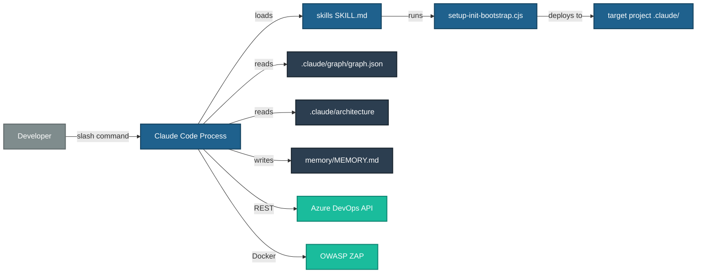
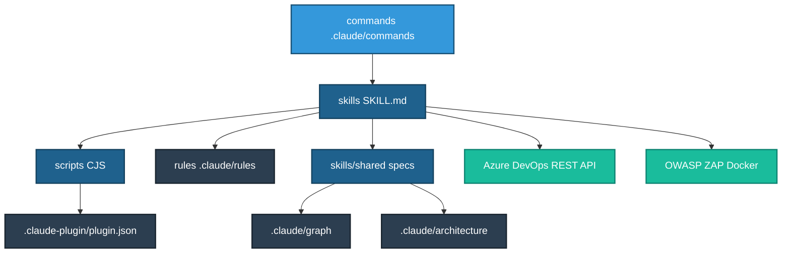

# Architecture — ai-assisted-development Plugin

_Generated: 2026-07-13 | Stack: Node.js (CJS) · Markdown skills · Claude Code Plugin_

## Overview

A Claude Code plugin that enforces an ICEA-driven development workflow for distributed teams using
Azure DevOps. Language-agnostic: supports .NET 8, ASP.NET Framework 4.x, Java/Spring Boot,
Python (FastAPI/Django/Flask), Node.js, Angular 17+, and React.

The plugin is not a deployed web service — it runs entirely within the Claude Code process on a
developer's local machine. It installs into `~/.claude/plugins/cache/`.

## Technology Stack

| Item | Value |
|---|---|
| Runtime | Node.js (CJS scripts, no build step) |
| Plugin format | Claude Code Plugin v1 — markdown skill files + YAML frontmatter |
| Package name | `ai-assisted-development` |
| Version | 3.12.0 |
| External integrations | Azure DevOps REST API · OWASP ZAP (Docker) |
| Test runner | `tests/validate.js` (offline) · `tests/runner.js` (requires API+network) |
| CI/CD | None — manual publish to KirklandAndEllis marketplace |

## Public API Surface (Commands)

The plugin exposes 37 slash commands, grouped by function:

**ICEA Workflow** — `/icea-feature`, `/icea-approve`, `/icea-implement`, `/icea-review`,
`/icea-revise`, `/icea-status`

**Code Quality** — `/code-review`, `/security-review`, `/dynamic-scan`, `/critic`, `/fix`,
`/dismiss`, `/checkin`

**Setup & Memory** — `/setup-init`, `/setup-sync`, `/setup-status`, `/setup-teardown`,
`/dream`, `/dream-health`, `/dream-audit`, `/dream-rollback`, `/session-start`

**Architecture & Graph** — `/update-arch`, `/graph-sync`, `/graph-viz`

**PR & ADO** — `/pr-describe`, `/pr-create`, `/pr-spec-review`, `/ado-tasks`, `/sprint-metrics`

**Other** — `/bug`, `/explain`, `/gitignore-sync`, `/sync-dirs`, `/token-analysis`,
`/app-readiness`, `/plugin-readiness`, `/product-docs`

## Folder Structure

| Folder | Purpose |
|---|---|
| `skills/` | 26 skill SKILL.md files — loaded on invocation |
| `skills/shared/` | Shared specs (graph schema, model routing, consent gate, etc.) |
| `skills/architect/` | Architect skill + per-stack prompts + architecture templates |
| `scripts/` | Node.js CJS scripts (bootstrap, graph-extract-edges, plugin-state, etc.) |
| `commands/` | 37 command stub `.md` files deployed to `.claude/commands/` in target projects |
| `rules/` | Rule files deployed to `.claude/rules/` by Bootstrap Phase 2 |
| `_project-deploy/` | Hook source files and gitignore base — canonical deploy sources |
| `docs/adr/` | Architecture Decision Records (ADR 0001–0053+) |
| `docs/migrations/` | Per-version migration notes applied by `/setup-sync` |
| `tests/` | `validate.js` (offline gate, 259 checks), `runner.js` (API+network) |
| `.claude-plugin/` | `plugin.json` — authoritative plugin metadata |

## End-to-End Architecture

## Layered View

