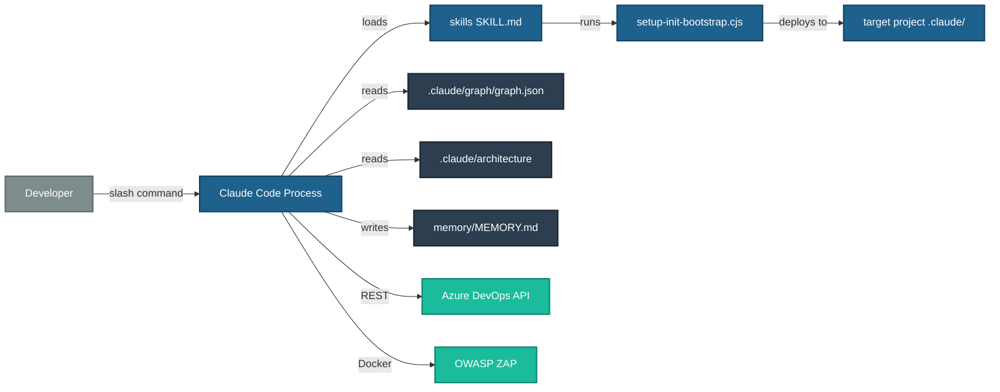
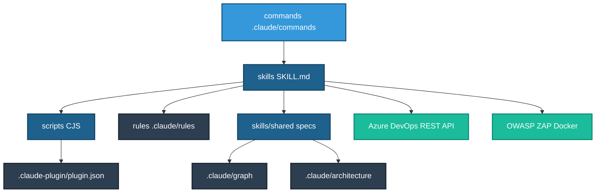

# Architecture — ai-assisted-development Plugin

_Generated: 2026-07-13 · Last refreshed: 2026-08-13 (v3.13.0) | Stack: Node.js (CJS) · Markdown skills · Claude Code Plugin_

## Overview

A Claude Code plugin that enforces an ICEA-driven development workflow for distributed teams using
Azure DevOps. Language-agnostic: supports .NET 8, ASP.NET Framework 4.x, Java/Spring Boot,
Python (FastAPI/Django/Flask), Node.js, Angular 17+, and React.

The plugin is not a deployed web service — it runs entirely within the Claude Code process on a
developer's local machine. It installs into `~/.claude/plugins/cache/`.

## Technology Stack

| Item | Value |
|---|---|
| Runtime | Node.js (CJS scripts, no build step) |
| Plugin format | Claude Code Plugin v1 — markdown skill files + YAML frontmatter |
| Package name | `ai-assisted-development` |
| Version | 3.13.0 |
| External integrations | Azure DevOps REST API · OWASP ZAP (Docker) |
| Test runner | `tests/validate.js` (offline) · `tests/runner.js` (requires API+network) |
| CI/CD | None — manual publish to the internal plugin marketplace |

## Public API Surface (Commands)

The plugin exposes 41 slash commands, grouped by function:

**ICEA Workflow** — `/icea-feature`, `/icea-approve`, `/icea-implement`, `/icea-review`,
`/icea-revise`, `/icea-status`

**Code Quality** — `/code-review`, `/security-review`, `/dynamic-scan`, `/critic`, `/fix`,
`/dismiss`, `/checkin`

**Setup & Memory** — `/setup-init`, `/setup-sync`, `/setup-status`, `/setup-teardown`,
`/dream`, `/dream-health`, `/dream-audit`, `/dream-rollback`, `/session-start`

**Architecture & Graph** — `/update-arch`, `/graph-sync`, `/graph-viz`

**PR & ADO** — `/pr-describe`, `/pr-create`, `/pr-spec-review`, `/ado-tasks`, `/sprint-metrics`

**Other** — `/bug`, `/explain`, `/gitignore-sync`, `/sync-dirs`, `/token-analysis`,
`/app-readiness`, `/plugin-readiness`, `/product-docs`

## Folder Structure

| Folder | Purpose |
|---|---|
| `skills/` | 32 skill SKILL.md files — loaded on invocation |
| `skills/shared/` | Shared specs (graph schema, model routing, consent gate, etc.) |
| `skills/architect/` | Architect skill + per-stack prompts + architecture templates |
| `scripts/` | Node.js CJS scripts (bootstrap, graph-extract-edges, plugin-state, etc.) |
| `commands/` | 41 command stub `.md` files deployed to `.claude/commands/` in target projects |
| `rules/` | Rule files deployed to `.claude/rules/` by Bootstrap Phase 2 |
| `_project-deploy/` | Hook source files and gitignore base — canonical deploy sources |
| `docs/adr/` | Architecture Decision Records (ADR 0001–0053+) |
| `docs/migrations/` | Per-version migration notes applied by `/setup-sync` |
| `tests/` | `validate.js` (offline gate, 259 checks), `runner.js` (API+network) |
| `.claude-plugin/` | `plugin.json` — authoritative plugin metadata |

## End-to-End Architecture

```mermaid
flowchart LR
    DEV[Developer] -->|slash command| CC[Claude Code Process]
    CC -->|loads| SK[skills SKILL.md]
    CC -->|reads| GRAPH[.claude/graph/graph.json]
    CC -->|reads| ARCH[.claude/architecture]
    CC -->|writes| MEMORY[memory/MEMORY.md]
    CC -->|REST| ADO[Azure DevOps API]
    CC -->|Docker| ZAP[OWASP ZAP]
    SK -->|runs| BOOT[setup-init-bootstrap.cjs]
    BOOT -->|deploys to| TARGET[target project .claude/]
    style DEV fill:#7F8C8D,color:#ffffff,stroke:#616A6B,stroke-width:2px
    style CC fill:#1F618D,color:#ffffff,stroke:#154360,stroke-width:2px
    style SK fill:#1F618D,color:#ffffff,stroke:#154360,stroke-width:2px
    style GRAPH fill:#2C3E50,color:#ffffff,stroke:#1a252f,stroke-width:2px
    style ARCH fill:#2C3E50,color:#ffffff,stroke:#1a252f,stroke-width:2px
    style MEMORY fill:#2C3E50,color:#ffffff,stroke:#1a252f,stroke-width:2px
    style ADO fill:#1ABC9C,color:#ffffff,stroke:#0E8472,stroke-width:2px
    style ZAP fill:#1ABC9C,color:#ffffff,stroke:#0E8472,stroke-width:2px
    style BOOT fill:#1F618D,color:#ffffff,stroke:#154360,stroke-width:2px
    style TARGET fill:#1F618D,color:#ffffff,stroke:#154360,stroke-width:2px

```

## Layered View

```mermaid
flowchart TB
    CMD[commands .claude/commands] --> SKILL[skills SKILL.md]
    SKILL --> SCRIPTS[scripts CJS]
    SKILL --> RULES[rules .claude/rules]
    SKILL --> SHARED[skills/shared specs]
    SCRIPTS --> META[.claude-plugin/plugin.json]
    SHARED --> GRAPH2[.claude/graph]
    SHARED --> ARCHDOCS[.claude/architecture]
    SKILL --> ADO2[Azure DevOps REST API]
    SKILL --> ZAP2[OWASP ZAP Docker]
    style CMD fill:#3498DB,color:#ffffff,stroke:#1a5276,stroke-width:2px
    style SKILL fill:#1F618D,color:#ffffff,stroke:#154360,stroke-width:2px
    style SCRIPTS fill:#1F618D,color:#ffffff,stroke:#154360,stroke-width:2px
    style RULES fill:#2C3E50,color:#ffffff,stroke:#1a252f,stroke-width:2px
    style SHARED fill:#1F618D,color:#ffffff,stroke:#154360,stroke-width:2px
    style META fill:#2C3E50,color:#ffffff,stroke:#1a252f,stroke-width:2px
    style GRAPH2 fill:#2C3E50,color:#ffffff,stroke:#1a252f,stroke-width:2px
    style ARCHDOCS fill:#2C3E50,color:#ffffff,stroke:#1a252f,stroke-width:2px
    style ADO2 fill:#1ABC9C,color:#ffffff,stroke:#0E8472,stroke-width:2px
    style ZAP2 fill:#1ABC9C,color:#ffffff,stroke:#0E8472,stroke-width:2px

```

## Multi-Harness (4.x) Direction — Epic ADO-4000

The 4.x line makes the plugin **LLM-agnostic** so it runs under **GitHub Copilot** as well as Claude Code.
**APPROVED design — Epic ADO-4000 (ICEA #6/#7/#8; `docs/Release4/Sprint1/UserStory4000/`):** a shared
**content core (L1)** in `Shared/` (ICEA method + templates, coding rules + B1–B7 taxonomy, checker
knowledge, the `ai-gate`) is authored once and consumed **NATIVELY** by each harness's own engagement +
enforcement (`Claude/` ≈ v3.13; `Copilot/` redesigned to GitHub/Copilot strengths) — **no mechanical
projection, no delta-map, no runtime `$PLUGIN_DIR`**. Enforcement is **asymmetric but hard on both**:
Claude = write-time prevention (`icea-floor`); Copilot = merge gate (CI `ai-gate` required status check) +
a review-time `review-icea` critic; client hooks/skills = best-effort. Prompt artifacts are versioned
(AC-F9). *(Supersedes the earlier "convergence via projection" framing in the paragraphs below — see the
ICEA for the authoritative approved design.)*

**Target structure (source):** scoped `Shared/` (neutral single source of truth) + thin
`Claude/` and `Copilot/` adapters + a neutral `plugin.manifest.json`. Provisioning **projects**
`Shared/` + the selected adapter into each tool's native paths (`.claude/` for Claude,
`.github/` for Copilot), and emits a `.vscode/settings.json` that scopes Copilot to `.github/`
only (turning off `.claude/` skill+rule discovery via `chat.agentSkillsLocations` /
`chat.instructionsFilesLocations` — verified: `false` excludes a location, while
`chat.useClaudeMdFile:true` keeps the shared `CLAUDE.md`).

**Impact on the subsystems above:**
- **Skills (§ Skills):** relocate to `Shared/skills` as **self-contained** units (project-relative
  `_shared/` reads), retiring the runtime `$PLUGIN_DIR` resolver; projected per-harness via a
  mechanical delta-map, with a per-skill override escape hatch.
- **Hooks (§ Hook pipeline):** a compatibility shim so the same hook logic runs under Copilot's
  (Preview) hook model; enforcement becomes **three-tier** — Tier A Claude write-time hooks
  (hard), Tier B Copilot read-only gate agents + PreToolUse deny (overridable), Tier C git
  pre-commit + CI `ai-gate` (harness-independent backstop).
- **Provisioning (§ Provisioning):** harness is selected at **application-integration time**
  (`provision --harness=…`), not at machine install; machine install becomes harness-neutral.
- **Governance (ICEA state machine):** approval hardened from an on-disk `Status: Approved`
  grep to a system-of-record/ADO-bound check (Phase 6); memory/docs treated as untrusted input;
  B1–B7 data-egress policy; behavioural eval harness; audit stamping.

**Artifacts vs. config:** architecture docs, the knowledge graph, `memory/`, and `docs/` are
generated **once** into neutral locations and shared by both harnesses (read by explicit path,
so Copilot's `.claude/` scoping does not hide them); only config (skills/rules/hooks/agents/
instructions) is projected per-harness.

Full design, phase tracker (Phases 0–8), and verified-facts appendix:
`docs/plans/2026-08-12-llm-agnostic-multi-harness-convergence.md`.