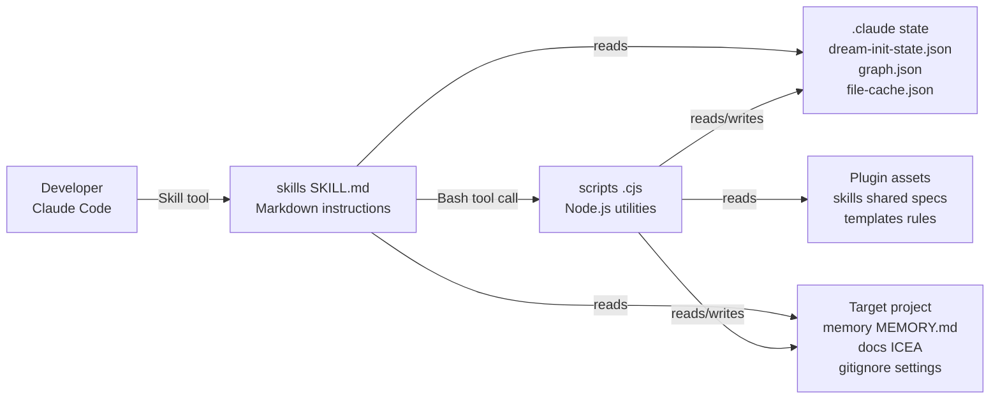
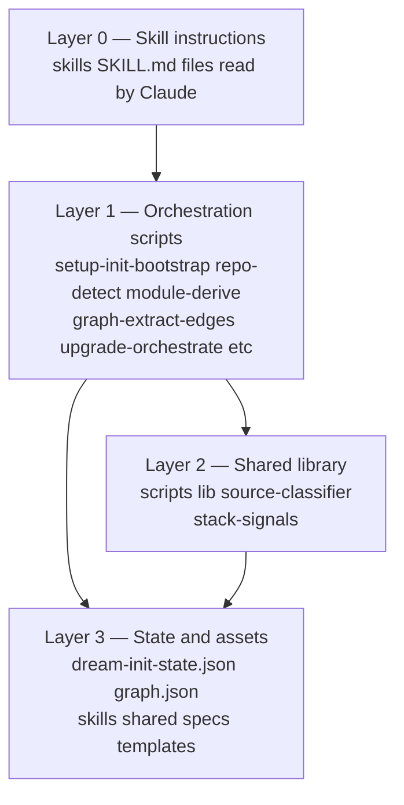

# Architecture — ai-assisted-development Plugin

> Load this file when adding a new layer, module, middleware, or endpoint,
> or when needing to understand the overall structure.

## Technology Stack

| Component | Technology | Version |
|---|---|---|
| Runtime | Node.js | 20+ (enforced by CI + install.cjs) |
| Module system | CommonJS (.cjs) | — |
| Test framework | Jest | 29.7.0 |
| Coverage | c8 | 10.1.2 |
| CI reporters | jest-junit | 16.0.0 |
| PPTX generation | pptxgenjs | 4.0.1 |
| CI/CD | Azure DevOps Pipelines | — |
| Skill format | Markdown (SKILL.md, read by Claude at runtime) | — |

## Package Structure

| Path | Responsibility |
|---|---|
| `skills/*/SKILL.md` | Skill instruction files — executed by Claude at runtime via the Skill tool |
| `skills/shared/` | Cross-skill specs (model routing, write gate, consent, migration knowledge, etc.) |
| `scripts/*.cjs` | Node.js utilities invoked by skills via Bash tool calls (bootstrap, graph, detection, etc.) |
| `scripts/lib/` | Shared library modules used by multiple scripts |
| `tests/*.test.cjs` | Self-contained node test scripts (use custom assert + process.exit pattern) |
| `tests/jest.suite.test.cjs` | Jest wrapper — spawns each raw test file as a subprocess to prevent process.exit killing Jest |
| `tests/migration-validation/` | Migration-specific self-test suite |
| `tests/fixtures/` | Static test fixtures |
| `tests/skill-scenarios/` | Scenario-based skill test data |
| `_project-deploy/` | Template files copied into target projects by bootstrap (CLAUDE.md, settings stubs) |
| `.claude-plugin/plugin.json` | Single-source plugin version, metadata, and recommended models |
| `plugin-manifest.json` | Marketplace manifest — lists all versions and their install paths |
| `.claude/rules/` | Rule files deployed to target projects |
| `.claude/hooks/` | Hook scripts enforcing ICEA floor, secret guard, context budget, and audit |
| `.claude/architecture/` | Architecture docs for the plugin itself (this file) |
| `docs/` | Developer guides, ADRs, migration docs, changelogs |

## End-to-End Architecture

```mermaid
flowchart LR
    User["Developer\nClaude Code"] -->|"Skill tool"| SkillMD["skills SKILL.md\nMarkdown instructions"]
    SkillMD -->|"Bash tool call"| Scripts["scripts .cjs\nNode.js utilities"]
    Scripts -->|"reads/writes"| State[".claude state\ndream-init-state.json\ngraph.json\nfile-cache.json"]
    Scripts -->|"reads/writes"| ProjectFiles["Target project\nmemory MEMORY.md\ndocs ICEA\ngitignore settings"]
    Scripts -->|"reads"| PluginAssets["Plugin assets\nskills shared specs\ntemplates rules"]
    SkillMD -->|"reads"| State
    SkillMD -->|"reads"| ProjectFiles
```

## Layered View

```mermaid
flowchart TB
    L0["Layer 0 — Skill instructions\nskills SKILL.md files read by Claude"]
    L1["Layer 1 — Orchestration scripts\nsetup-init-bootstrap repo-detect module-derive\ngraph-extract-edges upgrade-orchestrate etc"]
    L2["Layer 2 — Shared library\nscripts lib source-classifier\nstack-signals"]
    L3["Layer 3 — State and assets\ndream-init-state.json graph.json\nskills shared specs templates"]
    L0 --> L1
    L1 --> L2
    L1 --> L3
    L2 --> L3
```

## Key Scripts and Responsibilities

| Script | Responsibility |
|---|---|
| `setup-init-bootstrap.cjs` | All mechanical provisioning: dirs, command stubs, hooks, state files, gitignore, CLAUDE.md sections. Writes `_bootstrap-manifest.json` with remaining LLM work. |
| `repo-detect.cjs` | Deterministic 12-type repo classification ladder. Merges `repo_type` + `detected_stacks[]` into `dream-init-state.json`. |
| `stack-signals.cjs` | Canonical signal→stack_key detection used by repo-detect. |
| `module-derive.cjs` | Knowledge graph module skeleton from source tree scan. Writes `.module-skeleton.json`. |
| `graph-extract-edges.js` | Deterministic EXTRACTED edge derivation from source imports (ADR 0041). No LLM. |
| `plugin-state.cjs` | Single canonical resolver for installed plugin version + drift status from `installed_plugins.json`. |
| `intake-verify.cjs` | Migration source-context intake verification. |
| `strategy-resolve.cjs` | Migration strategy resolution. |
| `checkpoint-ledger.cjs` | Migration checkpoint read/write. |
| `upgrade-checkpoint.cjs` / `upgrade-orchestrate.cjs` | Upgrade skill support — per-hop checkpointing and orchestration. |
| `rewrite-bal.cjs` / `rewrite-decompose.cjs` | Rewrite skill support — BAL scoring and cluster decomposition. |
| `audit-write.cjs` | Append-only audit trail writer under `.claude/audit/`. |
| `governance-report.cjs` | Sprint governance and quality report generation. |
| `check-version-consistency.js` | Validates plugin.json, plugin-manifest.json, and git tag all agree on version. |
| `release.cjs` | Bump version, seed manifest, open CHANGELOG stub, create annotated git tag. |

## Plugin Entry Points

- **Install:** `install.cjs` — installs the plugin into `~/.claude/plugins/cache/` from the marketplace
- **Provision:** `setup-init-bootstrap.cjs --mode init` — mechanical bootstrap of a target project
- **Re-provision:** `setup-init-bootstrap.cjs --mode sync` — re-provision after upgrade
- **Graph:** `module-derive.cjs` → `graph-extract-edges.js` — knowledge graph generation

## State Files

| File | Owner | Purpose |
|---|---|---|
| `.claude/dream-init-state.json` | bootstrap | Provisioning state, repo_type, detected_stacks, plugin version stamp |
| `.claude/graph/graph.json` | graph-create + graph-sync | Authoritative knowledge graph (typed nodes, typed edges with confidence) |
| `.claude/file-cache.json` | code-review, security | Fingerprints for skip-unchanged-files in scanner runs |
| `token-analysis/token-graph.json` | token-analysis | Persistent delta-cache for token analysis |
| `memory/MEMORY.md` | Dream | Manual override inbox + auto-capture bookmarks |
| `memory/dream-log.md` | Dream | Append-only audit trail |

## Background Jobs

None — this is a local CLI plugin with no background daemons, startup events, or scheduled jobs. All execution is triggered by Claude Code (Bash + Skill tool calls) or direct `node script.cjs` invocations.
