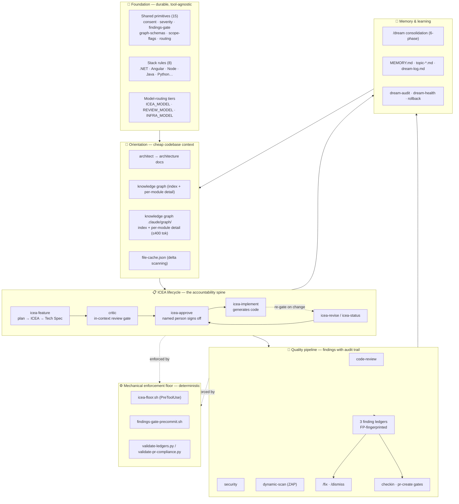
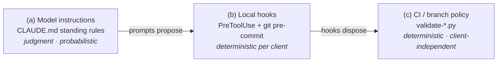
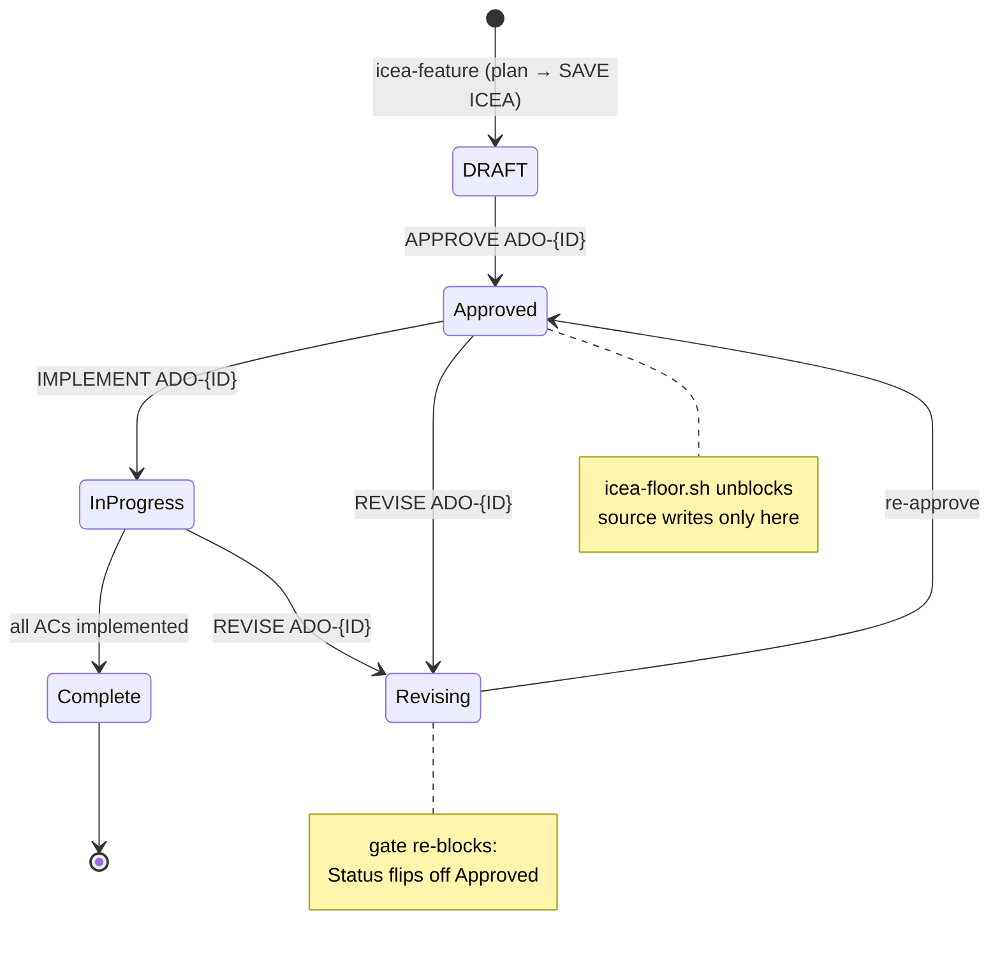

<!-- documents-plugin-version: 3.0.0 -->

# ai-assisted-development — Architecture Whitepaper

**An ICEA-driven governance framework for AI-assisted software delivery on distributed teams.**

| | |
|---|---|
| **Plugin** | `ai-assisted-development` |
| **Version at writing** | 2.6.0 |
| **Author** | Product Engineering |
| **Audience** | Engineering leadership, platform/AI architects, plugin maintainers |
| **Companion docs** | [README.md](README.md) · [DEVELOPER-GUIDE.md](DEVELOPER-GUIDE.md) · [docs/adr/](docs/adr/) (37 decision records) |

---

## Abstract

This paper explains why the `ai-assisted-development` plugin was built, how it evolved from a single approval gate into a layered governance framework, the architectural decisions that shaped it, and the concrete engineering problems encountered along the way. The plugin extends Claude Code with a spec-driven workflow (ICEA), a mechanical enforcement floor, a persistent memory system, cache-aware code/security/DAST scanning, and a codebase knowledge graph — all built on one thesis: **in AI-assisted development, every material change must trace back to a named human who took responsibility for it.** The design record is unusually complete — 37 Architecture Decision Records and a full changelog — which lets this paper cite the *why* behind each choice rather than reconstruct it.

---

## 1. Why This Plugin Exists

### 1.1 The problem

Modern AI coding assistants are, in the framework's own words, *"brilliant in isolation but inconsistent under pressure."* On a distributed team — where **Product Managers, Developers, and QA occupy separate roles** and coordinate through Azure DevOps — that inconsistency is not a productivity nuisance; it is a governance failure. When code can be generated faster than it can be reviewed, three problems surface at once:

1. **Accountability erosion.** "An agent did it" is never an acceptable answer in a regulated, high-stakes environment (this framework was built at a law firm). Someone must own every change.
2. **Spec drift.** A thin or absent specification produces rework: code that technically runs but does not implement what the business asked for. Rework is expensive and invisible until PR review.
3. **Context cost.** A stateless assistant re-reads the whole codebase every session, inflating token cost by 80–95% and slowing every operation.

### 1.2 The thesis: accountability through named approval

The plugin's organizing principle is **accountability transfer**. Its foundational rule (CLAUDE.md §1) is blunt:

> *"All feature work is driven by ICEA documents (Intent · Context · Examples · Acceptance). **No ticket moves to Active in Azure DevOps without an approved ICEA.**"*

**ICEA** is the permission structure for everything else. Before code is written, the work is captured as an ICEA document — its **I**ntent, the **C**ontext it operates in, worked **E**xamples, and testable **A**cceptance criteria. Code generation is *blocked* until a named person (Tech Lead or Product) explicitly approves it. The approval is the accountability transfer: the moment responsibility passes from the model to a human who can be asked "why."

Critically, the gate changed behaviour **through incentive alignment, not coercion**: a thin ICEA blocks the developer's *own* PR, so developers began writing better specs because *"one well-written spec prevents three bounced PRs"* ([ADR 0001](docs/adr/0001-icea-approval-gate.md)).

### 1.3 Three lessons that shaped the design

| Lesson | Problem observed | Response |
|---|---|---|
| **Stateless skills are expensive** | Code review re-scanned all 50 files daily when only 2 changed; security loaded Python/JS/Java references for a pure C# repo. | Shared primitives — the knowledge graph, `file-cache.json`, scope flags — cut token cost 80–95% after the first baseline run ([ADR 0016](docs/adr/0016-cache-aware-scanning.md)). |
| **Orientation beats source reads** | Every skill opened source files to learn structure; the ICEA skill was reading half the codebase per invocation. | The codebase knowledge graph maps modules to entry points and per-module detail; skills orient in *one* read ([ADR 0038](docs/adr/0038-knowledge-graph-orientation.md), which superseded the earlier `domain-map.md` of [ADR 0017](docs/adr/0017-domain-map.md)). |
| **Secure credentials from day one** | A PAT in an un-gitignored `.claude/settings.json` is a real credential leak under delivery pressure. | Credentials default to environment variables; `dream-init` writes the ignore block; `dream-status` audits it. |

---

## 2. Design Principles

The framework states its philosophy explicitly (CLAUDE.md §3), and — notably — *enforces* it: the critic and code-review skills treat violations as **findings, not style preferences**.

- **Simplicity first.** *"Complexity that cannot be justified by a concrete requirement is a defect."*
- **Readability over writer convenience.** Code is read far more than written.
- **Explicit over clever.** A future developer should change any piece without reading the whole codebase.
- **Testability.** No hidden side effects, no global state, no deep coupling.
- **Do not assume — stop and ask.** *"A wrong assumption costs more to unwind than the question costs to ask."*
- **Decision transparency.** Non-trivial choices carry an inline `DECISION:` block listing options considered and why each was rejected or chosen. (This whitepaper's ability to explain *why* is a direct consequence of this principle applied at the architectural level via ADRs.)
- **Output-gated constraints.** Orientation, questions, and reading architecture docs are always free; only *generating implementation code* is gated ([ADR 0002](docs/adr/0002-output-gated-enforcement.md)).
- **Language-agnostic.** Workflow ideas (gates, memory, consent, critic) are not language ideas; stack detection drives which rules/scanners activate ([ADR 0018](docs/adr/0018-language-agnostic.md)).

---

## 3. How It Was Shaped — An Evolution in Five Movements

The plugin was not designed as it stands today; it accreted, each layer solving a problem exposed by the last. The changelog records the arc from v1.x through v2.6.0.

| Phase | Versions | What was added | Architectural shift |
|---|---|---|---|
| **1 — The gate** | v1.0–v1.14 | The ICEA approval gate; model-routing tiers; the architect skill and `domain-map`; code-review and security scanning. | *ICEA-as-suggestion* → *ICEA-as-enforced-requirement.* |
| **2 — Intelligence & efficiency** | v1.15–v1.23 | The **critic** layer (in-context review before disk); cache-aware scanning; **language-agnostic** support (Java, Python); the **Dismissed** finding state; **change tiers** (T1/T2/T3); the **mechanical enforcement floor** (git hooks) and the first ADRs. | *Prompting layer* → *gating layer with a deterministic floor.* |
| **3 — Trust & portability** | v1.26–v1.29 | ICEA-D decisions block + change manifest + **trust-calibration loop**; **VCS-aware** ignore files (TFVC `.tfignore`); **version-drift detection** and `dream-sync` re-provisioning. | Enforcement becomes *measurable and portable.* |
| **4 — Session independence** | v2.0–v2.2 | **Disk-based ICEA state** and global **keyword handlers** (`APPROVE/IMPLEMENT/REVISE/STATUS ADO-{ID}`); **single-responsibility** split (`icea-feature`/`approve`/`implement`/`revise`/`status`); interactive **plan → draft → save** flow. | *Session-bound* → *session-independent, disk-authoritative workflow.* |
| **5 — Codebase intelligence** | v2.3–v3.0 | Reliability hardening (path resolution, section detection, mechanical gates); Tech Spec templates; the **codebase knowledge graph** (`.claude/graph/`) with git-hook staleness detection. In **v3.0.0** the graph became the *single* orientation layer (domain-map retired, [ADR 0038](docs/adr/0038-knowledge-graph-orientation.md)) and is now committed rather than gitignored. | Adds a *persistent, incrementally-maintained, version-controlled model of the codebase.* |

**The throughline:** from *a prompt that suggests a spec* → *a gate that requires one* → *a stateful workflow that survives session boundaries* → *a mechanical floor that holds when prompts don't* → *codebase intelligence that keeps orientation cheap.*

Two of these movements were **reversals of earlier decisions** — the clearest evidence that the design adapted to reality rather than the reverse (see §6).

---

## 4. Architecture — What It Is Now

At 3.0.0 the plugin ships **36 commands, 25 skills, 15 shared specs, 8 stack rules, 4 enforcement hooks**, and **38 ADRs**. These are best understood not as a flat list but as six cooperating layers.

### 4.1 The layered model

**Layer 1 — Foundation (durable).** `skills/shared/` is the single source of truth for anything two or more skills share ([ADR 0003](docs/adr/0003-shared-primitives-layer.md)): the consent model, business-severity overrides, the findings-gate, cache/scope schemas, and model-routing rules. These specs are deliberately **tool-agnostic** — they never reference Claude Code mechanics — so they remain portable. Volatile wiring (command stubs, `CLAUDE.md`, settings) is allowed to couple; the durable layer is not.

**Layer 2 — Orientation.** The `architect` skill generates architecture docs and the **codebase knowledge graph** — a fingerprint-tracked index plus one ≤400-token detail file per module. As of v3.0.0 this is the *single* orientation layer ([ADR 0038](docs/adr/0038-knowledge-graph-orientation.md) retired the earlier `domain-map.md`), and it is committed and PR-reviewed rather than gitignored. Together with `file-cache.json`, it lets every downstream skill orient in one read and scan only what changed.

**Layer 3 — ICEA lifecycle (the accountability spine).** Five single-responsibility skills own one phase each ([ADR 0033](docs/adr/0033-skill-single-responsibility.md)): plan/draft (`icea-feature`), sign-off (`icea-approve`), code generation (`icea-implement`), revision (`icea-revise`), and state reporting (`icea-status`). The **critic** ([ADR 0012](docs/adr/0012-critic-layer.md)) reviews artifacts in-context *before* they touch disk.

**Layer 4 — Quality pipeline.** `code-review`, `security`, and `dynamic-scan` all conform to one **finding contract** ([ADR 0014](docs/adr/0014-finding-ledger-contract.md)): FP-fingerprinted findings written to persistent ledgers, with unified `/fix` and `/dismiss` workflows. `checkin` and `pr-create` read the shared findings-gate to block on open Critical/High issues.

**Layer 5 — Mechanical enforcement floor.** Beneath the probabilistic prompt gates sit deterministic hooks ([ADR 0005](docs/adr/0005-mechanical-enforcement-floor.md)): a PreToolUse write-blocker, a git pre-commit findings gate, and CI ledger/PR-compliance validators. *"Prompts propose; hooks dispose."*

**Layer 6 — Memory & learning.** `/dream` consolidates sessions into a curated memory (a 20-entry promoted `MEMORY.md` over unlimited topic files), and a citation/audit loop ([ADR 0007](docs/adr/0007-memory-audit-loop.md)) makes memory self-pruning rather than write-only.

### 4.2 The enforcement ladder

A central architectural idea: **every rule lives at the lowest tier that can hold it.** Judgment stays in prompts; guarantees move down to mechanics.

An important honesty note is baked into the record: the authoritative floor was originally designed to be **server-side in CI** ([ADR 0009](docs/adr/0009-server-side-authoritative.md)), but the plugin's real deployment model is **local-only** — so [ADR 0010](docs/adr/0010-local-only-enforcement.md) *supersedes* that claim and states plainly that a determined developer can bypass local gates; what remains is that **bypass is visible** (integrity checks, `pr-create` re-checks, `sprint-metrics` history mining). The framework refuses to overclaim its own guarantees.

### 4.3 The ICEA state machine

ICEA state is **disk-based and session-independent** ([ADR 0031](docs/adr/0031-icea-state-model.md)): the `Status:` line in the document *is* the workflow state, so a developer can close the session, receive an approval over email, and action it later with a keyword ([ADR 0032](docs/adr/0032-keyword-handler.md)).

The mechanical floor keys on `Status: ✅ Approved`; revising an approved ICEA rewrites the status to `DRAFT — Revising`, which **re-blocks** code generation ([ADR 0027](docs/adr/0027-icea-rerun-revise-and-reblock.md)). This closes the loophole where a spec could be quietly changed after approval without re-review.

### 4.4 Model routing

Different work needs different model tiers ([ADR 0023](docs/adr/0023-model-routing.md)); each is an env var with a documented default, project settings overriding machine settings.

| Tier | Env var | Default | Used by | Why |
|---|---|---|---|---|
| Generation | `ICEA_MODEL` | `claude-opus-4-6` | icea-feature, ado-tasks, pr-describe, product-docs | Specs and code are the most consequential outputs. |
| Review | `REVIEW_MODEL` | `claude-sonnet-4-6` | code-review, security, icea-review, pr-spec-review, dynamic-scan | Review is analytical pattern-matching; faster, lower timeout risk on long scans. |
| Infrastructure | `INFRA_MODEL` | `claude-sonnet-4-6` | dream, architect, dream-status, session-start, graph-sync, checkin, fix, … | Operational, no creative generation. |

---

## 5. Architectural Decisions (38 ADRs, Thematically)

The plugin keeps a complete decision record — *"the why must live in the repo, not the maintainer's head… bus-factor insurance."* The 38 ADRs cluster into recognizable pillars:

1. **Spec-driven gates** — ICEA gate ([0001](docs/adr/0001-icea-approval-gate.md)), output-gated enforcement ([0002](docs/adr/0002-output-gated-enforcement.md)), the Write Gate for source/config ([0028](docs/adr/0028-write-gate.md)), disk-based state ([0031](docs/adr/0031-icea-state-model.md)), keyword handlers ([0032](docs/adr/0032-keyword-handler.md)), draft-then-save ([0034](docs/adr/0034-interactive-draft-save-flow.md)), plan-feeds-ICEA ([0035](docs/adr/0035-plan-feeds-icea.md)), the `temp/` rendering aid ([0036](docs/adr/0036-temp-rendering-aid.md)).
2. **Layered enforcement** — mechanical floor ([0005](docs/adr/0005-mechanical-enforcement-floor.md)), server-side→local reversal ([0009](docs/adr/0009-server-side-authoritative.md)→[0010](docs/adr/0010-local-only-enforcement.md)), behavioural evals ([0021](docs/adr/0021-evals.md)), guide-versioning contract ([0022](docs/adr/0022-guide-versioning.md)).
3. **Proportional ceremony** — diff-classified change tiers T1/T2/T3 ([0006](docs/adr/0006-change-tiers.md)); the critic runs unconditionally even when the gate relaxes.
4. **Finding-state integrity** — dismissed-as-a-state with re-open-on-change ([0004](docs/adr/0004-dismissed-findings-state.md)), the ledger contract ([0014](docs/adr/0014-finding-ledger-contract.md)), business-context severity B1–B7 ([0015](docs/adr/0015-business-context-severity.md)), deterministic+probabilistic hybrid ([0019](docs/adr/0019-phase-d-hybrid.md)), baseline-never-gates ([0020](docs/adr/0020-baseline-strategy.md)).
5. **Codebase intelligence & portability** — single-source shared primitives ([0003](docs/adr/0003-shared-primitives-layer.md)), the knowledge graph as the single orientation layer ([0038](docs/adr/0038-knowledge-graph-orientation.md), superseding domain-map [0017](docs/adr/0017-domain-map.md)), cache-aware scanning ([0016](docs/adr/0016-cache-aware-scanning.md)), language-agnostic design ([0018](docs/adr/0018-language-agnostic.md)), VCS-aware ignore files ([0025](docs/adr/0025-vcs-aware-ignore-file.md)), version-drift detection ([0026](docs/adr/0026-version-drift-detection.md)).
6. **Trust, transparency & governance** — memory audit loop ([0007](docs/adr/0007-memory-audit-loop.md)), deprecation policy + bus-factor rule ([0008](docs/adr/0008-deprecation-policy.md)), trust-calibration/earned-autonomy loop ([0011](docs/adr/0011-trust-calibration-loop.md)), source-file consent A/B/C ([0013](docs/adr/0013-source-file-consent.md)), model routing ([0023](docs/adr/0023-model-routing.md)), roadmap-proposals area ([0037](docs/adr/0037-roadmap-proposals-area.md)).
7. **ICEA workflow lifecycle** — revise-not-overwrite ([0027](docs/adr/0027-icea-rerun-revise-and-reblock.md)), hierarchical folders ([0029](docs/adr/0029-icea-folder-structure.md)), the dedicated `/icea-revise` command ([0030](docs/adr/0030-icea-revise-command.md)), single-responsibility boundaries ([0033](docs/adr/0033-skill-single-responsibility.md)).
8. **Roadmap (not yet built)** — async checkpoint queue ([0024](docs/adr/0024-async-checkpoint-queue.md), Proposal v0.9): evolving synchronous human gates into asynchronous, provisionally-executed checkpoints while preserving named-decider accountability.

See [docs/adr/README.md](docs/adr/README.md) for the full index.

---

## 6. Issues Encountered — and How They Were Resolved

The most instructive part of the record is where the design met reality. A recurring meta-lesson emerges: **mechanical checks beat probabilistic ones, and "described" is not "executed."**

### 6.1 Two decision reversals

- **Server-side → local enforcement (0009 → 0010).** The floor was designed to run as required CI Build Validation. Reality: the plugin runs only in developers' local Claude Code sessions — no pipeline executes its gates. Rather than pretend otherwise, [ADR 0010](docs/adr/0010-local-only-enforcement.md) rewrote the model to *local-only with visible bypass*, and relocated bypass telemetry to `pr-create` re-checks and `sprint-metrics`.
- **Inline revise → dedicated command (0027 → 0030).** Revision initially lived as a branch inside `icea-feature`, which buried it and produced two conflicting flows in one skill. [ADR 0030](docs/adr/0030-icea-revise-command.md) promoted `/icea-revise` to a first-class, discoverable command; [ADR 0033](docs/adr/0033-skill-single-responsibility.md) then drew hard single-responsibility boundaries across the ICEA skills.

### 6.2 The gate that was silently inert (v1.29.0)

The most consequential bug: the `icea-floor.sh` hook — the mechanical guarantee behind the entire ICEA thesis — **matched nothing**. Two drifts compounded:

1. The hook globbed `icea-*.md`, but files were named `ADO-<id>-*.md` → zero matches.
2. The approved-status predicate was `Status:\s*Approved`, but the template wrote `Status: ✅ Approved` (with emoji) → the regex broke on the emoji.

**Result:** the floor described in ADR 0009 was not holding for *any* ICEA under the current naming convention. **Fix:** glob `ADO-*.md` (plus legacy `icea-*.md`), and match `Status:.*Approved`; the revise line uses lowercase "approval" so it cannot self-satisfy the predicate. A behavioural eval now exercises the full gate lifecycle. *Lesson: enforcement mechanisms must be tested behaviourally, not assumed — spec and implementation drift silently.*

### 6.3 "Described but never executed" — the .gitignore and CLAUDE.md class of bugs

Several bugs shared a root cause: a step *described* a write in prose but issued **no actual write command**.

- **`.gitignore` write (v1.18.0).** `dream-init` printed *"✓ added to .gitignore"* while writing nothing. Fixed by an explicit idempotent Node write **plus a mandatory verification phase** that re-reads the file and emits `VERIFY_OK`/`VERIFY_FAIL`.
- **Stale CLAUDE.md on upgrade (v2.4.4).** Append-only section logic left *stale* write-gate/keyword tables in place after an upgrade, so Claude followed obsolete instructions. Fixed by **stale-content replacement**: detect known-bad strings and replace the whole section from the installed plugin — never touching developer customizations.
- **Substring vs whole-line matching (v1.18.0).** A coarse `grep -q ".claude/"` masked specific entries like `.claude/settings.json`. Fixed with whole-line matching.

*Lesson: for infrastructure steps, verification is not optional — "the summary said it happened" is a failure mode.*

### 6.4 Mechanical gates over prompt instructions (v2.4.2–v2.4.3)

`icea-feature` would skip the plan and save ICEA/Tech Spec inline, because the "stop and save" steps were *prose instructions* — easily bypassed. The fix replaced them with **deterministic bash gates**: a `[ -f "*.plan.md" ]` check emits `PLAN_GATE_BLOCKED` before any ICEA work; a parallel `ICEA_GATE_BLOCKED` guards the Tech Spec step; explicit `⛔ STOP` blocks were added. A related near-miss — `cp` to a not-yet-existing directory followed by `rm temp/...` — risked **silent data loss** and was fixed by `mkdir -p` before every copy.

### 6.5 Portability and platform bugs

- **`where.exe` unreliable on Windows (v2.3.1).** Git/Bash path detection failed under Claude Code's bash context and corporate proxies. Fixed with a fallback chain: `where.exe` → `which` → known install paths.
- **Detection without implementation (v1.28.1).** VCS-aware ignore was *specced* in v1.27.0 (TFVC needs `.tfignore`, not `.gitignore`) but `gitignore-sync` still wrote only `.gitignore` — leaving TFVC repos **entirely unprotected**. Fixed by branching on the shared VCS-detect spec and writing per-VCS syntax. *Lesson: a spec without an end-to-end implementation is security theater.*
- **`plugin.json` read from the wrong path (v2.4.4).** Version detection resolved `plugin.json` relative to the project root — a path that never exists — so every project recorded `version: undefined` and drift detection was silently broken until the plugin path was hardcoded correctly.

### 6.6 Brittleness removed by better references (v1.22.0, v2.5.0)

- **Logic drift across skills.** `code-review`, `security`, and `dynamic-scan` each carried their own copy of dismissed-finding reconciliation. Extracted to a single shared spec ([ADR 0003](docs/adr/0003-shared-primitives-layer.md) applied) — one source of truth, drift eliminated.
- **Section numbers as contracts.** Downstream skills referenced Tech Spec "Section 10/11" by number; adding a section shifted all numbers and broke them *without error*. Fixed by referencing **heading text** (`## Open Questions`) instead. *Lesson: choose durable references — names survive refactors, ordinals don't.*

### 6.7 The self-audit that produced this paper's baseline (v2.6.x)

A structural audit found the plugin's own manifest had drifted from disk: eight commands and five skills existed but were unregistered; a command-stub referenced in the deploy loop had no backing file (so `/graph-sync` never deployed); and an unimplemented proposal sat among live shared specs, reading as an orphan. Resolution: the manifest was reconciled, the missing stub created, the proposal relocated to `docs/proposals/` ([ADR 0037](docs/adr/0037-roadmap-proposals-area.md)), and the validator was extended with a **bidirectional drift guard** so the framework now governs its own integrity. *Lesson: a governance tool must hold itself to the standard it enforces on others.*

---

## 7. Cross-Cutting Design Insights

1. **Put guarantees at the lowest tier that can hold them.** Judgment in prompts; determinism in hooks and bash gates. Everything load-bearing eventually became mechanical.
2. **Honesty over overclaim.** When the server-side floor proved undeployable, the design said so ([ADR 0010](docs/adr/0010-local-only-enforcement.md)); when drift detection reported green while unverified, that was named a *dangerous* failure mode ([ADR 0026](docs/adr/0026-version-drift-detection.md)).
3. **Proportionality prevents gaming.** Mechanical T1/T2/T3 classification means the developer never self-classifies, so "trivial" can't expand to dodge the gate — yet the critic still runs on everything.
4. **Single source of truth, enforced by a validator.** Shared primitives + structural validation keep 25 skills consistent as the system grows.
5. **Observability closes the loop.** Citation telemetry, dismissal churn, manifest-deviation events, and usage analytics turn subjective quality questions into measurable ones — and feed earned autonomy and deprecation.
6. **Durable vs volatile separation.** Tool-agnostic specs (the durable asset) are quarantined from Claude Code wiring (the volatile layer), so the intellectual core survives tooling churn.

---

## 8. Current State and Roadmap

**Today (2.6.0).** A mature, self-validating governance framework: the ICEA spine is session-independent and mechanically floored; three scan skills feed audit-trailed ledgers; memory is self-pruning; and a fingerprint-tracked knowledge graph keeps orientation cheap on large repositories. The framework is language-agnostic across .NET, Java/Spring, Python, Node.js, and Angular/React, and VCS-aware across Git and TFVC.

**On the roadmap.** The most forward-looking design is the **async checkpoint queue** ([ADR 0024](docs/adr/0024-async-checkpoint-queue.md), Proposal v0.9, tracked in [docs/proposals/](docs/proposals/)): evolving human gates from *synchronous interrupts* into *asynchronous checkpoints* — the agent works on provisionally-approved artifacts under strict containment, and a human reviews a queue on their own schedule. It preserves the accountability thesis (every resolution records a named decider) while supporting longer autonomous runs. It graduates from proposal to shared spec the moment a skill begins to consume it.

---

## Appendix — Component Inventory (v2.6.0)

| Component | Count | Location |
|---|---|---|
| Commands | 36 | `commands/` (+ mirrored stubs in `_project-deploy/commands/`) |
| Skills | 25 | `skills/<name>/SKILL.md` |
| Shared specs | 15 | `skills/shared/` |
| Stack rules | 8 | `_project-deploy/rules/` |
| Enforcement hooks | 4 | `_project-deploy/hooks/` |
| Architecture Decision Records | 38 | `docs/adr/` |
| Enforcement hooks (tiers) | 3 | model instructions · local hooks · CI validators |
| Finding ledgers | 3 | code-review · security · dynamic-scan |
| Roadmap proposals | 1 | `docs/proposals/` |

*This whitepaper is grounded in the plugin's own record — the 38 ADRs, the changelog (`CHANGELOG.md` + `docs/changelog-archive/`), and the developer/user guides. Where a claim reflects a decision, the governing ADR is cited so the reasoning can be traced to source.*
