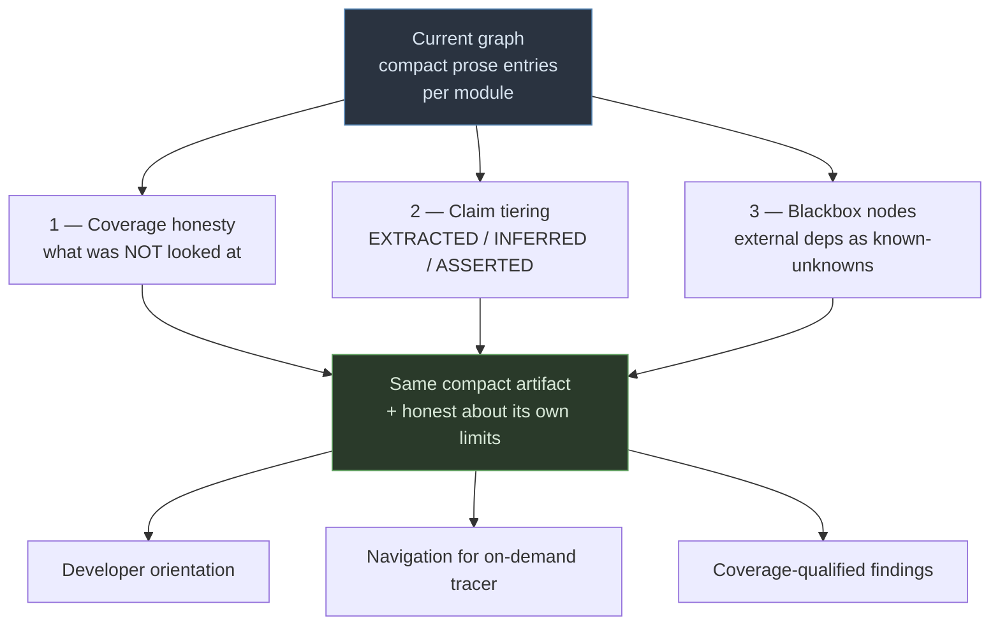
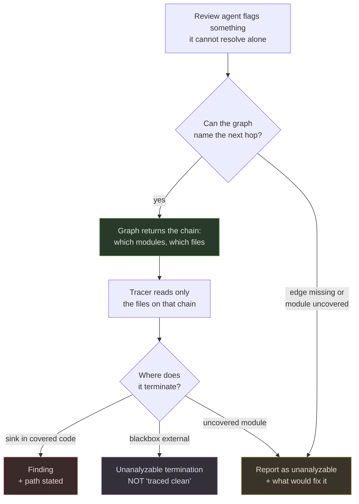

# The Compact Graph

**Enhancing the existing plugin graph without abandoning what makes it work**

Status: Proposal — companion to `GRAPH-DESIGN.md`
Scope: `team-delivery-core` plugin — graph subsystem, intent tiering, on-demand taint tracing
Relationship: This is **Option 2** from `GRAPH-DESIGN.md` Act −1, developed properly. The two documents are alternatives, not sequential phases.

---

## Why this document exists

`GRAPH-DESIGN.md` proposes replacing the plugin's generated graph with deterministic AST extraction. It runs to 55 decisions and reshapes most of the subsystem.

It was written before two constraints were on the table:

1. **The current graph is deliberately compact.** Small and summarized so it costs little context. That was a design decision validated against real context pressure, not an accident of implementation.
2. **Taint analysis runs on suspicion, not by enumeration.** When an agent flags something and cannot resolve it alone, a tracer follows that specific chain end to end. There is no requirement to precompute all source-to-sink paths.

Both constraints change the answer. This document works within them.

### The tension the other document never acknowledged

Deterministic extraction produces graphs three orders of magnitude larger than a summarized one — 126k nodes on a mid-size open-source project, 472k on a larger one. The existing graph is prose entries numbering in the hundreds.

That gap is not incidental. **A generated summary is a compression step.** It discards detail deliberately. The full redesign would replace a compact artifact with a large one, then spend considerable machinery — query interfaces, result-set caps, ranking, budget models — recovering the compactness that was thrown away.

That is a great deal of work to arrive back where the plugin already is.

### What changes when taint is reactive

The expensive parts of the redesign — parameter-level edges, sanitizer annotation on paths, precomputed source-to-sink enumeration — exist to make **enumeration** tractable. Enumerating every path in a large codebase is only affordable if the graph has already done the filtering.

If tracing is triggered by suspicion, none of that applies. A handful of paths per scan is bounded by construction. The graph's job reduces to one question:

> When a tracer needs to follow this chain, which files should it read?

That is a **navigation aid**, not a data-flow model. Data flow is determined by the tracer reading actual code, which is what it already does today. A compact graph can answer navigation questions perfectly well.

**Consequence:** `GRAPH-DESIGN.md` Decision 29 — inverting Phase 2.5 from reactive to proactive — is wrong for this plugin. The reactive model is correct. The graph makes it *faster*, not obsolete.

---

## The design

Three additions to the existing graph. Nothing removed, nothing replaced.

### Addition 1 — Coverage honesty

**The highest value-per-unit-of-work item in either document.**

The graph already knows which stacks it detected and which directories it read. Stating what it *did not* cover is additive metadata, not new machinery. No extractor, no parser, no meaningful size increase.

What to record:

- **Stacks detected vs. stacks with rule files.** A Python service in a repo with no Python rule file is uncovered, and today that is silent.
- **Directories skipped** — vendored code, generated output, anything excluded by config.
- **External dependencies observed but unmapped** — see Addition 3.
- **Modules where generation was truncated or failed.**
- **When the graph was last built, and against which commit.**

**C1 — Coverage metadata is part of the graph artifact, not a separate report.**
Given the compactness constraint, a full ranked capability report of the kind `GRAPH-DESIGN.md` Act 5 describes is over-built. A short coverage block at the head of the graph is sufficient and costs almost nothing in context.

**C2 — Coverage is declared in any answer it materially affects.**
Same rule as the other document, same two failure modes to avoid: over-hedging spends credibility, and "the graph is incomplete" must never substitute for opening a file that is right there.

**C3 — Findings from code and security review carry a coverage line.**
"Reviewed 14 modules; 2 uncovered (no Python rule file); 3 external dependencies unmapped." Without this, a clean result reads as stronger than it is. This is the piece that turns the graph from *occasionally wrong* into *occasionally wrong and says where*.

### Addition 2 — Claim tiering

The existing graph makes claims of quite different reliability and marks none of them.

Three tiers, all producible at generation time. **No parser required** — this is a discipline applied to how entries are written, not a new extraction capability.

| Tier | Source | Verifiable? |
|---|---|---|
| `EXTRACTED` | Read directly from an artifact — a test name, a guard clause, a validation attribute, an ADR reference in a commit | Yes, re-derives on rebuild |
| `INFERRED` | Claude's summary of what the code appears to do | Only against cited code |
| `ASSERTED` | Human-written, no code backing — ops ownership, client mandates, historical rationale | No — ages instead |

**C4 — Prefer extraction over inference wherever an artifact exists.**
A test named `Should_Reject_Cancelled_To_Confirmed_Transition` states a constraint, cites itself, and decays loudly when deleted. Guard clauses, thrown exception types, validation attributes, retry and timeout configuration, and ADR references in commit messages are all in this category. **Measure how much of the graph's real content is recoverable this way before building anything else** — it may be most of it.

**C5 — Inferred claims cite the code that supports them, or are not written.**
A one-line file-and-symbol reference. Uncited inferences are dropped rather than kept. This costs a few tokens per entry and makes the claim checkable.

**C6 — Asserted claims carry author and date.**
A two-year-old assertion from someone who has left is different from last month's, and nothing else can distinguish them.

**C7 — Tier is visible in output.**
An answer built on extracted claims should read differently from one built on assertions. The vocabulary exists; it only needs to surface.

### Addition 3 — Blackbox nodes

External dependencies currently either appear as ordinary entries or do not appear at all. Both are wrong: the first overstates knowledge, the second makes a data destination invisible.

**C8 — External dependencies are recorded as explicit known-unknowns.**

An entry naming the service, what is called, and the fact that its interior is unmapped. Two sub-cases worth distinguishing, cheaply:

- **Contract available** — a WSDL, OpenAPI document, or `Reference.svcmap` on disk. The surface is authoritative and complete.
- **Caller-side only** — inferred from the calls observed. The surface is whatever this codebase happens to exercise, which may be a fraction of what the service offers.

**C9 — Blackbox entries are where external tribal knowledge lives.**
"Rate-limited to 100/min." "Returns 202, processes async." "Ops owns it, contact X." This knowledge has nowhere else to go today, and it is exactly what a developer needs when a trace terminates there.

**C10 — A trace reaching a blackbox terminates as *unanalyzable*, not as clean.**
This is the security-relevant half. An external service receiving user input is a data destination that was not analyzed. It must appear in findings as a coverage gap.

---

## On-demand tracing

The security model, stated as it actually works.

**C11 — The graph tells the tracer where to read. It does not model data flow.**
Data flow is established by the tracer reading real code. The graph supplies navigation. This keeps the graph compact and keeps the analysis grounded in source rather than in a model of source.

**C12 — Tracing stays reactive.**
Triggered by agent suspicion, not by enumeration. Bounded by construction — a handful of paths per scan. No result-set caps, ranking, or budget model needed, because the volume never gets there.

**C13 — Every trace terminates explicitly.**
Three outcomes: a sink in covered code, a blackbox, or an uncovered module. The last two are *coverage gaps*, not clean results. A trace that ran out of graph must never read as a trace that found nothing.

**C14 — Trace reliability depends on edge accuracy, and that is measurable.**
A tracer following a chain the graph got wrong follows the wrong chain and does not know it. This is the one place where the compact graph's inferred nature has real consequences. See M1 below.

---

## What this deliberately does not do

Named so the omissions are choices rather than oversights.

| Not doing | Why | Revisit if |
|---|---|---|
| Deterministic AST extraction | Produces a graph 3 orders of magnitude larger; contradicts the compactness constraint | Enumeration-based analysis becomes a requirement |
| Federated graphs, boundary manifests | Solves cross-repo resolution the plugin does not currently need | Cross-application taint becomes a client requirement |
| Parameter-level taint edges, sanitizer annotation | Exists to make enumeration affordable; irrelevant to reactive tracing | Same as above |
| Full ranked capability report | Over-built for a compact graph; a coverage block suffices | Report items regularly exceed ~10 and need prioritising |
| Graph as CI-published artifact | The graph is cheap to regenerate locally | QA team needs graph access without running the plugin |
| Confirmation workflow for inferred claims | Machinery ahead of evidence; C4 may make it unnecessary | M2 shows most content is genuinely inferred, not extractable |

**All of these are documented in `GRAPH-DESIGN.md` with full rationale.** That document becomes the reference for what a larger design would look like, and the source to draw from if any row above gets revisited.

---

## Measurements

Two, both small. Neither requires building anything from this document.

**M1 — Call-relationship accuracy.** Take one module in a repo you know. Check every call or dependency relationship the graph claims: correct, hallucinated, or missing.

This is narrower than a general accuracy audit and more decision-relevant, because **call edges are what the tracer depends on**. A graph can be 90% accurate overall and still unreliable for tracing if the errors concentrate in call relationships.

- High accuracy → tracing on the compact graph is sound; proceed.
- Low accuracy → the tracer needs to verify each hop by reading rather than trusting the graph. Slower, still workable, but it should be a stated behavior rather than an accident.

**M2 — Extractable proportion.** On one repo, measure how much of the graph's real content could come from test names, guard clauses, validation attributes, and ADR references rather than from inference.

- High → Addition 2 is mostly a mechanical change, and the inference layer shrinks accordingly.
- Low → inference remains primary, and C5's citation requirement carries more weight.

---

## Sequencing

1. **Coverage metadata** (C1–C3). Additive, no dependencies, highest value. Ship first.
2. **M1 and M2.** Small, and they inform everything after.
3. **Blackbox nodes** (C8–C10). Small schema addition, unlocks honest trace termination.
4. **Claim tiering** (C4–C7), scoped by what M2 returns.
5. **Trace integration** (C11–C14), scoped by what M1 returns.

Steps 1 and 3 are worth doing regardless of what the measurements say.

---

## Open questions

| # | Question | Notes |
|---|---|---|
| Q1 | Does the graph currently record call/dependency relationships explicitly, or only prose descriptions? | Determines how much work C11's navigation actually is. If relationships are implicit in prose, they need surfacing as structure |
| Q2 | How does the reviewer's Phase 2.5 currently pick what to trace? | C12 keeps this reactive — confirm the existing trigger and leave it alone |
| Q3 | Does `graph-sync` regenerate everything or only stale modules? | Coverage metadata must reflect the whole graph, not just the refreshed part |
| Q4 | Is there any existing provenance marking on generated content? | C4–C6 may extend something present rather than being net-new |
| Q5 | Does the QA team need graph access without running the plugin? | The one thing that would force artifact publication |

---

## The principle

Same as the larger document, at a fraction of the cost:

> **The graph should be honest about what it does not know.**

The compact graph will be wrong sometimes. That is acceptable for orientation and navigation. What is not acceptable is being wrong *silently* — a trace that ran out of graph reading as a trace that found nothing, or a clean scan that never mentions the three modules it could not see.

Coverage honesty is cheap, compatible with everything already built, and delivers the single most valuable property of the full redesign. If exactly one thing from either document ships, it should be that.

---

## Revision log

| Version | Change |
|---|---|
| 0.1 | Initial — compact-graph approach developed from `GRAPH-DESIGN.md` Act −1 Option 2, under the compactness and reactive-tracing constraints |
