# The Graph That Admits What It Doesn't Know

**A design for evidence-tiered codebase knowledge graphs in polyglot enterprise estates**

Status: **Proposal — not approved. Act −1 must be completed before any implementation begins.**
Scope: `team-delivery-core` plugin — graph subsystem, intent overlay, code & security review integration

> **Read this first.** This document contains 55 numbered decisions with stated rationale. That format makes it read as settled. It is not. Almost all of it was designed ahead of evidence, and several sections are plausibly over-built for the actual need. Act −1 exists to determine whether the redesign is warranted at all, and it is a legitimate outcome to conclude that it is not.
>
> **Two constraints surfaced after this document was written**, both of which weaken its case: the plugin's existing graph is *deliberately* compact to minimise context cost, and taint analysis is intended to run reactively on suspicion rather than by enumeration. The companion document `COMPACT-GRAPH-DESIGN.md` develops the alternative that respects both. This document remains the reference for what a larger design would require, and the source to draw from if that becomes necessary.

---

## Act −1 — Is this redesign actually required?

Everything after this point assumes the answer is yes. That assumption has not been tested.

### The honest position

The existing graph works. It has been in use, it supports the plugin's workflows, and no one has reported it producing bad outcomes. The case for replacing it rests entirely on an argument about *evidence quality* — that LLM-inferred structure is fine for orientation and inadequate for assertion.

That argument is correct in the abstract. Whether it matters in practice depends on what the graph is used for, and how bad the current graph actually is. Neither has been measured.

### The scoping question that decides most of this

There are two products here, and they have different requirements:

| | **Product A — developer orientation** | **Product B — security assertion** |
|---|---|---|
| Graph answers | "What is this module, what touches it, why is it built this way" | "Does untrusted input reach this sink" |
| Cost of a wrong edge | A developer reads a file and corrects it in ten seconds | An undefendable claim to a client, or a missed vulnerability |
| Cost of a missing edge | Mild inconvenience | A silent coverage hole |
| Is LLM-inferred structure adequate? | **Probably yes** | **No** |
| Is the redesign warranted? | Likely over-engineering | Yes, and not optional |

**This is decidable today, without any repo investigation or measurement.** If the multi-agent security reviewer is going to consume this graph, the deterministic base is a requirement, not a preference — the liability difference between "occasionally wrong orientation tool" and "security scan that asserted clean over unverified edges" is not a matter of engineering taste.

If the graph is staying an orientation aid, most of this document is solving a problem that does not exist at that use case.

**Gate question 0 — Which product is this?** Answer before proceeding. Record the answer here.

### What must be measured before committing

Two measurements, one to two days of work, determine whether the deterministic base is even tractable on real codebases. Neither requires building anything from this document.

**M1 — Cold tree-sitter build time on the largest repo in scope.**
Ideally the codebase that produced the original frozen screen.
- Under ~10 minutes → one-time cost, hideable behind a background build. Proceed as sequenced.
- Substantially more → incremental rebuild is not optional and must precede all extractor work. Reshapes Act 12 entirely.

**M2 — `RESOLVED` vs `SYNTACTIC` edge ratio on taint-relevant paths, one representative .NET repo.**
Extract once with tree-sitter alone, once with a Roslyn pass, and compare.
- High resolved ratio → Roslyn is an optimization, sequence as planned.
- Low resolved ratio → **Roslyn is a prerequisite for Product B, not step 3.** And if the ratio is poor even *with* Roslyn, the honest conclusion may be that deterministic taint analysis is not achievable on these codebases at acceptable cost.

**Gate question 1 — What did M1 and M2 return, and does the deterministic base remain viable?**

### The comparison that has never been run

The redesign's central claim is that the current graph is unreliable. That has been asserted, not demonstrated.

**M3 — Accuracy audit of the current graph.** Take one module from a repo you know well. List every relationship the current generated graph claims. Verify each against the code by hand.

- **Hallucinated edges** — relationships claimed that do not exist
- **Missed edges** — relationships in the code the graph does not have
- **Correct edges** — the baseline

This is the single most decision-relevant number in the document and it costs an afternoon. If the current graph is 95% accurate on structure, the redesign's premise is much weaker than Act 0 asserts. If it is 70%, the premise is stronger than stated.

**Gate question 2 — What is the measured accuracy of the current graph, and does it justify replacement?**

### Comparison of the three real options

Not two. There is a middle path that this document, having been written as a redesign, does not give fair treatment.

| | **Option 1 — Keep current design** | **Option 2 — Current design + coverage honesty** | **Option 3 — Full redesign** |
|---|---|---|---|
| Effort | None | Days | Months |
| Structural accuracy | Whatever M3 says | Whatever M3 says | High for .NET, mixed elsewhere |
| States what it cannot see | No | **Yes** | Yes |
| Supports Product B | No | No — but fails honestly | Yes |
| Risk | Silent wrongness | Low | Substantial new surface the team maintains forever |
| Reversible | n/a | Yes | Not really |

**Option 2 deserves more weight than the rest of this document gives it.** Whatever the graph is built from, it can state what it did not look at, which stacks it has no rules for, which dependencies are external and unmapped, and which claims are inferred rather than verified. That costs little, works with the existing architecture, requires no extractors, and delivers the single most valuable property in the whole redesign: the difference between a tool that is occasionally wrong and a tool that is occasionally wrong *and tells you where*.

> **Option 2 is developed in full in the companion document `COMPACT-GRAPH-DESIGN.md`.** It was written after two constraints came to light that this document did not account for: the existing graph is *deliberately* compact to limit context cost, and taint analysis runs reactively on suspicion rather than by enumeration. Both materially weaken the case for the redesign below — deterministic extraction produces graphs three orders of magnitude larger, and the expensive parts of this design (parameter-level edges, sanitizer annotation, precomputed paths) exist to make enumeration affordable. **Read the companion document before implementing anything here.**

If exactly one thing from this document is implemented before any measurement is taken, it should be Option 2.

**Gate question 3 — Is Option 2 sufficient for the next six months?**

### Where this document is likely over-built

Named honestly, so implementation does not proceed on momentum:

- **The inference layer (Act 7, Decisions 23–27)** may collapse to almost nothing if M4 shows most intent is already recoverable from test names and guard clauses. The confirmation machinery in particular is speculative.
- **The capability report apparatus (Act 5)** is designed for a forty-item report. If a real first run produces four items, most of the ranking and indexing design is unnecessary.
- **Cross-language matching (Decision 5, Act 3 federation)** is a differentiator or a footnote depending entirely on the route match rate, which has never been measured. It is written up as settled and is not.
- **48 numbered decisions ahead of any evidence** is itself the risk. Numbering and rationale create an appearance of rigor that the underlying evidence does not support. Treat each as a hypothesis with a stated reason, not as an approved specification.

### Decision record

Complete this before proceeding past Act 0.

| Gate | Question | Answer | Date |
|---|---|---|---|
| 0 | Product A or Product B? | | |
| 1 | M1 / M2 results — is the deterministic base viable? | | |
| 2 | M3 — measured accuracy of current graph | | |
| 3 | Is Option 2 sufficient for now? | | |
| — | **Verdict: proceed with full redesign / Option 2 only / no change** | | |

**If the verdict is Option 2 or no change, the remainder of this document is archived reasoning, not a plan.** That is a successful outcome for this analysis, not a failed one.

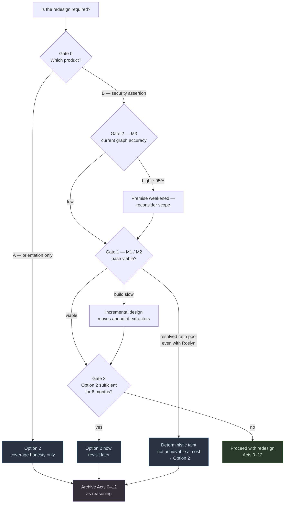

Note how many paths terminate at Option 2. That is not pessimism about the redesign — it reflects that Option 2 is cheap, reversible, and delivers the design's most valuable single property without any of its risk.

---

## Act 0 — Why this document exists

The plugin already builds a knowledge graph. It works like this: detect the tech stack, load the matching rule files, populate architecture documents from the codebase, build the graph.

The graph is Claude-generated prose. Module files describing entities, signatures, relationships, constraints. A git-diff script detects which modules went stale and Claude regenerates those.

It works. It also has a problem that only becomes visible when you point a security reviewer at it: **nothing in it is verified.** Every edge is something a language model believed after reading some files. That is fine for orientation and dangerous for assertion.

*Caveat carried from Act −1: the severity of that problem is asserted here, not measured. M3 tests it.*

This document records the redesign, including the paths we rejected and why.

### The shape of the redesign

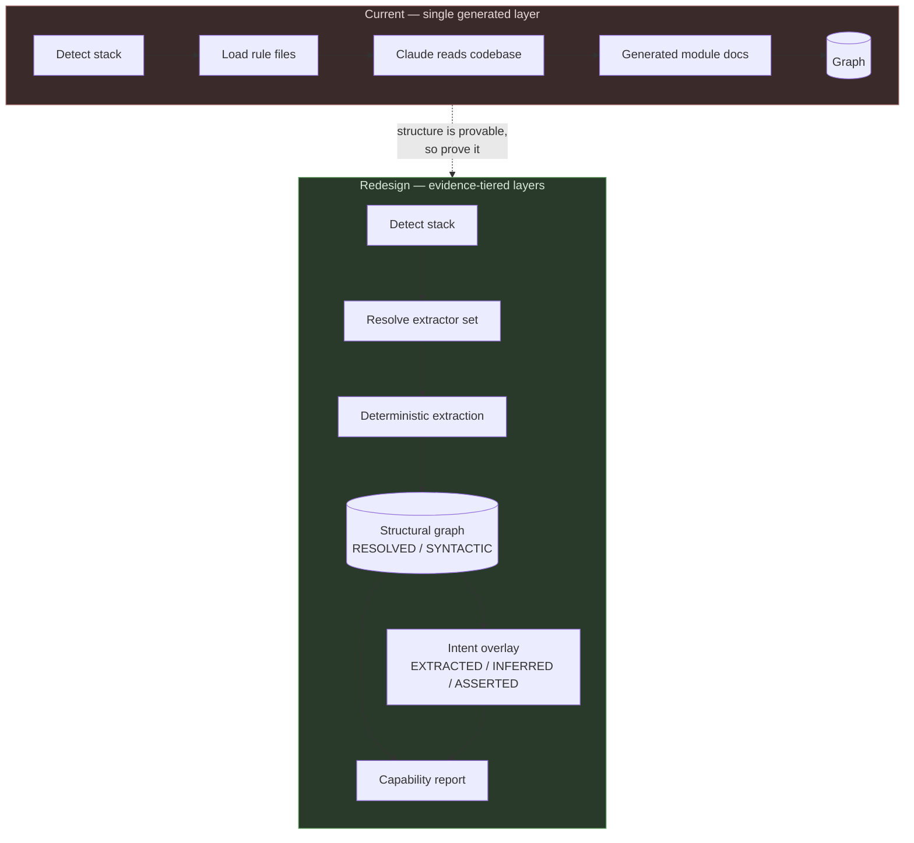

The essential move: split one undifferentiated layer into a proven layer and an authored layer, and make the seam between them visible.

---

## Act 1 — The comparison that started it

The trigger was a comparison against Graphify — an open-source tool that does deterministic AST extraction with tree-sitter, ships an MCP server, and rebuilds per commit.

The comparison surfaced the real distinction, which is not feature-level:

| | Current plugin graph | Deterministic extraction |
|---|---|---|
| Source of truth | LLM reading code | Parser proving structure |
| Cost | Tokens per build | Free after build |
| Failure mode | Confidently wrong | Silently incomplete |
| Captures intent | Yes — constraints, rationale | No |
| Captures structure | Approximately | Exactly |

Neither is strictly better. They fail in opposite directions.

**Decision 1 — Adopt deterministic extraction as the base layer; keep LLM-authored content as an intent layer on top.**
*Rationale:* structure is provable and should be proven. Intent is not extractable and must be authored. Using the wrong mechanism for either is the root of both tools' weaknesses.

**Rejected — Adopting Graphify itself as a dependency.**
*Rationale:* the plugin is a delivery artifact for client engagements. An external dependency that ships roughly daily, is not version-governed by us, and whose extraction rules we cannot extend is not acceptable in that context. Also rejected because it cannot capture WCF/VSTO topology, which is where our client estates actually live.

### What is convergent, and what is actually novel

Rejecting the dependency does not mean rejecting the prior art. An honest accounting of where this design merely re-derives what exists, versus where it adds something:

**Convergent — already solved elsewhere, borrow the solution:**

| Concept | Prior art | Where it lands here |
|---|---|---|
| Confidence-tagged edges | `EXTRACTED` / `INFERRED` / `AMBIGUOUS` tags | Decisions 23–25, 34 — same idea, different axis (see below) |
| Incremental rebuild via content hashing | SHA256 per-file cache, AST-only, no LLM cost | Act 10 scope resolution |
| Git hook triggers, detached execution | post-commit + post-checkout, nohup background | Decisions 49, 51 |
| Atomic output replacement | Copy over previous graph only on success | Decision 50 |
| PR impact triage and community-overlap conflict detection | `prs --triage`, `prs --conflicts` | Decision 52 |
| Tree-sitter breadth across many languages | 20–36 languages via tree-sitter | Act 2 |

**Genuinely novel — no prior art found:**

- **Capability-based tiering rather than method-based tiering.** Existing tools tag *how* a fact was derived. This design tags *whether the toolchain present on this machine was able to resolve it* — `RESOLVED` vs `SYNTACTIC`. That is the axis that matters in a polyglot estate with uneven extractor availability, and it is what makes the capability report possible.
- **The capability report as a first-class artifact and runtime input** (Act 5, Decision 18). Comparable tools emit a status summary — node counts, languages, last-updated. None appear to emit a statement of *what could not be analyzed and what would fix it*, ranked by recoverable impact.
- **Federation across application boundaries** (Act 3). Prior art is one repo, one graph. Boundary manifests, blackbox tiers, and manifest-hash staleness tokens have no equivalent.
- **Missing-extractor degradation** (Decisions 15–16). No comparable concept of building honestly with a partial toolchain.
- **Security semantics on the graph** (Decisions 30–35). Typed edges elsewhere are imports/calls/contains. Source/sink/sanitizer annotation, parameter-level granularity, and path-level confidence are additions.
- **Verification loops on the inferred layer** (Decision 26). Semantic passes elsewhere are LLM-generated and unverified — the same weakness this design identifies in its own current graph.

**A caution from the wild.** A downstream project built on Graphify reported that with no automatic update mechanism, planning sessions after the first quietly degraded into stale-context territory, with graph queries annotated "treat as approximate" when stale. That is Act 10's problem appearing in production, in a tool with strong extraction. **Extraction quality does not solve lifecycle.** It is evidence that the maintenance half of this design deserves at least as much attention as the extraction half — and that "treat as approximate when stale" is a pattern others reached independently.

---

## Act 2 — The extractor question

Initial instinct was Roslyn, which gives semantic resolution rather than syntax: resolved call targets, interface implementations, DI graph, inheritance. Far stronger than tree-sitter for .NET.

Then the stack list was stated properly: .NET, C#, WCF, VSTO, Java, Angular, React, Python.

Roslyn-for-everything does not exist. Hand-writing six extractors is a project, not a feature.

**Decision 2 — Two-tier extraction. Tree-sitter for breadth, Roslyn for .NET depth.**

Tree-sitter gives one traversal engine with per-language query files. Adding a language is writing queries, not writing code. Roslyn runs as an optional second pass that upgrades what it can.

This produces two edge confidence tiers, and the distinction is load-bearing:

- **`RESOLVED`** — a semantic model proved it. Roslyn for .NET, TypeScript compiler API for Angular/React if we go there.
- **`SYNTACTIC`** — the parser saw the call but could not resolve the receiver.

`_orderService.CreateAsync(...)` under tree-sitter means "a method named `CreateAsync` was called." Not on what. In a DI-heavy enterprise codebase that is most of the interesting edges.

**Decision 3 — Per-language honesty about depth.** Python's dynamic dispatch means many edges stay `SYNTACTIC` permanently. That is accepted and declared, not papered over. Trying to make Python edges as good as C# edges is where this kind of project goes sideways.

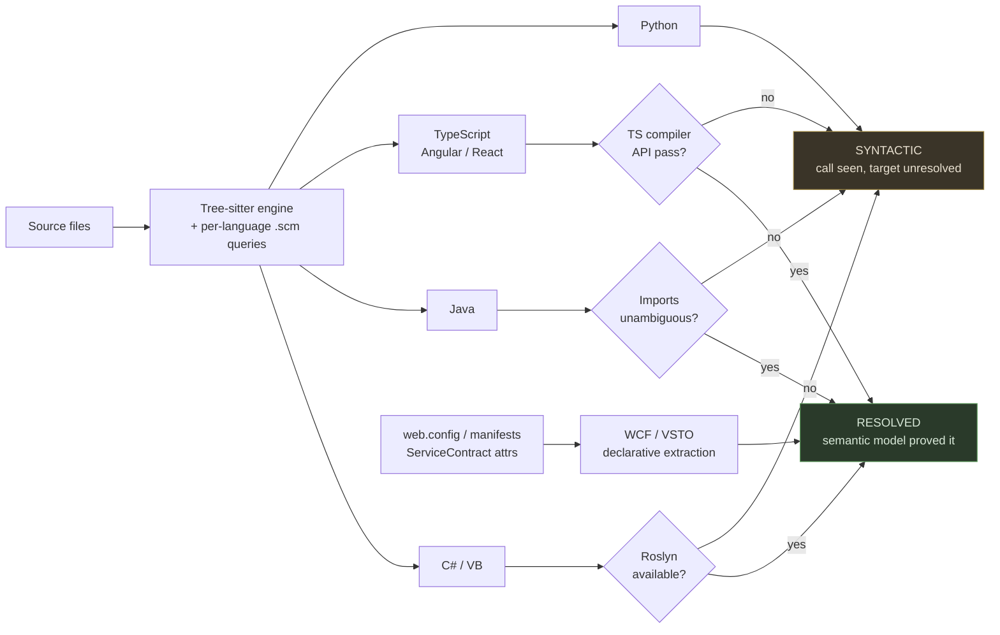

The asymmetry is deliberate and must stay visible in output. Python taint analysis will be materially weaker than C# taint analysis, and pretending otherwise is the failure this whole design exists to prevent.

**Decision 4 — Build WCF and VSTO extractors.** Not because they are technically interesting — because the contracts are declarative and easy to extract (`[ServiceContract]`, `[OperationContract]`, `web.config` endpoints, VSTO manifests and ribbon XML), and because nobody else builds them. Legacy Microsoft estates are exactly where our clients are. This is differentiation, not a checkbox.

**Decision 5 — Cross-language edges are the point.** An Angular service calling a .NET controller lives at route strings, not in any AST. Extract route attributes on one side, HTTP client calls on the other, match on path. Tier: `INFERRED`.

**Open risk:** route matching is messier than it sounds — environment base URLs, API versioning, gateway rewrites, proxies. **Test before building:** pull routes from one .NET repo and HTTP calls from its Angular counterpart, count matches. If resolution lands at 40% rather than 90%, the federated cross-app story is a footnote rather than a differentiator.

### Mitigations for cross-reference resolution

Matching two independently-authored string spaces that were never designed to agree is a lossy channel. No amount of matching sophistication fixes that. Three families of mitigation, in order of leverage.

**Make matching less lossy.**
- **Normalize before comparing** — strip base URLs, resolve environment constants, collapse version segments, normalize placeholder syntax (`{id}` / `:id` / `${id}`), lowercase, strip trailing slashes. Most misses are formatting, not semantics. This alone likely moves the rate materially.
- **Match on structure, not strings** — a route is a segment sequence with typed holes. `/api/v2/orders/{orderId}/lines` and `/orders/:id/lines` match structurally once the prefix is stripped and placeholders are wildcards.
- **Resolve config chains rather than reading a single file** — Angular base URLs are often composed from several constants or rewritten by a proxy config.
- **Use payload shape as a tiebreaker** — when a route match is ambiguous between candidates, DTO field names usually disambiguate. Weak alone, useful as a secondary signal.

**Make matching unnecessary — higher leverage.**
- **Detect generated clients.** If `api-client.ts` came from swagger codegen, the correspondence is *declared*, not guessed. Detecting the generation step converts an entire app pair from `INFERRED` to `CONTRACT` tier in one move, and enterprise teams frequently already do this.
- **Prefer any published contract** over inference wherever one exists.
- **Accept a declared manifest where inference genuinely cannot reach.** A hand-written, committed, reviewed fifteen-line YAML stating "this client calls these three services" is unfashionable and more reliable than any matcher. The overlay layer already accommodates this shape.

**Make failure safe — see Decisions 54 and 55.** Given matching will never be complete, what happens on failure matters more than the match rate itself.

**Hard ceiling worth knowing early:** endpoints constructed dynamically — string concatenation, template literals with runtime values — are unmatchable *in principle*, not merely in practice. If the Angular codebases build URLs that way at volume, no matching strategy helps, and the honest answers are generated clients or declared manifests. F3's failure categorization is what reveals whether this is the situation.

---

## Act 3 — The federation decision

The existing design handles polyglot applications with hybrid rule files. An Angular UI that knows about its .NET API gets a combined rule set.

That does not scale. The combinatorics grow with the stack list, and it puts one application's build in charge of another application's structure.

**Decision 6 — Federated graphs. Each application owns its own graph and negotiates at the boundary.**

Each graph has two parts:
- **Internal** — nodes and edges within the app
- **Boundary manifest** — what it *offers* (controllers, routes, WCF operations) and what it *needs* (outbound calls as unresolved external references)

The symmetric half matters. If the .NET app only publishes internal nodes, the Angular side has nothing to match against.

Resolution happens at traversal time, not build time: does a graph exist for the referenced app, does it export a matching node.

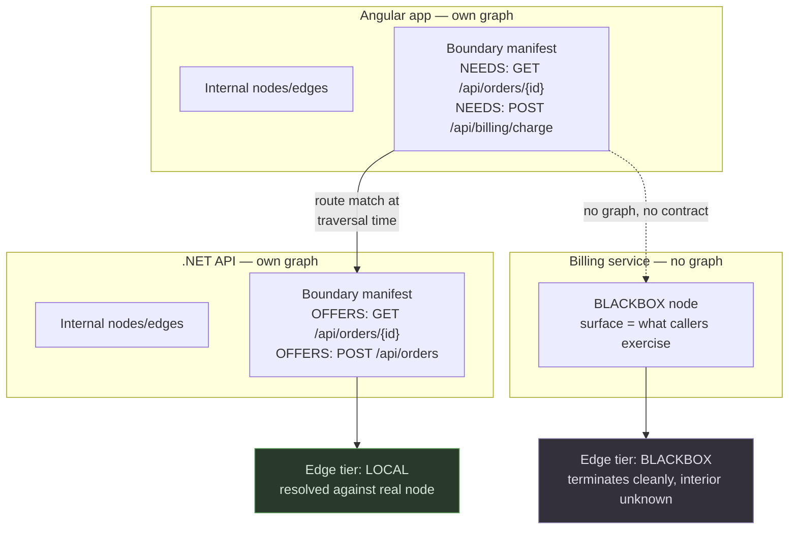

The symmetry matters: without the OFFERS half, the NEEDS half has nothing to match against.

**Decision 7 — Detection resolves to a *set* of extractors, not one path per application.**
An enterprise .NET shop with an Angular frontend is one application with two paths. Path-per-stack, graph-per-application. Anything else loses the cross-language edges we just decided were the differentiator.

> **Unresolved consequence, addressed later.** Making graphs per-application also makes *coverage reporting* per-application, which Act 5 did not anticipate. A per-app report cannot describe a boundary where one side is unmapped, because from the mapped side there is no gap. This is corrected in Act 5 (Decisions 53–55) with a composition step, and it has a cost: system-level coverage requires artifacts from more than one application, which is the single place where the "work with what is on this machine" principle cannot hold.

---

## Act 4 — Working with what is actually on the machine

The governing principle, stated by the plugin owner and adopted wholesale:

> Each application is unique, and so is each machine. One developer has cloned every repo. Another has three. Work with what is available. Report what would make it better.

This turned out to be more general than expected. Missing repos, missing extractors, missing contracts, unconfirmed inferences, stale overlays — all the same shape. *Partial evidence, degrade honestly, rank what would improve it.*

### The blackbox tier

**Decision 8 — External services with no available source are first-class nodes, not absences.**

Three resolution tiers, not two:

- **`LOCAL`** — graph present, edges resolved against real nodes
- **`CONTRACT`** — no graph, but a formal contract exists (OpenAPI, WSDL, `.proto`), so the surface is authoritative and *complete*
- **`BLACKBOX`** — inferred purely from caller-side usage; surface is only what the client happens to exercise

The middle tier deserves separate standing. A WSDL gives you the complete operation set including operations nobody calls. Caller-side inference gives you the exercised subset. Different confidence, different completeness.

Two properties fall out for free:

1. A blackbox contract describes a *deployed* service, not a branch tip — which is more correct than resolving against a colleague's local HEAD. Local resolution is arguably the special case.
2. Nodes promote without schema change. Someone clones the repo, or a registry appears; identity stays stable, only tier changes.

**Decision 9 — Blackbox nodes are intent-overlay attachment points.** "Rate-limited to 100 req/min." "Returns 202, processes async." "Ops team owns it, contact X." That is tribal knowledge with nowhere else to live.

### Auto-classification, with a hard honesty rule

**Decision 10 — Auto-detect external dependencies rather than prompting per-dependency.** Asking a developer to classify six externals on first run is friction they will click through carelessly.

Evidence, in confidence order:

1. **Contract artifacts on disk** — `.wsdl`, `.proto`, `swagger.json`, `openapi.yaml`, `Connected Services` / `Reference.svcmap`. Strongest signal, carries the endpoint address too.
2. **Config-declared endpoints** — Angular `environment.ts`, `appsettings.json`, `web.config` client endpoints, Spring `application.yml`. Gives target, not shape.
3. **Local path correlation** — base URL host matching a sibling directory or an existing additional-directories entry.
4. **Caller-side inference** — HTTP calls with no config or contract backing.

**Decision 11 — Automatic classification only on *direct* evidence.**

A WSDL on disk directly proves a contract. A `Reference.svcmap` directly proves a service reference. Those resolve silently.

Everything else is correlation. A base URL host matching a sibling directory name is a plausible guess and still a guess — so it gets asked, with evidence shown. The cost of asking is one click; the cost of a wrong assumption is an edge nobody can distinguish from a proven one.

**Decision 12 — `UNCLASSIFIED` is a legitimate terminal state.**
The failure mode to design against is a classifier reaching for a weak match rather than coming back empty. "Calls to `/api/billing/*`, no evidence found, unclassified" is honest and still useful — the endpoint is recorded, traversal terminates cleanly, overlay can attach. A wrong local resolution is worse than no resolution because it looks correct.

**Decision 13 — Store provenance, not just the answer.** Each classification records how it was determined: `contract-file`, `svcmap`, `developer-confirmed`, `unclassified`. Cached in `.claude/` so it is team-shareable via commit and re-prompts only when something changes. A developer who confirmed something wrongly six months ago is traceable rather than baked in as fact.

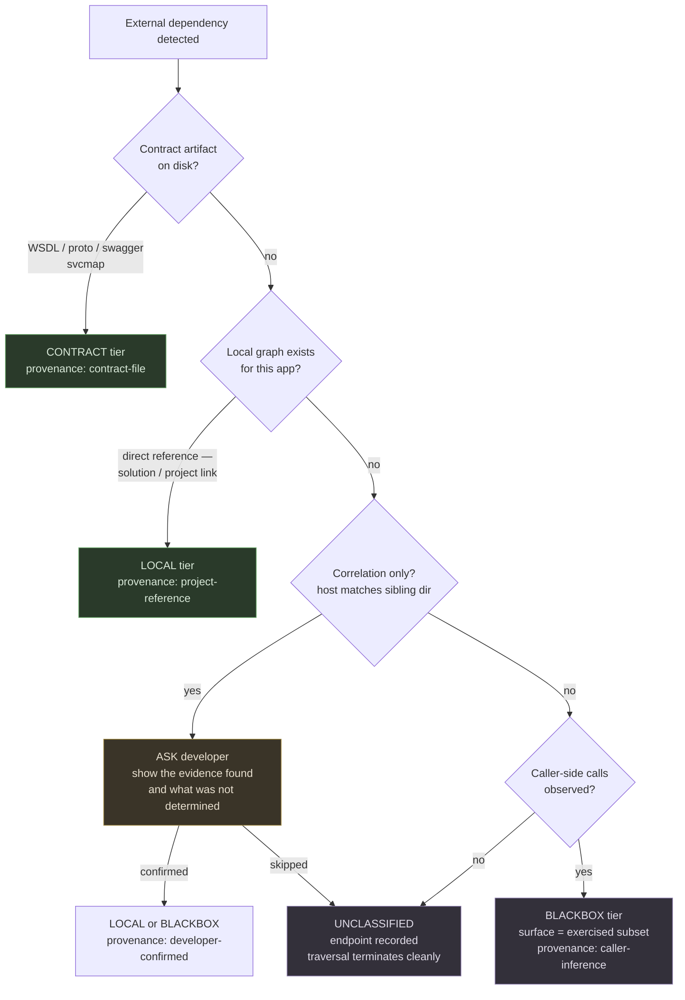

The left branch resolves silently because the evidence is direct. The middle branch asks because correlation is a guess. The right branch terminates honestly rather than reaching for a weak match.

**Deferred — live swagger URL fetching.** Would upgrade many blackboxes to contract tier, but it is a network call from a dev machine to a possibly-internal service. Opt-in per project, not default.

---

## Act 5 — The capability report

**Decision 14 — Every build emits a capability report. It is a first-class artifact, not a log.**

This became the single most load-bearing piece of the design. It is the honesty mechanism, the onboarding surface, the prompt replacement, and the incentive driver — four features depend on its schema.

Contents:

- **What was built** — stacks detected, extractors used *and their versions*, node/edge counts by tier
- **What is degraded** — ".NET edges syntactic-only, Roslyn extractor absent"; "billing service blackbox, no contract found"
- **What is unmapped** — externals without local repos, unclassified endpoints, regions with no overlay
- **What would improve it, ranked by impact** — "clone `Acme.Billing.Api` → resolves 34 unresolved edges" ranks above "install Roslyn extractor → upgrades 12 edges to resolved"

The ranking is the product. A list of everything missing is noise. A list ordered by recoverable edges is a work queue. And it is computable — you know how many unresolved references point at each missing thing.

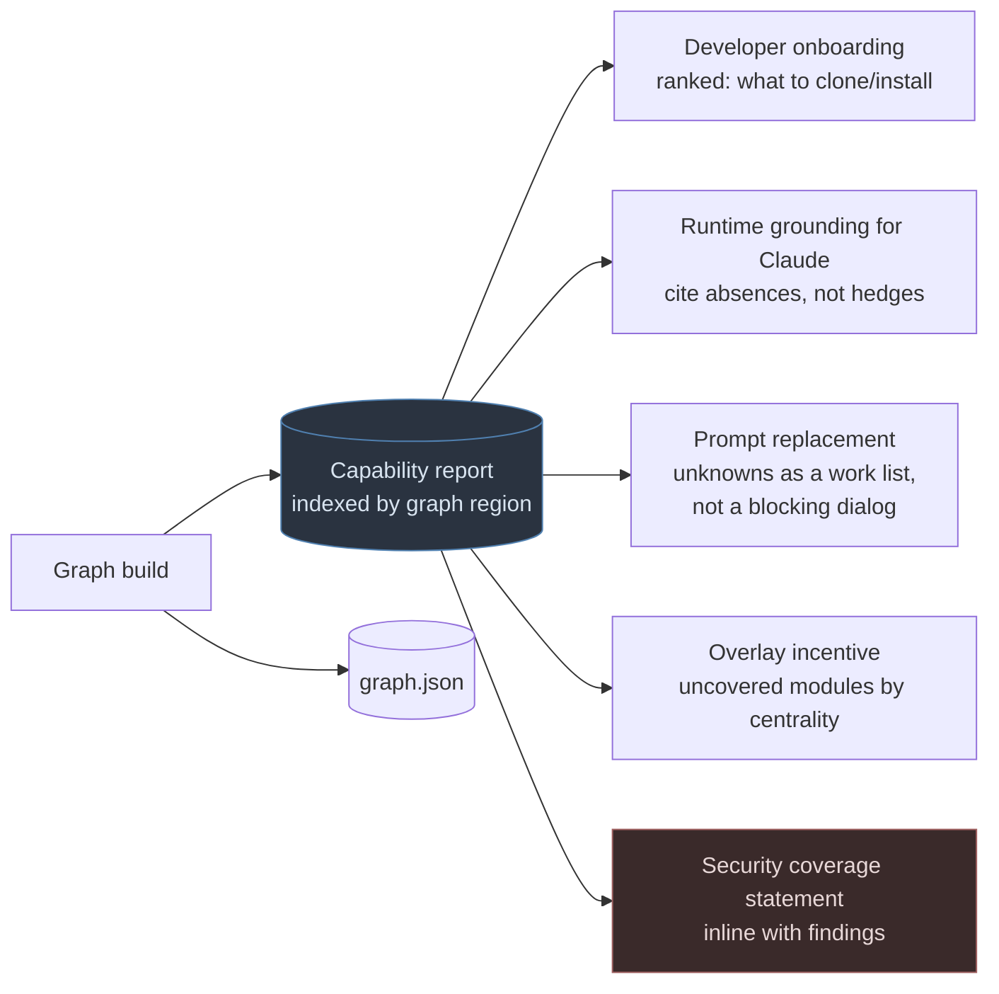

Four features depend on this schema, which is why it is worth designing deliberately and early. The security consumer is highlighted because it is the one where a schema gap becomes a safety claim rather than an inconvenience.

**Decision 15 — Extractors report a capability manifest, not a boolean.** "Is it installed" is really several questions: present, correct version, grammar compiled in. Version skew across a team is where this silently degrades — someone runs an older extractor, gets fewer edges, and nothing tells them. Manifests (languages, edge types, confidence tiers emitted) get recorded in graph metadata, so a graph built with a degraded toolchain is *visibly* degraded rather than quietly wrong.

**Decision 16 — Partial success builds.** Angular extractor present, .NET missing: build the Angular half, mark the .NET region as unmapped, let overlays still attach. Half a map is useful; no map is not. This propagates into the schema — there must be a representation for "known unknown" regions, which is cheaper to decide now than to retrofit.

**Decision 17 — The report replaces build-time prompting.** Do not block the build to ask. Build with available evidence, classify honestly, put the unknowns in the report as a ranked list the developer works when they choose. A prompt that blocks a build gets clicked through. A report item that unblocks 34 edges gets read.

**Decision 18 — The report is a runtime input to Claude, not just a build summary.**

This is the reframe that makes refusal grounded rather than hedged. Instead of "I'm not sure how billing works":

> This path terminates at `BillingService`, which is blackbox — no contract, no local repo. I cannot tell you what happens after the call. The report ranks cloning `Acme.Billing.Api` as the highest-impact fix, worth 34 edges.

Same discipline as citing a source, applied to citing an *absence*.

Requirements this imposes:
- **Queryable by graph region.** Runtime needs "gaps relevant to orders," not all forty items. Indexed by node. Structured JSON with a human rendering, not the reverse.
- **Written atomically with `graph.json`, same commit stamp.** A stale report is worse than none — Claude will cite a filled gap or miss a new one.
- **Hard rule in SKILL.md:** any traversal answer must reconcile against the report for that region; any degraded region must be declared. Same family as "never write structural facts into overlay files."

**Two failure modes to guard:**
- *Over-hedging.* If every response leads with tier caveats, developers tune it out and the credibility is spent. Rule: declare gaps that *materially affect this answer*; proceed silently where they do not. A blackbox three hops away is not worth mentioning.
- *Excuse surface.* "The graph is incomplete" must not become a substitute for opening a file that is sitting right there. The report explains what traversal cannot reach. It does not excuse not reading. State this explicitly — it is the cheaper path, and models drift toward cheap paths.

### Coverage is per-application. Security claims are not.

**This section corrects an assumption that broke when Act 3 introduced federation.** Act 5 was written describing the report as a per-build artifact. Act 3 then made graphs per-application. The consequence was not revisited, and it matters.

A per-app report describes gaps from that app's vantage only. The Angular report says "12 outbound calls I could not resolve." The .NET report says nothing about them — from its side there is no gap, its controllers are fully mapped. So a cross-application path that nobody analyzed appears as a partial gap in one report and *no gap at all* in the other. No artifact in the system describes the boundary as a whole.

For a developer working in one app, that is adequate. For a security claim about a system, it is not — and security claims are almost always about systems.

**Decision 53 — Coverage composes across federated reports. A system-level coverage statement is a distinct artifact from a per-app report.**

The composition step reads available published app reports and answers questions no single report can:

- Which boundaries have **both sides mapped** — outbound calls resolved against a matching offered route
- Which have **one side mapped** — the caller knows it calls something; nothing describes the callee
- Which have **neither** — blackbox on one side, absent graph on the other
- Which cross-app paths carry an `INFERRED` route match, and therefore should not back a high-confidence finding

**Decision 54 — Unmatched outbound calls are reported as coverage gaps, never as absence of connection.**

A match is evidence of a connection. A non-match is *not* evidence of no connection. This asymmetry must be explicit in the schema. An unmatched HTTP call is an unanalyzed data destination — for security use it is a hole, not a dead end, and it must surface as such rather than silently vanishing from the graph.

**Decision 55 — Cross-application edges are excluded from high-confidence security findings until match quality is measured.**

A wrong cross-app edge is worse than a missing one: it produces a taint path that looks proven and is not. Until F3 establishes a match rate and the matching logic has been validated, cross-app paths are reportable as `INFERRED` findings only.

### The tension this creates, stated plainly

**A system-level coverage statement requires seeing more than one application's artifacts.** A developer with a single repo cloned cannot produce one and should not pretend to.

This is the one place where the governing principle from Act 4 — *work with what is available on this machine* — does not hold. It cannot: the question being asked is inherently about more than one machine's worth of evidence.

The resolution is scope honesty rather than abandoning the principle:

- **Per-app report** — buildable anywhere, describes that app's gaps, sufficient for developer work
- **System coverage statement** — requires published artifacts from multiple apps, produced CI-side or registry-side, required for any security claim spanning applications

Which also means **Decision 44's artifact publication is load-bearing for security claims**, not merely convenient for the QA team. Without a place where app graphs and reports are published, no system-level coverage statement is possible, and every cross-application security claim is therefore unqualified.

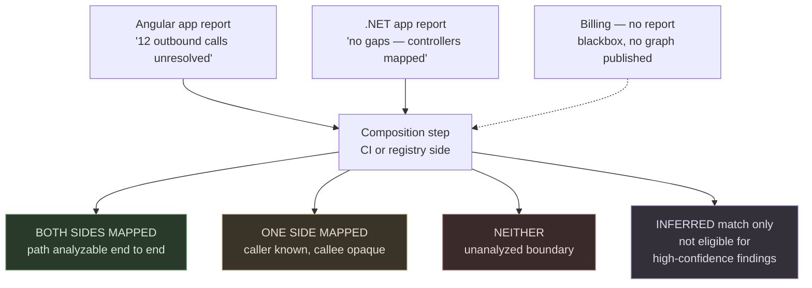

Note that the `.NET` app's report — accurate and complete on its own terms — contributes nothing to detecting the gap. Only composition surfaces it.

---

## Act 6 — Arguing with the design

Critical pass over the whole thing. Seven breaking points.

**1. The overlay is the only place hallucination can still enter — and nothing checks it.**
Everything else is evidence-gated. Then Claude-written prose sits on top carrying the credibility of everything around it. "Status transitions are one-directional" is a behavioral claim with no artifact backing. If wrong, wrong forever. Structural, not incidental.

**2. Silent decay.**
An overlay claim can become false with no file changing — a validation moves layers, a constraint relaxes. Staleness detection is edge-diff-based and cannot catch this. Over a year, a fraction of overlay content becomes confidently wrong with no signal.

**3. Anchor granularity is unresolved.**
Class-level anchoring: any method change flags the whole overlay. Method-level: overlays fragment, cross-cutting constraints homeless. Expensive to reverse once a team has written overlays.
**Decision 19 — Anchor to the symbol that owns the invariant, usually the type, but permit method-level anchors where a constraint genuinely belongs to one operation.** Staleness scopes by anchor level. Costs a richer anchor schema; buys not having to pick one granularity for all cases.

**4. Federation reintroduced consistency as a problem.**
Two apps classify the same service independently and differently.
**Decision 20 — No reconciliation service. Evidence ordering resolves it deterministically: contract beats caller-inference, always.** The report notes it: "billing resolved via contract in `OrdersApi`, inferred-only here — that contract is the better source." Different graphs on different machines is not a bug under the governing principle; it is two machines with different evidence.

**5. Prompt fatigue defeats the honesty rule.** Addressed by Decision 17.

**6. Ambient dependencies are invisible.**
Everything detected flows through explicit code references. Config-driven DI, reflection, message queues, database triggers, scheduled jobs — none appear. The graph looks complete while missing entire coupling paths, and completeness is the claim most likely to be over-trusted.
**Decision 21 — Undetectable coupling is *declared* undetectable.** If a stack rule file knows MassTransit is referenced but topology is not statically extractable, the report says so and suggests overlay declaration. Converts an invisible gap into a known one.

**7. Overlay incentive.**
Overlays cost effort now and benefit someone else later. Without a forcing function they get written once at rollout and never again.
**Decision 22 — The report drives coverage.** "Modules with structure but no intent overlay, ranked by graph centrality." Centrality is computable. Turns an open-ended chore into a finite ranked list — the same trick as everything else here.

---

## Act 7 — The inference layer

The intent layer needs the same evidence discipline as everything below it. Three tiers.

**Decision 23 — Prefer extraction over generation.**

A surprising amount of intent already exists as artifact:

- Test names and assertions — `Should_Reject_Cancelled_To_Confirmed_Transition` is a constraint stated by a passing test, and it decays *loudly*
- Guard clauses, thrown exception types
- Validation attributes, `Required`, ranges
- ADR references in comments, commit messages, PR descriptions
- Retry, timeout, circuit-breaker configuration
- Interface XML docs

Tier `EXTRACTED`, with a pointer back to the artifact. Verifiable, and re-derives on rebuild.

**Decision 24 — Inferred claims must cite supporting code, or be discarded.**
Claude proposes constraints from reading a module. Each proposal cites the specific code supporting it. Uncited proposals are dropped, not kept. Tier `INFERRED`, treated as a *candidate awaiting confirmation*, not as knowledge.

**Decision 25 — Asserted claims carry author and date.**
Human-written, no code backing — "ops owns this," "the client insisted on synchronous processing." Highest value, lowest verifiability. A two-year-old assertion from someone who left is different from last month's. Age them; surface the oldest for periodic review.

**Decision 26 — Verification loop.** Inferred claims are checked against the artifacts they cite. If the guard clause a constraint derived from is gone, the constraint is suspect and flagged. Same mechanism as anchor-drift repair, applied to intent. Extracted claims verify free on rebuild. Asserted claims cannot be verified at all — hence the aging.

**Decision 27 — Confirmation happens in context, not in a queue.**
Unconfirmed claims surface when someone is already in the relevant code — a PR touching a module surfaces that module's unconfirmed claims. Cheap in context, and it catches decay, because the person reading is the person who just changed the behavior.

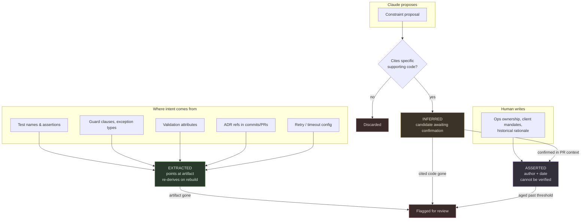

Note the direction of flow into `FLAG`: every tier has a decay path, and only `ASSERTED` decays purely on age because nothing can check it.

**Open question, worth measuring first:** the `EXTRACTED` tier may be most of the value at a fraction of the cost and risk. Test-derived constraints in particular are verifiable, self-maintaining, and already written. **Measure what proportion of real intent knowledge is recoverable that way on one repo before building the inference and confirmation machinery.** If it is most of it, the inference layer is a much smaller and safer feature than it currently looks.

---

## Act 8 — What about the architecture documents we already generate?

The plugin already produces data-flow and workflow documents during setup-init and sync. Reasonable question: why not use those instead of building data-flow extraction?

**Decision 28 — Use them as hypotheses and annotations. Not as the flow graph.**

They are Claude-generated from reading the codebase. That makes them `INFERRED` — plausible, useful, unverified. Two problems for security use specifically:

- *Silent incompleteness.* A missed path produces no signal. Extraction over-produces and you filter. Generation under-produces and you never know.
- *Decay.* Regenerated on sync, but sync triggers on structural drift. A refactor changing data flow without changing signatures may not flag.

**What they are genuinely better at**, and where they should be used:

- **Semantic trust boundaries.** Extraction knows a controller receives input. The doc knows *this* endpoint is public and *that* one is behind auth. That determines whether a path is a vulnerability or a non-issue, and no parser infers it. Highest-value use by some distance.
- **Intent of a flow.** "Accepts raw HTML because the editor requires it" turns a finding into a documented exception.
- **Ambient flows** — queues, scheduled jobs, config dispatch. Precisely the graph's blind spot.
- **Cross-app narrative** where route matching failed.

**As hypotheses**, each documented flow is checked against the extracted graph, with three outcomes:

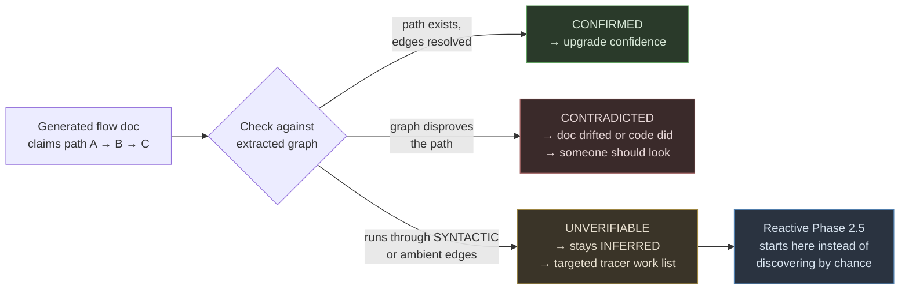

That third bucket is easy to undervalue. It is a work list covering exactly what the graph cannot see, derived from the docs. The reactive tracer currently finds those by chance.

**Free decay detector:** doc-versus-graph contradictions after sync mean either the doc drifted or the code did. Either way someone should look. Closest thing to self-checking on the inferred layer, and it costs nothing beyond running the comparison.

**The line to hold:** these documents are excellent at telling you *where to look* and *what matters*. They are unreliable at telling you *what is not there*. They do not stand in for extracted data flow when a finding is asserted or a clean scan is claimed.

**Measure:** diff one generated flow doc's paths against extracted edges. The confirmed/contradicted/unverifiable split gives an empirical trust number, which beats anyone's prior.

---

## Act 9 — Where this meets the multi-agent reviewer

The graph is consumed by the five-phase parallel code and security review. This changes both.

### What the graph gives the reviewer

**Partitioning stops being arbitrary.** Phase 1 currently slices by directory or file count. Graph communities slice by actual coupling density — cohesive units, and fewer findings straddling boundaries in the first place.

**Taint tracing becomes traversal instead of search.** Largest single win. Today an agent raises a hand and something follows the data by reading files. With edges, "does input from this controller reach a SQL sink" is a reachability query. Read only the files on the returned path, to confirm. On a large codebase this is the difference between bounded and pathological — and it is exactly the phase most likely to reproduce the original frozen screen.

**Sources and sinks become graph-queryable.** Controllers, request binding, form inputs are sources. SQL execution, file writes, process start, deserialization, outbound HTTP are sinks. Both extractable at build. So the orchestrator can enumerate source-to-sink paths *before any agent runs* and dispatch against a work list.

**Change-scoped review.** Impact analysis gives the affected subgraph plus its taint neighborhood. Thirty modules instead of five hundred. This is probably what makes per-PR security review viable at all.

**Cross-app taint** — input entering an Angular form and landing in a .NET query, traceable across the boundary, where the route match resolved.

### Revisiting Act 2 of the original reviewer design

The original conclusion — module scoping has a blind spot at boundaries, therefore scrap it — is correct for *file-based* scoping. The graph changes the premise: a module's boundary edges are known before any agent reads anything.

**Decision 29 — Phase 2.5 inverts from reactive to primarily proactive.** The orchestrator enumerates source-to-sink paths from the graph and dispatches tracers against that list. Agent hand-raising remains as the fallback for what the graph cannot see — which, given how much of a polyglot estate lands in `SYNTACTIC` tier, stays a substantial share. Two mechanisms, different roles: graph-driven for what is proven, agent-driven for what is not.

> **Superseded under the reactive-tracing constraint.** This decision assumes enumeration is the goal and that the graph exists to make it affordable. If tracing runs only on agent suspicion, enumeration never happens and the machinery supporting it — parameter-level edges, sanitizer annotation, precomputed paths — is unnecessary. See `COMPACT-GRAPH-DESIGN.md` C11–C14. Decision 29 stands only if enumeration becomes a requirement.

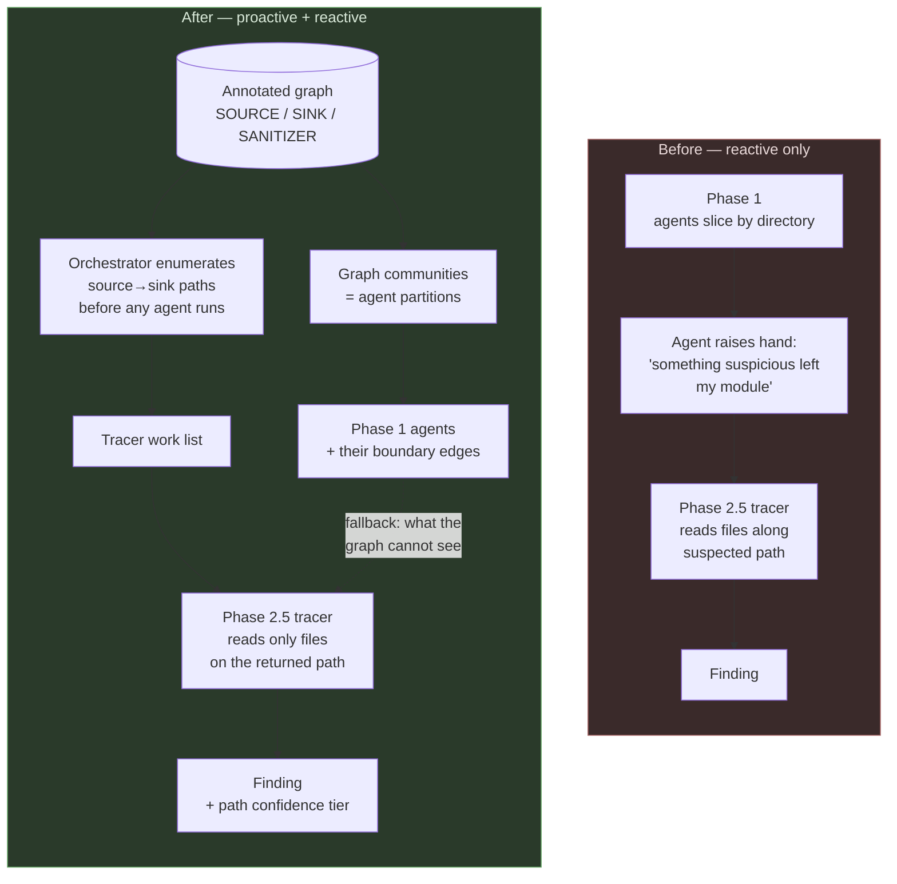

The reactive path does not disappear. It becomes the fallback for `SYNTACTIC` and ambient coupling rather than the primary mechanism.

### Graph schema changes the security use case requires

**Decision 30 — Security semantics live in stack rule files, not agent prompts.**
Node annotations for `SOURCE`, `SINK` (typed by kind), `SANITIZER`. Per-stack declarative lists. Adding a stack means writing a rule file; agents stay stack-agnostic consumers of an annotated graph. It also means the skill can honestly report "no sink definitions for this stack" rather than a scan quietly covering less than it appears to.

**Decision 31 — Parameter-level edge granularity.** Method-level edges are too coarse for taint. `Execute(query, connectionString)` — taint on the first parameter matters, on the second it does not. Edges carry which parameter position receives caller data. Schema decision with real cost; settle before writing extractors.

**Decision 32 — Data-flow edges, not just call edges.** Assignment, field write, return propagation. Meaningfully more extraction work, and the piece that makes taint precise rather than suggestive. Roslyn's data flow APIs help enormously for .NET. Other stacks will be coarser — see the asymmetry warning below.

**Decision 33 — Sanitizer awareness on paths.** A source-to-sink path through a parameterized query is not a finding. Without this, enumeration produces noise at a rate that destroys trust.

**Decision 34 — Confidence is computed at path level, not just edge level.** A path is only as trustworthy as its weakest hop. A path containing a `SYNTACTIC` edge is *unconfirmed* — the call target was not resolved, so the sink can be neither ruled in nor out. Path confidence carries into findings.

**Decision 35 — Unmapped regions are explicit sinks of unknown kind.** A blackbox external service receiving user data is a data destination that cannot be analyzed. It appears in the graph as such, not as an absence.

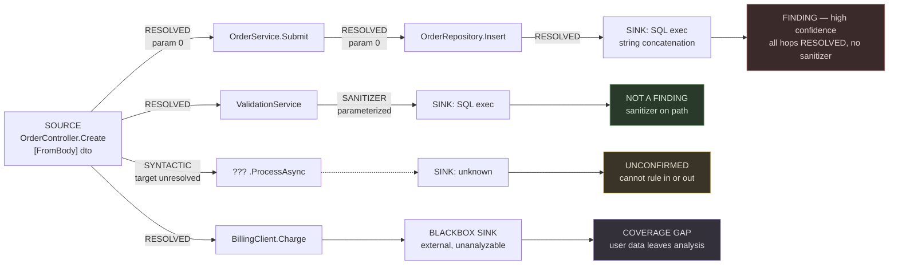

Four different outcomes from one source. The design's whole claim is that these must be reported as four different things — and that the third and fourth must not be silently absent from a "no vulnerabilities found" result.

### Reviewer skill changes

**Decision 36 — Findings carry evidence tier and are reported separately.** A finding on a `RESOLVED` path with proven data flow is a different artifact from one on a `SYNTACTIC` path with an inferred sink. Mixing them is how a tool loses credibility with a security team.

**Decision 37 — Coverage statement is mandatory output, inline with findings.**

> Reviewed 340 of 380 modules at resolved tier. 40 at syntactic only. 3 external sinks unmapped.

Not a sidecar file. Without this in the finding output itself, we have rebuilt the original problem — a safety net with a hole you cannot see, documented somewhere nobody reads. A scan reporting "no SQL injection found" over a subgraph with unresolved edges and three blackbox sinks is making a far weaker claim than it sounds like.

This is also the strongest market position in the design. Coverage-qualified security findings are something almost nothing on the market offers, and it fits the governance positioning already being built.

**Decision 38 — Fingerprints anchor to graph nodes.** The current scheme has the entry-side module assign the fingerprint before knowing where data lands, and the tracer inherits it. Node identity is better: a path fingerprint from source node plus sink node survives refactoring that moves code between files, which the current scheme does not.

**Decision 39 — Cache keys become subgraph hashes, not module content hashes.**
Content hashing per module is correct today and misses a real class of staleness: a module's code is unchanged, but a sanitizer three hops upstream was removed. Hashing the module plus its taint-relevant neighborhood catches it. **This is a correctness gap in the current reviewer design, not an optimization.**

---

## Act 10 — Graph lifecycle and maintenance

The design so far describes how the graph is *built*. It has been largely silent on how it stays true — which is the half that determines whether anyone still trusts it in six months.

### The trigger model

**Decision 41 — Three trigger contexts, one engine.**

| Context | Trigger | Scope | Interactive? |
|---|---|---|---|
| **Developer local** | `graph-sync` on demand | Incremental, changed modules + blast radius | Report only, never blocking prompts |
| **Developer automatic** | git post-commit / post-checkout, detached | Incremental | Never — must not block `git commit` |
| **CI on merge** | Post-merge to main | Full or incremental, publishes artifact | Never |
| **PR-time review** | PR opened / updated | Merge-base preview | Never |

The same engine with different entry points. If these drift into separate implementations, the developer's local graph and the graph a security finding was asserted against will diverge, and nobody will know which one was right.

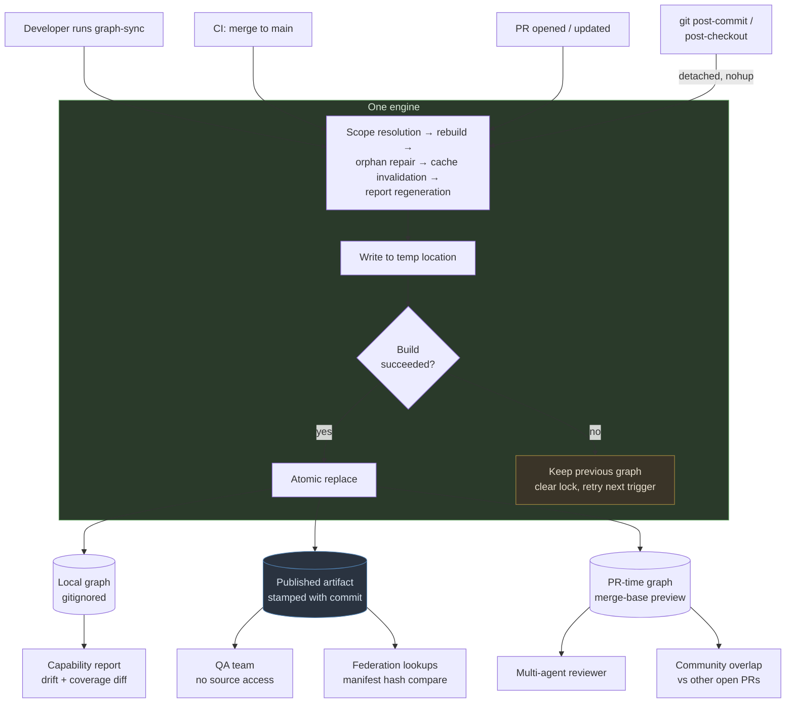

**Decision 42 — `graph-sync` is the developer-facing entry point and already exists.** The redesign extends its responsibilities rather than introducing a new mechanism. See the repo investigation section for what must be confirmed about its current behavior.

### What sync must do beyond rebuilding

**Blast-radius scope resolution.** Changed files → affected modules is insufficient. A signature change upstream invalidates downstream overlays and downstream review caches. That is a graph traversal, which is now possible because the graph exists. Sync must compute the transitive set, not the direct set.

**Orphan repair.** The unaddressed consequence of Decision 19. After rebuild, every overlay anchor must resolve against the current graph. Unresolved anchors go to a repair queue — re-anchor or retire. Without this, a rename silently orphans intent knowledge and nothing reports it.

**Federation staleness check.** See below.

**Cache invalidation.** Decision 39's subgraph hashing is computed here. Review caches keyed on old hashes become misses. This is a correctness mechanism, not an optimization, and it belongs in sync rather than being left as the reviewer's problem.

**Capability report regeneration and diff.** New blackboxes, extractors that stopped resolving, coverage that dropped. The *diff* is what makes coverage regression visible.

### Versioning: the graph is not source

**Decision 43 — `graph.json` is a build artifact and is not committed.**

*Rationale:* the graph is always the current state of the application. Nobody needs to know what it looked like two weeks ago. And not versioning it makes the concurrent-PR problem disappear by construction.

The concurrent-PR failure this avoids: two PRs branch from the same base, both rebuild the graph, both merge. A union merge of their outputs reflects neither PR's actual post-merge state, because edges deleted in one branch are resurrected by the other's copy. Standard git merge cannot catch this because the JSON is machine-generated and the conflict is semantic, not textual.

**Rejected — committing `graph.json` with a custom merge driver in `.gitattributes`.**

*This is not a hypothetical. It is the model Graphify ships:* commit the output directory, and `graphify hook install` configures a git merge driver that union-merges `graph.json` so parallel commits never produce conflict markers. So the rejection below is a rejection of a working, widely-deployed design, and the reasoning should be read with that weight.

The variant considered here was slightly different — a driver that discards both sides and *rebuilds* rather than union-merging. Rejected for three compounding reasons:

1. **Merge drivers are not distributed by the repo.** `.gitattributes` declares which driver to use; the definition lives in each developer's local git config. A machine without the setup step silently falls back to the default textual merge and produces exactly the corrupted union the driver exists to prevent — with no warning.
2. **The driver only fires on textual conflict.** Branches touching different regions of the file merge cleanly without invoking it. So the rebuild is occasional, not guaranteed.
3. **It does not run on the server.** GitHub and Azure DevOps merges do not execute local merge drivers. The case that actually matters — platform PR merges with concurrent branches — is precisely the case the driver never covers.

The middle option solves local merges, which were the least concerning case, and does nothing for the case that motivated it.

**Why union merge is more defensible for Graphify than it would be here.** Their extraction is a single deterministic pass producing one artifact. Ours is not: a rebuild has to reconcile whether the Roslyn pass ran, whether the capability report changed, whether intent overlays were orphaned by the diff, and whether review caches are still valid under Decision 39's subgraph hashing. That is a merge across several tiers of state, not a union of node lists. The richer the build state, the worse union merge behaves.

**What their model does solve, and we must solve differently.** Committing the output means one person builds, everyone pulls, and their assistant reads the graph immediately — no extractors required on the consuming machine. That is exactly the QA-team access problem. Decision 44's artifact publication is the cleaner answer but assumes CI exists to produce it. **If CI publication is not available, committing the graph is the pragmatic fallback and the concurrency risk must be accepted and documented rather than pretended away.**

**Decision 44 — Availability is solved by artifact publication, not by versioning.**

Two mechanisms replace the committed file:

- **Published build artifact.** CI builds the graph on merge to main and publishes it to wherever the org already puts build outputs. Anyone needing a graph without extractors installed pulls the published one. This covers the QA team, who have no source access — and it is strictly better than a committed file, because the artifact is stamped with the commit it was built from and cannot silently drift.
- **Local build on demand.** Developers with extractors installed build locally via `graph-sync`. `.gitignore` the file.

This also delivers the graph registry idea from Act 3 through the back door: the artifact store *is* the registry, because the federation staleness check needs somewhere to look up another app's manifest, and the publication mechanism already provides it.

### Federation staleness

A PR to the .NET API changes its boundary manifest, invalidating resolved edges in the Angular graph on someone else's machine. Nothing in the design as originally written propagates that.

**Decision 45 — Each resolved external edge stores the source graph's commit and boundary manifest hash at resolution time.**

This makes the manifest hash a first-class schema element, not an implementation detail — it is the staleness token for the entire federation model.

Staleness detection becomes a hash comparison against whatever manifest is locally available or published. **No clone, no pull, no network requirement.** If the other repo is not on the machine at all, the edge was already `BLACKBOX` and there is nothing to check. This preserves the property that made federation worth adopting: an app's build never depends on fetching another app.

**Decision 46 — Drift is reported, not auto-resolved. Do not prompt the developer to pull latest.**

*Rationale:* latest on the .NET repo's main branch is not necessarily what the Angular app runs against — this is the version-skew problem from Act 4. Pulling latest can make resolution *less* correct if the deployed API is two sprints behind. So sync reports the drift with both commit stamps and lets the developer decide. Consistent with Decision 17: a report item, not a blocking prompt.

### Coverage regression as a PR signal

**Decision 47 — The capability report is diffed per PR, and coverage regression is a reviewable event.**

A PR that introduces a new blackbox dependency, or one that causes an extractor to stop resolving a region, has reduced what the security review can see. Under Decision 18 the report is already a runtime input; diffing it makes degradation visible at the moment it is introduced rather than discovered later.

**Open policy question — advisory or merge-blocking?** This is a decision about team norms, not architecture. Advisory risks being ignored; blocking risks developers routing around the tool. Recommend advisory initially, with the diff surfaced in the PR conversation, and revisit once there is data on how often it fires.

### PR-time build scope

**Decision 48 — Two speeds, and the coverage statement declares which one ran.**

- **Base graph + PR diff** — fast, approximate. Adequate for impact analysis and change-scoped review.
- **Fresh build from merge preview** — correct, slower. Required for the full security pass, because a *new* sink introduced by the PR is exactly what taint enumeration must catch, and a base-plus-diff approach can miss it.

Reporting which mode ran is not optional. A security finding asserted against an approximate graph is a weaker claim than one asserted against a fresh build, and the distinction must survive into the output.

### Execution semantics

Three properties that are non-obvious, and that comparable tools appear to have learned by shipping.

**Decision 49 — Rebuild runs detached and never blocks the developer.**
A post-commit hook that runs synchronously makes `git commit` feel broken. Graphify's hook runs the rebuild as a detached background process so the commit returns immediately, with logs to a known cache path. Same requirement here, and more so — a Roslyn pass is slower than tree-sitter alone.

**Decision 50 — Rebuild is atomic. The previous valid graph survives a failed build.**
Write new outputs to a temporary location and copy over the existing graph only after the build succeeds. A background process that dies from a full disk, a killed terminal, or a parse crash must leave the last known-good graph intact rather than a truncated file. Locks are cleared by a trap handler so the next trigger retries cleanly rather than deadlocking on a stale lock.

This matters more here than for a simpler tool, because a corrupted or truncated graph feeding the security reviewer is worse than no graph — it produces a coverage statement that looks complete.

**Decision 51 — Rebuild belongs on git hooks, not on assistant hooks.**
Post-commit and post-checkout are the right triggers. Session-start, per-turn, or post-tool-use triggers are not: incremental rebuild on a real monorepo is measured in seconds to tens of seconds, which is tolerable when a developer has already moved on from a commit and intolerable inside an interactive loop. `graph-sync` remains the manual escape hatch.

### PR overlap detection

**Decision 52 — Flag PRs touching overlapping graph communities.**

Once community detection exists for partitioning (Decision 29), the same structure supports a cheap and genuinely useful signal: two open PRs modifying nodes in the same community are merge-order risk, regardless of whether they touch the same files. Textual conflict detection misses this entirely — the PRs may not overlap by a single line and still break each other semantically.

This is borrowed directly from Graphify's `prs --conflicts` and costs little once communities are computed. It also composes with Decision 47: a PR that both degrades coverage *and* overlaps another open PR's community is a strong review-priority signal.

---

## Act 11 — Performance

Three costs, behaving very differently.

**Graph build — expensive, amortized.** Tree-sitter over thousands of files is minutes. A Roslyn semantic pass on a large solution is worse. Paid once, then incrementally per commit. The make-or-break is whether incremental rebuild is genuinely scoped: if a one-file change triggers full-solution recompile, the frozen screen is rebuilt at a different layer.

**Graph query — cheap, roughly constant.** JSON load plus BFS. Every question answered by traversal is a question that cost no file read and no tokens.

**Agent review — where the time actually goes, and where the graph pays off.** Principled partitioning, bounded taint tracing, change-scoped review.

Net: build cost rises once, per-review cost falls substantially, and the pathological cross-module phase becomes bounded.

### Two measurements before committing

1. **Cold build time on the codebase that froze.** Eight minutes is a one-time cost hideable behind a background build. Forty means incremental design is not optional and must precede everything else.

2. **Fraction of taint-relevant edges landing `RESOLVED` vs `SYNTACTIC`** on a representative .NET repo. Taint tracing over syntactic edges is guesswork. If the fraction is bad, the Roslyn pass stops being an optimization and becomes a *prerequisite* for the security use case. Worth knowing which situation we are in before sequencing work.

---

## Act 12 — Sequencing

1. Tree-sitter engine + query-file pattern, one language (C#), to prove the shape
2. Java, TypeScript, Python as query files — mostly config, not code
3. Roslyn deep pass, upgrading `SYNTACTIC` → `RESOLVED`
4. Cross-language HTTP/contract matching
5. WCF and VSTO extractors

Steps 1–2 give something usable. Step 4 is where it beats what could have been bought.

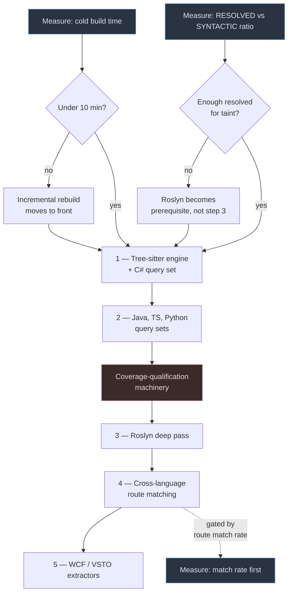

Coverage-qualification is drawn in the critical path deliberately, per Decision 40 below.

**Decision 40 — Coverage-qualification machinery ships before path-enumeration machinery.**
A structural graph that is 80% right is a useful developer aid. A taint graph that is 80% right, presented as a security scan, is the hole you cannot see. The first scan that runs must already be honest about what it missed.

---

## Open questions

All open questions are consolidated in the **Repo investigation plan** below, organised by whether they resolve by reading the repo (Groups A–E), by running a measurement (Group F), or by a human decision (Group G).

---

## Repo investigation plan

**How to use this section:** run this document inside the plugin repository with Claude Code. The questions below cannot be answered from design discussion — they depend on what the plugin actually does today. Each has a stated reason it matters and what decision it unblocks, so answers can be recorded inline and the affected decisions revisited.

Work top to bottom. Group A blocks the most downstream work.

### Group A — `graph-sync` current behavior

Blocks: Decisions 41, 42, and the whole of Act 10.

| # | Question | Why it matters |
|---|---|---|
| A1 | Does `graph-sync` do full or incremental rebuild today? | If full, incremental scoping is new work and moves ahead of extractor work per Act 12's gating |
| A2 | Does it prompt interactively during a run? | Decision 17 says it must not. If it does today, that is a behavior change to plan, not an assumption to carry |
| A3 | What is its current staleness detection mechanism? | The git-diff script is referenced in Act 0 — confirm it exists, and whether it maps files→modules or something richer |
| A4 | Can it run non-interactively for CI? | Decision 41 needs one engine, three entry points. If CI mode does not exist, that is new surface |
| A5 | Does it currently regenerate architecture/flow docs, or only the graph? | Determines whether Decision 28's doc-vs-graph reconciliation has a natural home in sync |
| A6 | What does it emit today — files, stdout, structured output? | The capability report (Decision 14) needs a place to live in the existing output contract |
| A7 | Does the plugin install git hooks today, and if so which? | Decisions 49/51 assume post-commit and post-checkout. Confirm whether hook installation exists at all |
| A8 | Is rebuild currently synchronous or detached? | Decision 49 — a synchronous post-commit rebuild makes `git commit` feel broken |
| A9 | Is output replacement atomic, and what happens on a failed or killed rebuild? | Decision 50 — a truncated graph feeding the security reviewer is worse than no graph |
| A10 | Is `graph.json` (or its equivalent) currently gitignored or committed, and does the QA team consume it? | Gates Decisions 43/44 and the CI-availability fallback |

### Group B — existing graph structure and storage

Blocks: Decisions 31, 32, 43, 45.

| # | Question | Why it matters |
|---|---|---|
| B1 | What is the current on-disk format and location of the graph? | Decision 43 says do not version it — confirm whether it is currently committed and what breaks if that changes |
| B2 | Is it committed to the repo today? | If yes, un-versioning it is a migration with a QA-access consequence (Decision 44) |
| B3 | What node identity scheme is used — file path, symbol name, something else? | Act 2 argues for fully-qualified symbol names so identity survives file moves. Confirm current scheme |
| B4 | Do edges carry any metadata today, or are they bare adjacency? | Decision 31 (parameter position) and edge tiering both require edge attributes |
| B5 | Is there any existing concept of confidence or tier? | Determines whether `RESOLVED`/`SYNTACTIC` is a new axis or an extension of something present |
| B6 | How large is the graph on the largest repo it has run against? | Feeds the performance questions and the incremental-vs-full decision |

### Group C — stack detection and rule files

Blocks: Decisions 2, 7, 15, 30.

| # | Question | Why it matters |
|---|---|---|
| C1 | What does a rule file contain today, and what is its schema? | Decision 30 puts `SOURCE`/`SINK`/`SANITIZER` definitions here. Confirm the schema can carry them |
| C2 | How does hybrid detection work currently (the Angular + .NET case)? | Decision 7 replaces hybrid rule files with an extractor set. Understand what is being replaced |
| C3 | Is there an existing extractor-availability check of any kind? | Decision 15's capability manifest may be an extension rather than net-new |
| C4 | Which stacks have rule files today, and how complete are they? | The stack list in Act 2 is aspirational — confirm which are real |
| C5 | Where is the additional-directories feature implemented, and what does it store? | Decision 10's auto-classification extends it; Decision 13 adds provenance to what it stores |

### Group D — intent overlay and architecture documents

Blocks: Decisions 19, 23–28.

| # | Question | Why it matters |
|---|---|---|
| D1 | What is the current module document template? | Act 1's split requires knowing what is structural (moves to graph) vs. intent (stays) |
| D2 | Is there any anchoring mechanism today linking docs to code? | Decision 19's anchor schema may have a precursor |
| D3 | What do the generated data-flow / workflow docs actually contain? | Decision 28's whole treatment depends on their real shape and granularity |
| D4 | When are those docs generated — init only, or every sync? | Determines their decay characteristics and whether Decision 28's reconciliation runs per sync |
| D5 | Is there any existing confidence or provenance marking on generated content? | Decisions 23–25's tiering may extend something present |

### Group E — multi-agent reviewer integration

Blocks: Decisions 29, 36–39, 47, 48.

| # | Question | Why it matters |
|---|---|---|
| E1 | How does Phase 1 currently partition modules? | Decision 29 replaces this with graph communities |
| E2 | What is the current cache key for a module's review result? | Decision 39 changes it to a subgraph hash — this is a stated correctness gap, confirm the current scheme |
| E3 | How are fingerprints currently assigned and inherited? | Decision 38 anchors them to graph nodes instead |
| E4 | Does the reviewer emit any coverage statement today? | Decision 37 makes it mandatory and inline |
| E5 | Is the reviewer invoked at PR time already, or manually? | Decisions 47–48 assume PR-time invocation exists or can be added |
| E6 | How does Phase 2.5 currently decide what to trace? | Decision 29 inverts this — understand the reactive mechanism before demoting it to fallback |

### Group F — measurements (require running code, not reading it)

These are the empirical questions. They need a real codebase, ideally the one that produced the frozen screen.

**F7, F1, and F2 are the Act −1 gate measurements. Run those three before anything else in this plan.**

| # | Measurement | Decision it gates |
|---|---|---|
| F7 | **Accuracy audit of the current graph** — one known module, every claimed relationship verified by hand: hallucinated / missed / correct | **Gate 2. The redesign's entire premise. An afternoon's work and the most decision-relevant number in the document** |
| F1 | Cold tree-sitter build time on the largest repo | Gate 1. Whether incremental design precedes everything (Act 12) |
| F2 | `RESOLVED` vs `SYNTACTIC` ratio on taint-relevant edges, one .NET repo | Gate 1. Whether Roslyn is prerequisite, optimization, or insufficient either way (Decision 3) |
| F3 | Route-template match rate, one Angular ↔ .NET repo pair — **categorize misses, do not just count them**: formatting/normalization, base-URL composition, versioning segments, dynamically constructed URLs, genuinely absent routes | Whether cross-app is differentiator or footnote (Decision 5). The failure *distribution* determines which mitigation is worth building — normalization is an afternoon; dynamically constructed URLs are a hard ceiling no matcher fixes |
| F4 | Proportion of intent recoverable as `EXTRACTED` — test names, guard clauses | May shrink the inference layer substantially (Decision 23) |
| F5 | One flow doc diffed against extracted edges: confirmed / contradicted / unverifiable split | Sets trust weighting (Decision 28) |
| F6 | First-run capability report size on a partially-cloned machine | Forty items makes ranking the product; four means this is over-engineered (Decision 14) |

### Group G — decisions requiring a human call, not investigation

These do not resolve by reading the repo. They are policy or preference.

| # | Question | Considerations |
|---|---|---|
| G1 | Extractor implementation language — C# for both extraction and MCP, or C# + Python? | Single artifact and one build vs. deliberate Python/MCP practice. Decide before step 1 |
| G2 | Coverage regression: advisory or merge-blocking? (Decision 47) | Advisory risks being ignored; blocking risks being routed around. Recommend advisory first |
| G3 | Which stacks get first-class support vs. "syntactic only, best effort"? | Act 2 warns that trying to make all stacks equal is where this goes sideways |
| G4 | Does the QA team consume published graph artifacts, and through what channel? | Decision 44's publication target depends on their existing access model |

---

## Revision log

| Version | Change |
|---|---|
| 0.1 | Initial design — Acts 0–9, Decisions 1–40 |
| 0.2 | Added Mermaid diagrams at structurally load-bearing points |
| 0.3 | Added Act 10 (lifecycle and maintenance), Decisions 41–48; rejected the `.gitattributes` merge-driver option with rationale; added repo investigation plan |
| 0.4 | Added Act −1 (go/no-go gate) with the three-option comparison, gate measurements, and named over-build risks; status downgraded to unapproved proposal; added F7 accuracy audit as the premise test |
| 0.5 | Prior-art assessment added to Act 1 separating convergent from novel; merge-driver rejection corrected to note it rejects a shipped design and why our state is richer; Decisions 49–52 added (detached rebuild, atomic replace, git-hook-not-assistant-hook, PR community overlap) |
| 0.6 | Cross-reference mitigations added to Act 3; Decisions 53–55 added correcting the per-app coverage assumption that broke when federation was introduced — coverage composition, non-match asymmetry, cross-app findings excluded from high confidence; F3 expanded to categorize failures rather than count them |
| 0.7 | Compactness and reactive-tracing constraints surfaced, weakening this document's case; `COMPACT-GRAPH-DESIGN.md` created developing Option 2 in full; Decision 29's proactive inversion noted as incorrect under reactive tracing; this document reframed as the reference for a larger design rather than the default path |

---

Every decision in this document reduces to the same rule, which is the plugin's existing anti-hallucination stance applied one layer down:

> **The graph must not assume, must not infer past its evidence, and must ask rather than guess — and when it cannot ask, it must say so.**

The graph's value is not that it knows everything. It is that what it claims to know, it can prove, and what it cannot prove, it says out loud.

Which is the answer to the question the original reviewer article ended on. The silent failure we were trusting too much was a knowledge graph that never told us what it did not know.
