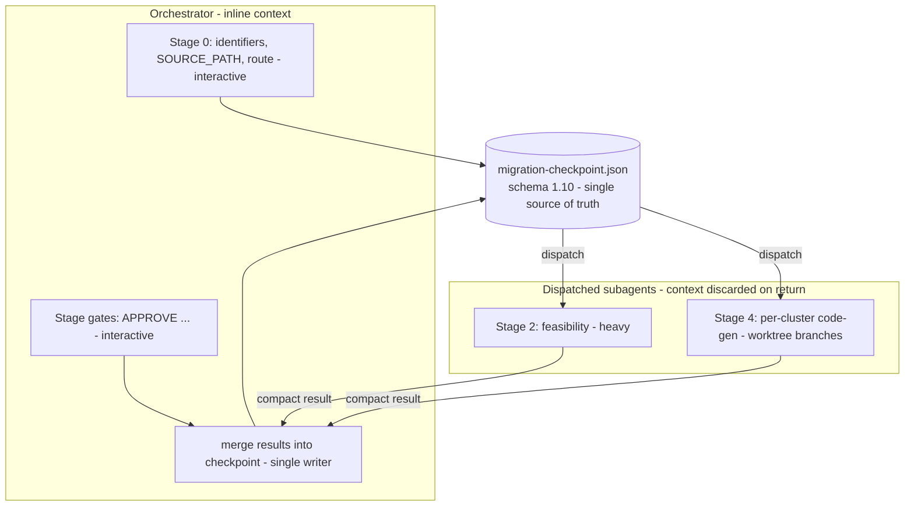
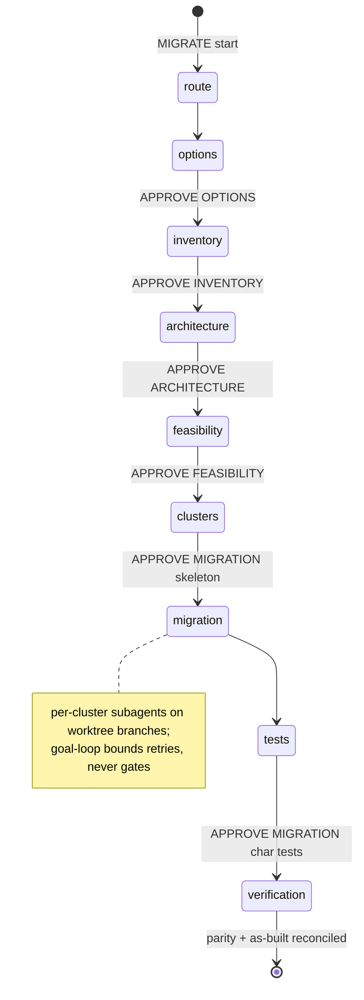
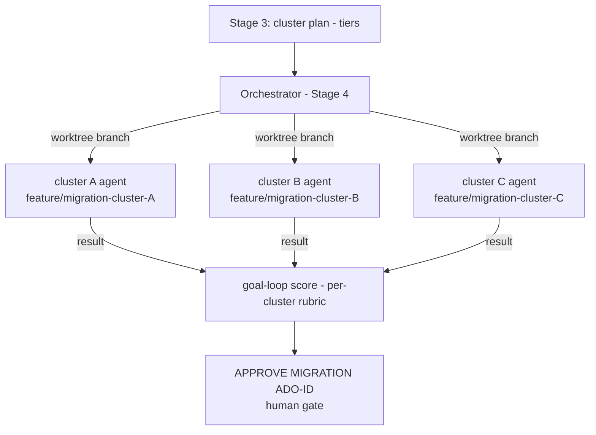

# Legacy `migration` skill — architecture explainer (retired)

> **Status: RETIRED.** The single `migration` skill (and its read-only companion `migration-status`)
> was split into three focused, directly-invoked skills — **Upgrade · Rewrite · Replatform** —
> carved on *locality* of change. See [ADR 0061](../adr/0061-migration-skill-family-split.md) and
> [docs/migrations/2026-09-migration-skill-family.md](../migrations/2026-09-migration-skill-family.md).
>
> This document captures the retired skill's design so the orchestrator pattern it pioneered lives on
> as reference, not only in git history. **Git restore anchor:** the skill was removed in commit
> `06d22b9`, so its last state is at `06d22b9^` — e.g.
> `git show 06d22b9^:skills/migration/SKILL.md` (and `…/steps/stage-0.md`, `stage-1-architecture.md`, …).
>
> **Abbreviations** (SA · SE · SRP · DAG · BAL …): see [migration-glossary.md](migration-glossary.md).

---

## 1. Purpose

`migration` migrated an application from one tech stack to another **out of place**: you ran it
**from inside the new (empty) TARGET project folder** and supplied the SOURCE application path when
prompted. It used the *source* project's knowledge graph to derive parallel migration **clusters**,
and each cluster agent generated target code on its own **branch of the TARGET repository**.

Supported source→target moves at retirement: .NET Framework → .NET 10, Java ↔ .NET,
React+Express → Angular+.NET, Node.js → .NET.

Its defining characteristic — and the reason it is worth remembering — is the **thin-orchestrator +
per-stage step-file + checkpoint** pattern, combined with a **hybrid inline/subagent execution
model** that kept a very long, multi-stage workflow inside a bounded context budget.

---

## 2. Responsibility (SRP)

`SKILL.md` was a **thin orchestrator**. Its single responsibility was *sequence + stage-gates +
checkpoint*:

- It owned **Step 0** (entry / resume), the **stage order**, the **gate keywords**, and the
  `.claude/migration-checkpoint.json` **checkpoint** (the single source of truth).
- Each stage's actual procedure — persona, model tier, reference loads, and steps — lived in its own
  **step file** under `skills/migration/steps/`.
- The orchestrator read the checkpoint's `phase` / `stage_gates` and **dispatched** the right step
  file. It never inlined stage procedures.

This is the pattern the DEVELOPER-GUIDE's "multi-stage orchestrator skills" section points to.

---

## 3. Hybrid execution model (the context-budget trick)

The workflow was far too long to run in one context. The skill split work by **interactivity**:

- **Interactive** steps (Stage 0 questions; every stage-gate approval) ran **inline** in the
  orchestrator's context — a subagent cannot do multi-turn user Q&A.
- **Heavy, non-interactive** steps (Stage 2 feasibility; Stage 4 cluster code-gen) were **dispatched
  as subagents**, so their large context was **discarded on return** — only a compact structured
  result flowed back into the checkpoint.
- The **checkpoint (JSON)** was the hand-off medium. The orchestrator was the **single writer**
  (`skills/shared/single-writer-assumption.md`); dispatched agents **returned** results, and the
  orchestrator merged them.



---

## 4. The nine-stage flow

| Stage | Keyword (start / resume) | Step file | Gate keyword | Exec |
|---|---|---|---|---|
| 0 — identifiers, SOURCE_PATH, route | `MIGRATE ADO-{ID}` | `stage-0.md` | — | inline |
| 0.5 — target **options** (× TCO) | `MIGRATE OPTIONS` | `stage-0.5-options.md` | `APPROVE OPTIONS ADO-{ID}` | inline |
| 0.6 — source **inventory** | `MIGRATE INVENTORY` | `stage-0.6-inventory.md` | `APPROVE INVENTORY ADO-{ID}` | inline (large → per-cluster subagents) |
| 1 — target **architecture** | `MIGRATE ARCH` | `stage-1-architecture.md` | `APPROVE ARCHITECTURE ADO-{ID}` | inline |
| 2 — **feasibility** | `MIGRATE FEAS` | `stage-2-feasibility.md` | `APPROVE FEASIBILITY ADO-{ID}` | **subagent** |
| 3 — **clusters** (parallel plan) | `MIGRATE CLUSTERS` | `stage-3-clusters.md` | `APPROVE MIGRATION ADO-{ID}` (skeleton) | inline |
| 4 — **migration** (code-gen) | `MIGRATE RESUME [BACKEND\|FRONTEND]` · `RETRY CLUSTER {name}` | `stage-4-migration.md` | — | **subagents** (per cluster, worktree) |
| 5 — **tests** (characterization) | — | `stage-5-tests.md` | `APPROVE MIGRATION ADO-{ID}` | inline |
| 6 — **verification** | — | `stage-6-verification.md` | completion gate (6.4 parity · 6.5 as-built reconciliation) | inline |

Cross-cutting: `MIGRATE STATUS ADO-{ID}` → the read-only `/migration-status` projection.

```mermaid
flowchart LR
    A["Stage 0 route"] --> B["0.5 options"]
    B -->|"APPROVE OPTIONS"| C["0.6 inventory"]
    C -->|"APPROVE INVENTORY"| D["1 architecture"]
    D -->|"APPROVE ARCHITECTURE"| E["2 feasibility - subagent"]
    E -->|"APPROVE FEASIBILITY"| F["3 clusters"]
    F -->|"APPROVE MIGRATION - skeleton"| G["4 migration - cluster subagents"]
    G --> H["5 tests"]
    H -->|"APPROVE MIGRATION - char tests"| I["6 verification"]
    I -->|"parity + as-built reconciliation"| DONE(["MIGRATION COMPLETE"])
```



**Per-stage walkthrough (one line each):**
- **0** — collect ADO/Release/Sprint + SOURCE_PATH, verify TARGET git repo, register SOURCE as an
  additionalDirectory, detect + offer resume from any existing checkpoint.
- **0.5** — enumerate viable target options with trade-offs/TCO (skipped only for a pure `dotnet`
  version upgrade).
- **0.6** — build a grounded source **inventory**; INFERRED items touching integration/auth/security
  must be ground-truth-verified; gaps logged with `file:line`, never guessed.
- **1** — design the **target architecture** (the governance substitute for an ICEA); Mermaid required.
- **2** — **feasibility** assessment (heavy → subagent); risk/finding severity uses the B-series.
- **3** — derive parallel **clusters** from the source graph; deploy target guardrail rules (Step 3.3a).
- **4** — generate target code **per cluster on worktree branches**; bounded goal-loop scores each.
- **5** — characterization / **tests**.
- **6** — **verification**: golden-master parity (6.4) + as-built reconciliation (6.5) before COMPLETE.

---

## 5. Gate & checkpoint model

`.claude/migration-checkpoint.json` (**schema 1.10**) was seeded at Step 0.4 and **merged** at each
gate. It was the resume anchor for every `MIGRATE *` keyword, the Stage 1–3 context-budget checks,
and the parallel Stage-4 subagents. It was **gitignored runtime state** (never committed;
`skills/shared/checkpoint-schema.md`). Human-readable status was a **computed projection** rendered
by `/migration-status` — there was no separate markdown tracker file.

On each `APPROVE …`, the owning step file merged the checkpoint
(`stage_gates.*_approved = true`, `phase = next`) **without clobbering** `decision_log` / `clusters`.
Per-cluster status was authoritative in `clusters{}`:

```json
"clusters": {
  "{ClusterName}": {
    "status": "pending|in-progress|complete|failed",
    "tier": 0,
    "branch": "feature/migration-cluster-…",
    "date": "YYYY-MM-DD",
    "feature_ids": []
  }
}
```



---

## 6. Personas & model routing

| Stage | Persona | Model tier |
|---|---|---|
| 0 / 0.5 / 0.6 / 1 / 3 | **[SA] Rafael Mendes — Solution Architect** | `ICEA_MODEL` (opus) — options, architecture, cluster planning |
| 2 (feasibility) + Stage-5.0 golden-master / verification | **[SA]** (feasibility) | `REVIEW_MODEL` (sonnet) |
| 4 / 5 / 6 (code-gen, tests, verification) | **[SE] Elena Fischer — Senior Software Engineer** | `ICEA_MODEL` for Stage 4 code-gen |

Each step file re-stated its own persona; see `skills/shared/personas-spec.md` /
`model-routing-spec.md`.

---

## 7. Stage-4 cluster parallelism

Stage 4 dispatched **one subagent per cluster**, each on its **own git worktree branch** of the
TARGET repo, executing from `TARGET-ARCHITECTURE.md` only (cluster agents loaded **no** reference
files). The orchestrator ran the bounded **goal-loop** (`goal-loop-spec.md`) to score each cluster
against its completion rubric and compute an overall Stage-4 percentage shown beside the
`APPROVE MIGRATION ADO-{ID}` summary. The loop bounded auto-retries (maxIterations 2, then
`RETRY CLUSTER {name}`) and **never crossed the gate** — it stopped at it for the human.



---

## 8. Full-stack = two coordinated single-track runs

A full-stack migration was **two** coordinated runs, never one:

1. A **`backend`** run that generates the API and **publishes the integration contract**.
2. A separate **`frontend`** run that **consumes** it — calling the API only through the *generated
   client*, never editing the contract, and checking the consumed **integration-contract hash**
   before every cluster (Step 4.3a).

---

## 9. Governance & key hard rules

- **ICEA substitute:** the skill generated code **without a prior ICEA**; the **Stage-1 architecture
  documents** were the governance substitute. The **Write Gate still held** — no target code was
  written without `APPROVE MIGRATION ADO-{ID}`.
- **Design-time ≠ as-built:** Stage-1 docs were pre-implementation intent; `MIGRATION COMPLETE`
  required the Stage-6 **as-built reconciliation** (`architect` + `/graph-sync` on the generated
  target; `asbuilt-reconciliation-spec.md`). When golden-master was skipped, the mechanical as-built
  audit was the compensating control.
- **Ground-truth integration verification:** never classify an integration's transport/binding/auth
  from a consumer interface name — verify against host config / assembly / WSDL
  (`integration-verification-spec.md`). `PROV:` proves the citation exists, not that its
  interpretation is correct.
- **No fallbacks:** unsupported source stack → STOP; `MATURITY: ⚠ Unverified` target profile →
  explicit go-ahead required; never auto-proceed past a gate.
- **Never migrate + refactor + change behaviour in one step; never assume when ambiguous; never write
  secrets (placeholders only); never skip Mermaid diagrams.**

---

## 10. What replaced it

| Legacy `migration` posture | Replacement skill |
|---|---|
| Same stack, higher version (in place) | **`/upgrade`** — orchestrates a deterministic tool; rejects false-upgrades |
| Different stack, translate the code (out of place) | **`/rewrite`** — generative; posture · options × TCO · target-space DAG · per-cluster BAL/ERL · two-gate |
| On-prem → cloud (move the host) | **`/replatform`** — NFR/Well-Architected oracle; LLM authors IaC + human-executed runbooks |
| Legacy stack/mapping/strategy references | **Offline knowledge tier** `skills/shared/migration-knowledge/refs/` (INFERRED), validated by **`/knowledge-freshness`** (ADO-9004) |
| `migration-checkpoint.json` (schema 1.10) | Shared `checkpoint-ledger.cjs` + `migration-ledger-schema.md` (one ledger per ADO) |
| `MIGRATE *` router | **Static human-choice signpost** — no classifier (rejected as rigid/duplicative) |

See [ADR 0061](../adr/0061-migration-skill-family-split.md).

---

## Appendix — retired reference inventory (`06d22b9^:skills/migration/`)

- **`steps/`** — `stage-0`, `0.5-options`, `0.6-inventory`, `1-architecture`, `2-feasibility`,
  `3-clusters`, `4-migration`, `5-tests`, `6-verification`.
- **`references/specs/` (×11)** — `source-inventory`, `target-options`, `target-app-architecture`,
  `phase1-architecture`, `feasibility`, `integration-contract`, `integration-verification`,
  `frontend-parity`, `golden-master`, `asbuilt-reconciliation`, `migration-report`.
- **`references/stacks/` (×7)** — `dotnet`, `dotnet-framework`, `java-spring`, `nodejs-express`,
  `python`, `angular`, `react`.
- **`references/mappings/` (×7)** — `java-dotnet`, `nodejs-dotnet`, `nodejs-python`, `react-angular`,
  `angular-react`, `dotnet-framework-to-dotnet`, `dotnet-upgrade`.
- **`references/strategies/`** — `README` + `dotnet`, `java-spring`, `python`, `angular`, `react`.
- **`references/shared/`** — `clean-architecture`, `ef6-to-efcore`, `fullstack-integration`.

The curated subset of these (version-sensitive stacks/mappings/strategies + the golden-master,
feasibility, and as-built-reconciliation specs) was **preserved** under
`skills/shared/migration-knowledge/refs/` with a freshness manifest; the 8 superseded stage-machine
specs were archived with the skill. Recover any file with
`git show 06d22b9^:skills/migration/<path>`.
