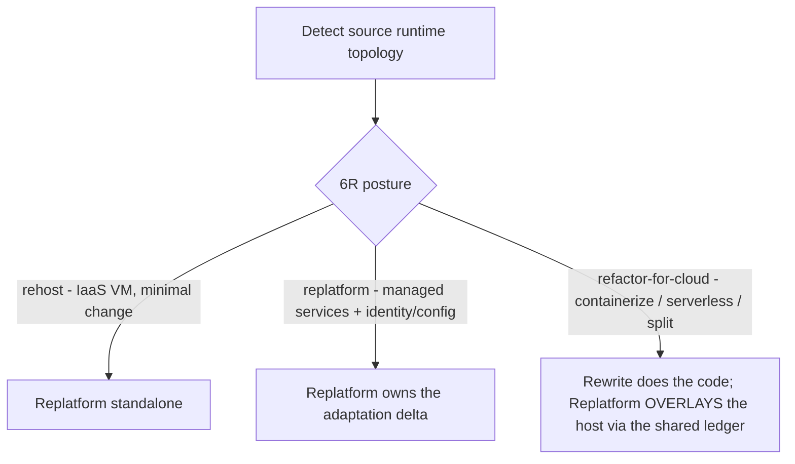
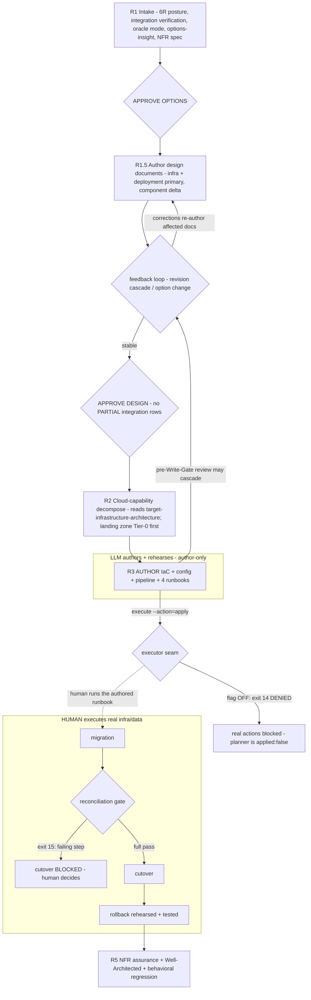

# `replatform` skill — architecture explainer

> **Status: LIVE.** One of the three migration-family skills (**Upgrade · Rewrite · Replatform**)
> that replaced the retired `migration` skill — see [ADR 0061](../adr/0061-migration-skill-family-split.md)
> and [legacy-migration-skill.md](legacy-migration-skill.md). Skill source: `skills/replatform/SKILL.md`
> (+ `references/`). Design of record: `docs/plans/migrationSkill/replatform.md`.
>
> **Abbreviations** (6R · NFR · IaC · WAF · TCO · BYO · PII · Tier-0 …): see [migration-glossary.md](migration-glossary.md).

---

## 1. Purpose

`replatform` is the **different-axis** family member: it moves **where** an application runs, not
**what** language it is written in (on-prem → cloud). Triggered by `REPLATFORM ADO-{ID}` / `/replatform`.

Its defining stance: **the LLM AUTHORS** IaC + config + pipeline + human-executable runbooks; **a
HUMAN EXECUTES** anything touching real infrastructure or data, in *any* environment. That boundary is
the **executor seam**.

---

## 2. Guiding principle

> **Readiness IS the deliverable.** Where Rewrite's oracle is behavioral (BAL), Replatform's PRIMARY
> oracle is **non-functional** — an NFR spec graded against Well-Architected, with a **measurability
> ceiling** (an NFR you cannot measure caps the assurance it can claim). The LLM authors + rehearses;
> the human executes.

## 3. Skill shape

- **Locality:** same code (mostly) moved to a new host — **not** a new target folder (that's Rewrite).
- **LLM role:** **author** of IaC + config + pipeline + runbooks. Never an executor of real infra/data.
- **Oracle:** NFR tests + Well-Architected assessment (primary); behavioral regression (secondary).
- **Decomposition unit:** cloud capability (compute · data · identity · messaging · secrets ·
  observability · network), **landing zone = Tier-0**. **Isolation unit:** IaC state/module (not a git worktree).

---

## 4. Posture (6R) — resolved at intake



`refactor-for-cloud` never redesigns application code itself — it **overlays** [Rewrite](rewrite-skill.md)
(`payload.rewrite` ↔ `payload.replatform` in the shared ledger).

## 5. Stage flow

```
Detect topology
  → R1 Intake: 6R posture + integration verification (Integration Inventory) + oracle mode
       + TCO options (options-insight) + NFR spec + feasibility (GREEN/YELLOW/RED) → APPROVE OPTIONS
  → R1.5 Target design documents (infra + deployment primary; component delta) → feedback loop → APPROVE DESIGN
  → R2 Decompose by cloud capability (reads target-infrastructure-architecture; landing zone = Tier-0 first)
  → R3 Author IaC + config + pipeline + runbooks (design-quality + judge + security scan; author-only)
       pre-Write-Gate review may cascade: revise in R3 · back to R1.5 · option change
  → R4 HUMAN executes runbooks: migration → reconciliation gate → cutover → rollback (LLM monitors)
  → R5 NFR assurance (measurability-ceilinged) + Well-Architected + behavioral regression
  → every gate: shared judge verdict → shared ledger (payload.replatform); migration log at each phase
```

The **author / execute seam** is the spine of the whole skill — but note that **integration
verification and the target design phase precede R2**, and the pre-Write-Gate review of authored IaC
is itself a *sequence* that can cascade back to the design phase:



---

## 6. R1 — Intake, posture, integration verification, NFR spec, options

Detection via the family-shared `scripts/migration-source-detect.cjs`. Then:

- **Classify 6R posture** (§4). `refactor-for-cloud` → overlay Rewrite; pure rehost → standalone.
- **Integration verification** (`integration-verification-spec.md`) — **before options**. A cloud move
  changes on-prem integrations materially (NTLM → managed identity, on-prem SQL → Azure SQL private
  endpoint, WCF → REST/CoreWCF), and integration rework is a **major cost driver**, so the Integration
  Inventory must be verified before the TCO decision. Tier 2 via `additionalDirectories` where the
  service source is available. PARTIAL rows are advisory at options, a **hard block at APPROVE DESIGN**.
- **Oracle mode detection** (`golden-master-spec.md` Step 1) — the source is a running on-prem app, so
  `provided-url` is the natural default; recorded in `decision_log.golden_master`, feeds R5.
- **Ask intake questions — NEVER assume** (they differ per engagement): target cloud (Azure/AWS/GCP),
  target **CI/CD platform** (Azure DevOps / GitHub Actions / GitLab), **IaC flavor** (Bicep / Terraform
  / ARM / Pulumi), environment progression, and **regulated?** (data-residency / PII / financial →
  hard-block NFRs). Recorded into `replatform-plan.cjs plan --cicd-platform=… --iac-flavor=…` + ledger.
- **Capture the NFR spec** as the PRIMARY intent (`references/nfr-spec.md`).
- **Present cloud-target OPTIONS** (IaaS VM / App Service / AKS / Container Apps / Functions) per
  `options-insight-spec.md`: each option carries a **capability summary** (count + estimated IaC/runbook
  effort — App Service ~5 vs AKS ~9 capabilities materially changes provisioning complexity), every
  attribute a **basis** (provenance, not a confidence score), and each decision-critical attribute a
  **comparative insight** ("why A and not B"). Volatile cloud/TCO facts are web-grounded through the
  cache (VERIFIED/INFERRED, dated) with consent; a **triggered judge pass** checks the synthesis on a
  close call; `requires:` on compliance / NFR floors routes to a named human. Feasibility gated
  GREEN/YELLOW/RED; a hard blocker → STOP or hybrid. `APPROVE OPTIONS` commits the selection.

## 7. R1.5 — Target design documents + APPROVE DESIGN

After `APPROVE OPTIONS`, before R2 capability decomposition, the skill authors the target design
documents (`target-design-spec.md`). The Replatform mix is **infrastructure + deployment as the primary
deliverables**; component-architecture is **delta only** (same code, minimal structural change).

- The document dependency graph is derived at runtime by `scripts/graph-derive-documents.cjs`
  (topological sort → waves; exit 1 cycle / exit 2 parse error).
- Documents are authored by **wave-scheduled parallel subagents** (`document-orchestrator.md`), with the
  Integration Inventory + NFR spec as shared state.
- **Feedback loop** (`design-revision-spec.md` → `document-feedback.md`): a developer change cascades
  through the dependency graph — affected documents are re-authored (targeted, not full rewrite), a
  stale-reference scan catches drift, corrections apply deterministically. Option changes route through
  `option-change-spec.md`; note the **`refactor-for-cloud` posture-boundary case** — a change that
  crosses into code redesign hands off to Rewrite, not a simple archive-and-reselect.
- **APPROVE DESIGN** — all required documents `APPROVED`, no PARTIAL/UNVERIFIED integration rows remain.
  Records `payload.replatform.gate_verdicts.design_approved`. R2 then **reads** the approved
  `target-infrastructure-architecture.md` rather than re-deriving capabilities.

## 8. R2 — Cloud-capability decomposition

Decompose by cloud capability with the **landing zone as Tier-0**
(`references/cloud-capability-decomposition.md`). R2 **reads the approved
`target-infrastructure-architecture.md`** (from R1.5) as the source of truth for *which* capabilities
exist — it organises them into a provisioning order, it does not re-derive them. The mapping is
**grounded**: the static table is an offline-fallback **INFERRED** tier; the concrete service pick is
web-grounded → **VERIFIED**. The landing zone is provisioned first and inherited by every capability;
independent capabilities parallelize after it. Isolation unit = IaC state/module.

## 9. R3 — Author IaC + config + pipeline + runbooks

IaC is **both** generated code **and** a destructive action, so it carries two safety layers:

1. **Author-time quality** — Write Gate before write · design-quality (SRMT) · shared judge (separate
   model) · security/policy scan (tfsec / checkov + policy-as-code, reusing `security-review`). Authored
   via `INFRA_MODEL`.
2. **The four runbooks** (`references/runbooks.md`) — **migration · reconciliation · cutover ·
   rollback** — NEW target-specific artifacts, rehearsed in non-prod, each step carrying the 5-point
   transparency + a PASS/FAIL gate.

**The executor seam is a sequence, not a wall.** The developer REVIEWS the authored IaC/runbooks
*before* the Write Gate, and that review can cascade **upstream** — the seam applies only to *execution*
(post-APPROVE), never to the review phase: IaC detail doesn't fit → revise within R3; authoring reveals
a design gap (e.g. a private endpoint not in the design) → return to **R1.5** and update
`target-infrastructure-architecture.md` via the feedback loop; complexity reveals the option was wrong
(e.g. App Service can't do the required VNet integration) → **option change** (`option-change-spec.md`).

Only after `APPROVE` (Write Gate) does the executor seam apply — a real action is denied while the
future-autonomy flag is OFF:

```bash
node "$PLUGIN_DIR/scripts/replatform-plan.cjs" execute --action=apply --json   # exit 14 DENIED (flag OFF)
```

## 10. R4 — Human executes

The LLM authors + rehearses; the **human executes** anything touching real infra/data in ANY
environment. Sequence: migration → **reconciliation gate** → cutover → rollback (LLM monitors). The
reconciliation gate is **mandatory pre-cutover**; regulated/PII/financial require a **full** pass:

```bash
node "$PLUGIN_DIR/scripts/replatform-plan.cjs" reconcile-gate --steps-total=<N> --steps-passing=<M> --json
```
Cutover is **blocked (exit 15)** on any failing step. The real prod cutover is the *Nth rehearsal*,
human-executed, with the LLM monitoring reconciliation + smoke + NFR.

## 11. R5 — NFR assurance + Well-Architected + behavioral regression

The completion oracle (`scripts/replatform-nfr-assess.cjs`): **NFR assurance** graded weakest-link on
**measurability ceiling × evidence × load-profile** (symmetric to Rewrite's BAL — an unmeasurable NFR
cannot claim high assurance) + **Well-Architected** grade (reuses app-readiness/ERL) + **behavioral
regression** per `golden-master-spec.md` (its Replatform binding row — the oracle mode was detected at
R1; the source is the running on-prem app; engine `tests/migration-validation/golden-master-replay.cjs`).
Two-gate; a **regulated NFR below floor is a HARD BLOCK** (`gate`
exit 16). References: `references/nfr-assurance.md`, `references/well-architected.md`.

To build + smoke the (unchanged) app on the new host, R5 resolves the app's execution profile for the
**verify subset only** — `scripts/strategy-resolve.cjs --tokens=BUILD,TEST_ALL,SERVE,E2E`. Replatform
moves the host, not the code, so it never needs the scaffold/cluster tokens (those are Rewrite's; a
`refactor-for-cloud` overlay lets Rewrite own generation). Same STOP-on-missing / warn-on-unverified
discipline as Rewrite — it just requires a smaller contract.

## 12. Executor seam (the safety substrate)

`skills/shared/executor-seam.md` defines a **future-autonomy flag, default OFF**: the planner is
decision-only (`applied:false`); real actions (apply / cutover / destroy) are **DENIED** (exit 14)
with the flag OFF. **prod + regulated are PERMANENTLY human-executed** even if the flag is ever turned
on. This is what lets an LLM safely drive an infrastructure migration without ever touching production.

## 13. Personas & model routing

- **Personas:** **[SA] Rafael Mendes** (intake · posture · decomposition · NFR spec) → **[SE] Elena
  Fischer** (IaC + runbook authoring) → **[QA] Sam Okonkwo** (NFR assurance + reconciliation gates).
- **Model routing:** IaC / config / pipeline authoring → `INFRA_MODEL` (sonnet); options / NFR spec /
  decomposition → `ICEA_MODEL` (opus); every gate → the shared judge ladder (`CRITIC_MODEL` →
  `CRITIC_MODEL_MAX` → different-family panel for top-risk).

## 14. Deterministic scripts

| Script | Role |
|---|---|
| `migration-source-detect.cjs` | family-shared source runtime/topology detection |
| `graph-derive-documents.cjs` | derives the design-document dependency graph (waves) from `target-design-spec.md` `### Dependencies` blocks (exit 1 cycle / exit 2 parse error) — R1.5 |
| `strategy-resolve.cjs` | resolves the app execution profile for the **verify subset** (`--tokens=BUILD,TEST_ALL,SERVE,E2E`) to build/smoke the app on the new host — R5 (exit 0 resolved · 2 malformed · 3 stub · 4 missing) |
| `replatform-plan.cjs` | `plan` (landing-zone Tier-0 decomposition + runbooks, author-only) · `execute` (exit 14 DENIED, flag OFF) · `reconcile-gate` (exit 15) |
| `replatform-nfr-assess.cjs` | `assess` (weakest-link NFR) · `gate` (regulated-below-floor hard block, exit 16) |
| `checkpoint-ledger.cjs` | shared resumable ledger (`payload.replatform`) |
| `executor-seam.md` (shared) | future-autonomy flag contract (default OFF; prod+regulated permanent human) |

Knowledge-tier specs the skill reads (not scripts): `integration-verification-spec.md`,
`golden-master-spec.md`, `target-design-spec.md`, `options-insight-spec.md`, `design-revision-spec.md`,
`document-orchestrator.md`, `document-feedback.md`, `option-change-spec.md`, `migration-log-spec.md`,
`feasibility-spec.md`.

## 15. Key hard rules

- NEVER present options before the Integration Inventory is complete — integration rework is a major
  cloud-cost driver; PARTIAL rows are advisory at options but a **hard block at APPROVE DESIGN**.
- NEVER author IaC (R3) before `APPROVE DESIGN` (R1.5) closes — the design documents are the intent baseline.
- The executor seam applies to **execution only** — the pre-Write-Gate review may cascade to a design
  update (R1.5) or an option change; that is not an executor-seam violation.
- The LLM **AUTHORS**; the HUMAN **EXECUTES** anything touching real infra/data, in ANY environment.
- **prod + regulated are PERMANENTLY human-executed**, even if the future-autonomy flag is ever ON.
- Options carry a **basis** (provenance), NEVER a confidence score; web-ground volatile facts with consent.
- NEVER assume target cloud / CI-CD / IaC flavor — ask at intake; record in the ledger.
- **Landing zone is Tier-0** — provisioned first, inherited by every capability; never parallelized ahead of it.
- Runbooks are NEW target-specific artifacts, rehearsed with a **TESTED rollback** before real cutover.
- Reconciliation is a mandatory pre-cutover gate; regulated/PII/financial require a full pass (hard-block).
- `refactor-for-cloud` OVERLAYS Rewrite via the shared ledger — Replatform never redesigns app code.
- Write migration log entries per `migration-log-spec.md` at each phase — never defer logging.

---

## Where it fits in the family

| You have… | Skill |
|---|---|
| Same stack, higher version, edit in place | [Upgrade](upgrade-skill.md) |
| Different stack, translate the code to a new target | [Rewrite](rewrite-skill.md) |
| Same code, new host/topology (on-prem → cloud) | **Replatform** (this doc) |

For `refactor-for-cloud`, Rewrite authors the new code and Replatform provisions the host — the two
coordinate through the shared migration ledger.
