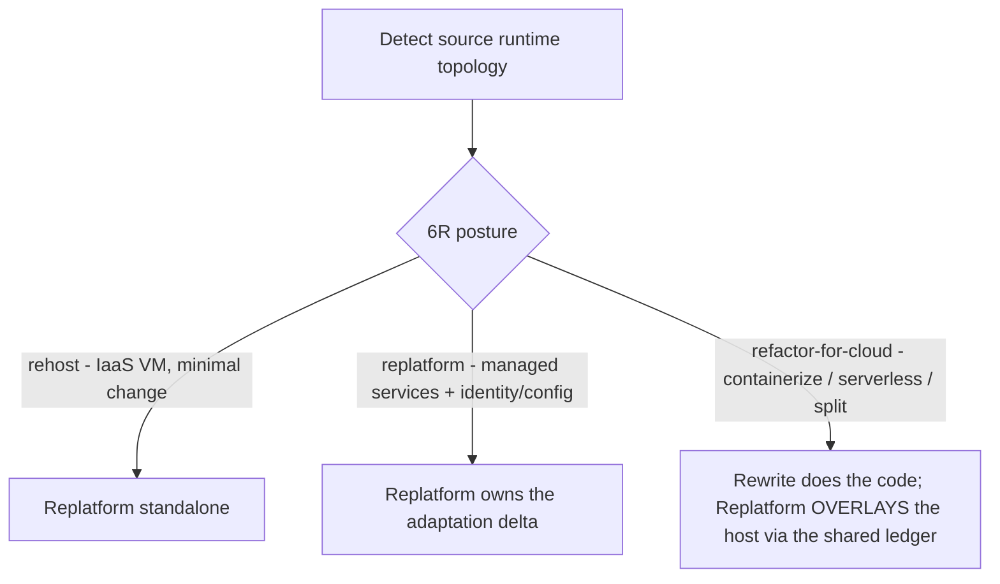
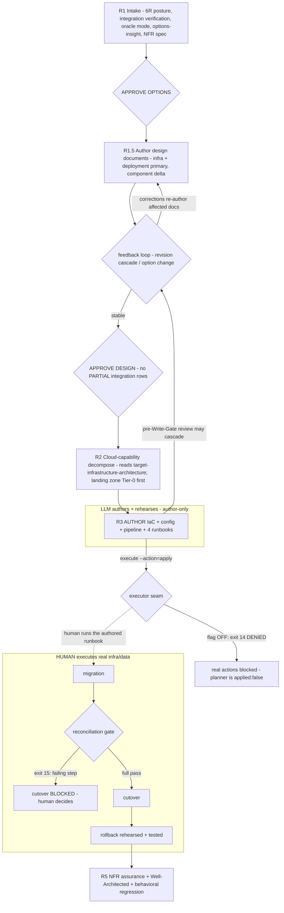

# `replatform` skill — architecture explainer

> **Status: LIVE.** One of the three migration-family skills (**Upgrade · Rewrite · Replatform**)
> that replaced the retired `migration` skill — see [ADR 0061](../adr/0061-migration-skill-family-split.md)
> and [legacy-migration-skill.md](legacy-migration-skill.md). Skill source: `skills/replatform/SKILL.md`
> (+ `references/`). Design of record: `docs/plans/migrationSkill/replatform.md`.
>
> **Abbreviations** (6R · NFR · IaC · WAF · TCO · BYO · PII · Tier-0 …): see [migration-glossary.md](migration-glossary.md).

---

## The story in one line

*Think of Replatform as relocating a live business to new premises with zero downtime.* The
business itself barely changes — same staff, same fittings, same product (the code moves mostly
as-is). What changes is the *building*: you're leaving the old on-prem premises for a new, serviced
location (the cloud). And here's the cardinal rule of any real move: **the architect draws the
plan, orders the fit-out, and rehearses the whole thing on paper — but licensed movers, and a human
foreman, actually lift anything heavy or breakable.**

---

## 1. Purpose — moving where it runs, not what it is

`replatform` is the **different-axis** family member: it moves **where** an application runs, not
**what** language it is written in (on-prem → cloud). Triggered by `REPLATFORM ADO-{ID}` /
`/replatform`.

Its defining stance is that cardinal rule of relocation: **the LLM AUTHORS** the IaC (Infrastructure
as Code) + config + pipeline + human-executable runbooks; **a HUMAN EXECUTES** anything touching
real infrastructure or data, in *any* environment. That boundary — architect on one side, movers on
the other — is the **executor seam**, and it is the spine of the entire skill.

---

## 2. Guiding principle — a ready building is the whole point

> **Readiness IS the deliverable.** Where Rewrite's oracle is behavioral (BAL), Replatform's PRIMARY
> oracle is **non-functional** — an NFR spec graded against Well-Architected, with a **measurability
> ceiling** (an NFR you cannot measure caps the assurance it can claim). The LLM authors +
> rehearses; the human executes.

For a business relocation, success isn't "the boxes arrived" — it's "the new premises is properly
serviced": power, water, security, capacity, cost under control. That's what the NFRs
(Non-Functional Requirements) measure, and a requirement you can't actually measure can't be claimed
as met — you can't sign off on plumbing you never tested.

## 3. Skill shape — same business, new premises

- **Locality:** the same code (mostly) moved to a new host — **not** a new target folder (that's
  [Rewrite](rewrite-skill.md)). You're moving the business, not rebuilding it.
- **LLM role:** **author** of IaC + config + pipeline + runbooks. Never a mover of real infra/data.
- **Oracle:** NFR tests + Well-Architected assessment (is the new premises ready?) as the primary
  measure; behavioral regression (does the business still work the same?) as the secondary.
- **Decomposition unit:** cloud capability (compute · data · identity · messaging · secrets ·
  observability · network) — the utilities and services the premises needs — with the **landing
  zone = Tier-0** (the serviced foundation). **Isolation unit:** an IaC state/module (not a git
  worktree).

---

## 4. Choosing the kind of move — posture (6R), resolved at intake

Not every relocation is the same. The **6R** posture set (the six Rs of cloud migration) decides how
much actually changes; this family uses three of them:



A `rehost` is a straight lift-and-shift — same furniture, new address. A `replatform` swaps some
in-house services for the building's managed ones (identity, config) and Replatform owns that
adaptation delta. A `refactor-for-cloud` is when the business itself must be reshaped to fit — and
here Replatform never redesigns the app code; it **overlays** [Rewrite](rewrite-skill.md)
(`payload.rewrite` ↔ `payload.replatform` in the shared ledger). Rewrite builds; Replatform provides
the premises.

## 5. The journey, stage by stage

The whole relocation, R1 through R5:

```
Detect topology
  → R1 Intake: 6R posture + integration verification (Integration Inventory) + oracle mode
       + TCO options (options-insight) + NFR spec + feasibility (GREEN/YELLOW/RED) → APPROVE OPTIONS
  → R1.5 Target design documents (infra + deployment primary; component delta) → feedback loop → APPROVE DESIGN
  → R2 Decompose by cloud capability (reads target-infrastructure-architecture; landing zone = Tier-0 first)
  → R3 Author IaC + config + pipeline + runbooks (design-quality + judge + security scan; author-only)
       pre-Write-Gate review may cascade: revise in R3 · back to R1.5 · option change
  → R4 HUMAN executes runbooks: migration → reconciliation gate → cutover → rollback (LLM monitors)
  → R5 NFR assurance (measurability-ceilinged) + Well-Architected + behavioral regression
  → every gate: shared judge verdict → shared ledger (payload.replatform); migration log at each phase
```

The **author / execute seam** is the spine of the whole thing — but note two subtleties. First, you
**survey the connections and draw the plans (R1, R1.5) before you decompose and build (R2)**. Second,
the seam is not a brick wall: the developer *reviews* the authored plans **before** the Write Gate,
and that review can send work back upstream to the drawing board:



---

## 6. R1 — Intake: sizing up the move (posture, connections, NFR spec, options)

Detection uses the family-shared `scripts/migration-source-detect.cjs`. Then the intake work, in
order:

- **Classify the 6R posture** (§4). `refactor-for-cloud` → overlay Rewrite; a pure rehost →
  standalone.
- **Verify the integrations — before pricing anything.** A move changes on-prem connections
  materially (NTLM → managed identity, on-prem SQL → Azure SQL private endpoint, WCF → REST/CoreWCF),
  and re-plumbing is a **major cost driver**, so the Integration Inventory
  (`integration-verification-spec.md`) must be verified before the TCO (Total Cost of Ownership)
  decision — you don't quote a relocation before you know which utilities have to be re-run. Tier 2
  verification via `additionalDirectories` where the service source is available. PARTIAL rows are
  advisory at options, a **hard block at APPROVE DESIGN**.
- **Detect the oracle mode** (`golden-master-spec.md` Step 1). The source is a running on-prem app,
  so `provided-url` is the natural default; recorded in `decision_log.golden_master`, and it feeds
  R5's final check.
- **Ask the intake questions — NEVER assume.** These genuinely differ per engagement, like asking
  which city you're moving to: target cloud (Azure/AWS/GCP), target **CI/CD platform** (Azure
  DevOps / GitHub Actions / GitLab), **IaC flavor** (Bicep / Terraform / ARM / Pulumi), environment
  progression, and — critically — **regulated?** (data-residency / PII / financial → hard-block
  NFRs). Recorded via `replatform-plan.cjs plan --cicd-platform=… --iac-flavor=…` + the ledger.
- **Capture the NFR spec** as the PRIMARY intent (`references/nfr-spec.md`) — the definition of what
  "a ready premises" means for this business.
- **Present the cloud-target OPTIONS** (IaaS VM / App Service / AKS / Container Apps / Functions) per
  `options-insight-spec.md`. Each option is a candidate premises and carries a **capability summary**
  (count + estimated IaC/runbook effort — App Service at ~5 capabilities vs AKS at ~9 is a very
  different fit-out), every attribute a **basis** (where the fact came from, not a confidence
  score), and each decision-critical attribute a **comparative insight** ("why A and not B"). Volatile
  cloud/TCO facts are web-grounded through the cache (VERIFIED/INFERRED, dated) with consent; a
  **triggered judge pass** double-checks a close call; a `requires:` flag on compliance / NFR floors
  routes to a named human. Feasibility is gated GREEN/YELLOW/RED; a hard blocker → STOP or a hybrid.
  `APPROVE OPTIONS` commits the choice of premises.

## 7. R1.5 — Drawing the fit-out plans + APPROVE DESIGN

After `APPROVE OPTIONS`, and before R2 decomposition, the skill authors the target design documents
(`target-design-spec.md`). For a relocation the emphasis is different from a rebuild: **infrastructure
+ deployment are the primary deliverables** (the building and how you move in), and component
architecture is **delta only** (same business, minimal structural change).

- The document dependency order is derived at runtime by `scripts/graph-derive-documents.cjs`
  (topological sort → waves; exit 1 cycle / exit 2 parse error).
- Documents are authored by **wave-scheduled parallel subagents** (`document-orchestrator.md`), with
  the Integration Inventory + NFR spec as shared reference.
- **Feedback loop** (`design-revision-spec.md` → `document-feedback.md`): a developer change ripples
  through the dependency graph — affected documents are re-authored (targeted, not a full redo), a
  stale-reference scan catches drift, corrections apply deterministically. Option changes route
  through `option-change-spec.md`; watch for the **`refactor-for-cloud` posture-boundary case** — a
  change that crosses into redesigning the business itself hands off to Rewrite, not a simple
  archive-and-reselect.
- **APPROVE DESIGN** — all required documents `APPROVED`, no PARTIAL/UNVERIFIED integration rows
  remaining. It records `payload.replatform.gate_verdicts.design_approved`. R2 then **reads** the
  approved `target-infrastructure-architecture.md` rather than re-deriving the plan.

## 8. R2 — Ordering the utilities: cloud-capability decomposition

Now the plan is broken into the services the premises needs, with the **landing zone as Tier-0** —
the serviced foundation (`references/cloud-capability-decomposition.md`). R2 **reads the approved
`target-infrastructure-architecture.md`** (from R1.5) as the source of truth for *which* capabilities
exist — it arranges them into a provisioning order, it does not reinvent them. The mapping is
**grounded**: the static table is an offline-fallback **INFERRED** tier; the concrete service pick is
web-grounded → **VERIFIED**. The landing zone (power, water, roads) is provisioned first and inherited
by every capability; independent capabilities can be fitted out in parallel only after it exists. The
isolation unit is an IaC state/module.

## 9. R3 — The architect's work: authoring IaC + config + pipeline + runbooks

IaC is a peculiar thing: it is **both** generated code **and** a destructive action waiting to
happen, so it carries two safety layers:

1. **Author-time quality** — Write Gate before any write · design-quality (Simple / Readable /
   Maintainable / Testable) · a shared judge on a separate model · a security/policy scan (tfsec /
   checkov + policy-as-code, reusing `security-review`). All authored via `INFRA_MODEL`.
2. **The four runbooks** (`references/runbooks.md`) — **migration · reconciliation · cutover ·
   rollback** — brand-new, target-specific artifacts, rehearsed in non-prod, each step carrying the
   5-point transparency plus a PASS/FAIL gate. These are the movers' step-by-step instructions.

**The executor seam is a sequence, not a wall.** The developer REVIEWS the authored IaC/runbooks
*before* the Write Gate, and that review can cascade **upstream** — the seam applies only to
*execution* (post-APPROVE), never to the review phase: IaC detail doesn't fit → revise within R3;
authoring reveals a design gap (say, a private endpoint missing from the plan) → return to **R1.5**
and update `target-infrastructure-architecture.md` via the feedback loop; complexity reveals the
premises was the wrong pick (App Service can't do the required VNet integration) → **option change**
(`option-change-spec.md`). The architect is free to send the plans back to the drawing board; what
they cannot do is start lifting furniture.

Only after `APPROVE` (Write Gate) does the executor seam bite — and a real action is refused while
the future-autonomy flag is OFF:

```bash
node "$PLUGIN_DIR/scripts/replatform-plan.cjs" execute --action=apply --json   # exit 14 DENIED (flag OFF)
```

## 10. R4 — Moving day: the human executes

The LLM authors + rehearses; the **human executes** anything touching real infra/data in ANY
environment. The sequence is a careful one: migration → **reconciliation gate** → cutover → rollback
(with the LLM monitoring throughout). The reconciliation gate is the **mandatory inventory check
before you unlock the doors to customers** — did everything arrive intact? Regulated/PII/financial
moves require a **full** pass:

```bash
node "$PLUGIN_DIR/scripts/replatform-plan.cjs" reconcile-gate --steps-total=<N> --steps-passing=<M> --json
```

Cutover is **blocked (exit 15)** on any failing step. And the real production cutover is never a
first attempt — it is the *Nth rehearsal*, human-executed, with the LLM watching reconciliation +
smoke + NFR.

## 11. R5 — Signing off the new premises: NFR assurance + Well-Architected + behavioral regression

The completion oracle (`scripts/replatform-nfr-assess.cjs`) answers "is this premises truly ready?":
**NFR assurance** graded weakest-link on **measurability ceiling × evidence × load-profile**
(symmetric to Rewrite's BAL — an NFR you cannot measure cannot claim high assurance) + a
**Well-Architected** grade (reusing app-readiness/ERL) + **behavioral regression** per
`golden-master-spec.md` (its Replatform binding row — the oracle mode was detected back at R1; the
source is the running on-prem app; the engine is `tests/migration-validation/golden-master-replay.cjs`).
It's a two-gate check, and a **regulated NFR below floor is a HARD BLOCK** (`gate` exit 16).
References: `references/nfr-assurance.md`, `references/well-architected.md`.

To build + smoke the (unchanged) app on the new host, R5 resolves the app's execution profile for
the **verify subset only** — `scripts/strategy-resolve.cjs --tokens=BUILD,TEST_ALL,SERVE,E2E`.
Replatform moves the building, not the business, so it never needs the scaffold/cluster tokens
(those belong to Rewrite; a `refactor-for-cloud` overlay lets Rewrite own generation). Same
STOP-on-missing / warn-on-unverified discipline as Rewrite — it just needs a smaller contract.

## 12. The executor seam — the safety substrate

`skills/shared/executor-seam.md` defines a **future-autonomy flag, default OFF**: the planner is
decision-only (`applied:false`), and real actions (apply / cutover / destroy) are **DENIED**
(exit 14) with the flag OFF. **prod + regulated are PERMANENTLY human-executed** even if that flag is
ever turned on. This is the whole reason an LLM can safely drive an infrastructure migration without
ever laying a finger on production — it plans the move down to the last box, and a human always does
the lifting.

## 13. Who's on the job — personas & model routing

- **Personas:** **[SA] Rafael Mendes** (intake · posture · decomposition · NFR spec — the planner) →
  **[SE] Elena Fischer** (IaC + runbook authoring — the draughtsman) → **[QA] Sam Okonkwo** (NFR
  assurance + reconciliation gates — the inspector).
- **Model routing:** IaC / config / pipeline authoring → `INFRA_MODEL` (sonnet); options / NFR spec /
  decomposition → `ICEA_MODEL` (opus); every gate → the shared judge ladder (`CRITIC_MODEL` →
  `CRITIC_MODEL_MAX` → different-family panel for top-risk).

## 14. The tools on the job — deterministic scripts

| Script | Role |
|---|---|
| `migration-source-detect.cjs` | family-shared source runtime/topology detection |
| `graph-derive-documents.cjs` | derives the design-document dependency graph (waves) from `target-design-spec.md` `### Dependencies` blocks (exit 1 cycle / exit 2 parse error) — R1.5 |
| `strategy-resolve.cjs` | resolves the app execution profile for the **verify subset** (`--tokens=BUILD,TEST_ALL,SERVE,E2E`) to build/smoke the app on the new host — R5 (exit 0 resolved · 2 malformed · 3 stub · 4 missing) |
| `replatform-plan.cjs` | `plan` (landing-zone Tier-0 decomposition + runbooks, author-only) · `execute` (exit 14 DENIED, flag OFF) · `reconcile-gate` (exit 15) |
| `replatform-nfr-assess.cjs` | `assess` (weakest-link NFR) · `gate` (regulated-below-floor hard block, exit 16) |
| `checkpoint-ledger.cjs` | shared resumable ledger (`payload.replatform`) |
| `executor-seam.md` (shared) | future-autonomy flag contract (default OFF; prod+regulated permanent human) |

Knowledge-tier specs the skill reads (reference texts, not tools): `integration-verification-spec.md`,
`golden-master-spec.md`, `target-design-spec.md`, `options-insight-spec.md`, `design-revision-spec.md`,
`document-orchestrator.md`, `document-feedback.md`, `option-change-spec.md`, `migration-log-spec.md`,
`feasibility-spec.md`.

## 15. The lines this skill won't cross

Each rule below is one Replatform never breaks — most of them exist to protect the running business
and the sanctity of the mover/architect seam:

- **It never presents options before the Integration Inventory is complete** — re-plumbing is a
  major cloud-cost driver; PARTIAL rows are advisory at options but a **hard block at APPROVE
  DESIGN**.
- **It never authors IaC (R3) before APPROVE DESIGN (R1.5) closes** — the design documents are the
  agreed plan for the move.
- **The executor seam applies to execution only** — a pre-Write-Gate review may cascade back to a
  design update (R1.5) or an option change; that is *not* a seam violation. Sending plans back is
  allowed; lifting furniture early is not.
- **The LLM AUTHORS; the HUMAN EXECUTES** anything touching real infra/data, in ANY environment.
- **prod + regulated are PERMANENTLY human-executed**, even if the future-autonomy flag is ever ON.
- **Options carry a basis (provenance), never a confidence score**; volatile facts are web-grounded
  with consent.
- **It never assumes target cloud / CI-CD / IaC flavor** — it asks at intake and records the answers
  in the ledger.
- **The landing zone is Tier-0** — provisioned first, inherited by every capability, never
  parallelized ahead of.
- **Runbooks are new, target-specific artifacts, rehearsed with a TESTED rollback** before any real
  cutover — you always know you can move back.
- **Reconciliation is a mandatory pre-cutover gate**; regulated/PII/financial require a full pass
  (hard-block).
- **`refactor-for-cloud` OVERLAYS Rewrite via the shared ledger** — Replatform never redesigns app
  code.
- **It writes a migration log entry at each phase** per `migration-log-spec.md` — logging is never
  deferred.

---

## Where it fits in the family

Three siblings, each for a different kind of move:

| You have… | Skill |
|---|---|
| Same stack, higher version, edit in place | [Upgrade](upgrade-skill.md) |
| Different stack, translate the code to a new target | [Rewrite](rewrite-skill.md) |
| Same code, new host/topology (on-prem → cloud) | **Replatform** (this doc) |

For `refactor-for-cloud`, Rewrite builds the new code and Replatform provisions the premises — the
two coordinate through the shared migration ledger.
