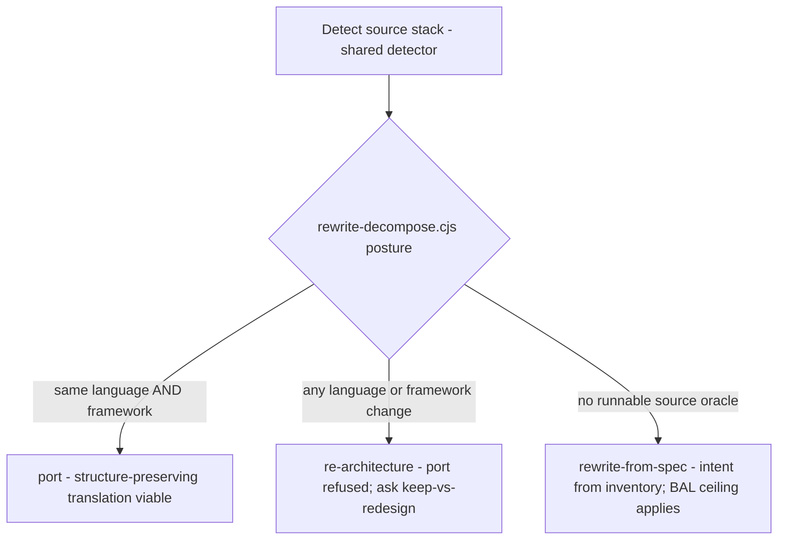
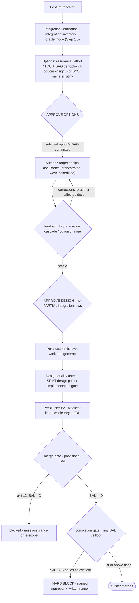

# `rewrite` skill — architecture explainer

> **Status: LIVE.** One of the three migration-family skills (**Upgrade · Rewrite · Replatform**)
> that replaced the retired `migration` skill — see [ADR 0061](../adr/0061-migration-skill-family-split.md)
> and [legacy-migration-skill.md](legacy-migration-skill.md). Skill source: `skills/rewrite/SKILL.md`
> (+ `references/`). Design of record: `docs/plans/migrationSkill/rewrite.md`.
>
> **Abbreviations** (BYO · TCO · BAL · ERL · NFR · SRMT · DAG · 6R · IaC …): see [migration-glossary.md](migration-glossary.md).

---

## The story in one line

*Think of Rewrite as building a new house next door and moving your life into it.* The old house
still stands — you never bulldoze it, and you never even remodel it; it stays exactly as-is as your
reference for how life is supposed to work. The new house is built in a different style (a new
stack), from fresh blueprints you approve before a single wall goes up, by parallel crews who each
build their own rooms — and no one is allowed to move in until every room passes inspection.

---

## 1. Purpose — a new house, not a remodel

`rewrite` performs an **out-of-place, generative code translation** — a source app becomes a **NEW
target-folder application in a different stack** (e.g. Java→.NET, Express→Angular). The old house
(the source) stays read-only; the new one is a fresh folder. Triggered by `REWRITE ADO-{ID}` /
`/rewrite`.

Contrast this with its sibling [Upgrade](upgrade-skill.md): there the LLM *orchestrates* a
deterministic tool, like a specialist servicing the house you already live in. Here the LLM is a
**generative author** — it actually builds new rooms. Building freehand is powerful and risky, so
what keeps it honest is a simple discipline: **every room's quality is measured and gated, never
assumed.**

---

## 2. Guiding principle — greenfield, but with the old house as the brief

> **Greenfield with a defined intent.** The source is the **intent oracle** (runnable source /
> behavioral inventory), not a codebase to mutate. The LLM authors new target code, but every
> cluster's assurance is *measured* — a **Behavioral Assurance Level (BAL)** on weakest-link,
> mechanical denominators — and *gated*, never assumed.

In house terms: you are building fresh, but you're not inventing how the family lives — the old
house tells you that. And you don't get to *say* the new house is well-built; an inspector
*measures* it, room by room, and the weakest room decides the certificate.

## 3. Skill shape — the plot, the builder, the inspector

- **Locality:** out-of-place — a new target folder; the source stays read-only. New plot, old house
  untouched.
- **LLM role:** generative author — the builder who actually raises the walls.
- **Oracle:** the running source / inventory-as-intent — the old house as the brief; per-cluster
  **BAL (Behavioral Assurance Level)** is the inspector's grade.

---

## 4. The journey, stage by stage

The whole build, from surveying the site to handing over the keys:

```
Detect source stack  →  Resolve POSTURE
  →  Integration verification (Integration Inventory) + oracle-mode detection   [Step 1.5, before options]
  →  Present OPTIONS (assurance/effort/TCO, INCLUDING the DAG per option) + options-insight, or accept BYO
        APPROVE OPTIONS → the selected option's DAG is committed
  →  Author 7 TARGET DESIGN documents → feedback loop (revision cascade / option change) → APPROVE DESIGN
  →  per cluster (worktree, DAG-scheduled): generate → design-quality gate
  →  per-cluster BAL (weakest-link) + ERL (Tier-0 backbone)
  →  MERGE GATE (provisional BAL != D)  →  COMPLETION GATE (final BAL; B-series floor hard-block)
  →  every gate: shared judge verdict → shared ledger (payload.rewrite); migration log at each phase
```

The first question is a zoning question: **posture.** How far apart are the old and new styles?
That distance decides whether you're even allowed to do a structure-preserving copy of the floor
plan, or whether the design has to be reconsidered from the ground up:



Then the build itself — gated at every step. Notice that you **survey the utilities and draw the
blueprints before anyone builds**: options are priced against *verified* connections, and no room
is framed until the plans are signed off:



---

## 5. Zoning — posture resolution (Step 1)

Detection uses the family-shared `scripts/migration-source-detect.cjs` (the family reads the old
house's chart the same way). Then `scripts/rewrite-decompose.cjs posture` decides how ambitious the
build has to be (see `references/posture.md`):

| Posture | When | Consequence |
|---|---|---|
| `port` | same language **and** same framework | structure-preserving translation viable |
| `re-architecture` | any language or framework change | port refused; ask keep-vs-redesign |
| `rewrite-from-spec` | no runnable source oracle | intent from inventory/spec (BAL **ceiling** applies) |

A `port` is copying the floor plan almost exactly. Any change in language or framework means the
old plan won't simply drop onto the new plot, so a straight port is refused and you're asked
keep-vs-redesign. And if the old house isn't even runnable — no oracle to walk through — you're
building from a written brief alone, which is honest but limits how high the inspection grade can
climb (a BAL ceiling).

## 6. Surveying the utilities — integration verification + oracle mode (Step 1.5)

Before any option is priced, the skill **checks the connections rather than assuming them** — you
don't quote a build before you know where the water, power, and sewer actually run. Options are
sold on assurance × effort × TCO, and those numbers are simply wrong if a WCF service is misread as
REST, or a data-access-only dependency is never surfaced as something to build inline. Per
`skills/shared/migration-knowledge/refs/specs/integration-verification-spec.md`:

- **Tier 1 — client-side:** config, WSDL, proxy classes, assembly references (what you can see from
  your own side of the property line).
- **Tier 2 — server-side:** the service source itself via `additionalDirectories`, when available
  (walking the neighbouring property with permission).
- Produces the **Integration Inventory** (`docs/.../integration-inventory.md`) — the single
  authoritative map of every connection. Each service is **classified** (data-access-only ·
  business-logic · mixed · unknown) and gets a derived **target approach** (inline as project ·
  NuGet package · keep external).
- Rows are `VERIFIED` / `PARTIAL` / `UNVERIFIED` with `PROV` citations. **PARTIAL is advisory at
  options** but a **hard block at APPROVE DESIGN** — you cannot draw the security and integration
  blueprints on top of an auth scheme you haven't confirmed.

In the same step the skill detects the **oracle mode** (`self-run` | `provided-url` |
`deferred-capture` | `skipped`) per `golden-master-spec.md` Step 1, and records it in
`decision_log.golden_master`. This mode sets the **assurance ceiling** shown per option (no oracle
→ BAL caps at C/D) — so the highest grade the finished house *could* earn is visible **before** the
developer commits to an option, never a nasty surprise at inspection time.

## 7. Choosing the design — options × assurance × TCO + DAG + insight, or BYO (Step 2)

Present 2–3 target options across **assurance ceiling × effort × TCO** — onboarding plus
**web-grounded, dated** recurring run-cost (`references/options-and-tco.md`). Think of these as
competing builders' proposals. The developer may instead bring their own architect's drawing — a
**BYO (Bring Your Own) design** (image / doc) — and it is held to the **same critic scrutiny** as
the generated proposals (`references/byo-design.md`), never waved through unexamined.

**The build schedule is now part of each proposal, not a later surprise.** Every candidate option
is run through `rewrite-decompose.cjs decompose` (a target-space, **acyclic** dependency plan —
exit 11 on a cycle → you must break it first) so the developer sees the shape they're choosing:
**how many rooms (clusters) · which crews can work in parallel vs which must wait (wave schedule) ·
effort · the approach for each connection · the assurance ceiling.** After `APPROVE OPTIONS` the
selected option's DAG (Directed Acyclic Graph — the build order) is **committed** and feeds both the
blueprints (§8) and the build itself (§9) — there is no separate decompose step later.

Options are presented per `options-insight-spec.md`, and the honesty rules here matter:

- Every attribute carries a **basis** from a fixed vocabulary — `computed` | `web-grounded:{date}`
  | `published-spec` | `estimate:{source}` | `requires:{who}` — and **not** a confidence tier. A
  confidence score is just the LLM guessing about its own guess; a basis is a hard fact about where
  the number *came from*.
- Each decision-critical attribute is paired with a **comparative insight** explaining the delta
  ("why 5 rooms and not 9"), not a per-option brochure blurb.
- **Volatile cloud/runtime facts** are web-grounded through the cache (VERIFIED/INFERRED, dated);
  the skill offers the web search *before* running it (awareness + consent); offline, it degrades
  to the `refs/` INFERRED tier and shows how stale it is.
- A **triggered judge pass** double-checks the recommendation when it's a close call or the
  developer asks "why?"; a `requires:` flag on compliance / security / NFR (Non-Functional
  Requirement) floors routes the decision to a named human before `APPROVE OPTIONS`.

## 8. Drawing the blueprints — target design documents + APPROVE DESIGN (Step 2.5)

After `APPROVE OPTIONS`, and before anyone frames a wall, the skill draws the full plans — **7
target design documents** (component · security · data · integration · infrastructure · deployment
· feasibility) per `target-design-spec.md`. Separate drawings keep each pass focused and reviewable
on its own (one giant blueprint invites mistakes and context loss). Note that infrastructure +
deployment are required for Rewrite too, not just Replatform: a change of stack routinely drags in
new cloud dependencies.

- The blueprint **dependency order is derived at runtime** from each template's
  `### Dependencies` block by `scripts/graph-derive-documents.cjs` (topological sort → waves;
  exit 1 cycle / exit 2 parse error) — you draw the foundation plan before the roof plan.
- Documents are drawn by **wave-scheduled parallel subagents** (`document-orchestrator.md`), each
  handed only the context it needs; the Integration Inventory is shared reference, never redrawn.
- **Feedback loop** (`design-revision-spec.md` controller → `document-feedback.md`): a developer
  change ripples through the dependency graph — affected drawings are flagged and **re-drawn
  (targeted, not a full redo)**; a Pass-2 stale-reference scan catches anything left dangling;
  developer-supplied corrections are applied **deterministically**. If it won't settle, it escalates
  a summary at 5 iterations and hard-returns to APPROVE OPTIONS at 10. Bigger changes route through
  `option-change-spec.md` (bounded | significant | fundamental); a fundamental change that crosses
  the posture boundary goes all the way back to option selection. New information is always run
  through the right verification spec *first*, then cascades.
- **APPROVE DESIGN** is a formal gate — all 7 documents at `Status: APPROVED`, with no PARTIAL /
  UNVERIFIED integration rows remaining. It records `payload.rewrite.gate_verdicts.design_approved`.
  This is the permit; building is illegal before it.

## 9. Building the rooms — per-cluster generation + design-quality gates (Step 3)

Before the first crew starts, the skill sorts out which tools and commands this particular build
uses — it resolves the target **execution profile** (`strategies/{target}.md` via
`scripts/strategy-resolve.cjs`): the stack-specific commands/paths (`SKELETON`, `BUILD`,
`TEST_CLUSTER`, `TEST_ALL`, `SERVE`, `E2E`, `COVERAGE`, …) that let the skill's own logic stay
stack-agnostic. A missing profile (exit 4), a stub (exit 3), or a malformed one (exit 2) **STOPs** —
the skill never grabs another stack's toolchain by mistake; an `unverified` profile warns the
developer first. Two-track (full-stack) migrations resolve **both** a backend and a frontend
profile. Every stack-specific command below is read from the profile, never recalled from memory.

Each cluster (room) then gets built in its **own git worktree**, so parallel crews can't collide.
Quality is inspected at **two** points, both by the shared judge reading only the artifact + rubric
+ ground truth (`references/design-quality.md`):

1. **Design gate (before building)** — is the plan Simple / Readable / Maintainable / Testable
   (SRMT)? A `REVISE` sends it back to refine + re-judge; you never build against a failing design.
2. **Implementation gate (on the finished diff)** — did the code honour SRMT, and did it carry
   `// DECISION:` comments explaining the non-trivial choices? `REVISE` regenerates the flagged
   units; `BLOCK` stops the room cold.

Generated code only lands in the new house after `APPROVE ADO-{ID}` (the Write Gate). And a room
must clear **both** its design-quality gate **and** its BAL gate before it can be joined to the rest
of the house.

## 10. Inspecting the house — BAL, ERL, and the two-gate model (Steps 4–5)

**BAL (Behavioral Assurance Level)** is the inspector's grade, and it is measured
**deterministically** by `scripts/rewrite-bal.cjs` — the skill runs the tests/oracle and feeds the
raw **counts** in:

```
BAL = min(oracle_ceiling, coverage, tests)      # weakest-link, mechanical denominators
```

That `min` is the whole philosophy: **the weakest room caps the certificate for the house.** A
room with no runnable oracle to check it against is **capped at C** (ceiling flagged). The
whole-target **ERL (Enterprise-Readiness Level)** is assembled from the app-readiness 8 domains and
is **designed-in at Tier 0**, not audited as an afterthought at the end (`references/erl.md`). Both
grades are recorded in the ledger (`payload.rewrite.BAL/ERL`).

To check the new house actually behaves like the old one, behavioral regression runs through the
shared **golden-master engine** `tests/migration-validation/golden-master-replay.cjs`
(deterministic, read-only; HIGH-risk drift is a hard gate) — the very same engine Replatform's R5
uses.

There are two inspections before you get the keys:

| Gate | Rule | Exit |
|---|---|---|
| **Merge gate** | provisional BAL must be **≠ D** | 12 blocks (raise assurance / re-scope) |
| **Completion gate** | a **B-series** cluster below the assurance floor is a **HARD BLOCK** (named approver + written reason); non-B-series below floor is a warn | 13 hard-block |

> BAL is weakest-link on mechanical denominators — **never** averaged across dimensions and
> **never** graded by judgment. That is what makes "assurance" a measurement rather than a vibe. A
> house isn't "mostly up to code"; the failing room fails the house.

## 11. The second opinion — judge + resumable ledger

Every gate records an **independent judge** verdict (`skills/shared/judge.md`, risk-scaled: sonnet
→ opus max-effort → different-family panel for the top-risk rooms), persisted to the shared
**migration ledger** via `scripts/checkpoint-ledger.cjs` (`set-gate` / `set-payload`, namespace
`payload.rewrite`). Because the whole build is written down, it can be paused and resumed
(`REWRITE RESUME ADO-{ID}`) or shown read-only at any time (`REWRITE STATUS ADO-{ID}`).

## 12. Who's on site — personas & model routing

- **Personas:** **[SE] Elena Fischer** is the builder (author), weighing **[SA] Rafael Mendes**
  (posture / options / architecture at intake) and **[QA] Sam Okonkwo** (BAL / test coverage at the
  gates — the inspector).
- **Model routing:** generation (options, design, code) → `ICEA_MODEL` (opus); the gate judge → the
  shared three-tier ladder (`CRITIC_MODEL` → `CRITIC_MODEL_MAX` max-effort for high-risk/B-series →
  different-family panel for top-risk).

## 13. The tools on site — deterministic scripts

| Script | Role |
|---|---|
| `migration-source-detect.cjs` | family-shared source stack detection |
| `rewrite-decompose.cjs` | `posture` (port/re-architecture/rewrite-from-spec) · `decompose` (acyclic DAG, exit 11 on cycle) — run per option at Step 2 |
| `graph-derive-documents.cjs` | derives the design-document dependency graph (waves) from `target-design-spec.md` `### Dependencies` blocks (exit 1 cycle / exit 2 parse error) |
| `strategy-resolve.cjs` | resolves the target execution profile `strategies/{target}.md` (exit 0 resolved · 2 malformed · 3 stub · 4 missing) — run at the start of generation |
| `rewrite-bal.cjs` | `bal` (weakest-link) · `merge-gate` (exit 12) · `completion-gate` (exit 13) |
| `checkpoint-ledger.cjs` | shared resumable ledger (`payload.rewrite`) |

Knowledge-tier specs the skill reads (reference texts, not tools): `integration-verification-spec.md`,
`golden-master-spec.md`, `target-design-spec.md`, `options-insight-spec.md`, `design-revision-spec.md`,
`document-orchestrator.md`, `document-feedback.md`, `option-change-spec.md`, `migration-log-spec.md`.

## 14. The lines this skill won't cross

Each of these is a rule Rewrite never breaks, and each protects either the old house (your
reference) or the integrity of the new one:

- **It never presents options before the Integration Inventory is complete** — the oracle mode and
  each connection's approach must be known first; PARTIAL rows are advisory at options but a **hard
  block at APPROVE DESIGN**.
- **It never generates code before APPROVE DESIGN closes** — all 7 blueprints must be approved; no
  building without a permit.
- **It always characterises the build schedule (the DAG) per option at Step 2** — you never choose
  a proposal without seeing its cluster count and wave schedule.
- **It never re-detects the oracle mode at BAL time** — that's fixed at Step 1.5 and carried
  through, so the inspection can't quietly change the rules.
- **Options carry a basis (provenance), never a confidence score**; volatile facts are web-grounded
  with consent.
- **It never offers `port` unless source and target share BOTH language and framework** — you can't
  copy a floor plan onto an incompatible plot.
- **A BYO design gets the same critic scrutiny as generated options**, and its assurance ceiling is
  shown BEFORE you commit.
- **It never schedules crews against a cyclic DAG** — a circular dependency must be broken first.
- **BAL is weakest-link on mechanical denominators** — never averaged, never judged by feel.
- **It never merges a room at provisional BAL D, and never lets a B-series room below floor slip
  through silently** — that's a hard block with a named approver.
- **The source stays read-only; the target is a NEW folder; no generated code before
  APPROVE ADO-{ID}.** The old house is sacred; the permit is real.
- **It writes a migration log entry at each phase** per `migration-log-spec.md` — logging is never
  deferred.

---

## Where it fits in the family

Three siblings, each for a different kind of move:

| You have… | Skill |
|---|---|
| Same stack, higher version, edit in place | [Upgrade](upgrade-skill.md) |
| Different stack, translate the code to a new target | **Rewrite** (this doc) |
| Same code, new host/topology (on-prem → cloud) | [Replatform](replatform-skill.md) |

Upgrade refers a `false-upgrade` here — the case that turned out to need a new house after all. And
when the new house also has to sit on new ground, **Replatform** overlays Rewrite (posture
`refactor-for-cloud`): Rewrite builds the house, Replatform prepares the plot, and the two
coordinate through the shared ledger.
