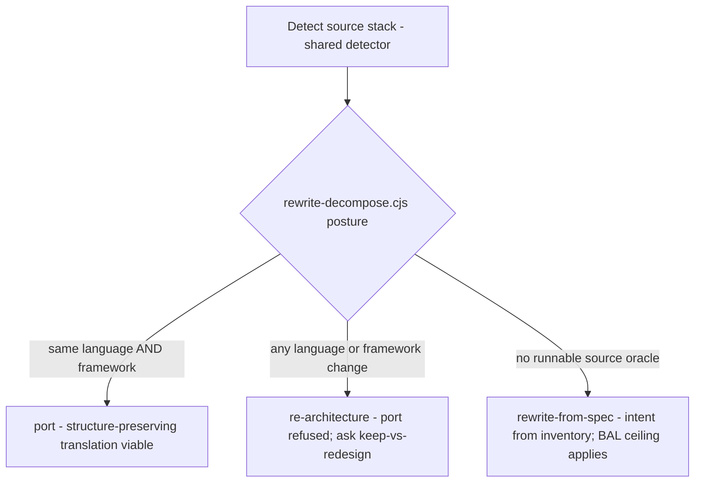

# `rewrite` skill — architecture explainer

> **Status: LIVE.** One of the three migration-family skills (**Upgrade · Rewrite · Replatform**)
> that replaced the retired `migration` skill — see [ADR 0061](../adr/0061-migration-skill-family-split.md)
> and [legacy-migration-skill.md](legacy-migration-skill.md). Skill source: `skills/rewrite/SKILL.md`
> (+ `references/`). Design of record: `docs/plans/migrationSkill/rewrite.md`.
>
> **Abbreviations** (BYO · TCO · BAL · ERL · NFR · SRMT · DAG · 6R · IaC …): see [migration-glossary.md](migration-glossary.md).

---

## 1. Purpose

`rewrite` performs an **out-of-place, generative code translation** — a source app becomes a **NEW
target-folder application in a different stack** (e.g. Java→.NET, Express→Angular). The source stays
read-only; the target is a fresh folder. Triggered by `REWRITE ADO-{ID}` / `/rewrite`.

Contrast with [Upgrade](upgrade-skill.md): there the LLM *orchestrates* a deterministic tool; here the
LLM is a **generative author**. What keeps generative work honest is that every cluster's assurance is
**measured and gated**, never assumed.

---

## 2. Guiding principle

> **Greenfield with a defined intent.** The source is the **intent oracle** (runnable source /
> behavioral inventory), not a codebase to mutate. The LLM authors new target code, but every
> cluster's assurance is *measured* — a **Behavioral Assurance Level (BAL)** on weakest-link,
> mechanical denominators — and *gated*, never assumed.

## 3. Skill shape

- **Locality:** out-of-place — a new target folder; source read-only.
- **LLM role:** generative author.
- **Oracle:** the running source / inventory-as-intent; per-cluster **BAL** is the assurance measure.

---

## 4. Stage flow

```
Detect source stack  →  Resolve POSTURE
  →  Integration verification (Integration Inventory) + oracle-mode detection   [Step 1.5, before options]
  →  Present OPTIONS (assurance/effort/TCO, INCLUDING the DAG per option) + options-insight, or accept BYO
        APPROVE OPTIONS → the selected option's DAG is committed
  →  Author 7 TARGET DESIGN documents → feedback loop (revision cascade / option change) → APPROVE DESIGN
  →  per cluster (worktree, DAG-scheduled): generate → design-quality gate
  →  per-cluster BAL (weakest-link) + ERL (Tier-0 backbone)
  →  MERGE GATE (provisional BAL != D)  →  COMPLETION GATE (final BAL; B-series floor hard-block)
  →  every gate: shared judge verdict → shared ledger (payload.rewrite); migration log at each phase
```

**Posture** is resolved first — stack distance decides whether a structure-preserving port is even
legitimate:



Then the generative pipeline, gated at each step. Note that **integration verification and the target
design phase precede generation** — options are priced on verified integrations, and no code is authored
until the design documents are approved:


---

## 5. Posture resolution (Step 1)

Detection uses the family-shared `scripts/migration-source-detect.cjs`. `scripts/rewrite-decompose.cjs
posture` then resolves (see `references/posture.md`):

| Posture | When | Consequence |
|---|---|---|
| `port` | same language **and** same framework | structure-preserving translation viable |
| `re-architecture` | any language or framework change | port refused; ask keep-vs-redesign |
| `rewrite-from-spec` | no runnable source oracle | intent from inventory/spec (BAL **ceiling** applies) |

## 6. Integration verification + oracle mode (Step 1.5)

Before any option is priced, the skill **verifies integrations rather than assuming them** — options
present assurance × effort × TCO, and those numbers are wrong if a WCF service is misread as REST or a
data-access-only dependency is never surfaced as an inline candidate. Per
`skills/shared/migration-knowledge/refs/specs/integration-verification-spec.md`:

- **Tier 1 — client-side:** config, WSDL, proxy classes, assembly references.
- **Tier 2 — server-side:** the service source via `additionalDirectories`, when available.
- Produces the **Integration Inventory** (`docs/.../integration-inventory.md`), the single authoritative
  source for integrations. Each service is **classified** (data-access-only · business-logic · mixed ·
  unknown) and gets a derived **target approach** (inline as project · NuGet package · keep external).
- Rows are `VERIFIED` / `PARTIAL` / `UNVERIFIED` with `PROV` citations. **PARTIAL is advisory at options**
  but a **hard block at APPROVE DESIGN** — security + integration docs cannot be authored on unverified
  auth schemes.

In the same step the skill detects the **oracle mode** (`self-run` | `provided-url` | `deferred-capture`
| `skipped`) per `golden-master-spec.md` Step 1, and records it in `decision_log.golden_master`. The
mode sets the **assurance ceiling** shown per option (no oracle → BAL caps at C/D) — so the ceiling is
visible *before* the developer commits, not a surprise at BAL time.

## 7. Options × assurance × TCO + DAG + insight, or BYO (Step 2)

Present 2–3 target options across **assurance ceiling × effort × TCO** — onboarding + **web-grounded,
dated** recurring run-cost (`references/options-and-tco.md`). The developer may instead supply a **BYO
design** (image / doc); it is held to the **same critic scrutiny** as generated options
(`references/byo-design.md`), never silently accepted.

**Decomposition is now part of option characterization, not a later step.** Each candidate option is run
through `rewrite-decompose.cjs decompose` (target-space, **acyclic** DAG — exit 11 cycle → break it
first) so the developer sees the shape they are choosing: **cluster count · wave schedule (parallel vs
sequential) · effort · integration approach per service · assurance ceiling**. After `APPROVE OPTIONS`
the selected option's DAG is **committed** and feeds both the design documents (§8) and generation (§9)
— there is no separate decompose step.

Options are presented per `options-insight-spec.md`:

- Every attribute carries a **basis** from a fixed vocabulary — `computed` | `web-grounded:{date}` |
  `published-spec` | `estimate:{source}` | `requires:{who}` — **not** a confidence tier (a confidence
  score is itself an LLM inference; the basis is a deterministic *fact about provenance*).
- Each decision-critical attribute is paired with a **comparative insight** explaining the delta between
  options ("why 5 clusters and not 9"), not a per-option description.
- **Volatile cloud/runtime facts** are web-grounded through the cache (VERIFIED/INFERRED, dated); the
  skill suggests the web search *before* running it (awareness + consent); offline degrades to the
  `refs/` INFERRED tier with staleness shown.
- A **triggered judge pass** checks the selection synthesis when options are a close call or the
  developer asks "why?"; `requires:` on compliance / security / NFR floors routes to a named human
  before `APPROVE OPTIONS`.

## 8. Target design documents + APPROVE DESIGN (Step 2.5)

After `APPROVE OPTIONS`, before any code generation, the skill authors **7 target design documents**
(component · security · data · integration · infrastructure · deployment · feasibility) —
`target-design-spec.md`. Separate documents keep each authoring pass focused and reviewable in isolation
(one long document risks context loss). Infrastructure + deployment are required for Rewrite, not just
Replatform: a stack change regularly introduces new cloud dependencies.

- The document **dependency graph is derived at runtime** from the templates' `### Dependencies` blocks
  by `scripts/graph-derive-documents.cjs` (topological sort → waves; exit 1 cycle / exit 2 parse error).
- Documents are authored by **wave-scheduled parallel subagents** (`document-orchestrator.md`), each
  sliced to only the context it needs; the Integration Inventory is shared state, never re-derived.
- **Feedback loop** (`design-revision-spec.md` controller → `document-feedback.md`): a developer change
  cascades through the dependency graph — affected documents are flagged and **re-authored (targeted, not
  full rewrite)**; a Pass-2 stale-reference scan catches drift; developer-supplied corrections are applied
  **deterministically**. Convergence escalates a summary at 5 iterations and hard-returns to APPROVE
  OPTIONS at 10. Option changes route through `option-change-spec.md` (bounded | significant |
  fundamental); a fundamental change that crosses the posture boundary routes back out to option
  selection. New information is routed through the appropriate verification spec *first*, then cascades.
- **APPROVE DESIGN** is a formal gate — all 7 documents at `Status: APPROVED`, no PARTIAL/UNVERIFIED
  integration rows remaining. Records `payload.rewrite.gate_verdicts.design_approved`.

## 9. Per-cluster generation + design-quality gates (Step 3)

At the **start of the generation phase** the skill resolves the target **execution profile**
(`strategies/{target}.md` via `scripts/strategy-resolve.cjs`) — the stack-specific commands/paths
(`SKELETON`, `BUILD`, `TEST_CLUSTER`, `TEST_ALL`, `SERVE`, `E2E`, `COVERAGE`, …) that keep the skill's
own logic stack-agnostic. A missing profile (exit 4), a stub (exit 3), or a malformed one (exit 2)
**STOPs** — the skill never falls back to another stack's toolchain; an `unverified` profile warns the
developer first. Two-track (full-stack) migrations resolve **both** a backend and a frontend profile.
Every stack-specific command below is read from the profile, never hard-coded from memory.

Each cluster then generates in its **own git worktree** (parallel clusters cannot collide).
Design-Quality is gated at **two** points, both by the shared judge reading only artifact + rubric +
ground truth (`references/design-quality.md`):

1. **Design gate (before generation)** — is the plan Simple / Readable / Maintainable / Testable
   (SRMT)? `REVISE` → refine + re-judge; never generate against a failing design.
2. **Implementation gate (on the diff)** — did the code honor SRMT + carry `// DECISION:` comments for
   non-trivial choices? `REVISE` → regenerate flagged units; `BLOCK` → stop.

Generated code reaches the target only after `APPROVE ADO-{ID}` (Write Gate). A cluster must clear
**both** its design-quality gate and its BAL gate to merge.

## 10. BAL, ERL, and the two-gate model (Steps 4–5)

**BAL (Behavioral Assurance Level)** is graded **deterministically** by `scripts/rewrite-bal.cjs` —
the skill runs the tests/oracle and feeds the **counts** in:

```
BAL = min(oracle_ceiling, coverage, tests)      # weakest-link, mechanical denominators
```
No runnable oracle **caps the cluster at C** (ceiling flagged). Whole-target **ERL** is assembled from
the app-readiness 8 domains — **designed-in at Tier 0**, not audited at the end
(`references/erl.md`). Both are recorded in the ledger (`payload.rewrite.BAL/ERL`).

Behavioral regression against the source oracle uses the shared **golden-master engine**
`tests/migration-validation/golden-master-replay.cjs` (deterministic, read-only; HIGH-risk drift is a
hard gate) — the same engine Replatform's R5 uses.

| Gate | Rule | Exit |
|---|---|---|
| **Merge gate** | provisional BAL must be **≠ D** | 12 blocks (raise assurance / re-scope) |
| **Completion gate** | a **B-series** cluster below the assurance floor is a **HARD BLOCK** (named approver + written reason); non-B-series below floor is a warn | 13 hard-block |

> BAL is weakest-link on mechanical denominators — **never** averaged across dimensions and **never**
> graded by judgment. That is what makes "assurance" a measurement rather than a vibe.

## 11. Judge + resumable ledger

Every gate records an **independent judge** verdict (`skills/shared/judge.md`, risk-scaled: sonnet →
opus max-effort → different-family panel for top-risk), persisted to the shared **migration ledger**
via `scripts/checkpoint-ledger.cjs` (`set-gate` / `set-payload`, namespace `payload.rewrite`). Runs
are resumable (`REWRITE RESUME ADO-{ID}`) and read-only-renderable (`REWRITE STATUS ADO-{ID}`).

## 12. Personas & model routing

- **Personas:** **[SE] Elena Fischer** (author), weighing **[SA] Rafael Mendes** (posture / options /
  architecture at intake) and **[QA] Sam Okonkwo** (BAL / test coverage at the gates).
- **Model routing:** generation (options, design, code) → `ICEA_MODEL` (opus); the gate judge → the
  shared three-tier ladder (`CRITIC_MODEL` → `CRITIC_MODEL_MAX` max-effort for high-risk/B-series →
  different-family panel for top-risk).

## 13. Deterministic scripts

| Script | Role |
|---|---|
| `migration-source-detect.cjs` | family-shared source stack detection |
| `rewrite-decompose.cjs` | `posture` (port/re-architecture/rewrite-from-spec) · `decompose` (acyclic DAG, exit 11 on cycle) — run per option at Step 2 |
| `graph-derive-documents.cjs` | derives the design-document dependency graph (waves) from `target-design-spec.md` `### Dependencies` blocks (exit 1 cycle / exit 2 parse error) |
| `strategy-resolve.cjs` | resolves the target execution profile `strategies/{target}.md` (exit 0 resolved · 2 malformed · 3 stub · 4 missing) — run at the start of generation |
| `rewrite-bal.cjs` | `bal` (weakest-link) · `merge-gate` (exit 12) · `completion-gate` (exit 13) |
| `checkpoint-ledger.cjs` | shared resumable ledger (`payload.rewrite`) |

Knowledge-tier specs the skill reads (not scripts): `integration-verification-spec.md`,
`golden-master-spec.md`, `target-design-spec.md`, `options-insight-spec.md`, `design-revision-spec.md`,
`document-orchestrator.md`, `document-feedback.md`, `option-change-spec.md`, `migration-log-spec.md`.

## 14. Key hard rules

- NEVER present options before the Integration Inventory is complete — the oracle mode and per-service
  integration approach must be known; PARTIAL rows are advisory at options but a **hard block at APPROVE DESIGN**.
- NEVER generate code before `APPROVE DESIGN` closes — all 7 design documents must be approved.
- ALWAYS characterise the DAG (cluster count, wave schedule) per option candidate at Step 2 — never
  present options without their decomposition shape.
- NEVER re-detect the oracle mode at BAL time — it is determined at Step 1.5 and passed through.
- Options carry a **basis** (provenance), NEVER a confidence score; web-ground volatile facts with consent.
- NEVER offer `port` unless source and target share BOTH language and framework.
- ALWAYS hold a BYO design to the same critic scrutiny as generated options; show the assurance ceiling BEFORE commit.
- NEVER schedule worktrees against a cyclic DAG — break the cycle first.
- BAL is weakest-link on mechanical denominators — NEVER average or grade by judgment.
- NEVER merge a cluster at provisional BAL D; NEVER let a B-series cluster below floor pass silently (hard block).
- SOURCE read-only; target is a NEW folder; no generated code before `APPROVE ADO-{ID}`.
- Write migration log entries per `migration-log-spec.md` at each phase — never defer logging.

---

## Where it fits in the family

| You have… | Skill |
|---|---|
| Same stack, higher version, edit in place | [Upgrade](upgrade-skill.md) |
| Different stack, translate the code to a new target | **Rewrite** (this doc) |
| Same code, new host/topology (on-prem → cloud) | [Replatform](replatform-skill.md) |

Upgrade routes a `false-upgrade` here. When the target must also change *where* it runs,
**Replatform** overlays Rewrite (posture `refactor-for-cloud`) via the shared ledger.
