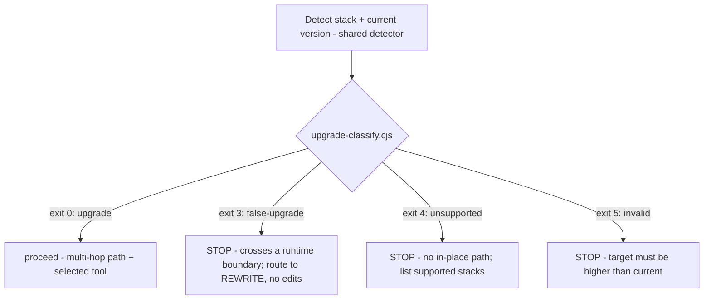
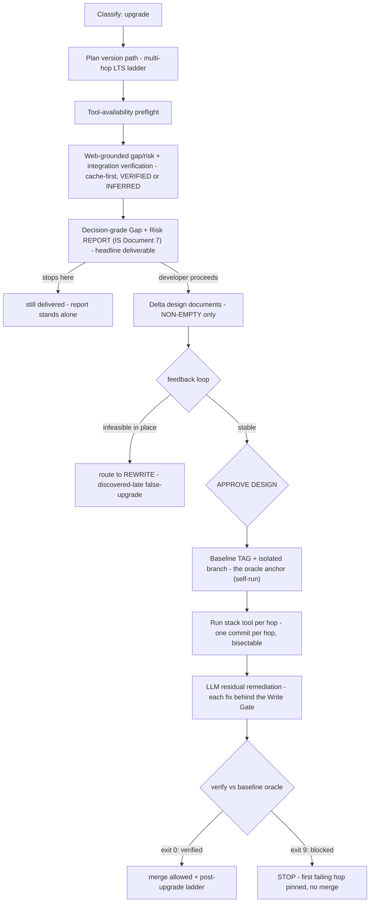

# `upgrade` skill — architecture explainer

> **Status: LIVE.** One of the three migration-family skills (**Upgrade · Rewrite · Replatform**)
> that replaced the retired `migration` skill — see [ADR 0061](../adr/0061-migration-skill-family-split.md)
> and [legacy-migration-skill.md](legacy-migration-skill.md). Skill source:
> `skills/upgrade/SKILL.md` (+ `references/`). Design of record: `docs/plans/migrationSkill/upgrade.md`.
>
> **Abbreviations** (BYO · TCO · BAL · ERL · NFR · SRMT · DAG · 6R · IaC …): see [migration-glossary.md](migration-glossary.md).

---

## The story in one line

*Think of Upgrade as a medical visit for your application.* The app is healthy and running — it
just needs to move to a supported, current runtime. Upgrade begins with a **diagnosis** you can
act on (or not), and if you choose treatment it brings in a **licensed specialist** to do the
work while it keeps careful watch. It never picks up the scalpel itself, and it always keeps a
record of your "before" state so nothing is done that can't be undone.

---

## 1. Purpose — the check-up

Your application works. It compiles, it ships, users are happy — but it's sitting on a runtime
that shipped a few years ago and the support clock is running out. You don't want to *change*
what the app does; you just want it current. That's a check-up, not surgery.

That is exactly what `upgrade` is for: an **in-place, same-stack version upgrade** — current → a
higher supported version of the *same* runtime (e.g. .NET 6→8, Angular 15→17, Java 8→21). It
edits the source repo itself, because you are treating the patient in front of you, not building
a new one.

The single most important thing to understand about how Upgrade behaves: **the LLM is an
*orchestrator* of a deterministic stack-native tool, never a generative author of the bulk
change.** A good doctor doesn't hand-operate when a proven, calibrated instrument exists. Upgrade
is triggered by `UPGRADE ADO-{ID}` / `/upgrade`, and is run from inside the repo being upgraded.

---

## 2. Guiding principle — diagnosis first, then a specialist

> **The LLM coordinates; the deterministic tool transforms.** The model never hand-authors the
> bulk change to working code — it selects and drives the stack-native tool (e.g. `dotnet` SDK
> upgrade assistant, `ng update`, OpenRewrite), grounds its gap/risk analysis in authoritative
> sources, and remediates only the **residual** the tool cannot handle — each fix gated and
> verified against the pre-upgrade baseline commit. The primary product is the **decision-grade
> report**; the code change is secondary and always reversible.

In medical terms: the report is the diagnosis, and the diagnosis is the deliverable. The
treatment — if you choose it — is performed by a specialist instrument, one careful step at a
time, always measured against your baseline vitals.

## 3. Skill shape — what kind of visit this is

- **Locality:** in-place — it edits the source repo directly. You're treating the existing
  patient, not cloning them.
- **Oracle (the baseline vitals):** the project's own **pre-upgrade baseline commit/tag** — the
  reference every post-treatment check is compared against.
- **Headline deliverable (the diagnosis):** the **Gap + Risk report** — worth producing even if
  the developer never proceeds to touch code. A clean bill of health, or a list of what would
  break, is valuable on its own.

---

## 4. The journey, stage by stage

Here is the whole visit at a glance — from walking in the door to walking out upgraded:

```
Detect stack + version  →  Classify  →  Plan version path  →  Tool preflight
  →  Web-grounded Gap + Risk analysis (INCLUDES integration verification)
  →  Decision-grade REPORT (the gap/risk report IS Document 7 / feasibility)
  →  Delta design documents (NON-EMPTY deltas only) → feedback loop → APPROVE DESIGN
        infeasibility discovered here → route to REWRITE (discovered-late false-upgrade)
  →  [if proceed] baseline TAG + branch (oracle = self-run baseline)  →  run tool per hop (1 commit/hop)
  →  LLM residual remediation (gated)  →  verify vs baseline oracle  →  post-upgrade ladder
```

The very first thing that happens is triage — and it is the most important safety check in the
whole skill. **Classification** is what keeps a patient who actually needs a *different*
specialist from being operated on by this one. Misdiagnose a rewrite as an upgrade and you'd
corrupt a working app, so the moment the boundary is crossed, Upgrade stops and refers you out:



Everything past the diagnosis happens **only if the patient consents to treatment.** Up to that
point the orchestrator is a **pure planner** — it writes and rehearses the git/tool commands; the
developer (or the tool) actually runs them:



---

## 5. Triage — classification & routing (Step 1)

Before anything else, Upgrade works out what it's looking at. Detection uses the family-shared
`scripts/migration-source-detect.cjs` (never re-implemented — the whole family reads the patient's
chart the same way). The deterministic `scripts/upgrade-classify.cjs` then makes the call, and the
exit code *is* the verdict (full taxonomy in `references/classification.md`):

| Exit | Classification | Action |
|---|---|---|
| 0 | `upgrade` | proceed — JSON carries the multi-hop `hops[]` + selected `tool` |
| 3 | `false-upgrade` | **STOP** — cross-runtime boundary → route to **Rewrite** (no edits) |
| 4 | `unsupported` | **STOP** — no in-place path/tool; list supported stacks |
| 5 | `invalid` | **STOP** — target ≤ current (downgrade/equal) |

The `false-upgrade` catch is the highest-value moment in the skill — the equivalent of a GP
recognising that this isn't a case for them at all. Treating a rewrite as an upgrade would corrupt
a working app, so Upgrade hard-stops, makes **no changes**, and hands you a `REWRITE ADO-{ID}`
signpost to the right specialist.

## 6. Is the instrument on the tray? — tool-availability preflight (Step 2)

Only reached once the case is confirmed as an `upgrade`. A surgeon checks the instrument is
present and calibrated before scrubbing in; `scripts/upgrade-tool-preflight.cjs` does the same,
probing the stack's deterministic tool read-only (the full matrix + per-OS install steps live in
`references/tool-matrix.md`):

| Exit | Status | Action |
|---|---|---|
| 0 | `available` | tool present at ≥ min version — proceed |
| 2 | `outdated` | present but too old — print upgrade steps, **pause**, re-run |
| 3 | `needs-install` | not found — print install+verify steps, **pause**, re-run |
| 4 | `unknown-stack` | no tool — **STOP** |

The skill only **prints** the steps — it never installs or bundles a tool. A missing instrument
is a graceful pause ("we'll wait while you fetch it"), not a failure.

## 7. The diagnosis — grounded gap/risk + the report (Steps 3–4)

This is where the visit earns its keep. Upgrade builds the diagnosis from evidence, not from
memory:

- **Cache-first:** `scripts/upgrade-knowledge-cache.cjs get` consults the patient's known history —
  the stable delta-KB (knowledge base) — before any new research (hit exit 0 / miss exit 7 /
  volatile-stale exit 6). Facts about a shipped version are immutable once it ships, so they're
  worth remembering.
- **Ground on miss:** on a cache miss it consults the literature — WebSearch an **authoritative**
  source (official migration guide / release notes / deprecation list), never model memory.
- **Tag + store:** `put` records each fact as `tier: VERIFIED` (from an authoritative host) or
  `INFERRED` (confidence auto-lowered), via the shared `scripts/lib/source-classifier.cjs`. If a
  differing claim ever arrives under the same id, it returns `immutable-conflict` (exit 8) rather
  than quietly overwriting a settled fact.

Crucially, **integration verification is part of this same examination**, not a separate
appointment (that differs from Rewrite/Replatform, where it precedes options). Per
`integration-verification-spec.md`: most integrations survive an in-place upgrade unchanged; the
ones that **break** — a library with no target-version equivalent, a changed auth scheme — are
exactly the symptoms the report must surface. Tier 2 verification runs via `additionalDirectories`
where the service source is available; the Integration Inventory feeds the report's integration
rows and its `[INTEGRATION]` log entries.

The **Gap + Risk report** (`references/gap-risk-report.md`) is the diagnosis written up: it states
which side of the **tool-coverage line** the project sits on, classifies each item on the
feasibility spine (🟢/🟡/🔴/⛔) with its source tag, includes a **dependency ledger** (a package with
no target-compatible version is a hard ⛔ BLOCKER), and closes with the **post-upgrade ladder**
(→ Rewrite / Replatform) — the "here's what to consider next" note at the bottom of the chart.
Even a RED/BLOCKER verdict yields a decision-grade report — you always leave with an answer, never
a bare "failed." Per `feasibility-spec.md`, **the gap/risk report IS Document 7 (feasibility)** —
Upgrade produces no separate `migration-feasibility.md`; this spec governs the report's format
directly.

## 8. Consenting to treatment — delta design documents + APPROVE DESIGN (Step 4.5)

If the developer proceeds, Upgrade writes up only the parts of the treatment plan that actually
change — the **non-empty delta documents only**. The diagnosis already identified which dimensions
the upgrade touches, and delta documents are authored solely for those (`target-design-spec.md`
delta depth). A clean upgrade might produce nothing more than the gap/risk report plus a component
delta (middleware pipeline, package replacements); infrastructure/deployment deltas appear only if
the upgrade also changes hosting. **No "No change" filler** — a chart full of "nothing to report"
lines only buries the findings that matter.

- The document graph is derived from **whatever documents are present** by
  `graph-derive-documents.cjs`.
- The **feedback loop** (`design-revision-spec.md` → `document-feedback.md`) runs on the reduced
  set (gap/risk report + deltas).
- **Referral escape hatch — route to Rewrite:** if the diagnosis or the feedback loop reveals the
  upgrade is **infeasible in place** (accumulated RED/BLOCKER evidence), Upgrade refers you to
  **Rewrite** — the discovered-late equivalent of the Step 1 `false-upgrade` catch
  (`option-change-spec.md`, upgrade posture-boundary note). It never forces an infeasible upgrade
  forward to the baseline tag; a good doctor stops rather than operate on a case they can't win.
- **APPROVE DESIGN** is a formal consent gate for Upgrade too (even for delta documents) —
  required *before* the baseline tag; it records
  `payload.upgrade.gate_verdicts.design_approved`.

## 9. The procedure — gated execution (Steps 5–7)

- **The oracle is `self-run` almost by definition** — the app builds and runs; it *is* the patient
  you're upgrading. If used as a secondary smoke test, golden master captures baseline behaviour
  here (pre-move) and replays it afterwards (post-move) per `golden-master-spec.md` (Upgrade
  binding row). If the app can't be built or run locally, the oracle degrades — and that's noted
  honestly in the report.
- **Baseline vitals before the first incision:** both **APPROVE DESIGN and the baseline tag must
  exist before any edit** — the consent gate (§8) and the oracle anchor are prerequisites, no
  exceptions. `scripts/upgrade-orchestrate.cjs plan` emits the ordered runbook; `steps[0]` is
  always the **baseline tag** (the oracle anchor) and `steps[1]` the isolated branch — both created
  before the first edit so verification always has a clean pre-upgrade reference to measure against.
- **One commit per hop:** run the tool for each version hop, then make exactly one commit → a
  bisectable history, so if something fails later you can pin the exact hop that caused it. Hops
  are never blended together.
- **Residual remediation is gated:** the specialist instrument leaves ~10–30% residual it can't
  reach; the LLM stitches that up by hand — but **each fix passes the Write Gate**
  (`APPROVE ADO-{ID}`). Nothing is closed up without your sign-off.
- **Verify against the baseline:** `upgrade-orchestrate.cjs verify` → exit 0 verified (merge
  allowed) / exit 9 blocked (first failing hop pinned; no merge until it passes).

## 10. The second opinion — judge + resumable ledger (Step 8)

No single doctor signs off alone. Each gate (report · residual · verify) records a verdict from an
**independent judge** — a separate agent on a separate model (`skills/shared/judge.md`) — persisted
to the shared **migration ledger** (`skills/shared/migration-ledger-schema.md`). This is the
second opinion on the chart. `scripts/upgrade-checkpoint.cjs` is a thin adapter over
`scripts/checkpoint-ledger.cjs` that owns the `payload.upgrade` namespace. The ledger is a
single-writer, **merge-write** contract (it never clobbers fields it doesn't own), so a visit can
be paused and picked up later (`UPGRADE RESUME ADO-{ID}`) or handed to a colleague, and
`UPGRADE STATUS ADO-{ID}` renders the current chart read-only.

## 11. Who's in the room — personas & model routing

- **Persona:** **[SE] Elena Fischer — Senior Software Engineer** is the attending, weighing
  **[SA] Rafael Mendes** (feasibility/classification) at intake.
- **Model routing:** classification / gap-risk / residual remediation → `ICEA_MODEL` (opus); the
  gate judge + source verification → `CRITIC_MODEL` (sonnet), escalating to `CRITIC_MODEL_MAX`
  (max effort) for high-risk / B-series findings.

## 12. The instruments — deterministic scripts

The calibrated tools on the tray, each with one job:

| Script | Role |
|---|---|
| `migration-source-detect.cjs` | family-shared stack+version detection (wraps `repo-detect.cjs`) |
| `upgrade-classify.cjs` | classify upgrade / false-upgrade / unsupported / invalid (exit contract) |
| `upgrade-tool-preflight.cjs` | probe the stack tool (available/outdated/needs-install/unknown) |
| `upgrade-knowledge-cache.cjs` | cache + tag grounded facts (VERIFIED/INFERRED via `lib/source-classifier.cjs`) |
| `graph-derive-documents.cjs` | derives the (reduced) design-document dependency graph from whatever delta documents are present (exit 1 cycle / exit 2 parse error) — Step 4.5 |
| `upgrade-orchestrate.cjs` | `plan` (baseline+branch+commit-per-hop runbook) · `verify` (vs baseline oracle) |
| `upgrade-checkpoint.cjs` | thin adapter over `checkpoint-ledger.cjs` for `payload.upgrade` |

Knowledge-tier specs the skill reads (the reference texts, not instruments):
`integration-verification-spec.md`, `feasibility-spec.md`, `target-design-spec.md`,
`design-revision-spec.md`, `document-feedback.md`, `option-change-spec.md`,
`golden-master-spec.md`, `options-insight-spec.md` (only where version-path / hosting options
exist), `migration-log-spec.md`.

## 13. The promises this skill keeps (the lines it won't cross)

Every one of these is a rule Upgrade never breaks — and each has a reason rooted in "first, do no
harm":

- **It never hand-authors the bulk transform** — it drives the deterministic tool, because a
  calibrated instrument beats a freehand incision on working code.
- **It never proceeds past a `false-upgrade`** — it routes to Rewrite and makes no edits, because
  operating on the wrong kind of case corrupts a healthy app.
- **If the diagnosis or feedback loop shows the upgrade is infeasible in place, it refers to
  Rewrite** (discovered-late false-upgrade) — it never forces an infeasible case forward to the
  baseline tag.
- **It never edits source before both APPROVE DESIGN and the baseline tag exist** — consent gate
  plus baseline vitals, always before the first incision.
- **Integration verification runs inside the diagnosis** (Step 3), not as a separate pre-options
  appointment.
- **It authors only non-empty delta documents** — never "No change" filler that buries the real
  findings.
- **The gap/risk report *is* the feasibility document** (Document 7) — no separate
  `migration-feasibility.md`.
- **Always one commit per version hop** (bisectable); **every residual fix is gated**; **no merge
  until verify passes.**
- **Every breaking-change fact is grounded in an authoritative source**, tagged VERIFIED or
  INFERRED — a source is never fabricated.
- **It writes a migration log entry at each phase** per `migration-log-spec.md` — the chart is
  never left blank.

---

## Where it fits in the family

Three siblings, each for a different kind of move:

| You have… | Skill |
|---|---|
| Same stack, higher version, edit in place | **Upgrade** (this doc) |
| Different stack, translate the code to a new target | [Rewrite](rewrite-skill.md) |
| Same code, new host/topology (on-prem → cloud) | [Replatform](replatform-skill.md) |

A `false-upgrade` classification is Upgrade explicitly referring you to **Rewrite**. And the
post-upgrade ladder at the foot of the report may point you further up — to Rewrite or Replatform —
once the immediate check-up is done.
