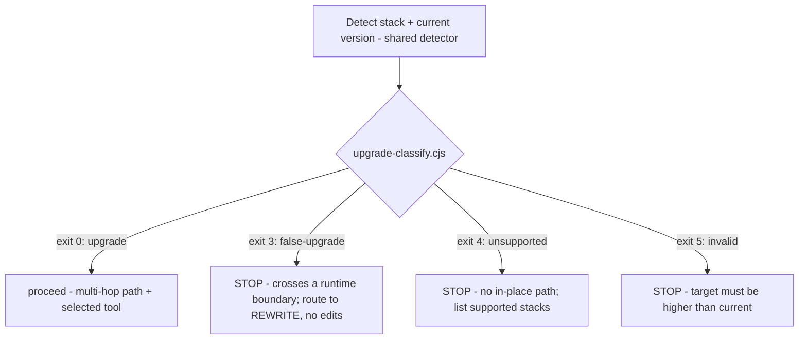
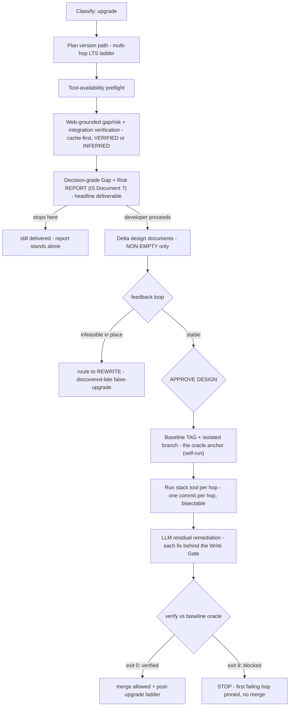

# `upgrade` skill — architecture explainer

> **Status: LIVE.** One of the three migration-family skills (**Upgrade · Rewrite · Replatform**)
> that replaced the retired `migration` skill — see [ADR 0061](../adr/0061-migration-skill-family-split.md)
> and [legacy-migration-skill.md](legacy-migration-skill.md). Skill source:
> `skills/upgrade/SKILL.md` (+ `references/`). Design of record: `docs/plans/migrationSkill/upgrade.md`.
>
> **Abbreviations** (BYO · TCO · BAL · ERL · NFR · SRMT · DAG · 6R · IaC …): see [migration-glossary.md](migration-glossary.md).

---

## 1. Purpose

`upgrade` performs an **in-place, same-stack version upgrade** — current → a higher supported version
of the *same* runtime (e.g. .NET 6→8, Angular 15→17, Java 8→21). It edits the source repo itself.

Its defining stance: **the LLM is an *orchestrator* of a deterministic stack-native tool, never a
generative author of the bulk change.** Triggered by `UPGRADE ADO-{ID}` / `/upgrade`, run from inside
the repo being upgraded.

---

## 2. Guiding principle

> **The LLM coordinates; the deterministic tool transforms.** The model never hand-authors the bulk
> change to working code — it selects and drives the stack-native tool (e.g. `dotnet` SDK upgrade
> assistant, `ng update`, OpenRewrite), grounds its gap/risk analysis in authoritative sources, and
> remediates only the **residual** the tool cannot handle — each fix gated and verified against the
> pre-upgrade baseline commit. The primary product is the **decision-grade report**; the code change
> is secondary and always reversible.

## 3. Skill shape

- **Locality:** in-place — edits the source repo directly.
- **Oracle:** the project's own **pre-upgrade baseline commit/tag** (the regression reference).
- **Headline deliverable:** the **Gap + Risk report** — worth producing even if the developer never
  proceeds to touch code.

---

## 4. Stage flow

```
Detect stack + version  →  Classify  →  Plan version path  →  Tool preflight
  →  Web-grounded Gap + Risk analysis (INCLUDES integration verification)
  →  Decision-grade REPORT (the gap/risk report IS Document 7 / feasibility)
  →  Delta design documents (NON-EMPTY deltas only) → feedback loop → APPROVE DESIGN
        infeasibility discovered here → route to REWRITE (discovered-late false-upgrade)
  →  [if proceed] baseline TAG + branch (oracle = self-run baseline)  →  run tool per hop (1 commit/hop)
  →  LLM residual remediation (gated)  →  verify vs baseline oracle  →  post-upgrade ladder
```

The first gate is **classification** — the safety valve that keeps a *false* upgrade from corrupting a
working app:



Everything past the report runs **only if the developer proceeds**, and the orchestrator is a **pure
planner** — it authors + rehearses the git/tool commands; the developer (or tool) executes:



---

## 5. Classification & routing (Step 1)

Detection uses the family-shared `scripts/migration-source-detect.cjs` (never re-implemented). The
deterministic `scripts/upgrade-classify.cjs` then decides — exit code is the contract (full taxonomy
in `references/classification.md`):

| Exit | Classification | Action |
|---|---|---|
| 0 | `upgrade` | proceed — JSON carries the multi-hop `hops[]` + selected `tool` |
| 3 | `false-upgrade` | **STOP** — cross-runtime boundary → route to **Rewrite** (no edits) |
| 4 | `unsupported` | **STOP** — no in-place path/tool; list supported stacks |
| 5 | `invalid` | **STOP** — target ≤ current (downgrade/equal) |

A `false-upgrade` is the highest-value catch: misrouting a rewrite as an upgrade would corrupt a
working app, so it hard-stops with a `REWRITE ADO-{ID}` signpost and makes no changes.

## 6. Tool-availability preflight (Step 2)

Only reached on `upgrade`. `scripts/upgrade-tool-preflight.cjs` probes the stack's deterministic tool
(read-only; matrix + per-OS install steps in `references/tool-matrix.md`):

| Exit | Status | Action |
|---|---|---|
| 0 | `available` | tool present at ≥ min version — proceed |
| 2 | `outdated` | present but too old — print upgrade steps, **pause**, re-run |
| 3 | `needs-install` | not found — print install+verify steps, **pause**, re-run |
| 4 | `unknown-stack` | no tool — **STOP** |

The skill only **prints** steps — it never installs or bundles a tool. Tool absence is a graceful
pause, not a failure.

## 7. Grounded gap/risk + the report (Steps 3–4)

- **Cache-first:** `scripts/upgrade-knowledge-cache.cjs get` reads the stable delta-KB before any
  search (hit exit 0 / miss exit 7 / volatile-stale exit 6). Stable facts are immutable once a version
  ships.
- **Ground on miss:** WebSearch an **authoritative** source (official migration guide / release notes
  / deprecation list) — never model memory.
- **Tag + store:** `put` sets `tier: VERIFIED` (authoritative host) or `INFERRED` (confidence
  auto-lowered), via the shared `scripts/lib/source-classifier.cjs`. A differing claim under the same
  id returns `immutable-conflict` (exit 8) rather than silently overwriting.

**Integration verification is the integration dimension of this analysis**, not a separate pre-options
step (unlike Rewrite/Replatform, where it precedes options). Per `integration-verification-spec.md`:
most integrations pass through an in-place upgrade unchanged; the ones that **break** (a library with no
target-version equivalent, a changed auth scheme) are exactly what the report must surface. Tier 2 via
`additionalDirectories` where the service source is available; the Integration Inventory feeds the
report's integration rows and `[INTEGRATION]` log entries.

The **Gap + Risk report** (`references/gap-risk-report.md`) is the headline deliverable: it states
which side of the **tool-coverage line** the project sits on, classifies each item on the feasibility
spine (🟢/🟡/🔴/⛔) with its source tag, includes a **dependency ledger** (a package with no
target-compatible version is a hard ⛔ BLOCKER), and ends with the **post-upgrade ladder**
(→ Rewrite / Replatform). Even a RED/BLOCKER verdict yields a decision-grade report — never a bare fail.
Per `feasibility-spec.md`, **the gap/risk report IS Document 7 (feasibility)** — no separate
`migration-feasibility.md` is produced for Upgrade; this spec governs the report's format directly.

## 8. Delta design documents + APPROVE DESIGN (Step 4.5)

If the developer proceeds, the skill authors the **non-empty delta documents only** — the gap/risk
analysis identifies which dimensions the upgrade actually changes, and delta documents are authored
solely for those (`target-design-spec.md` delta depth). A clean upgrade may produce only the gap/risk
report + a component delta (middleware pipeline, package replacements); infrastructure/deployment deltas
appear only when the upgrade includes a hosting change. **No "No change" filler** — it would dilute the
report.

- The document graph is derived from **whatever documents are present** by `graph-derive-documents.cjs`.
- The **feedback loop** (`design-revision-spec.md` → `document-feedback.md`) runs on the reduced set
  (gap/risk report + deltas).
- **Route-to-Rewrite escape hatch:** if the gap/risk review or the feedback loop reveals the upgrade is
  **infeasible in place** (accumulated RED/BLOCKER evidence), the skill routes to **Rewrite** — the
  discovered-late equivalent of the Step 1 false-upgrade catch (`option-change-spec.md`, upgrade
  posture-boundary note). It never forces an infeasible upgrade forward to the baseline tag.
- **APPROVE DESIGN** is a formal gate for Upgrade too (even delta documents) — required *before* the
  baseline tag; records `payload.upgrade.gate_verdicts.design_approved`.

## 9. Gated execution (Steps 5–7)

- **Oracle is `self-run`** almost by definition — the app builds and runs; it is what you are upgrading.
  Golden master, if used as a secondary smoke, captures baseline behaviour here (pre-move) and replays
  it after the upgrade (post-move) per `golden-master-spec.md` (Upgrade binding row). If the app cannot
  be built/run locally, the oracle degrades — noted in the report.
- **APPROVE DESIGN and the baseline tag both precede any edit** — the design gate (§8) and the oracle
  anchor are prerequisites; no source is touched before both exist.
- **Baseline first:** `scripts/upgrade-orchestrate.cjs plan` emits the ordered runbook; `steps[0]` is
  always the **baseline tag** (oracle anchor) and `steps[1]` the isolated branch — created before the
  first edit so verification always has a clean pre-upgrade reference.
- **One commit per hop:** run the tool for each hop, then exactly one commit → bisectable history so a
  later failure pins the exact hop. Hops are never blended.
- **Residual remediation is gated:** the tool leaves ~10–30% residual; the LLM fixes it, but **each
  fix passes the Write Gate** (`APPROVE ADO-{ID}`).
- **Verify vs the oracle:** `upgrade-orchestrate.cjs verify` → exit 0 verified (merge allowed) / exit
  9 blocked (first failing hop pinned; no merge until it passes).

## 10. Judge + resumable ledger (Step 8)

Each gate (report · residual · verify) records a verdict from an **independent judge** — a separate
agent on a separate model (`skills/shared/judge.md`) — persisted to the shared **migration ledger**
(`skills/shared/migration-ledger-schema.md`). `scripts/upgrade-checkpoint.cjs` is a thin adapter over
`scripts/checkpoint-ledger.cjs` owning the `payload.upgrade` namespace. The ledger is a single-writer,
**merge-write** contract (never clobbers fields it does not own), so a run is resumable
(`UPGRADE RESUME ADO-{ID}`) and safe to hand off; `UPGRADE STATUS ADO-{ID}` renders it read-only.

## 11. Personas & model routing

- **Persona:** **[SE] Elena Fischer — Senior Software Engineer**, weighing **[SA] Rafael Mendes**
  (feasibility/classification) at Intake.
- **Model routing:** classification / gap-risk / residual remediation → `ICEA_MODEL` (opus); the
  gate judge + source verification → `CRITIC_MODEL` (sonnet), escalating to `CRITIC_MODEL_MAX` (max
  effort) for high-risk / B-series findings.

## 12. Deterministic scripts

| Script | Role |
|---|---|
| `migration-source-detect.cjs` | family-shared stack+version detection (wraps `repo-detect.cjs`) |
| `upgrade-classify.cjs` | classify upgrade / false-upgrade / unsupported / invalid (exit contract) |
| `upgrade-tool-preflight.cjs` | probe the stack tool (available/outdated/needs-install/unknown) |
| `upgrade-knowledge-cache.cjs` | cache + tag grounded facts (VERIFIED/INFERRED via `lib/source-classifier.cjs`) |
| `graph-derive-documents.cjs` | derives the (reduced) design-document dependency graph from whatever delta documents are present (exit 1 cycle / exit 2 parse error) — Step 4.5 |
| `upgrade-orchestrate.cjs` | `plan` (baseline+branch+commit-per-hop runbook) · `verify` (vs baseline oracle) |
| `upgrade-checkpoint.cjs` | thin adapter over `checkpoint-ledger.cjs` for `payload.upgrade` |

Knowledge-tier specs the skill reads (not scripts): `integration-verification-spec.md`,
`feasibility-spec.md`, `target-design-spec.md`, `design-revision-spec.md`, `document-feedback.md`,
`option-change-spec.md`, `golden-master-spec.md`, `options-insight-spec.md` (only where version-path /
hosting options exist), `migration-log-spec.md`.

## 13. Key hard rules

- NEVER hand-author the bulk transform — drive the deterministic tool.
- NEVER proceed past a `false-upgrade` — route to Rewrite; make no edits.
- If the gap/risk review or feedback loop reveals the upgrade is **infeasible in place**, route to
  **Rewrite** (discovered-late false-upgrade) — NEVER force it forward to the baseline tag.
- NEVER edit source before **APPROVE DESIGN** and the **baseline tag** both exist (design gate + oracle anchor).
- Integration verification runs INSIDE the gap/risk analysis (Step 3) — not a separate pre-options step.
- Author only NON-EMPTY delta documents — never "No change" filler that dilutes the report.
- The gap/risk report IS the feasibility document (Document 7) — no separate `migration-feasibility.md`.
- ALWAYS one commit per version hop (bisectable); gate every residual fix; never merge until verify passes.
- ALWAYS ground breaking-change facts in an authoritative source; tag VERIFIED or INFERRED; never fabricate a source.
- Write migration log entries per `migration-log-spec.md` at each phase.

---

## Where it fits in the family

| You have… | Skill |
|---|---|
| Same stack, higher version, edit in place | **Upgrade** (this doc) |
| Different stack, translate the code to a new target | [Rewrite](rewrite-skill.md) |
| Same code, new host/topology (on-prem → cloud) | [Replatform](replatform-skill.md) |

A `false-upgrade` classification is Upgrade explicitly handing off to **Rewrite**. Post-upgrade
recommendations may point further up the ladder (Rewrite / Replatform).
