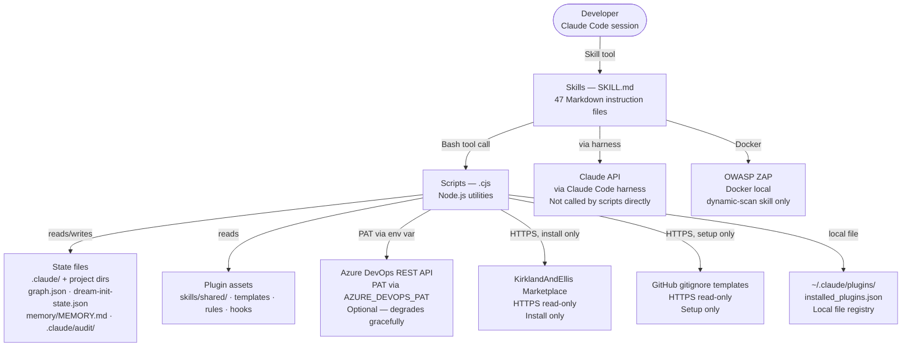
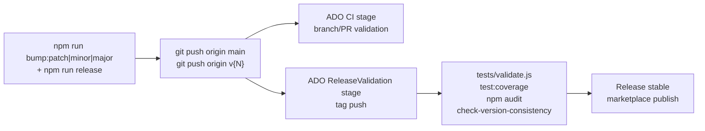
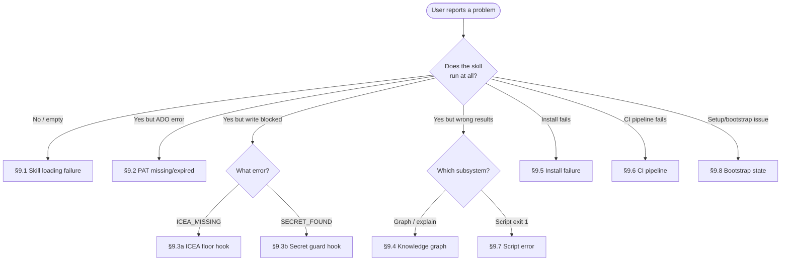
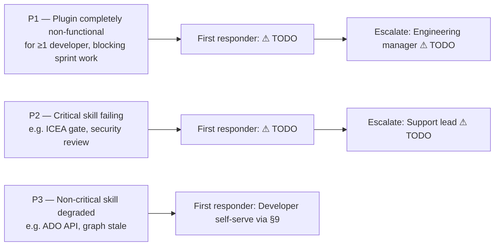

# ai-assisted-development — Operational Runbook

> **Purpose:** the single document a support engineer opens when something is wrong with
> the ai-assisted-development plugin, or when performing a routine operational task.
>
> **How to use this doc:** every field marked **⚠ TODO** must be filled in by the owning team —
> do not treat a TODO as "not applicable." Values here are drawn from the architecture docs,
> configuration, and pipeline definitions; **verify each against the live environment before
> relying on it in an incident.**
>
> **Status:** Draft · Last updated: 2026-09-25 · Owner: **⚠ TODO (support lead)**
>
> **Maintenance:** each section carries a _Last reviewed_ stamp (see §16). Update the relevant
> section — and its stamp — whenever infrastructure, contacts, or secrets change; append every
> resolved incident to §9.

---

## 0. At a glance

| Item | Value |
|---|---|
| Application | ai-assisted-development plugin v3.25.0 |
| What it does | Claude Code plugin providing 47 skills for ICEA-driven development workflow (feature planning, code review, security, migration, graph, memory consolidation). Installed on developer machines via `install.cjs` from the KirklandAndEllis marketplace. |
| Frontend | N/A — developer-local CLI tool (no browser frontend) |
| Backend | Node.js 20+ CommonJS scripts (.cjs) invoked by Claude Code via the Bash tool |
| Auth | Intentionally unauthenticated — local tool. Developer supplies `AZURE_DEVOPS_PAT` via shell env var for ADO API skills (optional). |
| Data store | File-based only (JSON state files in `.claude/` + project dirs). No database. |
| Key dependencies | Azure DevOps REST API (optional), Claude API (via Claude Code harness), KirklandAndEllis marketplace (install only), GitHub gitignore templates (setup only), OWASP ZAP / Docker (dynamic-scan skill only), `~/.claude/plugins/installed_plugins.json` |
| Region(s) | N/A — runs on developer local machines (Windows, Linux, macOS) |
| Support hours / SLA | ⚠ TODO |
| Primary on-call | ⚠ TODO — see §12 |
| Escalation | ⚠ TODO — see §12 |

**First move in any incident:** identify the layer — skill loading / ADO API / hook enforcement / knowledge graph / installation / CI pipeline / script error. The symptom→layer map in §8 routes you to the right playbook.

_Last reviewed: ⚠ TODO_

---

## 1. Architecture recap (60-second version)

This plugin is a developer-local Node.js tool installed on individual developer machines. Skills are plain Markdown files (`SKILL.md`) read by Claude Code at runtime; they invoke Node.js utility scripts via the Bash tool. All state (provisioning, knowledge graph, memory, audit trail) is stored as JSON or Markdown files in the target project's `.claude/` directory and git-tracked. There is no server process, no hosted environment, and no database.

- **Authorization is enforced by hooks:** `icea-floor` (blocks source writes without an approved ICEA), `secret-guard` (blocks PAT/key writes to committed files), `script-review-gate` (allow-lists permitted Bash invocations). There is no network-level auth — this is a local tool.
- **Graceful degradation:** Azure DevOps REST API failure → skills print a warning and continue with degraded output. Marketplace HTTPS failure → `install.cjs` fails with a clear error; no partial state written. GitHub gitignore fetch failure → falls back to offline templates in `$PLUGIN_DIR/skills/gitignore-sync/stacks/`. OWASP ZAP / Docker unavailable → `dynamic-scan` skill detects it and exits with instructions. `installed_plugins.json` missing → `plugin-state.cjs` returns `INSTALLED_UNKNOWN`; version-checking skills warn but continue.

Full detail: [../../.claude/architecture/architecture.md](../../.claude/architecture/architecture.md)
and the other `architecture-*.md` files in `.claude/architecture/`.

_Last reviewed: ⚠ TODO_

---

## 2. Architecture & dependency map



_Last reviewed: ⚠ TODO_

---

## 3. Environments & resource inventory

This plugin has no cloud-hosted environments. The single "environment" is the developer's local machine.

| Env | Installation path | Version | Deploy trigger |
|---|---|---|---|
| Developer local | `~/.claude/plugins/cache/KirklandAndEllis-marketplace/ai-assisted-development/{version}/` | 3.25.0 | `node install.cjs` from marketplace |
| CI (ADO pipeline) | ADO-hosted Ubuntu agent | Node.js 20.x | Tag push `v*` or branch push to `main`/`dev` |

Key path inventory (per developer machine):

| Resource | Path | Notes |
|---|---|---|
| Plugin cache | `~/.claude/plugins/cache/KirklandAndEllis-marketplace/ai-assisted-development/3.25.0/` | Installed by `install.cjs` |
| Plugin path pointer | `{project}/.claude/plugin-path.txt` | Written at install time; read by every skill |
| Installed plugins registry | `~/.claude/plugins/installed_plugins.json` | Global registry — read by `plugin-state.cjs` |
| Provisioning state | `{project}/.claude/dream-init-state.json` | Written by `setup-init-bootstrap.cjs` |
| Knowledge graph | `{project}/.claude/graph/graph.json` | Written by `graph-create` / `graph-sync` |
| Memory (dream-managed) | `{project}/memory/MEMORY.md` | Committed; managed by Dream skill |
| Audit trail | `{project}/.claude/audit/` | Append-only; managed by `audit-write.cjs` |
| File-cache (scanner) | `{project}/.claude/file-cache.json` | Written by `code-review`, `security` skills |

**⚠ CRITICAL to confirm before relying on any prod procedure:** there is no production hosted environment. "Production" for this plugin is a tagged release published to the marketplace. Verify the tag + pipeline have succeeded before treating a version as stable.

_Last reviewed: ⚠ TODO_

---

## 4. Access a support engineer needs (get this BEFORE an incident)

You cannot fix what you can't reach. Request these during onboarding, not during a P1.

| Access | Why | How granted | Have it? |
|---|---|---|---|
| Claude Code CLI (≥1.0) installed | Plugin requires Claude Code to run | [claude.ai](https://claude.ai) — developer install | ⚠ TODO |
| Node.js 20+ installed | All plugin scripts require Node.js 20+ | `nvm install 20` or system package manager | ⚠ TODO |
| Git access to plugin repo | Pull source, run tests, debug scripts | ⚠ TODO (repo URL / ADO permissions) | ⚠ TODO |
| `AZURE_DEVOPS_PAT` env var | ADO API skills (`pr-create`, `sprint-metrics`, `ado-tasks`) | ADO → User Settings → Personal Access Tokens | ⚠ TODO |
| ADO project access (`{ADO_PROJECT}`) | View pipeline runs, create PRs | ADO organization admin | ⚠ TODO |
| Developer machine (local account) | Plugin runs on-machine; no remote shell available | Developer onboarding | ⚠ TODO |

> **Network note:** if the target project is on an air-gapped or VPN-only network, marketplace fetch and GitHub gitignore fetch will fail — plan for offline installs from a cached zip.

_Last reviewed: ⚠ TODO_

---

## 5. Routine operations

### 5.1 Deploy (normal release)

The "deployment" of this plugin is a marketplace publish triggered by a git tag. Steps:

1. **Bump version:** `npm run bump:patch` (or `bump:minor` / `bump:major`) — updates `plugin.json`, `plugin-manifest.json`, seeds a `CHANGELOG` stub, creates an annotated git tag.
2. **Commit release:** `npm run release` — commits the version bump files.
3. **Push:** `git push origin main && git push origin v{N}` — the tag push triggers the ADO `ReleaseValidation` pipeline stage.
4. **Pipeline validates:** `npm ci` → `node tests/validate.js` → `npm run test:coverage` → `npm audit --audit-level=high` → `node scripts/check-version-consistency.js` → tag/manifest consistency checks.
5. **If pipeline passes:** the release is stable and available for install.

⚠ Verify that pipeline variables and the ADO service connection are configured before pushing a tag.



### 5.2 Rollback

Re-install a previous version from the marketplace:

```bash
# Re-run install.cjs and select the previous version
node install.cjs
# Or manually revert plugin-path.txt in the target project to the previous cache path
echo "~/.claude/plugins/cache/KirklandAndEllis-marketplace/ai-assisted-development/{PREV_VERSION}" \
  > {project}/.claude/plugin-path.txt
```
⚠ Verify the previous version path exists in the cache before editing `plugin-path.txt`.

> Rolling back the plugin does NOT roll back any state files (`graph.json`, `memory/MEMORY.md`, ICEA docs) already written by the newer version. State files are forward-compatible in most cases; if a state file format is incompatible, restore from git history.
> Record the last-known-good release after each publish: **⚠ TODO (maintain a release log).**

**✅ Confirm resolved:** after rollback, run `/session-start` in a fresh Claude Code session and confirm the skill list shows the expected version. Run `node scripts/check-version-consistency.js` to verify version files match.

### 5.3 Restart

This plugin has no persistent server process — there is nothing to "restart" in the traditional sense. If a Claude Code session is hung or unresponsive:

```bash
# Kill the hung Claude Code process
# On Windows:
taskkill /IM "Claude Code.exe" /F
# On Linux/macOS:
pkill -f "claude-code"
# Restart Claude Code and open a new session
```
⚠ Verify the process name against your installed Claude Code version.

> **Caveat:** no graceful-shutdown handling in plugin scripts — if a script is mid-write when the process is killed, the state file may be partially written. On next run, restore from git if the state file is malformed.

**✅ Confirm resolved:** open a fresh Claude Code session, run `/session-start`, and confirm memory and architecture context load without errors.

### 5.4 Database migrations

Not applicable — this plugin has no database. All state is file-based and git-tracked. "Schema changes" to state files (e.g. new fields in `dream-init-state.json` or `graph.json`) are handled by `setup-sync`, which applies version-sensitive migrations listed in `docs/migrations/`.

### 5.5 Plugin re-provisioning (existing project after upgrade)

When the plugin is upgraded and a target project needs to be re-provisioned:

```bash
# Inside the target project, in a Claude Code session:
/setup-sync
```
⚠ Verify the project's `.claude/dream-init-state.json` has `dream_init_plugin_version` set before running.

**✅ Confirm resolved:** `/setup-status` shows all green/amber (no red) for CLAUDE.md, memory, rules, hooks, and architecture docs.

_Last reviewed: ⚠ TODO_

---

## 6. Health, logs & monitoring

| Signal | Where | Notes |
|---|---|---|
| Liveness | N/A — local CLI tool | No health endpoint |
| Readiness | N/A — local CLI tool | No readiness endpoint |
| Plugin scripts log output | Claude Code Bash tool result panel | `console.log` / `console.error` to stdout only — not persisted |
| Audit trail | `{project}/.claude/audit/` | Append-only governance log; written by `audit-write.cjs`. Not an operational log. |
| APM / traces | None | No APM configured |
| CI pipeline health | ADO pipeline `{ADO_ORG}/{ADO_PROJECT}` | Check last build status for `main`/`dev` branches |
| npm dependency vulnerabilities | `npm audit` (CI gate) | Fails build on high/critical CVE; run locally: `npm audit --audit-level=high` |

> **No persistent error log:** script failures (exit 1, unhandled rejections) produce output in the Claude Code session only — there is no log file written after the session ends. This is a known gap (see §10). When debugging a script failure, reproduce in a fresh session and read the Bash tool error output.

**Recommended alerts** (wire to developer / team channel when plugin goes into active use):

| Alert | Signal / source | Threshold | Destination | Wired? |
|---|---|---|---|---|
| npm high/critical CVE | ADO pipeline `npm audit` step | Any high/critical CVE | ⚠ TODO | ⚠ TODO |
| CI pipeline failure on `main` | ADO pipeline result | Any failure | ⚠ TODO | ⚠ TODO |
| `AZURE_DEVOPS_PAT` expiry | ⚠ TODO — no automated expiry check | Before expiry date | ⚠ TODO | ⚠ TODO |

_Last reviewed: ⚠ TODO_

---

## 7. Secrets & rotation

> Prevent the classic "it worked for months then died" outage from an expired secret. Every
> credential the plugin depends on, where it lives, who rotates it, and when.

| # | Secret / credential | Used for | Location | Type | Auto-picked-up on rotation? | Owner | Expiry / next rotation | Blast radius if expired |
|---|---|---|---|---|---|---|---|---|
| 1 | `AZURE_DEVOPS_PAT` | ADO REST API calls (`pr-create`, `sprint-metrics`, `ado-tasks`) | Developer shell env or `{project}/.claude/settings.local.json` (gitignored) | Developer-generated PAT | No — developer must update manually | ⚠ TODO | ⚠ TODO | ADO skills fall back to degraded mode (warning printed, no crash). Skills requiring ADO connection will fail silently until renewed. |
| 2 | ADO service connection (CI pipeline) | Pipeline authentication to ADO | ADO Pipeline service connection (not stored in repo) | Service principal or PAT | ⚠ TODO | ⚠ TODO | ⚠ TODO | CI/CD pipeline fails on every push |
| 3 | Claude Code API key | Model access via Claude Code harness | Managed by Claude Code (not by this plugin) | ⚠ TODO — Anthropic account | ⚠ TODO | ⚠ TODO | ⚠ TODO | All Claude Code / plugin functionality fails |

> **Note on secrets hygiene:** the `secret-guard` hook (`check-settings-secrets.cjs`) blocks any write of a PAT, API key, or connection string into `.claude/settings.json` (committed/shared). Secrets must live in `.claude/settings.local.json` (gitignored) or a shell environment variable.

### 7.1 Rotation procedures

**`AZURE_DEVOPS_PAT`:**
```bash
# 1. Go to ADO → User Settings → Personal Access Tokens
# 2. Create a new PAT with the required scopes (Code: read/write, Work Items: read/write)
# 3. Update your shell profile or settings.local.json:
#    Option A — shell env (recommended):
echo 'export AZURE_DEVOPS_PAT=<new-token>' >> ~/.bashrc && source ~/.bashrc
#    Option B — settings.local.json (gitignored):
#    Add "env": { "AZURE_DEVOPS_PAT": "<new-token>" } to .claude/settings.local.json
```
⚠ Verify each command against your shell and OS. Never write the PAT into `.claude/settings.json`.

### 7.2 Rotation calendar (fill in real dates)

| Due | Item(s) | Owner | Done? |
|---|---|---|---|
| ⚠ TODO | `AZURE_DEVOPS_PAT` (developer) | ⚠ TODO | ☐ |
| ⚠ TODO | ADO CI service connection | ⚠ TODO | ☐ |

> Set a calendar reminder **2 weeks before** each known expiry. The **highest-value action** is to find the real expiry date of `AZURE_DEVOPS_PAT` now — a silently expired PAT is the most likely source of an unexpected ADO skill failure.

_Last reviewed: ⚠ TODO_

---

## 8. Symptom → layer → playbook map

| Symptom (what the user reports) | Likely layer | Go to |
|---|---|---|
| Skill command produces no output / Claude says it can't find the skill | Skill loading / plugin-path.txt | §9.1 |
| "ADO pipeline checks skipped" / ADO API 401 error | `AZURE_DEVOPS_PAT` missing or expired | §9.2 |
| All file writes blocked with "ICEA_MISSING" | ICEA floor hook | §9.3a |
| File write blocked with "SECRET_FOUND" | Secret guard hook | §9.3b |
| `graph-sync` errors / `/explain` returns wrong information | Knowledge graph state corruption | §9.4 |
| `install.cjs` fails / plugin not found after install | Marketplace / Node.js version | §9.5 |
| ADO CI pipeline fails on tag push | CI pipeline / version consistency | §9.6 |
| Script exits non-zero / unhandled rejection in session | Script-level error | §9.7 |
| `setup-sync` / `setup-init` partially applied | Bootstrap state inconsistency | §9.8 |



_Last reviewed: ⚠ TODO_

---

## 9. Failure-mode playbooks

Each playbook: **Symptoms → Diagnose → Recover → ✅ Confirm resolved → Escalate.**

### 9.1 Skill not loading / plugin not found

- **Symptoms:** Invoking a skill command produces no output; Claude says it cannot find the skill; `/session-start` does not load expected context.
- **Diagnose:**
  ```bash
  # Check plugin-path.txt exists and points to a real directory
  cat {project}/.claude/plugin-path.txt
  ls "$(cat {project}/.claude/plugin-path.txt)/skills/" 2>/dev/null | head -5
  # Check installed_plugins.json
  cat ~/.claude/plugins/installed_plugins.json 2>/dev/null | grep ai-assisted-development
  ```
  ⚠ Verify paths against your OS and installation.
- **Recover:**
  ```bash
  # Re-run install.cjs
  node install.cjs
  # Then re-provision the target project
  # (inside target project, Claude Code session)
  /setup-sync
  ```
- **✅ Confirm resolved:** run `/session-start` in a fresh Claude Code session; skills appear and load context without errors.
- **Escalate:** Plugin author → ⚠ TODO (contact)

### 9.2 ADO API calls fail (PAT missing or expired)

- **Symptoms:** "AZURE_DEVOPS_PAT not set" or HTTP 401 in ADO skill output; `pr-create`, `sprint-metrics`, `ado-tasks` skills report degraded mode or fail to connect.
- **Diagnose:**
  ```bash
  echo "PAT set: $([ -n "$AZURE_DEVOPS_PAT" ] && echo YES || echo NO)"
  # If set, test connectivity:
  curl -s -o /dev/null -w "%{http_code}" \
    -H "Authorization: Basic $(printf ':%s' "$AZURE_DEVOPS_PAT" | base64 -w 0)" \
    "https://dev.azure.com/{ADO_ORG}/_apis/projects?api-version=7.1"
  ```
  ⚠ Verify ADO org URL and replace `{ADO_ORG}`.
- **Recover:** Generate a new PAT in ADO → User Settings → Personal Access Tokens (scopes: Code read/write, Work Items read/write, Build read). Update per §7.1.
- **✅ Confirm resolved:** re-run the failing skill; ADO connection succeeds and output is no longer degraded.
- **Escalate:** ADO organization admin → ⚠ TODO (contact)

### 9.3a Hook blocks all writes — ICEA_MISSING

- **Symptoms:** Every attempt to write a source or config file is blocked with an error indicating no approved ICEA was found for the active ADO ID.
- **Diagnose:** An approved ICEA must exist at `docs/Release{R}/Sprint{S}/UserStory{ID}/ADO-{ID}-*.icea.md` with `Status: ✅ Approved`.
  ```bash
  find docs/ -name "*.icea.md" -exec grep -l "Status: ✅ Approved" {} \;
  ```
- **Recover:** Run `/icea-feature ADO-{ID}` to create and approve an ICEA for the work item. Do not proceed without an approved ICEA — the hook is enforcing a design decision, not a bug.
- **✅ Confirm resolved:** after ICEA is approved, attempt the write again; it proceeds.
- **Escalate:** Team lead → ⚠ TODO (contact)

### 9.3b Hook blocks write — SECRET_FOUND

- **Symptoms:** A write to `.claude/settings.json` is blocked with a "SECRET_FOUND" or similar message from `check-settings-secrets.cjs`.
- **Diagnose:** A PAT, API key, or connection string value is present in the content being written to the committed settings file.
- **Recover:** Remove the secret value from the content. Store it instead in:
  - `.claude/settings.local.json` (gitignored), under `"env": { "AZURE_DEVOPS_PAT": "..." }`, or
  - The shell environment (`export AZURE_DEVOPS_PAT=...`).
- **✅ Confirm resolved:** re-attempt the write to `settings.json` without the secret; it succeeds.
- **Escalate:** Security review if a secret was already committed — rotate the credential immediately.

### 9.4 Knowledge graph corrupted / graph-sync fails

- **Symptoms:** `graph-sync` exits with a JSON parse error or "module-unaccounted" error; `/explain` returns incorrect or stale module information; `/graph-viz` fails to render.
- **Diagnose:**
  ```bash
  # Validate graph.json
  node -e "JSON.parse(require('fs').readFileSync('.claude/graph/graph.json','utf8')); console.log('valid')" 2>&1
  # Check for stale flag
  ls .claude/graph/.stale 2>/dev/null && echo "STALE flag present"
  ```
- **Recover:**
  ```bash
  # Option A: incremental refresh (preferred — recomputes changed modules only)
  # (in Claude Code session)
  /graph-sync

  # Option B: full regeneration if graph.json is malformed
  rm .claude/graph/graph.json
  /graph-sync
  ```
  ⚠ Verify the graph.json path before deleting.
- **✅ Confirm resolved:** `node -e "JSON.parse(...)"` returns "valid"; `/graph-viz` renders without errors; `.stale` flag is gone.
- **Escalate:** Plugin author → ⚠ TODO (contact)

### 9.5 install.cjs fails

- **Symptoms:** Plugin install fails with a network error, Node.js version error, or version-not-found error; plugin is not available after running `install.cjs`.
- **Diagnose:**
  ```bash
  node --version   # Must be v20.x or higher
  # Test marketplace connectivity:
  curl -s -o /dev/null -w "%{http_code}" https://raw.githubusercontent.com/vickysrawat/AI-Assisted-development/main/plugin-manifest.json
  ```
- **Recover:**
  ```bash
  # If Node.js < 20:
  nvm install 20 && nvm use 20
  # Retry install:
  node install.cjs
  ```
  If marketplace is unreachable (air-gapped environment): manually copy a plugin zip from a connected machine and follow the offline install path documented in `DEVELOPER-GUIDE.md`.
- **✅ Confirm resolved:** `cat ~/.claude/plugins/cache/.../plugin.json | grep version` shows expected version; `cat {project}/.claude/plugin-path.txt` contains a valid path.
- **Escalate:** Plugin author → ⚠ TODO (contact)

### 9.6 CI / ReleaseValidation pipeline fails on tag push

- **Symptoms:** An ADO pipeline run for a `v*` tag fails; the release is not stable.
- **Diagnose:** Read the failing stage in ADO pipeline logs. Common failure stages:

  | Stage | Likely cause |
  |---|---|
  | `node tests/validate.js` | A SKILL.md or structural file is malformed |
  | `npm run test:coverage` | A test is failing — run `npm test` locally |
  | `npm audit --audit-level=high` | A high/critical CVE in a dependency |
  | `node scripts/check-version-consistency.js` | `plugin.json`, `plugin-manifest.json`, or tag do not agree on version |
  | Tag consistency check | Git tag `v{N}` does not match `plugin.json` version |

- **Recover per stage:**
  ```bash
  # Tests failing — reproduce locally:
  npm test
  # Coverage failure:
  npm run test:coverage
  # Dependency CVE:
  npm audit fix   # or manually bump the affected dependency
  # Version mismatch:
  node scripts/check-version-consistency.js
  # Fix, then cut a new version (do not re-push the same tag):
  npm run bump:patch && npm run release
  git push origin main && git push origin v{NEW}
  ```
  ⚠ Do not force-push an existing tag — ADO will re-run the same broken pipeline. Always cut a new version.
- **✅ Confirm resolved:** the new tag's `ReleaseValidation` pipeline passes all stages (green check in ADO).
- **Escalate:** Plugin developer → ⚠ TODO (contact)

### 9.7 Script exits non-zero / unhandled rejection

- **Symptoms:** A Bash tool result shows a non-zero exit code and/or a Node.js error stack trace in the Claude Code session panel.
- **Diagnose:** Read the error output in the Bash tool result. Common root causes:
  - Malformed JSON in a state file (`dream-init-state.json`, `graph.json`, `file-cache.json`)
  - File permission error (EPERM on Windows/OneDrive — see §10)
  - Missing required file (plugin-path.txt not found, architecture doc absent)
  - `fs.rename()` cross-filesystem failure on Windows/OneDrive (see architecture-data.md)
- **Recover:**
  ```bash
  # If a state file is malformed — restore from git:
  git checkout -- .claude/dream-init-state.json   # or whichever file is corrupt
  # If EPERM on file write — check OneDrive sync is not locking the file:
  # Pause OneDrive sync, retry the operation, resume sync.
  ```
  ⚠ Verify the git restore command targets only the corrupt file; do not `git checkout .` broadly.
- **✅ Confirm resolved:** re-run the skill; the script exits 0 and the expected output appears.
- **Escalate:** Plugin author → ⚠ TODO (contact)

### 9.8 Bootstrap / setup-init partially applied

- **Symptoms:** `/setup-status` shows red/amber items after running `/setup-init`; hooks or rules are missing; commands are not registered.
- **Diagnose:**
  ```bash
  # Check bootstrap manifest for remaining LLM work
  cat .claude/_bootstrap-manifest.json 2>/dev/null
  # Check provisioning state
  cat .claude/dream-init-state.json | node -e \
    "const d=JSON.parse(require('fs').readFileSync('/dev/stdin','utf8')); \
     console.log('version:', d.dream_init_plugin_version)"
  ```
- **Recover:**
  ```bash
  # Re-run setup (idempotent — skips completed steps):
  /setup-init
  # Or for post-upgrade re-provisioning:
  /setup-sync
  ```
- **✅ Confirm resolved:** `/setup-status` shows no red items for CLAUDE.md, memory, rules, hooks, command stubs, and architecture docs.
- **Escalate:** Plugin author → ⚠ TODO (contact)

_Last reviewed: ⚠ TODO_

---

## 10. Known issues & watch-items

- **No persistent error log** — script failures produce output in the Claude Code session only. There is no log file written after the session ends. Debugging a script failure requires reproducing it in a fresh session. Operational consequence: intermittent issues are hard to diagnose post-hoc without the session history.
- **No coverage threshold enforced in CI pipeline** — the `npm run test:coverage` step publishes coverage but does not enforce a minimum. A test regression would not fail the build. Operational consequence: test quality could silently degrade across releases.
- **ADO API timeout not configured** — HTTP timeout for ADO REST calls depends on Claude Code harness defaults (not plugin-owned). A slow or unresponsive ADO endpoint may cause a skill to hang for an extended period. Operational consequence: long-running skills may need to be killed and retried.
- **`fs.rename()` EPERM on Windows/OneDrive** — atomic file writes can fail when the target path is under OneDrive sync. The workaround (`writeFileSync` + `unlinkSync`) is implemented in scripts, but a partially-synced OneDrive state can still cause intermittent EPERM errors. Operational consequence: state file writes may fail if OneDrive is actively syncing; pausing sync before a long skill run mitigates this.
- **No structured logging framework** — `console.log` and `console.error` are the only logging mechanisms. Output is unstructured and unqueryable. Operational consequence: log analysis requires reading raw Claude Code session output.
- **`--no-verify` bypasses pre-commit hook** — developers can bypass the `secret-guard` and `icea-floor` pre-commit enforcement with `git commit --no-verify`. This is flagged in onboarding but not enforced. Operational consequence: a developer could accidentally commit a PAT or commit source code without an approved ICEA.

_Last reviewed: ⚠ TODO_

---

## 11. Backup & disaster recovery

- **State files (graph.json, dream-init-state.json, memory/MEMORY.md, ICEA docs):** all are git-tracked in the target project repository. Backup = git. Restore from git history if a state file is corrupted or accidentally deleted.
  ```bash
  git log -- .claude/graph/graph.json   # find last good commit
  git checkout <commit-hash> -- .claude/graph/graph.json
  ```
  ⚠ Verify the commit hash and file path before restoring.
- **Plugin source code:** git-tracked in the plugin repository. ADO CI pipeline validates every push. RTO = re-clone + `npm ci` + `npm test`.
- **Developer PAT (`AZURE_DEVOPS_PAT`):** stored in shell env / gitignored settings.local.json. If lost, generate a new one in ADO → User Settings → Personal Access Tokens. No data loss — the PAT is a key, not data.
- **Plugin installation cache (`~/.claude/plugins/cache/`):** if lost, re-run `node install.cjs` to re-download from marketplace.
- **What is NOT recoverable if git history is lost:** ICEA docs, architecture docs, memory/MEMORY.md, audit trail — git IS the backup. Ensure the git remote (ADO/GitHub) is regularly pushed to.
- **Config/secrets recovery path:** ⚠ TODO — document how to recover from a total loss of developer machine (PAT rotation, re-provisioning steps, which state files can be regenerated vs must be restored from git).

_Last reviewed: ⚠ TODO_

---

## 12. Escalation & ownership

### 12.1 Application ownership

| Role | Name | Contact (Teams/email/on-call) | Notes |
|---|---|---|---|
| Support lead | ⚠ TODO | ⚠ TODO | Owns this document |
| Primary on-call | ⚠ TODO | ⚠ TODO | |
| Secondary / backup on-call | ⚠ TODO | ⚠ TODO | |
| Product owner | ⚠ TODO | ⚠ TODO | Prioritises fixes |
| Engineering manager | ⚠ TODO | ⚠ TODO | Escalation point |
| Plugin author / maintainer | ⚠ TODO | ⚠ TODO | Plugin source issues |

### 12.2 Resource & dependency ownership

| Area / dependency | What breaks if it's down | Platform owner / team | Support / escalation contact |
|---|---|---|---|
| Azure DevOps REST API | `pr-create`, `sprint-metrics`, `ado-tasks` skills fail; all others degrade gracefully | Microsoft / ADO org admin | ⚠ TODO |
| Claude API (Anthropic) | All Claude Code and plugin functionality unavailable | Anthropic | ⚠ TODO |
| KirklandAndEllis marketplace | `install.cjs` cannot download plugin updates | Marketplace owner | ⚠ TODO |
| ADO CI pipeline | ReleaseValidation cannot run; releases cannot be validated | ADO org admin | ⚠ TODO |
| Developer machine | Plugin is entirely local; machine failure means no plugin access | IT / developer | ⚠ TODO |

### 12.3 Escalation path



_Last reviewed: ⚠ TODO_

---

## 13. Incident communications & time-to-declare

- **Declare a P1 when:** the plugin is completely non-functional for one or more developers for more than 30 minutes during working hours, blocking sprint delivery — ⚠ TODO confirm threshold with team.
- **On declaring, notify:** ⚠ TODO (Teams channel / distribution list / stakeholders).
- **Status-update cadence:** ⚠ TODO (e.g. every 30 minutes until resolved).
- **Where to record the incident:** ⚠ TODO (ADO board / incident ticket queue).
- **Post-incident:** append the failure mode + fix to §9 and update the relevant _Last reviewed_ stamp. If the failure reveals a missing playbook, add it.

_Last reviewed: ⚠ TODO_

---

## 14. Support targets & open questions

Populate these — they gate a real SLA:

- Availability / uptime target: **N/A** — local developer tool; no hosted availability target
- Support hours (24×7 vs business hours): **⚠ TODO**
- Performance target: **not formally defined** — single-user interactive CLI sessions
- Scaling: **single-user by design** — no horizontal scaling
- Data-retention policy for codebase excerpts (B1 — source code read during sessions): **⚠ TODO** — data sent to Anthropic Claude API is subject to Anthropic's data handling policies; confirm with legal/compliance
- ADO org / project configuration (currently `{ADO_ORG}` / `{ADO_PROJECT}` — placeholders): **⚠ TODO — set in CLAUDE.md and `.claude-plugin/config.json`**
- Plugin marketplace URL: **⚠ TODO — verify live marketplace URL**
- Source code IP classification for client codebases processed by the plugin: **⚠ TODO**

_Last reviewed: ⚠ TODO_

---

## 15. Appendix — quick command reference

```bash
# ── Plugin installation / upgrade ────────────────────────────────────────────
node install.cjs                          # Install or upgrade plugin from marketplace

# ── Target project provisioning ──────────────────────────────────────────────
# (run inside the target project in a Claude Code session)
/setup-init                               # First-time project setup
/setup-sync                               # Re-provision after plugin upgrade
/setup-status                             # Health check — shows green/amber/red for all infrastructure

# ── Knowledge graph ───────────────────────────────────────────────────────────
/graph-sync                               # Incremental graph refresh (fingerprint-delta)
/graph-viz                                # Render graph as offline HTML

# ── Plugin development / CI ───────────────────────────────────────────────────
npm test                                  # Run full Jest suite (CI mode)
npm run test:coverage                     # Tests + c8 coverage report
npm audit --audit-level=high             # Dependency vulnerability scan
node tests/validate.js                   # Structural validator (0 failures required)
node scripts/check-version-consistency.js # Verify plugin.json / plugin-manifest.json / tag agree

# ── Release ───────────────────────────────────────────────────────────────────
npm run bump:patch                        # Bump patch version + seed CHANGELOG stub
npm run bump:minor                        # Bump minor version
npm run bump:major                        # Bump major version
npm run release                           # Commit version bump + create annotated tag
git push origin main && git push origin v{N}  # Push + trigger ReleaseValidation pipeline

# ── State inspection ──────────────────────────────────────────────────────────
cat .claude/dream-init-state.json         # View provisioning state (repo_type, stacks, version)
cat .claude/graph/graph.json | node -e "const g=JSON.parse(require('fs').readFileSync('/dev/stdin','utf8')); console.log('nodes:', g.nodes.length, 'edges:', g.edges.length)"
                                          # Quick graph sanity check

# ── PAT check ─────────────────────────────────────────────────────────────────
echo "PAT set: $([ -n "$AZURE_DEVOPS_PAT" ] && echo YES || echo NO)"
```
⚠ Verify each command against the live environment and your CLI version.

---

## 16. Maintenance & review cadence

| Section | Owner | Cadence | Last reviewed |
|---|---|---|---|
| §3 Environments / resources | ⚠ TODO | On infra change / release | ⚠ TODO |
| §7 Secrets & rotation | ⚠ TODO | Expiry-driven + quarterly | ⚠ TODO |
| §9 Failure-mode playbooks | ⚠ TODO | After every incident | ⚠ TODO |
| §12 Escalation & ownership | ⚠ TODO | Quarterly (contacts go stale) | ⚠ TODO |
| §10 Known issues | ⚠ TODO | After every release | ⚠ TODO |
| Whole document | ⚠ TODO | Quarterly | ⚠ TODO |

---

*This runbook is a living document. Update it after every incident (add the failure mode + fix to §9) and whenever infrastructure changes. Companion transition gate: the go-live acceptance checklist (generated by `/go-live`).*
