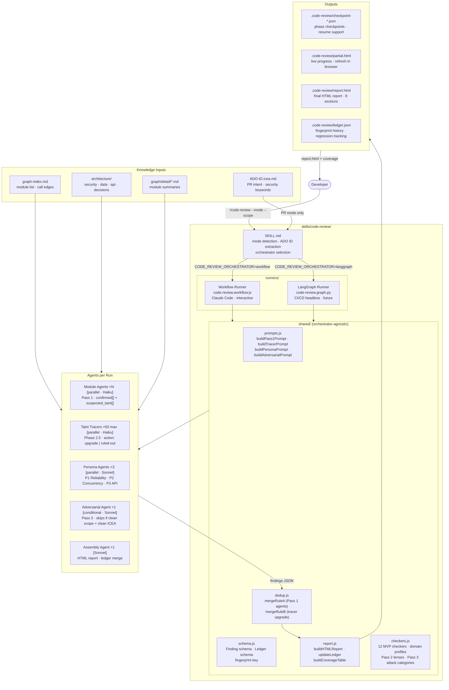
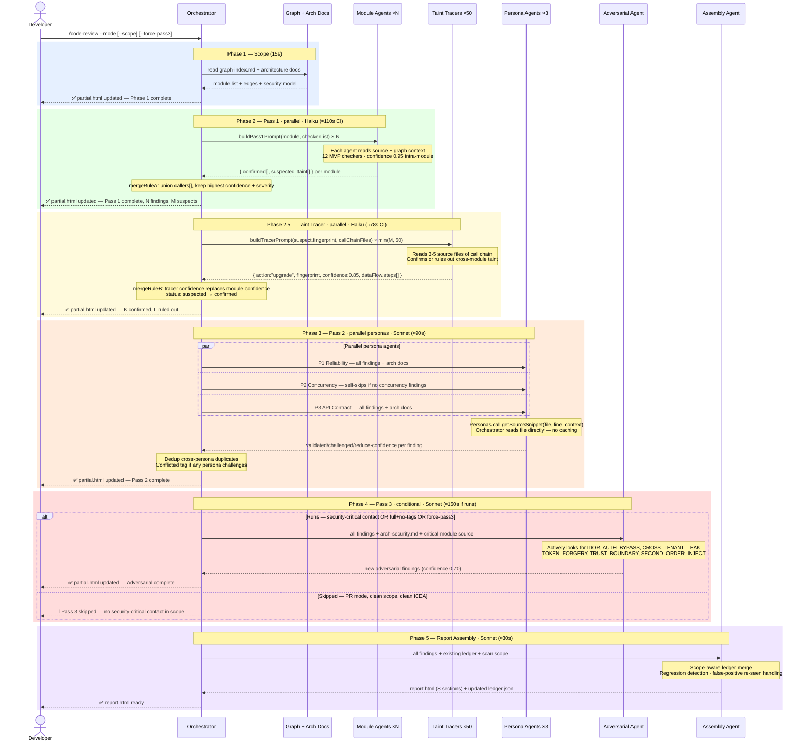

# Multi-Agent Code Review with Graph + Architecture Context

**Status:** Architectural spec — design review complete, all decisions resolved  
**Date:** 2026-07-16  
**Implementation:** Multi-agent Workflow (direct path — area-scoped single-agent approach abandoned)  
**Rationale:** Single-agent approaches miss vulnerabilities due to context window exhaustion. Multi-agent is required for comprehensive coverage.

---

## Problem Statement

Single-session code-review skill silently exhausts context window on large codebases (300+ files). No error, no guidance — developer sees frozen session.

Root cause: A single Claude session cannot hold hundreds of source files + three-pass analysis.

---

## Solution Overview

Multi-agent Workflow orchestrator that fans out per-module agents in parallel. Each agent receives:
- Its module's source files (~20K tokens)
- Graph-index.md + architecture docs (~12K tokens)
- Module detail files for dependencies (~2K tokens)

Total per agent: ~35K tokens — well within Haiku's window. No context exhaustion.

---

## End-to-End Architecture Diagram



---

## Sequence Diagram — Full Run Flow



---

## Architecture

### Module Definition

A module = one project file (.csproj/.vsproj for .NET, pom.xml for Java,
package.json for Node.js). graph-index.md identifies each module:

  moduleId:   "UserService"            # logical name
  sourceRoot: "src/UserService"        # root directory
  files:      ["Service.cs", "Dto.cs"] # source files in this module

Module agent receives: all files under sourceRoot + dependency detail files.
If a module has >100 files: graph-sync splits it by subdirectory; orchestrator
spawns sub-agents per subdirectory and merges their output before dedup.

---

```
Orchestrator
  ├── Phase 1 (Scope)
  │     Read graph-index.md → module list + edges
  │     Read architecture docs → security model, data entities, component diagram
  │
  ├── Phase 2 (Pass 1) — [parallel] One agent per module
  │     Context package per agent (~35K tokens):
  │       graph-index.md + architecture docs + module detail + dep detail files + source
  │     Each agent outputs:
  │       confirmed[]       — intra-module findings (fingerprint assigned, with evidence)
  │       suspected_taint[] — cross-module paths (fingerprint pre-assigned by agent,
  │                           entry seen, sink unknown, confidence 0.30)
  │
  ├── Phase 2.5 (Taint Tracer) — [parallel] Upgrade agents for suspected taints
  │     Cap: max 50 tracer agents per run
  │       If >50 suspects: trace highest-confidence suspects first; log remainder
  │       with "deferred to --continue" in coverage report
  │     Orchestrator passes each suspected_taint.fingerprint to its tracer
  │     Each tracer gets: full source of the call chain files (3-5 files)
  │
  │     Chain length rules:
  │       ≤5 modules → trace all hops normally
  │       >5 modules → keep entry + sink + 3 nearest middle hops
  │                    mark finding as trace-incomplete in dataFlow
  │
  │     Edge cases:
  │       Missing graph edge → tracer returns "trace-incomplete"; finding stays
  │         suspected at confidence 0.30; shown as Candidate in report
  │       Tracer timeout (60s) → same as missing edge, no retry
  │
  │     Tracer output:
  │       { action: "upgrade", fingerprint: "FP-xxx", confidence: 0.85,
  │         dataFlow: { steps: [...] } }
  │       NOT a new finding — orchestrator updates the existing finding in-place
  │       Ruled-out → finding removed from confirmed[] entirely
  │
  ├── Deduplication (orchestrator — no agent)
  │     Fingerprint key: hash(file + function + line + checker) — NOT caller or moduleId
  │     Pass 1 merge (same finding, two callers):
  │       callers[] → union; confidence → keep highest; severity → keep highest
  │       evidence differs → tag "dedup-candidate", keep both
  │     Tracer upgrade (tracer vs. existing Pass 1 finding, same fingerprint):
  │       confidence → tracer value replaces module value unconditionally
  │       dataFlow.steps[] → populated by tracer; confirmed flags set
  │       status: "suspected" → status: "confirmed"
  │
  ├── Phase 3 (Pass 2) — [parallel] Persona agents (self-skipping)
  │     P1 Reliability, P2 Concurrency (self-skipping), P3 API Contract
  │     Run in PARALLEL — no data dependency between personas
  │     Input: aggregated confirmed findings + graph-index + arch docs
  │     P2 self-skip: reads findings; if no category:"concurrency" findings exist →
  │       exits with { decision: "not-applicable", reason: "no concurrency patterns" }
  │       (one short call; appears in coverage as "P2: not-applicable")
  │     Persona validation: call getSourceSnippet(file, line, context) on-demand
  │       context=5 (default): 10-line window for Pass 1 evidence verification
  │       context=25: 50-line window for P1/P3 (full method context needed)
  │       context=100: full class for P2 (must see all shared field declarations)
  │       Orchestrator reads file directly (Workflow has filesystem access)
  │       No caching — reads on-demand, files stable within a 20-min run
  │     Output: validated findings + additional findings (new discoveries)
  │     Dedup: orchestrator removes cross-persona duplicates after all complete
  │
  └── Phase 4 (Pass 3) — [single, mode-aware] Adversarial agent
  │     Unified skip logic (all modes):
  │       skipPass3 = true
  │       if full && securityCriticalList.isEmpty() → false  // unconfigured: run conservatively
  │       if scopedModules touch security-critical (direct or graph-neighbor) → false
  │       if pr && ICEA contains security keywords → false
  │       if pr && no ICEA found → false                     // conservative
  │       if pr && changed modules not in graph → false      // conservative
  │       if --force-pass3 → false
  │
  │     Effective: full scan always runs (all modules in scope hits the direct check).
  │     Skip is only meaningful on --pr with a clean scope + clean ICEA.
  │     Report note if skipped: "Pass 3 skipped — scope and ICEA found no security-critical changes"
  │     --force-pass3 always overrides; --skip-pass3 never exists
  │     Input: all confirmed findings (Pass 1+2)
  │          + architecture-security.md (trust model, versioned module list)
  │          + source of security-critical modules (5-15 files, ~50-70K tokens)
  │
  │     Agent goal (NOT "review the findings"):
  │       "You are a security researcher attempting to break this system.
  │        Do NOT review the findings list. Instead, actively look for:
  │        — Can I forge or replay credentials (TOKEN_FORGERY)?
  │        — Can I access data belonging to another user (CROSS_TENANT_LEAK)?
  │        — Can I escalate privileges via parameter manipulation (PRIVILEGE_ESC)?
  │        — Can I bypass auth checks via unexpected code paths (AUTH_BYPASS)?
  │        — Can I corrupt data through second-order injection (SECOND_ORDER_INJECT)?
  │        — Does untrusted data cross a trust boundary without sanitization (TRUST_BOUNDARY)?
  │        Use architecture-security.md as your threat model baseline.
  │        Use the source code to trace actual exploit paths — do not speculate."
  │
  └── Phase 5 (Report) — Assembly agent
        Input: all findings + existing ledger
        Output: HTML report + updated ledger (with merge semantics below)
```

---

## What the Graph Actually Provides

Graph detail files contain module-level summaries only — bounded context,
key files, dependency names, and design patterns. The schema explicitly
prohibits function signatures, code snippets, and full file listings.

What each module agent receives:
  ✅ Call chain: UserController → UserService → UserRepository (graph edges)
  ✅ Security intent: which inputs are untrusted (architecture-security.md)
  ✅ Layer responsibilities: which layer owns validation (architecture.md)
  ✅ Module purpose: bounded context + patterns (detail file)
  ❌ Parameters flowing between modules — not in graph
  ❌ Whether a specific method uses raw SQL — not in graph

Result: module agents flag SUSPECTED cross-module taints.
The taint-tracer phase (Phase 2.5) confirms or rules them out using
the actual source files of the 3-5 file call chain.

### Optional: Minimal Param Enrichment

`graph-sync --with-params` adds lightweight export info to detail files:
  name, parameter types (not full signatures), return type, brief note

~200 bytes per export. Requires staleness detection: graph-sync stamps a
source-hash per module; if hash changes, detail file is flagged [STALE]
and code-review warns "taint tracing may be unreliable for this module."

This is opt-in. Default detail files remain as-is.

---

## Findings Schema

### Finding (confirmed)
```json
{
  "id": "unique-id",
  "fingerprint": "FP-xxxxxxxx",
  "checker": "TAINTED_SQL",
  "category": "security",
  "severity": "Critical|High|Medium|Low",
  "confidence": 0.95,
  "file": "path/to/file.cs",
  "function": "UserService.SearchByName",
  "line": 42,
  "moduleId": "UserService",
  "callers": ["UserController", "ReportService"],
  "description": "...",
  "evidence": "raw.sql = $\"SELECT * WHERE name={name}\"",
  "remediation": "...",
  "pass": 1,
  "dataFlow": {
    "entry": "UserController.GetUser(userInput)",
    "sink": "UserRepository.Search(name)",
    "steps": [
      { "module": "UserController", "confirmed": true },
      { "module": "UserService", "confirmed": true },
      { "module": "UserRepository", "confirmed": true }
    ]
  },
  "personaReviewStatus": {
    "P1": "validated | challenged | not-applicable | conflicted",
    "P2": "validated | skipped | not-applicable | conflicted",
    "P3": "validated | challenged | not-applicable | conflicted"
  }
}
```

### Suspected Taint (from module agent, pre-tracer — internal only, not in ledger)
```json
{
  "fingerprint": "FP-xxxxxxxx",
  "entry_file": "UserController.cs",
  "entry_function": "GetUser",
  "entry_param": "id",
  "call_chain": ["UserController", "UserService", "UserRepository"],
  "suspected_sink": "sql | html | cmd | file",
  "confidence": 0.30
}
```

### Fingerprint Key
`hash(file + ":" + function + ":" + line + ":" + checker)` — NOT keyed on moduleId or caller.

### Merge Rule A — Pass 1 agents (same finding, different callers)
```
callers[]   → union of all caller lists (deduplicated Set)
confidence  → keep HIGHEST (0.30 from A, 0.30 from B → 0.30)
severity    → keep HIGHEST (High beats Medium)
evidence    → if snippets differ → tag "dedup-candidate", keep both
```

### Merge Rule B — Tracer upgrade (tracer output vs. existing Pass 1 finding)
```
confidence  → tracer value REPLACES module value unconditionally (0.85 > 0.30)
dataFlow    → populated from tracer (confirmed flags per step)
status      → "suspected" → "confirmed"
Applies only when action: "upgrade" and fingerprint matches existing finding.
```

### Confidence Defaults by Source
```
Intra-module (Pass 1, direct source evidence):  0.95
Cross-module taint (tracer-confirmed):           0.85
Cross-module taint (graph-inferred, no tracer):  0.30
Pass 2 persona new finding (has source snippet): 0.80
Pass 3 adversarial new finding (architectural):  0.70
```

### Persona Confidence Adjustment
Personas can REDUCE confidence of inherited findings:
```
{ action: "reduce-confidence", fingerprint: "FP-xxx",
  newConfidence: 0.65, reason: "evidence weaker than reported" }
```
Personas CANNOT increase confidence of inherited findings (only tracer upgrades).

---

## Implementation Sketch

### 1. `skills/code-review/code-review.workflow.js`

Orchestration script using Claude Code's Workflow tool:

```javascript
export const meta = {
  name: 'code-review',
  description: 'Multi-agent SAST code review',
  phases: [
    { title: 'Scope', detail: 'Read graph, detect modules' },
    { title: 'Pass 1', detail: 'Parallel per-module analysis' },
    { title: 'Pass 2', detail: 'Specialist persona reviews' },
    { title: 'Pass 3', detail: 'Adversarial analysis' },
    { title: 'Report', detail: 'Assemble findings, update ledger' },
  ],
}

const FINDINGS_SCHEMA = { /* findings JSON structure */ }

phase('Scope')
const modules = await agent('Read graph-index.md and list all modules with their dependencies')

phase('Pass 1')
const pass1 = await parallel(
  modules.map(mod => () => 
    agent(buildPass1Prompt(mod), { 
      schema: FINDINGS_SCHEMA,
      label: `pass1:${mod.name}`
    })
  )
)

const deduped = dedup(pass1.filter(Boolean).flatMap(r => r.findings))

phase('Pass 2')
const p1 = await agent('P1 Reliability Engineer reviews findings', { schema: FINDINGS_SCHEMA })
const p2 = await agent('P2 Concurrency Specialist reviews findings', { schema: FINDINGS_SCHEMA })
const p3 = await agent('P3 API Contract Reviewer reviews findings', { schema: FINDINGS_SCHEMA })

phase('Pass 3')
const p3_findings = await agent('Adversarial analysis', { schema: FINDINGS_SCHEMA })

phase('Report')
await agent('Assemble HTML report, update ledger')
```

### 2. Updated `skills/code-review/SKILL.md`

Thin wrapper that:
1. Checks graph-index.md exists (if not: `run /graph-sync first`)
2. Resolves scope flag
3. Invokes the Workflow tool

All checker instructions, persona definitions, output formats move into workflow script prompts.

---

## Checker Taxonomy

Pass 1 module agents analyze for a defined set of checkers. Pass 2 personas review
through distinct lenses. Pass 3 adversarial agent looks for attack patterns.

**This is an MVP set — general-purpose across stacks. Expand based on domain risk
assessment (e.g., add LDAP_INJECT, XXE, UNSAFE_DESERIALIZE for .NET, NoSQL_INJECT
for document stores). The taxonomy is extensible; starting minimal is intentional.**

### Pass 1 — Per-Module Rule-Based Checkers (12 checkers — MVP, stack-agnostic)

| Checker ID | What it finds |
|---|---|
| TAINTED_SQL | Unsanitized user input reaches SQL query |
| TAINTED_HTML | Unsanitized input reaches HTML output (XSS) |
| TAINTED_CMD | Unsanitized input reaches shell/process command |
| PATH_TRAVERSAL | File access with user-controlled path segments |
| CSRF | State-changing operation missing anti-forgery protection |
| HARDCODED_SECRET | API keys, passwords, tokens in source |
| NULL_DEREF | Dereferencing a potentially null reference |
| RESOURCE_LEAK | File/connection/stream not disposed on all paths |
| UNVALIDATED_REDIRECT | Redirect target from user input without validation |
| MISSING_AUTH_CHECK | Endpoint/function performs operation without auth |
| OVERLY_PERMISSIVE_CORS | CORS policy allows all origins (*) |
| SENSITIVE_DATA_LOG | PII or credentials written to logs |

Domain-specific checkers activate via `graph-sync --checkers=<profile>`:
  dotnet: UNSAFE_DESERIALIZE, XXE, LDAP_INJECT, WEAK_CRYPTO, TIMING_ATTACK
  java:   UNSAFE_DESERIALIZE, XXE, EL_INJECTION, SERIALIZATION_GADGET
  nodejs: PROTOTYPE_POLLUTION, EVAL_INJECT, REGEX_DOS

Eventually: extract to `skills/code-review/checkers.md` so the taxonomy grows
without modifying the architecture doc.

### Pass 2 — Persona Lenses (3 personas)

| Persona | Checks |
|---|---|
| P1 Reliability | Null paths, exception swallowing, resource cleanup on exception path, retry without backoff |
| P2 Concurrency | Shared mutable state without synchronization, TOCTOU, deadlock potential, async void |
| P3 API Contract | Missing input validation, wrong HTTP status codes, no rate limiting on sensitive ops |

P2 is self-skipping — runs, checks findings for concurrency patterns, exits if none found.

### Pass 3 — Adversarial Checkers (6 attack categories)

| Checker ID | What it finds |
|---|---|
| PRIVILEGE_ESC | Privilege escalation via parameter manipulation |
| AUTH_BYPASS | Auth bypass via unexpected code path |
| CROSS_TENANT_LEAK | Data belonging to one tenant visible to another |
| TRUST_BOUNDARY | Untrusted data crossing a trust zone without sanitization |
| TOKEN_FORGERY | JWT/session token forgery surface area |
| SECOND_ORDER_INJECT | Data stored then unsafely executed later |

Module agents receive the Pass 1 checker list in their prompt.
Persona agents receive their lens definition explicitly.
Adversarial agent receives the Pass 3 attack categories as its goal — not as a review checklist.

---

## Persona Validation — getSourceSnippet()

Personas request source evidence on-demand before validating or challenging any finding.
The orchestrator reads the file directly (Workflow has filesystem access). No caching.

### Context Sizes Per Persona

| Context | Size | Use case |
|---|---|---|
| `context=5` | 10-line window | Default — Pass 1 evidence verification (±5 lines around finding line) |
| `context=25` | 50-line window | P1 Reliability, P3 API Contract — full method context needed to see scope |
| `context=100` | Full class | P2 Concurrency — must see all shared field declarations + synchronization |

### Persona Workflow

1. Read aggregated findings JSON
2. For findings in their lens: request snippet if evidence is insufficient
3. **Validate:** confirm severity, confirm not false-positive, add context
4. **Challenge:** if evidence contradicts finding → mark `personaReviewStatus: "challenged"` with reason
5. **Reduce-confidence:** if evidence is weaker than reported → output `{ action: "reduce-confidence", newConfidence: X, reason: "..." }` (updates confidence field only, no conflict tag)

**Important:** Personas do NOT receive source files. They receive findings JSON only. If they need to verify a finding, they call getSourceSnippet() and the orchestrator reads the file in real-time.

---

## Ledger Merge Semantics

### Ledger Record — Extended
```json
{
  "id": "finding-id",
  "fingerprint": "FP-xxxxxxxx",
  "firstSeen": "2026-07-10",
  "lastSeen": "2026-07-16",
  "status": "active | fixed | accepted-risk | false-positive",
  "dismissalReason": "...",
  "remediationTicket": "ADO-NNN",
  "passHistory": [
    {
      "date": "2026-07-16",
      "found": true,
      "severity": "High",
      "modulesScanScope": ["UserService", "ReportService"]
    },
    {
      "date": "2026-07-10",
      "found": true,
      "severity": "High",
      "modulesScanScope": ["*"]
    }
  ]
}
```

### Merge Rules (assembly agent)
**New finding** (fingerprint not in ledger):
  → append with status: "active", firstSeen = today

**Existing finding** (fingerprint matches):
  → update lastSeen = today
  → append to passHistory (including this run's modulesScanScope)
  → if severity changed: flag for developer review

**Finding NOT in this run's output — scope-aware check:**
  IF finding.moduleId NOT IN this run's modulesScanScope:
    → "Out-of-scope — module not scanned this run" (NOT a regression alert)
  ELSE:
    → status stays "active"
    → emit: "Regression risk — {fingerprint} found before, not found now. Fixed or missed?"
    → do NOT auto-mark as fixed

**Finding with status "fixed" found again:**
  → status → "active"
  → emit: "Regression — {fingerprint} reintroduced"

**Finding with status "false-positive" found again:**
  → status stays "false-positive"
  → emit: "Re-seen — previously marked false-positive. Verify: still FP, or new code introduced similar pattern?"
  → do NOT auto-escalate to "active"

## Capability Boundaries

### What module agents can determine (intra-module, confidence: 0.95)
- SQL/HTML/CMD injection with direct evidence in source
- Null dereferences, resource leaks, missing auth checks
- Hardcoded secrets, sensitive data in logs

### What the taint tracer can determine (cross-module, confidence: 0.85)
- Whether untrusted input flows from entry to sink across module boundaries
- Whether intermediate modules sanitize or validate before passing data
- Complete event path with confirmed source evidence at each step

### What remains uncertain (graph-inferred, confidence: 0.30)
- Cross-module flows where graph edges are missing or imprecise
- Flows through interfaces with multiple implementations (polymorphic dispatch)
- Taint paths spanning >5 modules (tracer scope limited to 3-5 files)

`confidence` in every finding reflects which category it falls into.
Findings with confidence < 0.50 are surfaced as "Candidates" in the report,
not confirmed issues — so developers can triage rather than trust them blindly.

---

## Persona Disagreement and Conflict Resolution

When multiple personas review the same finding, they may disagree:
- P1 says "HIGH severity, valid"
- P2 says "MEDIUM severity, valid"
- P3 says "LOW severity, false positive"

**Resolution rule (most-conservative-wins):**
If any persona challenges a finding, it STAYS. Mark with `personaReviewStatus: "conflicted"`.
Conflicted findings appear in a separate "Conflicts & Escalations" section in the report,
showing which personas disagreed and what each said.

Only if ALL three personas mark a finding false-positive does it move to:
`status: "false-positive"` with all three reasons merged into dismissalReason.

## Resilience and Failure Handling

### Timeout Budgets (explicit)
```
Module agent:      120s per agent; one full retry; if retry fails: skip module
Persona agent:     90s per persona; no retry (mark findings "not-reviewed", continue)
Taint tracer:      60s per tracer agent; no retry (stays as suspected, confidence 0.30)
Adversarial agent: 180s; no retry (emit partial findings with "ADVERSARIAL INCOMPLETE" header)
Total orchestration: 20 min hard cap; emit partial report with "SCAN INCOMPLETE" header
```

### Failure Definition
A failure is:
- Timeout (agent didn't finish within budget)
- Schema error (agent returned invalid/non-schema JSON)
- Explicit error (agent returned an error message)
- NOT a failure: agent returned empty findings[] (valid — module had no issues)

### Fail-Fast Rules
- Per-phase: >30% of agents in any phase fail → abort that phase immediately
  (e.g., 50 module agents, 16 timeout → abort Pass 1)
- Cross-phase: >3 total failures across all phases → abort entire run
- Report on abort: emit findings from completed phases with "SCAN INCOMPLETE" header

### Module Agent Retry
Module agent timeout → Retry once at full scope (no splitting).
Splitting a module by file count breaks cross-file analysis — if A.cs calls B.cs
and they're split, taint analysis fails.
If retry fails: skip module, emit "Coverage gap — {module} not scanned"

### Phase Checkpoints — Incremental Report Generation

After each major phase completes, the orchestrator writes a checkpoint:

```
.code-review/checkpoint-scope.json      # Phase 1 — module list
.code-review/checkpoint-pass1.json      # Phase 2 — deduped Pass 1 findings
.code-review/checkpoint-tracer.json     # Phase 2.5 — tracer upgrades applied
.code-review/checkpoint-pass2.json      # Phase 3 — persona-validated findings
.code-review/checkpoint-pass3.json      # Phase 4 — adversarial additions
.code-review/report.html               # Phase 5 — final report
```

Checkpoint JSON format:
```json
{
  "phase": "pass1",
  "completedAt": "ISO-timestamp",
  "findingsCount": 42,
  "suspectCount": 18
}
```

After each checkpoint, rewrite `.code-review/partial.html`:
```
✅ Pass 1 complete — 42 findings, 18 taint suspects
✅ Pass 2.5 complete — 12 suspects confirmed, 6 ruled out
⏳ Pass 2: Persona review (3 running...)
⏳ Pass 3: Adversarial (queued)
```

Developer opens `partial.html` in browser and refreshes to see live progress.
Checkpoint JSON enables `--continue` to resume from the last completed phase on failure.

---

## Report Output Format

### HTML Report Sections (in order)
1. **Summary** — modules scanned, findings count, taint suspect coverage, personas completed
2. **Critical Findings** (severity: Critical, confidence ≥ 0.50)
3. **High Findings** (severity: High, confidence ≥ 0.50)
4. **Medium Findings** (severity: Medium, confidence ≥ 0.50)
5. **Candidates** (confidence < 0.50 — investigate manually)
6. **Conflicts & Escalations** (personaReviewStatus = "conflicted")
7. **Coverage & Gaps** (modules scanned, modules skipped, deferred suspects, fail-fast triggers)
8. **Ledger History** (first-seen, re-seen, status changes, regressions)

### Finding Card (sections 2-4)
Each finding displays:
- Severity (HIGH) + Confidence (0.85 — taint-traced)
- Location (file:line:function)
- Evidence (3-5 line code snippet)
- Callers (if cross-module finding)
- Remediation (if available)
- Persona reviews (P1: validated | P2: not-applicable | P3: conflicted)
- History (first-seen: 2026-07-10, seen in 4 runs, status: active)

### Candidate Finding (section 5)
🟡 CANDIDATE badge with low confidence, reason, and triage actions.

### Conflicted Finding (section 6)
🔴 CONFLICTED badge showing each persona's position and what they disagreed on.

### Performance Targets and Model Routing

Wall-clock estimates (concurrency cap: 16 on CI server, 6 on dev machine):

| Phase | Agents | Per-agent | CI wall-clock | Dev wall-clock |
|---|---|---|---|---|
| Phase 1 (Scope) | 1 | 15s | 15s | 15s |
| Phase 2 (Pass 1) | 50 | 35s (Haiku) | ~110s | ~290s |
| Phase 2.5 (Tracer) | ~50 | 25s (Haiku) | ~78s | ~210s |
| Phase 3 (Pass 2) | 3 | 90s (Sonnet) | ~90s | ~90s |
| Phase 4 (Pass 3) | 1 | 150s (Sonnet) | ~150s | ~150s |
| Phase 5 (Report) | 1 | 30s (Sonnet) | 30s | 30s |
| **Total** | | | **~8 min** | **~13 min** |

**Model routing (cost + speed):**
  Pass 1 module agents:  Haiku — fast, cheap, rule-based checkers
  Pass 2.5 tracer agents: Haiku — file reading + confirmation, no generation-heavy work
  Pass 2 personas:       Sonnet — nuanced validation, source reasoning
  Pass 3 adversarial:    Sonnet — attack path inference requires strong reasoning
  Report assembly:       Sonnet — HTML generation + ledger merge logic

**Targets:**
  20 modules:  ≤4 min (CI), ≤7 min (dev)  — sprint-scoped review
  50 modules:  ≤10 min (CI), ≤15 min (dev) — full feature branch review
  100 modules: exceeds 20-min cap → use --scope to limit per-run, --continue for remainder

## Orchestrator Architecture

### Decoupling Strategy

The orchestration logic is separated from the orchestrator implementation.
This enables swapping between Workflow (Claude Code, interactive) and LangGraph
(CI/CD, headless) without duplicating prompts, schema, or report logic.

```
skills/code-review/
  shared/
    prompts.js          # All agent prompts (Pass 1, tracer, personas, adversarial)
    schema.js           # Finding schema, fingerprint logic, merge rules
    dedup.js            # Fingerprint(), mergeRuleA(), mergeRuleB()
    report.js           # buildHTMLReport(), updateLedger(), coverage table
    checkers.js         # Checker taxonomy by pass and domain profiles
  runners/
    workflow/
      code-review.workflow.js   # Workflow runner — orchestrates via agent()
    langgraph/
      code-review.graph.py      # LangGraph runner (future) — parallel via Send()
```

### Orchestrator Selection

Environment variable: `CODE_REVIEW_ORCHESTRATOR=workflow|langgraph`
Or config file: `.claude/code-review-config.json` → `orchestrator: "workflow"`

SKILL.md detects the orchestrator and invokes the appropriate runner transparently.

### Security-Critical Modules Configuration

The `architecture-security.md` document includes a versioned list of security-critical modules
that triggers Pass 3 analysis and drives threat modeling.

### Format

```yaml
# In architecture-security.md
security-critical-modules:
  - path: src/auth/JwtMiddleware.cs
    since: "2026-06-15"
  - path: src/api/ApiGateway.cs
    since: "2026-06-15"
  - path: src/validation/InputValidator.cs
    since: "2026-07-10"    # newly added
```

### How graph-sync Populates This

- `graph-sync` reads `graph/detail/*.md` files looking for `security-critical: true` tag
- For each tagged module, adds an entry to `security-critical-modules` with `since: today`
- Never updates existing entries (preserves historical `since:` dates)
- Emits delta report: "Newly security-critical since last run: InputValidator.cs (added 2026-07-10)"
- Developer can manually add entries for code regions that don't map to modules (e.g., runtime config)

### Why Versioning

The `since:` field allows the report to flag when Pass 3 scope changed. If a critical module
is newly added, developers know "adversarial analysis now covers this module for the first time."

---

## What Must Not Change Between Orchestrators

The following are owned by `shared/` and must never be duplicated in either runner:
- Findings schema (all fields, types, constraints)
- Fingerprint key algorithm (`hash(file:function:line:checker)`)
- Merge Rule A (Pass 1 agent merge) and Rule B (tracer upgrade)
- Ledger format and all merge scenarios (new, existing, out-of-scope, regression, re-FP)
- Checker taxonomy (12 MVP + domain profiles)
- Report HTML section structure and finding card format
- Coverage tracking and gap reporting format
- Confidence defaults by source (0.95 / 0.85 / 0.30 / 0.80 / 0.70)

## Why This Approach

- **Eliminates context exhaustion** — no single agent sees the whole codebase
- **Preserves inter-procedural analysis** — graph + architecture docs provide cross-file context
- **Scales to 500+ files** — parallel per-module agents
- **Uses existing infrastructure** — graph-index.md, architecture docs, ledger deduplication already exist
- **Maintains findings format** — fingerprint-based dedup, same ledger structure
- **Orchestrator-agnostic** — prompts and schema live in `shared/`; either runner works with identical output

---

## Implementation Path

**Phase 1 (Now) — Multi-Agent Workflow**
- Extract orchestration-agnostic logic to `shared/` modules (prompts, schema, dedup, report, checkers)
- Implement Workflow runner (`code-review.workflow.js`) with 5-phase orchestration
- Run integration tests on fixture-based synthetic codebase
- Run evals on ground truth dataset to validate recall/precision

**Phase 2 (After Phase 1 stabilizes) — LangGraph for CI/CD**
- Implement LangGraph runner (`code-review.graph.py`) using same `shared/` modules
- Add checkpointing for resume-on-failure
- Deploy to CI/CD pipeline

**Rationale for multi-agent approach:**
- Single-agent approaches (area-scoped or otherwise) exhaust context window and miss vulnerabilities
- Parallel per-module agents + taint tracer + personas + adversarial = comprehensive coverage within token budgets
- Orchestrator-agnostic design (`shared/` modules) enables both interactive (Workflow) and headless (LangGraph) paths without duplication

---

## Design Decisions — All Resolved

| Decision | Resolution |
|---|---|
| Timeout-skip vs. regression | Skipped modules NOT in modulesScanScope — treated as "not scanned", never triggers regression alert |
| Module split (>100 files) | Pre-split at ingestion (graph-sync). Never split during timeout retry — splitting breaks cross-file taint. Slow modules skip entirely. |
| Adversarial pass skip | Unified logic all modes: skip only if scope has no security-critical contact (direct or graph-neighbor) AND ICEA is clean (PR only). Full scan always runs in practice (all modules in scope). Unconfigured codebase (no tags) always runs. `--force-pass3` overrides. |
| Persona reduce-confidence | Advisory only — updates confidence field, no conflict tag. Only `challenge` triggers "conflicted" |
| Phase checkpoints | Specified — checkpoint JSON after each phase + partial.html for live developer visibility |
| Tracer count baseline | ~1 suspect/module conservative; 2-3 aggressive (cap at 50, defer remainder to --continue) |

---

## Recommendations

**Checker taxonomy expansion:**
The 12 MVP checkers are general-purpose across stacks. Expand via domain profiles:
- `graph-sync --checkers=dotnet` — adds UNSAFE_DESERIALIZE, XXE, LDAP_INJECT, WEAK_CRYPTO, TIMING_ATTACK
- `graph-sync --checkers=java` — adds UNSAFE_DESERIALIZE, XXE, EL_INJECTION, SERIALIZATION_GADGET
- `graph-sync --checkers=nodejs` — adds PROTOTYPE_POLLUTION, EVAL_INJECT, REGEX_DOS

Eventually extract taxonomy to `skills/code-review/checkers.md` so it grows without modifying this architecture doc.

**Streaming / orchestration:**
The Workflow tool (Claude Code) does not support incremental agent output — `agent()` resolves only on completion. Two paths:
- **Interactive use (developer in Claude Code):** Keep Workflow; use phase checkpoints to write `partial.html` after each phase. Developer refreshes in browser.
- **CI/CD headless use:** Move orchestration to LangGraph (`docs/plans/langgraph-orchestrator.md`). True incremental output via `astream_events()`. Findings schema and ledger are orchestrator-agnostic.

Design the orchestration logic in `shared/` so either runner can be used without changing prompts or schema.

---

## Implementation Readiness Checklist

Verify before starting implementation:

**Infrastructure**
- [ ] `graph-index.md` schema defines `moduleId`, `sourceRoot`, `files[]`
- [ ] `architecture-security.md` schema includes `security-critical-modules:` list with `since:` dates
- [ ] `graph-sync` supports `--checkers=<profile>` flag for domain-specific checkers
- [ ] `.code-review/` output directory structure agreed and writable in CI

**Skill / Orchestrator**
- [ ] `SKILL.md` branch-name → ADO ID extraction logic defined
- [ ] `CODE_REVIEW_ORCHESTRATOR` env var read by SKILL.md; defaults to `workflow`
- [ ] `--scope`, `--continue`, `--force-pass3` flags defined
- [ ] Phase checkpoint write after each phase (`.code-review/checkpoint-*.json`)
- [ ] `partial.html` rewritten after each checkpoint

**Shared Modules**
- [ ] `shared/prompts.js` — interfaces for all 5 prompt builders
- [ ] `shared/schema.js` — finding schema + suspected taint schema + ledger schema
- [ ] `shared/dedup.js` — `fingerprint()`, `mergeRuleA()`, `mergeRuleB()`, collision detection
- [ ] `shared/report.js` — `buildHTMLReport()` (8 sections), `updateLedger()` (all 5 merge rules)
- [ ] `shared/checkers.js` — 12 MVP checkers + domain profiles + Pass 2 lenses + Pass 3 categories

**Spec Completeness**
- [ ] Architecture diagram renders correctly in Mermaid
- [ ] Sequence diagram renders correctly in Mermaid
- [ ] All confidence defaults documented (0.95 / 0.85 / 0.30 / 0.80 / 0.70)
- [ ] All merge rules specified (Rule A, Rule B, ledger new/existing/out-of-scope/regression/re-FP)
- [ ] Pass 3 unified skip logic specified with all conditions and edge cases
- [ ] Report format specifies all 8 sections + 4 finding card types
- [ ] Performance targets stated per mode (CI vs dev, 20 vs 50 modules)
- [ ] LangGraph future plan at `docs/plans/langgraph-orchestrator.md`

---

## Testing Strategy — Summary

The multi-agent system requires four distinct testing layers:

| Layer | What | How | When |
|---|---|---|---|
| **Unit tests** | Deterministic `shared/` modules (dedup, schema, ledger, report, skip-logic) | Jest — no LLM calls, pure functions | Every commit |
| **Integration** | Fixture-based LLM calls (3-module synthetic codebase with planted vulnerabilities) | Real Haiku calls, schema validation, ledger merge | Nightly |
| **Evals** | LLM quality (recall, precision, calibration) on ground truth dataset | ~25 eval entries per checker, LLM judge grades findings | Weekly + on prompt/model changes |
| **A/B tests** | Model routing (Haiku vs Sonnet) and prompt changes | Compare metrics, adopt if recall +5% and precision stays flat | Manual on config changes |

### Deterministic Code Under Unit Tests

- `fingerprint()` — SHA1 hash(file:function:line:checker)
- `mergeRuleA()` — Pass 1 agent merge (union callers, keep highest confidence/severity)
- `mergeRuleB()` — Tracer upgrade (tracer confidence replaces module confidence)
- All 5 ledger merge rules (new, existing, out-of-scope, regression, re-FP)
- Pass 3 skip truth table — all 7 conditions
- ADO ID extraction, security keyword extraction from ICEA

### What NOT to Test

- End-to-end regression tests per PR (too slow + non-deterministic) — use fixtures instead
- Snapshot tests for LLM output (output varies — always flaky) — assert structure + recall instead
- Full codebase runs in CI (reserve for scheduled evals) — run only fixtures in CI

### Full Testing Specification

See: **`docs/plans/multi-agent-code-review-testing.md`**

---

## References

- `skills/shared/graph-index-schema.md` — graph structure
- `skills/shared/graph-module-schema.md` — module detail file schema
- `.claude/architecture/` — 8 architecture docs
- Workflow tool (Claude Code) — parallel agent orchestration
- `docs/plans/langgraph-orchestrator.md` — CI/CD orchestrator (future)
- `docs/plans/multi-agent-code-review-testing.md` — comprehensive testing spec (unit, integration, evals, A/B)
