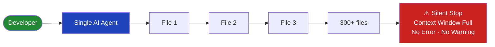
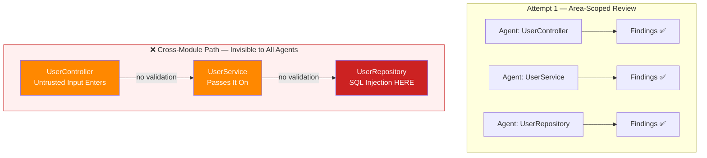
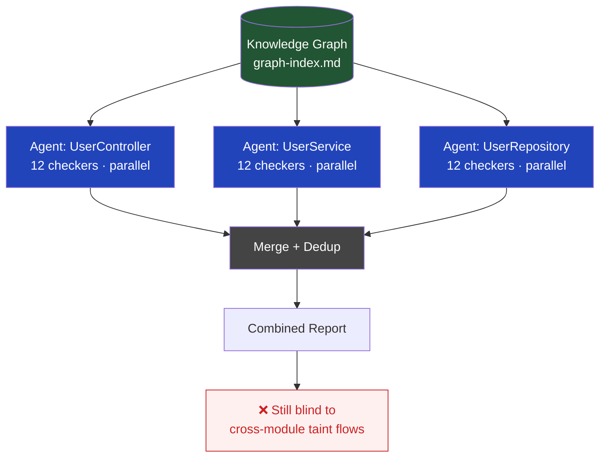
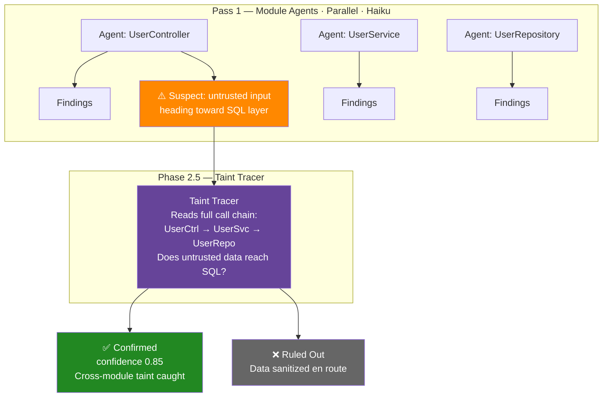
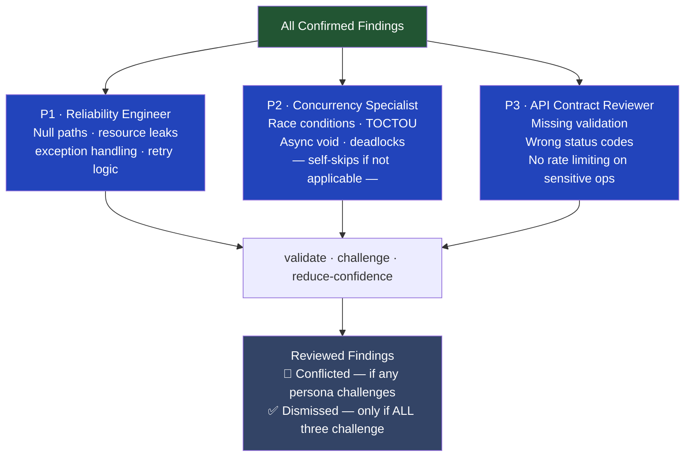
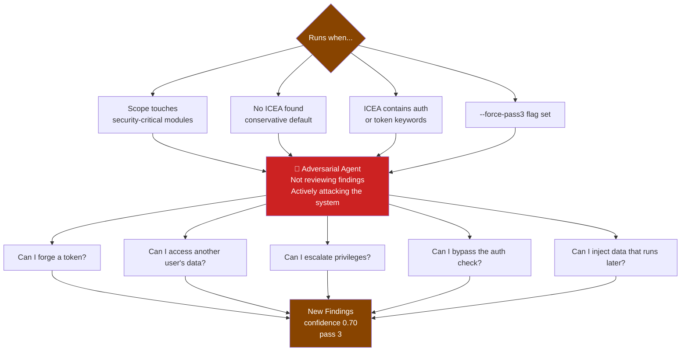
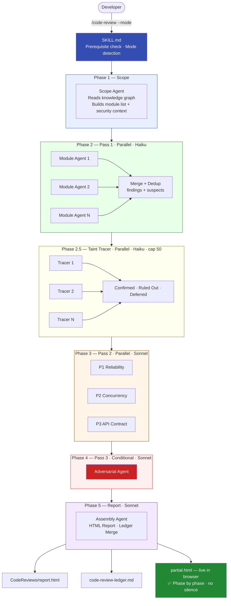

# The Frozen Screen That Started a Conspiracy
### *One Dev. No Team. Just 50 AI Agents and a Grudge.*

---

## Act 1 — The Silence

Twenty minutes.

I'm sitting there running a static code review. No notification. No error. No progress bar. Just a cursor blinking at me like it has nothing to say.

Is it scanning? Did it fail? Did it finish and I missed it?

I have no idea.

This is what was happening under the hood:

Static code review is supposed to be the safety net — the thing that catches what human eyes miss. The SQL injection buried three layers deep. The auth check missing on exactly the wrong endpoint. The hardcoded secret someone committed on a Tuesday and forgot about.

But a safety net with a hole you can't see is worse than no safety net. Because you trust it.

That twenty-minute nothing was the hole.

---

## Act 2 — The Wrong Fix

The obvious answer: scope it down. Give the AI less to read. Review one module at a time.

So I built it that way.

Then I tested it properly.

The most dangerous vulnerabilities don't live inside one module. They *travel*. A user types something into a form. It flows through a controller, into a service, down into a database query — and only at the very end does it become a SQL injection. If your reviewer only sees the controller, it sees data going out. If it only sees the database layer, it sees data arriving but has no idea it was ever untrusted.

The area-scoped approach had a blind spot exactly where blind spots are most dangerous — across module boundaries.

I scrapped it.

---

## Act 3 — The Real Question

I stopped asking *how do I make one reviewer smarter* and started asking *how would an expert actually do this?*

A senior security engineer doesn't read 500 files alone. They divide the work. Someone covers authentication. Another traces suspicious data flows. Someone else reviews API contracts. And then someone tries to actually break the system.

The context window was never the bug. It was a forcing function — pushing me toward the design that should have existed from the start.

---

## Act 4 — Building the Machine

### Step 1: Parallel Agents

What if instead of one AI reading everything, there were many — each reading a small slice, coordinated by something that sees the whole picture?

Better. No context exhaustion. Parallel. Fast.

But still missing something. Agents could see *within* their module. They still couldn't see *between* them.

---

### Step 2: The Taint Tracer

The agents needed a way to raise their hand — *"I saw something suspicious leave my module heading toward the database layer. I can't confirm it's dangerous. Someone should follow it."*

So I added Phase 2.5.

Now findings that crossed module boundaries could be confirmed — not just suspected.

---

### Step 3: The Specialist Personas

One finding can look different depending on who reviews it. A reliability engineer sees a resource leak. A concurrency specialist sees a race condition. An API reviewer sees a missing status code.

I added three specialist personas — running in parallel, each reading findings through a different lens.

---

### Step 4: The Adversary

The last piece was the hardest to design.

All previous passes were looking for known patterns. But the most dangerous vulnerabilities aren't always in a checklist. Sometimes you need someone who isn't reviewing — someone who is *attacking*.

---

## Act 5 — The Final Architecture

All five phases together:

---

## Act 6 — Arguing With Myself

Six rounds of self-critique. Sixty issues. Alone.

**What if an agent times out?**
Count the failures. Abort cleanly if too many fail. No partial results passed off as complete.

**What if the cache serves a stale vulnerable result after I fix the bug?**
Every module gets a content hash computed from its source. Code changes, hash changes, cache misses. Automatic.

**How do I know the scan actually finished and didn't silently abort?**
Don't check if the file exists. Check its modification timestamp. A stale file from an earlier run shouldn't count as success.

**What about cross-module fingerprints — how do you track the same vulnerability across two files?**
The entry-side module assigns the fingerprint before knowing where the data lands. The tracer inherits it. The ledger sees one stable identity, not a new entry every time.

Every round the design got tighter. Every question made it more honest about what it knew and what it didn't.

---

## Act 7 — What Got Built

A 1,300-line design. An 800-line orchestration script. A four-layer testing strategy. One person.

But the real thing that got built isn't the code.

It's the answer to *what now?*

Now the scan runs in phases. You watch it happen — module by module, phase by phase, live in your browser. Findings traced across module boundaries. Specialists validating each other's work. An adversary looking for what the others missed.

No silence. No guessing. Nothing quietly quits halfway through and lets you believe you're safe.

The screen has something to say now.

---

*What silent failure in your stack are you trusting too much?*
