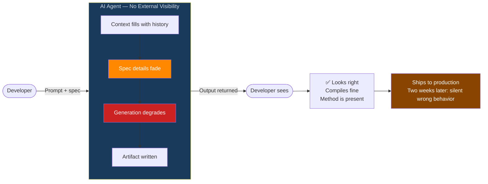
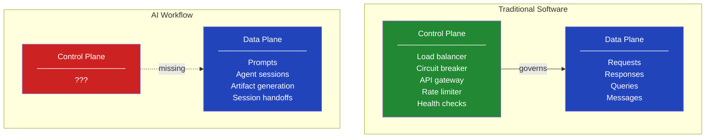
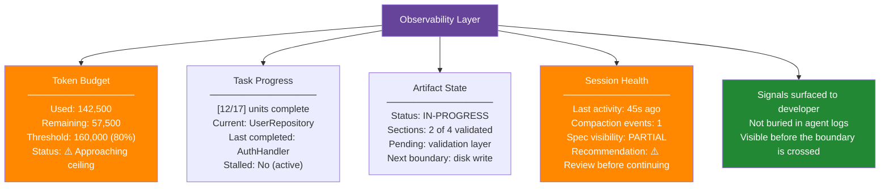
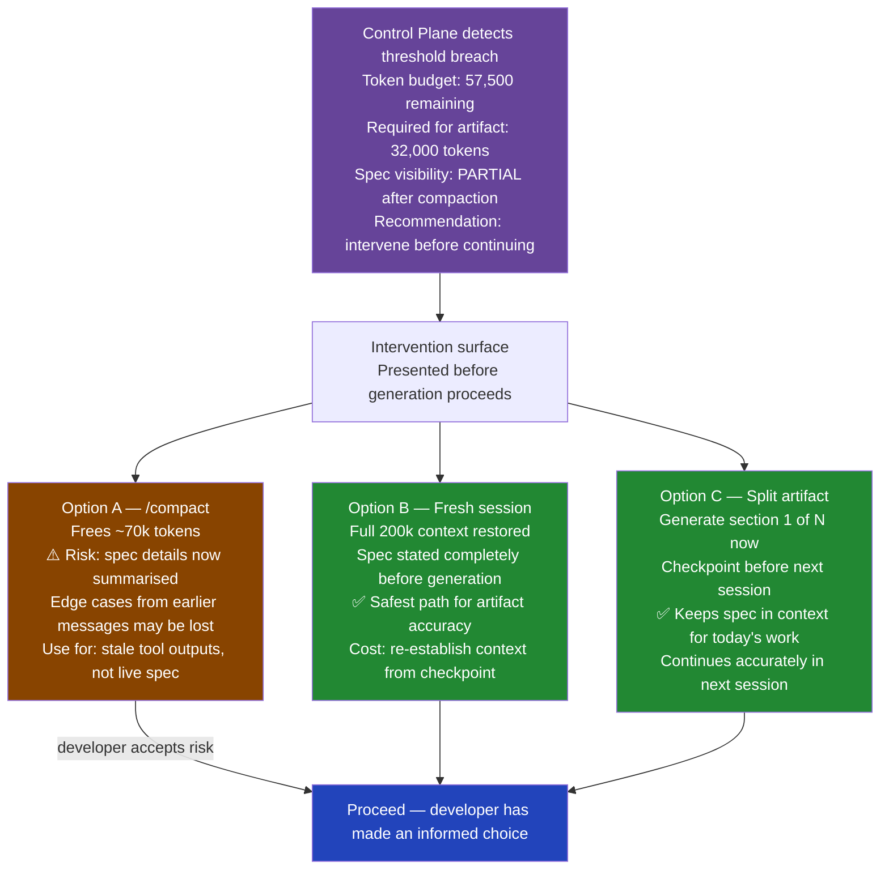
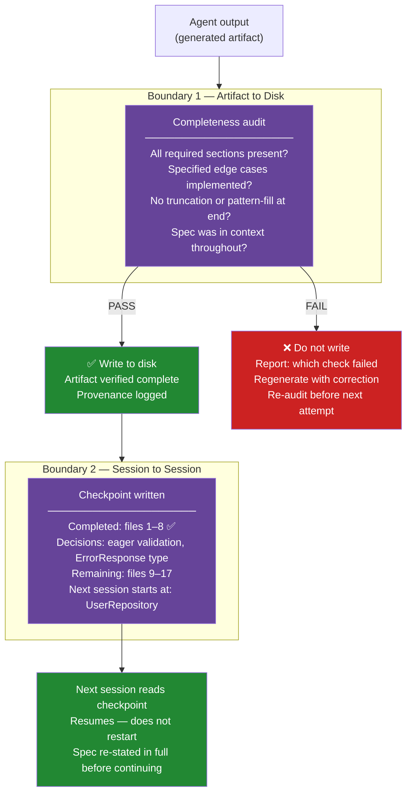
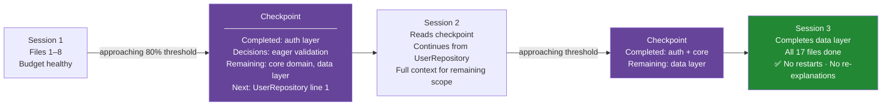
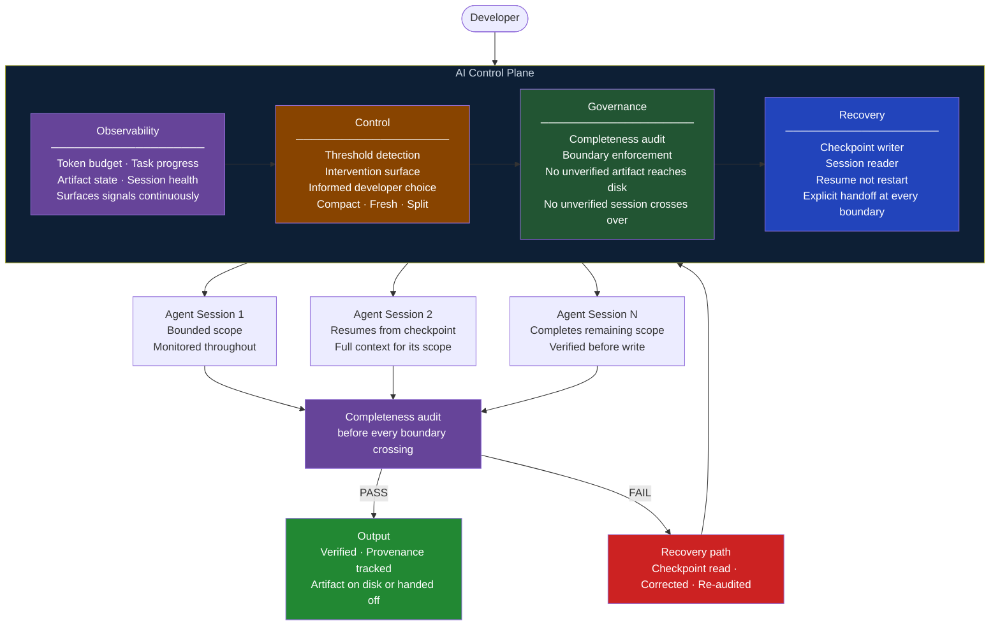

# The Control Plane You Never Built

**AI Agent Architecture · Observability · Control · Governance · Recovery**

*You deployed the AI. You trusted the output. You had no idea what was happening between those two events.*

---

## The Black Box

> **`?`**
>
> The agent was running. That's all I actually knew. Input went in, output came out, and somewhere in middle the context quietly ran out, the spec faded from the view, and the validation logic got... *improvised*.
> 
> *I had no visibility into anything between **send** and **receive**.*  

The artifact looked fine. It compiled. The method was there, right name, right signature. So I trusted it and moved on, the way anyone busy would.

What I couldn't see was everything it wasn't doing. No check for negative amounts. No upper bound enforced. No audit log entry. None of that was missing from the file's structure — the structure was perfect. It was missing from the logic inside it, written from pattern instead of spec. Invisible, until a production edge case two weeks later made it very visible.

I checked the logs afterward. Agent completed. Output returned. File on disk, right where it should be. Not one of those facts told me what happened during generation — when the spec started slipping out of frame, when the model was writing the last sections off whatever scraps it could still see. The logs told me the job finished. They didn't tell me it worked. Those turned out to be two different sentences.

In any other system, we'd call this a monitoring gap. In AI workflows, we call it Tuesday.

The artifact wasn't the problem. Nothing was watching — that was the problem. I'd deployed a data plane and called it a system.

---

## What a Control Plane Actually Is

We've solved this before. Just not for AI.

Modern software runs on two planes. The data plane is where the work happens — requests served, queries run. The control plane sits above it, mostly invisible, watching and governing without being part of the work itself.

- The load balancer doesn't know what your users want. It just knows server 3 is limping and quietly routes around it. 
- The circuit breaker doesn't understand your business logic — it knows the downstream service is failing and stops the bleeding before it cascades. 
- The gateway doesn't care what your service does; it knows this request has a bad token and rejects it before anything else sees it.  

None of these care about the content of the work. They govern the conditions it happens under.

Every item in that control-plane column exists because something broke catastrophically without it. We took those lessons seriously and built the missing layer, then called the result production-ready.

Then we handed the AI a task and a context window and said: good luck out there. No circuit breaker. Nothing watching, nothing able to step in.

That's not a workflow. That's a hope wearing a progress bar.

So I built the missing layer — **four pillars**, in the order I discovered I was missing them, which was usually right after something broke.

---

## Pillar 1: Observability

I'd love to say I had a dashboard, watching the token budget creep up, catching compaction before it ate my spec. Better lighting, that version.

The truth: `/context`, which tells you roughly what's in the window — qualitative, no hard numbers — and a `usage` field buried in the API response, if you remember to look. That was the whole layer. One fuzzy snapshot, one number you had to go dig for.

What I didn't have, and this is the part that actually bit me: any sense of how much of my spec was still *visible* to the model by the time it wrote the validation layer. No signal the task was drifting. No way to tell "generated" apart from "generated after compaction already ate half the instructions."

All four signals here — budget, progress, artifact state, session health — are knowable. None were surfaced to me when it mattered. Observability was never about knowing what went wrong. It's about knowing it's *about* to, while there's still a window to act.

---

## Pillar 2: Control

Knowing the budget just crossed 80% is useful. It's a lot less useful if the only thing you can do about it is worry.
 
A real circuit breaker doesn't log the failure and call it a day — it stops sending requests. An observability layer with no lever attached is just an expensive, well-lit way to watch a fire, fully informed and completely useless.
 
So when the control plane flags a problem, the answer can't be "log it." It has to put a real choice in front of the developer, with the tradeoffs, before anything gets written that can't be unwritten.

The word doing all the work there is *informed*. The control plane can't make the call for you — it depends on things only you know. What it kills off is the option currently winning by default: no choice at all, generation just keeps going, and you find out it was wrong later, from someone else, at a worse time.
 
A circuit breaker that only logs the failure isn't a circuit breaker. It's a diary entry.

---

## Pillars 3 & 4: Governance and Recovery

### Governance — Nothing Crosses a Boundary Unverified

Here's what it feels like to cross a boundary unverified.   

The artifact's on disk, it compiles, tests pass on the happy path — you ship it. Two weeks later, a production edge case reveals the validation logic never existed. Not deleted. Never written. The spec had been compacted out of context before the model reached that section, and it filled the gap with pattern instead of your actual requirements. The artifact *looked* complete. It just wasn't.
 
Governance exists to stop that story. Not a courtesy check — a hard gate.

"It compiled" is not a governance check. "It was generated with the full spec still in context, and validated before anything got written" — that is. They sound close enough to fool you for two weeks.
 
### Recovery — Plan for Failure, Not Just Success

Most architectures are designed for success, because success is what you plan for — the artifact generates cleanly, the session ends without issue, the handoff is smooth. The recovery path is the one you skip because you genuinely don't expect to need it, right up until the moment you do.

And then you need it — because context exhausts mid-artifact, or compaction runs and compresses the spec detail that the next section depends on, or a section fails the governance gate and the question isn't whether to fix it but where to pick back up from. None of these are system crashes; they're just points where the session stopped, and the only question is whether you can continue from where it stopped or whether you're explaining everything from the beginning again.

The checkpoint gets written before the context fills up, not after — after is a nice idea and also useless — structured so a fresh session can read it cold and know what was decided, what's done, and where to pick the thread back up.

---

## The Complete Control Plane

All four pillars together — one layer, sitting above every AI agent session, governing everything that crosses a boundary.

Nothing reaches the output without passing through all four layers, which means the system can still fail — but when it does, it fails with a recovery path rather than a silent artifact. The developer always knows where things stand because the observability layer is always running, always has a choice when things go sideways because the control layer surfaces one, and never has to discover a broken artifact in production because the governance layer won't let an unverified one reach disk. And when a session ends before the work is done, the next one picks up exactly where it left off because the recovery layer wrote it down.

I showed this to a colleague. She looked at it for a moment and said: "This is just software engineering." She was right. We'd just never thought to apply it to AI.

---

## Act 7 — Arguing With Myself

Five objections — all of them ones I raised myself before building this.

---

**This is a lot of infrastructure for a workflow that mostly works fine.**

I know, that's exactly what I said — and then I remembered that the corrupt artifact which compiled correctly and failed silently also "mostly worked fine," passing every test on the happy path. The control plane doesn't exist for the majority of sessions where nothing goes wrong; it exists for the minority where something does, and ensures that when it does, the failure is visible and recoverable rather than silent and trusted.

---

**The developer still has to make the intervention choices. Doesn't this just add friction?**

That was my second objection too, and what I realized is that the friction already exists — right now it shows up two weeks later in production, with no context about what went wrong or where. The control plane moves that friction earlier, when it's cheap and when you have actual information about what you're choosing. What it eliminates is the option that currently dominates: no choice, no surface, generation continues, artifact writes, problem discovered downstream.

---

**What about small tasks where context exhaustion will never happen?**

For small tasks, the control plane is lightweight by design — the budget check passes trivially, the completeness audit takes seconds, the checkpoint is a paragraph — because the overhead scales with risk, not with task size, and the system is built to get out of your way when it doesn't need to be in it.

---

**Checkpointing adds state to manage across sessions. That's complexity.**

Here's the thing: you already have state across sessions — it's just implicit right now, living in the conversation history the model compressed, in the decisions you vaguely remember making, in the context you'll need to re-explain when you start again tomorrow. The checkpoint makes that implicit state explicit, and explicit state is manageable while implicit state is why the validation layer got approximated and nobody noticed for two weeks.

---

**How is this different from just being more careful?**

Being more careful is a habit, and a control plane is a system, and the difference is that habits degrade under pressure, time constraints, context switches, and the very human tendency to trust a result that looks right — while systems don't forget to run the completeness audit because it's late, and don't skip the checkpoint because the session is almost done anyway.

---

## Act 8 — What the Layer Changes

| | |
|---|---|
| **4** | Pillars: Observability · Control · Governance · Recovery |
| **0** | Artifacts reaching disk without a completeness audit |
| **0** | Sessions resuming without reading a checkpoint |
| **1** | Question before every generation: what does the observability layer say? |
| **∞** | Gap between "it compiled" and "it was verified" |

The control plane doesn't make the AI smarter. It makes the AI's work verifiable — before it crosses a boundary, before it reaches disk, before it's relied on by code that assumes it's correct.

The corrupt artifact was not a bug in the model, which did exactly what it was trained to do: produce a coherent response from the context it had. The failure was in the layer above it — or rather, in the absence of that layer — because there was no observability to surface the degrading context, no control to offer an intervention before the boundary, no governance to catch the incomplete output before it was written, and no recovery to resume from a known-good state. The model was blameless. The architecture wasn't.

> **Every AI workflow has a data plane.** The work happens somewhere. What most AI workflows don't have is the layer that watches, intervenes, validates, and recovers. Without it, you're trusting the output because it looks right — not because anything verified it was.
>
> *What does your AI control plane look like — and if you don't have one, what are you trusting instead?*

---

*AI Agent Architecture · Observability · Control · Governance · Recovery · 2026*
