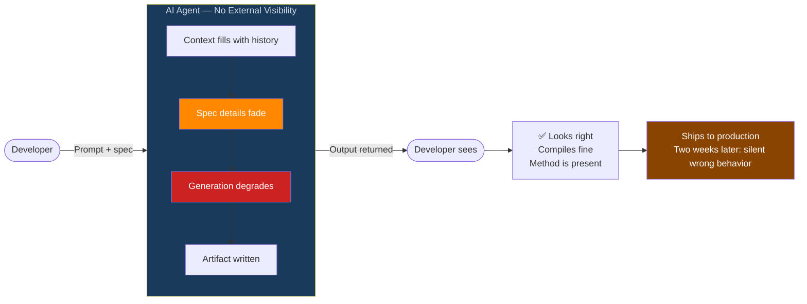
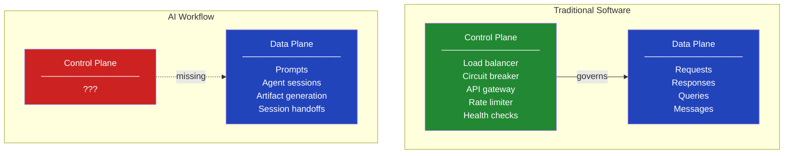
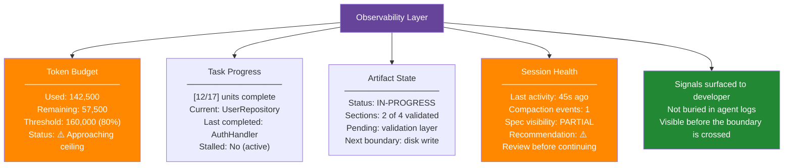
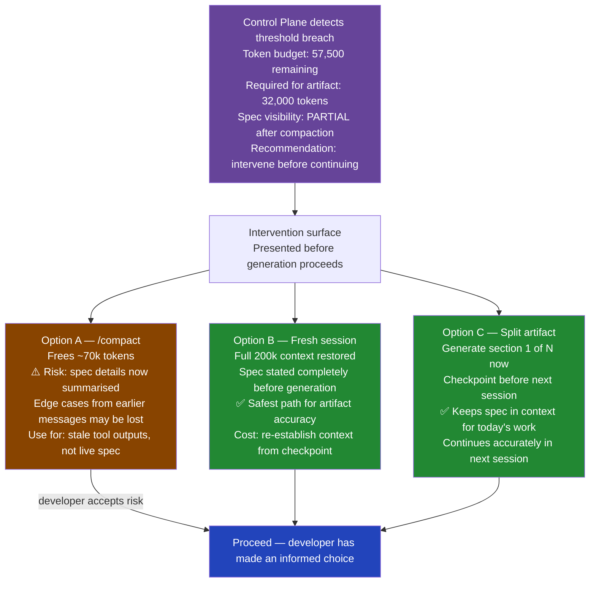
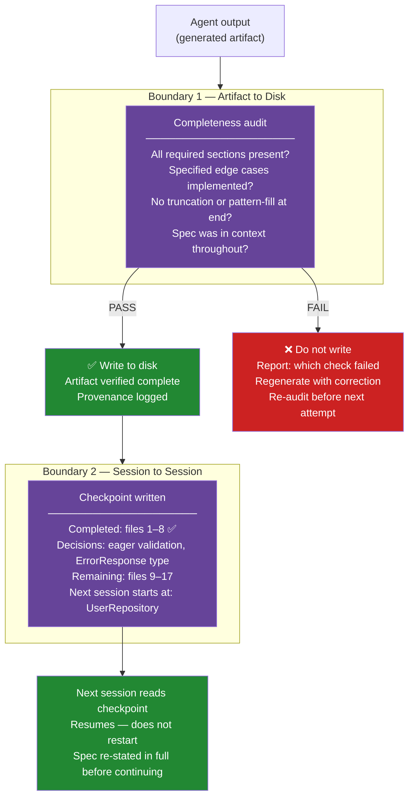
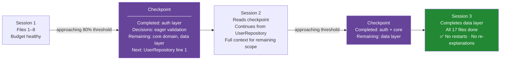
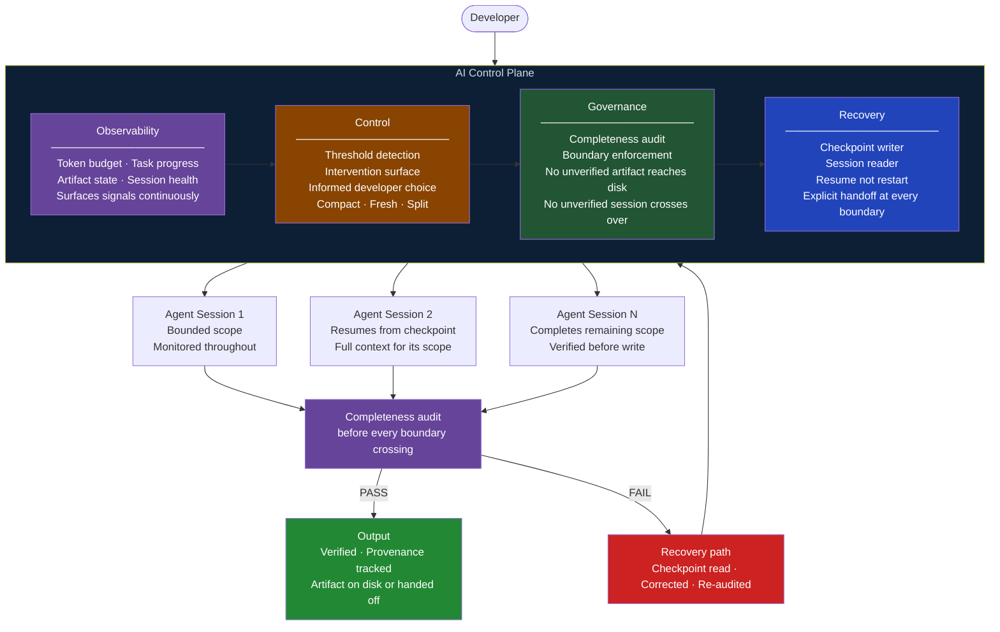

# The Control Plane You Never Built

**AI Agent Architecture · Observability · Control · Governance · Recovery**

*You deployed the AI. You trusted the output. You had no idea what was happening between those two events.*

---

## The Black Box

> **`?`**
>
> The agent was running. That's all I actually knew. Input went in, output came out, and somewhere in middle the context quietly ran out, the spec faded from the view, and the validation logic got... *improvised*.
> 
> *I had no visibility into anything between **send** and **receive**.*  

The artifact looked right — compiled, loaded, method present with the correct name and signature — and because it looked right, I trusted it. What it wasn't doing was harder to see: no validation of negative amounts, no enforcement of the upper bound, no audit log entry. None of that was missing from the file's structure; it was missing from the logic inside it, written from pattern rather than specification, invisible until a production edge case two weeks later made the absence extremely visible.

I went back looking for what had gone wrong, and I found exactly what you'd expect from a system with no instrumentation: the logs told me the job finished, the output was returned, the file was on disk — none of which told me anything about what had happened *during* generation, when the context was filling, when the spec was fading, when the last sections were being written from whatever the model could still see of my instructions versus what I had actually specified. The logs confirmed completion. They said nothing about correctness.

In any other system, we'd call this a monitoring gap. In AI workflows, we call it normal.

The problem wasn't the artifact — it was that I had no layer watching, nothing between me and the agent that could see what was happening and tell me about it. I had deployed a data plane and called it a system, and once I had that framing, I couldn't unsee it.

---

## Act 2 — What a Control Plane Actually Is

We've solved this problem before — just not for AI.

Think about how a modern software system actually runs in production. There are two distinct planes:
The **data plane**, where the work happens — requests get served, queries execute, messages flow.
The **control plane**, the layer that watches and governs everything the data plane does without being part of it.
> - The load balancer doesn't know what your users are asking for; it just knows server 3 is slower than the others and routes traffic away before users notice.
> - The circuit breaker doesn't understand the business logic; it just knows the downstream service is failing and stops sending requests before the cascade drags everything else down with it.
> - The API gateway doesn't know what your service does; it just knows this request doesn't have a valid token and rejects it before anything else sees it.

Rate limiters, health checks, orchestrators — none of them care about the content of the work. They govern the *conditions* under which the work proceeds.

Every element in that control plane column exists because something went catastrophically wrong without it — a cascade failure, a runaway process, a corrupt response that downstream systems trusted because nothing intercepted it. We learned those lessons, absorbed those incident postmortems, built those layers, and called the result production-ready software.

Then we gave the AI a task and a context window and said good luck — no circuit breaker to catch a failing session, no health check to surface a degraded context, no layer of any kind that could see what the agent was doing and intervene when it was going wrong.

That's not a workflow. That's a hope with a progress indicator.

So I built the missing layer — four pillars, in order of how badly I needed each one.

---

## Act 3 — Pillar 1: Observability

I want to tell you I had a dashboard.

I want to tell you I watched the session in real time, saw the token budget approaching the threshold, noticed when compaction had compressed the spec details I needed, and caught the problem before the artifact was written. That would make a much more satisfying story.

I had none of that.

What I had was `/context` — a command that tells you the *composition* of what's in the context window: how much is conversation history, how much is loaded files, how much is tool outputs. Qualitative, no token counts. And the Anthropic API's `usage` field in each response, which gives you exact numbers per call if you remember to look for them and if you're reading raw API responses rather than a polished UI that abstracts them away. That's the observability layer I was working with: one qualitative snapshot and one number buried in an API response.

What I didn't have was any signal about how much of my original spec was still visible to the model by the time it was generating the validation layer — no indication of whether the task was making the progress I thought it was, no readout of what state the artifact was actually in, not "generated" versus "not generated" but "generated with full spec in context" versus "generated from whatever the model could reconstruct after compaction."

The four signals in that diagram — token budget, task progress, artifact state, session health — all of them are knowable, and none of them were being surfaced to me while they mattered. They existed scattered across API responses, manual commands, and conversation history the model had already compressed. The design target is a unified surface that collects all four continuously, visible while the work is happening, before any boundary is crossed.

Observability isn't about knowing what went wrong after the fact. It's about knowing it's about to go wrong while there's still time to do something.

---

## Act 4 — Pillar 2: Control

Knowing the budget is at 80% and the spec is partially compressed is useful information — it's significantly less useful if the only thing you can do with it is worry.

This is the mistake observability-only systems make: they give you a dashboard full of red signals and no levers. The circuit breaker in a traditional system doesn't just log that requests are failing; it stops sending them. The load balancer doesn't just observe high latency; it routes around it. An observability layer without an intervention layer is an expensive way to watch things go wrong in real time, fully informed and completely helpless.

When the control plane signals a problem — budget approaching the threshold, spec detail compressed by compaction, session health degraded — the response can't be "log an event." It has to be: surface a choice, show the tradeoffs, let the developer make an informed decision before the boundary is crossed.

The critical word in that diagram is *informed*. The control plane doesn't make the choice — the developer does, because the right answer depends on context only the developer has: how much time is available, how critical the spec precision is, whether the remaining scope can wait for a fresh session. What the control plane eliminates is the option that currently dominates: no choice at all, no surface, no signal — generation continues, the artifact writes, and the problem is discovered in production.

A circuit breaker that only logs the failure isn't a circuit breaker. It's an expensive log file.

---

## Act 5 — Pillars 3 & 4: Governance and Recovery

### Governance — Nothing Crosses a Boundary Unverified

Here's what it feels like to cross a boundary unverified.

The artifact is on disk and you open it, and the method is there — the name is right, the signature is correct, the structure looks exactly like what you specified. The implementation compiles, the tests pass on the happy path, and you ship it. Two weeks later, in a production edge case, you discover that the validation logic — the part that was supposed to check negative amounts, enforce the upper bound, log the audit entry — wasn't there, not deleted but never generated, because the spec had been compacted out of the context before that section was written and the model filled it in from pattern rather than specification. The artifact looked complete and was structurally complete; the contract it was supposed to enforce just wasn't in it.

Governance is the answer to that — not as a courtesy check, but as a hard gate that the artifact must pass before it crosses the boundary.

*"It compiled"* is not a governance check. *"It was generated with the full spec in context and validated before write"* is.

### Recovery — Plan for Failure, Not Just Success

Most architectures are designed for success, because success is what you plan for — the artifact generates cleanly, the session ends without issue, the handoff is smooth. The recovery path is the one you skip because you genuinely don't expect to need it, right up until the moment you do.

And then you need it — because context exhausts mid-artifact, or compaction runs and compresses the spec detail that the next section depends on, or a section fails the governance gate and the question isn't whether to fix it but where to pick back up from. None of these are system crashes; they're just points where the session stopped, and the only question is whether you can continue from where it stopped or whether you're explaining everything from the beginning again.

The checkpoint is written before the context fills — not after, which is too late — structured so a fresh session can read it and know exactly what was decided, what was completed, and where to begin. Recovery isn't about what you do when it goes wrong. It's about whether you need to explain everything from the beginning when it does.

---

## Act 6 — The Complete Control Plane

All four pillars together — one layer, sitting above every AI agent session, governing everything that crosses a boundary.

Nothing reaches the output without passing through all four layers, which means the system can still fail — but when it does, it fails with a recovery path rather than a silent artifact. The developer always knows where things stand because the observability layer is always running, always has a choice when things go sideways because the control layer surfaces one, and never has to discover a broken artifact in production because the governance layer won't let an unverified one reach disk. And when a session ends before the work is done, the next one picks up exactly where it left off because the recovery layer wrote it down.

I showed this to a colleague. She looked at it for a moment and said: "This is just software engineering." She was right. We'd just never thought to apply it to AI.

---

## Act 7 — Arguing With Myself

Five objections — all of them ones I raised myself before building this.

---

**This is a lot of infrastructure for a workflow that mostly works fine.**

I know, that's exactly what I said — and then I remembered that the corrupt artifact which compiled correctly and failed silently also "mostly worked fine," passing every test on the happy path. The control plane doesn't exist for the majority of sessions where nothing goes wrong; it exists for the minority where something does, and ensures that when it does, the failure is visible and recoverable rather than silent and trusted.

---

**The developer still has to make the intervention choices. Doesn't this just add friction?**

That was my second objection too, and what I realized is that the friction already exists — right now it shows up two weeks later in production, with no context about what went wrong or where. The control plane moves that friction earlier, when it's cheap and when you have actual information about what you're choosing. What it eliminates is the option that currently dominates: no choice, no surface, generation continues, artifact writes, problem discovered downstream.

---

**What about small tasks where context exhaustion will never happen?**

For small tasks, the control plane is lightweight by design — the budget check passes trivially, the completeness audit takes seconds, the checkpoint is a paragraph — because the overhead scales with risk, not with task size, and the system is built to get out of your way when it doesn't need to be in it.

---

**Checkpointing adds state to manage across sessions. That's complexity.**

Here's the thing: you already have state across sessions — it's just implicit right now, living in the conversation history the model compressed, in the decisions you vaguely remember making, in the context you'll need to re-explain when you start again tomorrow. The checkpoint makes that implicit state explicit, and explicit state is manageable while implicit state is why the validation layer got approximated and nobody noticed for two weeks.

---

**How is this different from just being more careful?**

Being more careful is a habit, and a control plane is a system, and the difference is that habits degrade under pressure, time constraints, context switches, and the very human tendency to trust a result that looks right — while systems don't forget to run the completeness audit because it's late, and don't skip the checkpoint because the session is almost done anyway.

---

## Act 8 — What the Layer Changes

| | |
|---|---|
| **4** | Pillars: Observability · Control · Governance · Recovery |
| **0** | Artifacts reaching disk without a completeness audit |
| **0** | Sessions resuming without reading a checkpoint |
| **1** | Question before every generation: what does the observability layer say? |
| **∞** | Gap between "it compiled" and "it was verified" |

The control plane doesn't make the AI smarter. It makes the AI's work verifiable — before it crosses a boundary, before it reaches disk, before it's relied on by code that assumes it's correct.

The corrupt artifact was not a bug in the model, which did exactly what it was trained to do: produce a coherent response from the context it had. The failure was in the layer above it — or rather, in the absence of that layer — because there was no observability to surface the degrading context, no control to offer an intervention before the boundary, no governance to catch the incomplete output before it was written, and no recovery to resume from a known-good state. The model was blameless. The architecture wasn't.

> **Every AI workflow has a data plane.** The work happens somewhere. What most AI workflows don't have is the layer that watches, intervenes, validates, and recovers. Without it, you're trusting the output because it looks right — not because anything verified it was.
>
> *What does your AI control plane look like — and if you don't have one, what are you trusting instead?*

---

*AI Agent Architecture · Observability · Control · Governance · Recovery · 2026*
