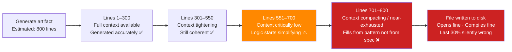
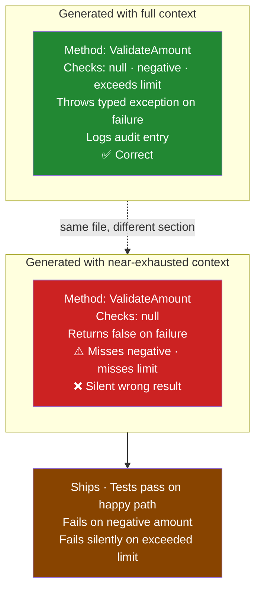
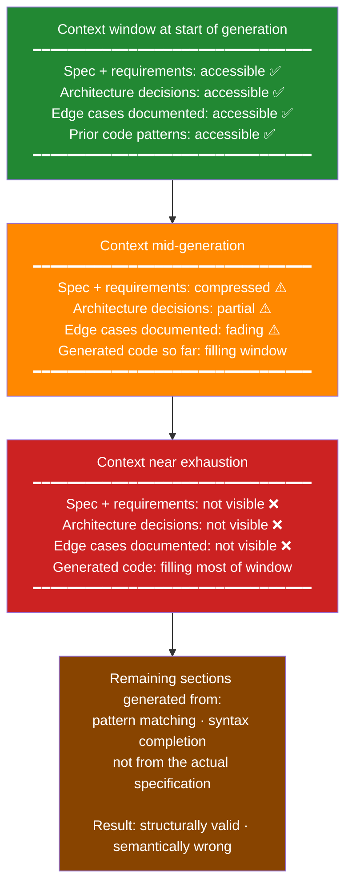
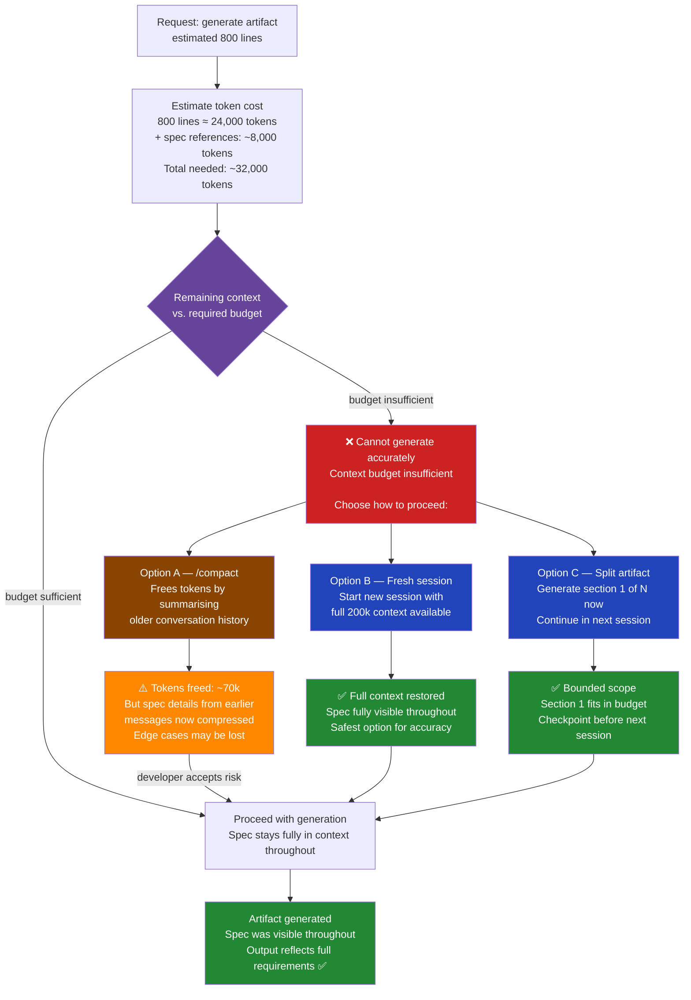
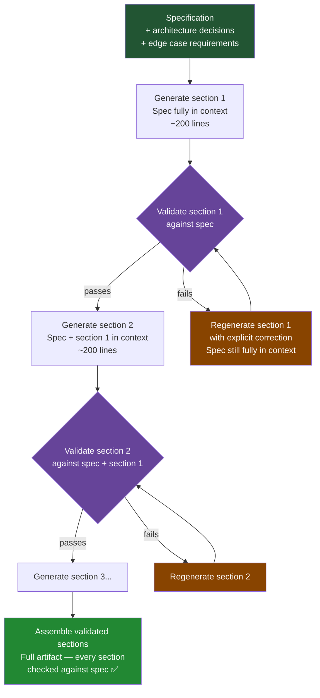
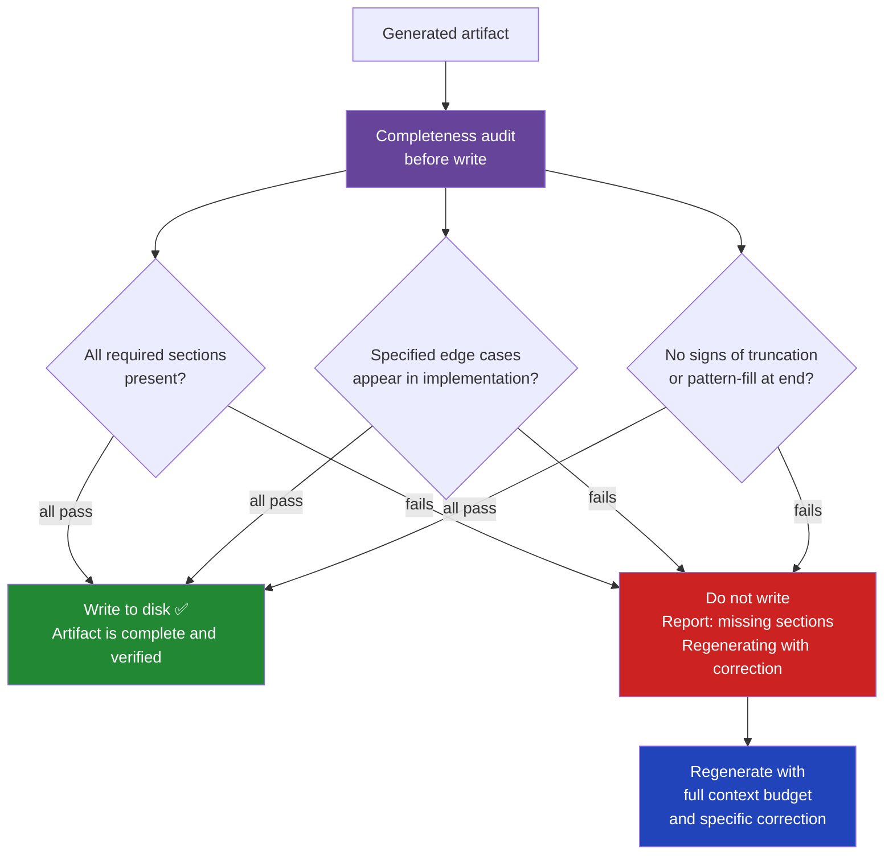
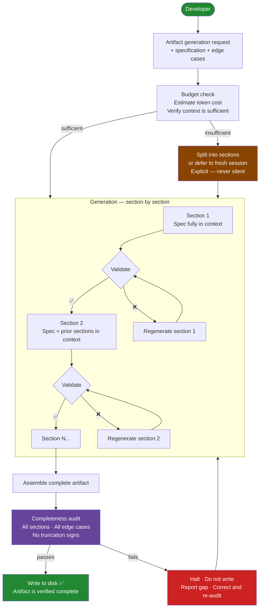

# The File That Looked Right

**AI Agent Architecture · Context Exhaustion & Artifact Corruption**

*It compiled. It loaded. It passed a quick glance. The last third of it was wrong.*

---

## Act 1 — The Artifact That Lied With Its Whole Chest

> **`✅`**
>
> The file was there. Correct name. Correct structure. Opened fine.\
> The methods were all present. The class closed properly.\
> I reviewed the top half, recognized the pattern, moved on.\
> \
> *The bottom third had been generated while the context was running out.\
> The logic was hollow. The validations were wrong. It compiled anyway.*

This is the failure mode that doesn't announce itself.

When an AI agent runs out of context mid-task, there are two versions of what you get back. In the first version, the task simply stops — the output ends early, something is visibly missing, and you know to look again. That version is annoying. This is not that version.

In the second version — the dangerous one — the agent keeps generating. It fills in the remaining sections of the file from pattern and habit rather than actual context. The structure stays intact. The syntax stays valid. The methods have the right names. But the implementation inside them has quietly become approximate, and "approximate" in a validation method, a permission check, or a migration script is another word for wrong.

The file was on disk. It looked right. And the only way to discover it wasn't was to run the thing in a scenario that exercised exactly the part that had quietly degraded — which, in my case, happened two weeks later in a production edge case.

---

## Act 2 — Why This Is Harder to Catch Than a Missing File

A missing file is a loud failure. The build breaks. The import fails. Something throws an exception at startup and points you at line one of a stack trace. You fix it in an hour.

A corrupted artifact is a quiet failure. The build succeeds. The import works. The method exists and returns a value. It just returns the wrong value under conditions that don't come up in the happy path.

The insidious part is how the degradation looks from the outside. The AI doesn't generate garbage when context runs out. It generates *plausible* content — the kind of thing that looks correct at a glance, matches the surrounding pattern, and only reveals itself as wrong when you push on it in exactly the right way. A validation function that returns `true` for inputs it should reject. A mapping function that handles four of five cases explicitly and quietly falls through on the fifth. A migration that runs and reports success and leaves two columns in their original state.

You can't review your way out of this with a quick scan. The method is there. The name is right. The signature is right. The test for `null` passes. The problem is what the test for `null` doesn't cover — and the AI didn't cover it either, because by the time it reached that method, it had forgotten what the spec said those edge cases were.

---

## Act 3 — What Happens Inside the Window

Context exhaustion during artifact generation has a specific shape. It's not a cliff — it's a slope. The model doesn't work perfectly and then suddenly produce garbage. It degrades gradually as the available context thins, and the degradation follows a predictable pattern.

Early in the file, the model has full access to the task specification, the existing code patterns, the architectural decisions, the edge cases documented in the requirements. The generated code reflects all of it.

As the context fills — with the system prompt, the conversation history, the code already generated — the model has progressively less room for the *specification* that motivated the generation. It knows what a method should look like from the patterns it's seen. It doesn't necessarily remember what *this* method was supposed to do differently.

This is what context compaction makes worse. When the session compacts — summarizing earlier conversation to free up space — the specification details that were in those earlier messages get reduced to a summary. The model keeps generating, but now it's working from a compressed version of what the task actually required. The sections generated after compaction are coherent. They're just not necessarily correct for *this* task.

---

## Act 4 — The Design That Prevents Corrupt Output

The solution is not "generate less." It's "never start generating what you can't finish accurately, and validate what you do generate before it touches disk."

Three things working together.

### Check the Budget Before You Begin

Before generating any artifact of significant size, check how much context remains and whether it's enough to generate the artifact accurately — including keeping the full specification in context throughout. If it isn't enough, say so explicitly and stop. Don't start what you can't finish accurately.

An explicit refusal is not a failure. A corrupt file is a failure. The refusal is the system working correctly.

**What's available today: `/context`**

Claude Code's `/context` command shows the *composition* of what's consuming context — conversation history, loaded files, tool outputs, loaded skills, CLAUDE.md. It doesn't give token counts, but it gives you enough to make a manual judgment before starting large generation:

| Signal from `/context` | What it means before generating |
|------------------------|----------------------------------|
| Conversation history: long | Spec details from earlier messages may already be compressed |
| Many files loaded | Significant token budget already consumed by file content |
| Large tool outputs in context | Consider `/compact` first to clear stale outputs |
| History is short, few files | Context is healthy — safe to proceed |

This is a qualitative check. It tells you *what* is consuming space, not *how much*. Run it before any large generation task as a manual gate — if the picture looks heavy, compact or start a fresh session before generating.

**The design target: quantitative budget check**

The table below shows what the check *should* look like with full instrumentation — the numbers that make the go/no-go decision precise rather than approximate:

| Metric | Value | Notes |
|--------|-------|-------|
| Context window (total) | 200,000 tokens | Model's hard ceiling |
| Tokens used so far | 142,500 tokens | System prompt + conversation + files read |
| **Remaining context** | **57,500 tokens** | Available for new generation |
| Artifact size estimate | 24,000 tokens | ~800 lines of code |
| Spec references required | 8,000 tokens | Must stay in context throughout generation |
| **Required budget** | **32,000 tokens** | Minimum to generate accurately |
| **Status** | **✅ Safe to generate** | Remaining (57,500) > Required (32,000) |

Today those numbers aren't directly surfaced in Claude Code. The closest you can get live is `/context` for composition and the Anthropic API's `usage` field in each response for exact counts — both useful signals, neither a ready-made dashboard. The live quantitative budget check is the design goal, not today's reality.

**What compaction changes — and what it doesn't**

When the session compacts — Claude summarizing earlier conversation to free space — the budget picture shifts:

| | Before compact | After compact | Net |
|-|----------------|---------------|-----|
| Tokens used | 142,500 | 71,000 | **71,500 tokens recovered** |
| Remaining | 57,500 | 129,000 | Looks healthy again |
| Spec details | Fully in context | **Compressed to summary** | ⚠️ Key edge cases may be lost |

This is the compaction trap. The remaining context number improves — sometimes dramatically. But the tokens that were freed were the conversation history that carried the specification details, the edge cases, the architectural decisions discussed earlier in the session. The model now has more room and knows less precisely what it was supposed to build.

Running `/context` after compaction will show a lighter history. What it won't show is which specific requirements are now summarised rather than verbatim. Generation that proceeds after compaction is generation from a compressed map — more room to work, but working from a lossy copy of the original territory.

When validation fails, the developer gets three choices — and the choice matters more than it looks.

**Option A — `/compact`** is the fastest path. It frees significant tokens immediately, sometimes 60–70k at once, and the session continues without interruption. But compact works by summarising the older conversation — and that older conversation is almost certainly where the specification, the edge cases, and the architectural decisions were discussed. The context number goes up. The precision of what the model remembers goes down. Use it to clear stale tool outputs and stale file reads. Be cautious using it when the freed tokens were carrying the spec.

**Option B — Fresh session** is the safest path for accuracy. The full 200k context is available from the first token, the specification can be stated clearly and completely before generation begins, and nothing has been compressed. The cost is continuity: the developer needs to re-establish context for the new session. With a proper checkpoint from the current session — what was already done, what decisions were made, where to begin — that re-establishment is fast.

**Option C — Split the artifact** keeps the session alive and generates what fits now, leaving the rest for the next session with a clear handoff. This is the right choice when the artifact is large but the current session still has the spec fully in context — generate what fits accurately, checkpoint, continue fresh rather than compact and risk losing the details that make the rest of it correct.

### Generate in Sections, Validate Between Them

For artifacts too large to generate in one pass, the answer is not to generate them whole and hope. It's to generate section by section, with an explicit validation step between each section: does this section match the specification for this section? Does it make consistent decisions with the sections already generated? Are the edge cases present?

Each section is small enough that the full specification stays visible throughout its generation. The validation step catches drift before it accumulates. A section that fails validation gets regenerated — not patched, regenerated with the full specification in context — before the next section begins.

### Verify Completeness Before Writing to Disk

The final gate is between the generated output and the filesystem. Before any artifact is written to disk, it is checked against the specification that defined it: are all required sections present? Do the edge cases specified appear in the implementation? Is the artifact structurally complete, or does it end in a way that suggests truncation?

This check is not a code review. It's a completeness audit — a fast structural pass that answers one question: does this output reflect what was asked for, or does it reflect what the model could produce before it ran out of context?

---

## Act 5 — The Complete System

No artifact reaches the filesystem without passing through a budget check, a section-level validation, and a completeness audit. The system can still fail — but when it does, it fails loudly: a refused generation, a reported gap, a regeneration request. Never a corrupt file that compiles and lies.

---

## Act 6 — The Objections I Couldn't Ignore

---

**This adds overhead to every artifact generation. Most of the time the context isn't even close to full.**

The budget check is fast — a token count and a comparison. The section validation is cheap compared to finding a corrupted file two weeks later in a production edge case. The completeness audit is not a full code review; it's a structural check against a specification that already exists. The overhead is real. So is the cost of the alternative.

---

**What if the specification itself is incomplete? The audit only catches what the spec listed.**

Correct. A completeness audit against an incomplete specification will miss things the specification missed. This is not a flaw in the audit; it's a reminder that specification quality determines output quality. The audit catches what was specified and not implemented. It doesn't invent requirements that weren't written down. That's a different problem.

---

**What about small artifacts — a 50-line config file, a short utility function?**

Small artifacts don't need section-by-section generation. They need a budget check (trivially passes) and a completeness audit (fast and cheap). The full machinery applies to artifacts whose size approaches the point where context could degrade. Below that threshold, the system is lightweight.

---

**What if the model generates a section that passes validation but is subtly wrong in a way the validator doesn't catch?**

The validator catches structural completeness and edge case coverage against the specification. It doesn't substitute for testing. Code still gets tested. The design prevents the specific failure mode where the code is structurally present but logically hollow because the model ran out of context. Testing catches logical errors in correct implementations. Both are necessary. Neither replaces the other.

---

## Act 7 — What the Compiled File Cost

| | |
|---|---|
| **2 weeks** | Between generation and discovery of the corrupt validation logic |
| **1 method** | That looked right, returned a value, and rejected the wrong inputs |
| **3 sections** | How the artifact would be split for accurate generation |
| **0** | Files that reach disk without a completeness audit |
| **1** | Rule: an explicit refusal is better than a corrupt file |

The file compiled. The import worked. The method existed and had a name that said exactly what it was supposed to do. None of that told me anything about whether it actually did it.

The pattern that replaced it doesn't make the AI more accurate. It makes the accuracy verifiable before the output leaves the system — when it's still possible to fix, before it's on disk, before it's been committed, before it's been relied on by code that assumes it works.

> **Every artifact now arrives with proof that it was generated with the specification in context throughout, validated section by section, and checked for completeness before it was written.** Not because the AI is untrustworthy. Because trust without verification is just hope — and hope doesn't catch a validation function that compiles fine and quietly rejects the wrong inputs.
>
> *What generated file in your codebase do you trust because it looks right — without knowing whether the last third of it was written while the context was running out?*

---

*AI Agent Architecture · Context Exhaustion & Artifact Corruption · 2026*
