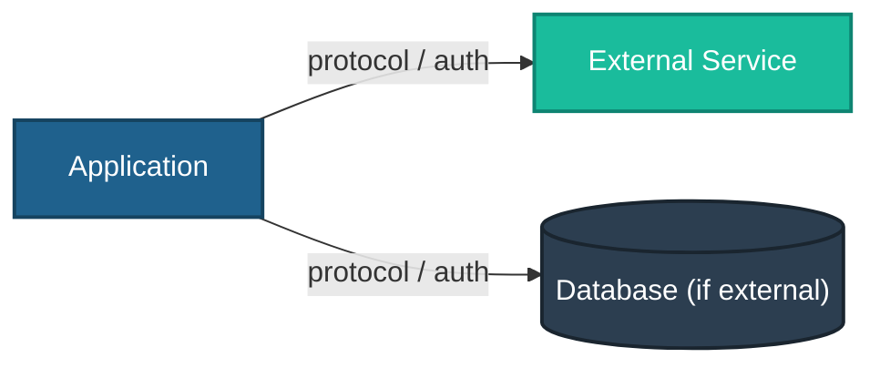

<!-- TEMPLATE -->
# Architecture — Integrations & External Dependencies

> Load this file when adding or changing a call to an external system, or when
> reasoning about failure behavior, timeouts, and resilience.
>
> This is *what we depend on* — distinct from `architecture-deployment.md` (our own infra).

## External Dependencies

| Dependency | Kind | Contract (protocol / endpoint) | Called from | Auth |
|------------|------|-------------------------------|-------------|------|

<!-- Kind: REST API - SOAP - gRPC - message queue - event bus - SMTP - file share - DB link - SDK -->

<!-- Integration map — only include connections confirmed from codebase — never invent -->

> ⚠ Could not determine — populate from actual API calls, SDK usage, and connection strings

## Resilience & Failure Behavior

| Dependency | Timeout | Retry / backoff | Circuit breaker | On failure (what happens) |
|------------|---------|-----------------|-----------------|---------------------------|

<!-- Extract from code where present (HTTP client timeouts, retry/backoff policies, SDK configs).
     "On failure" and SLA/ownership are usually human knowledge - flag if not in code. -->

## Ownership & SLA

| Dependency | Owning team / vendor | SLA / availability target | Support contact |
|------------|----------------------|---------------------------|-----------------|

> ⚠ Could not determine — needs manual input

## Data Exchanged

> What data crosses each boundary (and any B1–B7 sensitivity — see
> `business-context-severity.md`). Flag PII / privileged data leaving the system.

> ⚠ Could not determine — needs manual input
