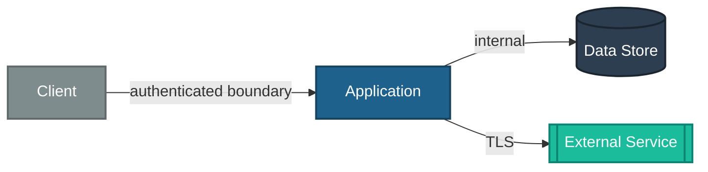

<!-- TEMPLATE -->
# Architecture — Security

> Load this file when adding an endpoint/route, role, or permission, when changing who
> can do what, or when running a security review. Consumed by the security skill.
>
> Auth *mechanics* (identity provider config, token validation) live in
> `architecture-deployment.md`. This file is the *authorization model* and trust map.

## Trust Boundaries / Zones

> Where trust changes: client → server, server → DB, server → external service, internal → DMZ.
> Note what is authenticated/validated at each crossing.

<!-- Trust-zone map. Renders in VS Code (Mermaid preview extension), Azure DevOps, and GitHub.
     Only include boundaries confirmed from the codebase — never invent. -->

> ⚠ Could not determine — populate from actual auth/transport config

## Authorization Model

| Action / Resource | Role / Policy | Enforced at |
|-------------------|---------------|-------------|

<!-- From code: framework authorization primitives - attributes/decorators/guards/policies and
     any custom authorization handlers. Name the class/method/guard that enforces each rule. -->

## Business Rules Gating Actions

> Rules beyond simple role checks (e.g. "only the owner may close it", "cross-tenant access
> denied"). Usually human knowledge.

> ⚠ Could not determine — needs manual input

## Secrets Handling (summary)

> Cross-links `architecture-deployment.md` Secrets Management. Note here only what the
> *application code* does (secret manager client, config providers, no secrets in source).

## Sensitive Data Handling

> Which endpoints/tables carry B1–B7 data (see `business-context-severity.md`), and how it is
> protected in transit / at rest / in logs.

> ⚠ Could not determine — needs manual input
