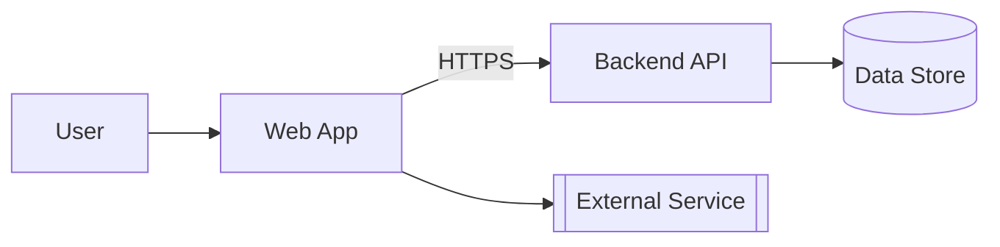
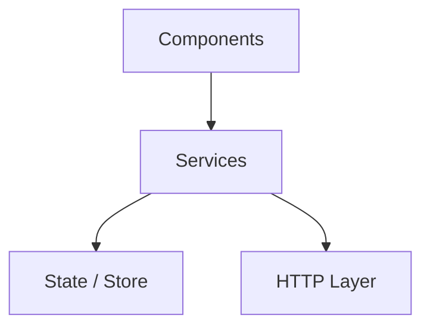

<!-- TEMPLATE -->
# Architecture

> Load this file when adding a new app, library, or understanding workspace structure.

## Technology Stack

| Category | Technology |
|----------|------------|
| Framework | |
| Workspace Tool | |
| State Management | |
| UI Component Library | |
| HTTP Client | |
| Testing | |
| Build tool / CI/CD | see `architecture-deployment.md` |

## End-to-End Architecture

<!-- Whole-system view. Renders in VS Code (with the Mermaid preview extension),
     Azure DevOps, and GitHub. Only include nodes confirmed from source — never invent. -->



## Layered View

<!-- Real tiers with dependency direction, derived from actual imports/module boundaries
     (not assumed layering). Replaces any former ASCII layer diagram. -->



> ⚠ If the layer graph cannot be determined, keep this marker instead of an empty
> diagram — needs manual input.

## Workspace Structure

| Name | Type | Path | Purpose |
|------|------|------|---------|

## Library Dependency Graph

```
[ASCII diagram]
```

## Shared Library Inventory

| Library | Entry Point | Provides | Consumed by |
|---------|------------|---------|------------|

## API Consumption Map

| App / Service | API Base URL | Endpoints Consumed |
|--------------|-------------|-------------------|

## Routing Structure

| App | Route | Component | Guards |
|-----|-------|-----------|--------|

## State Management

| App | Pattern | Stores / Slices |
|-----|---------|----------------|
