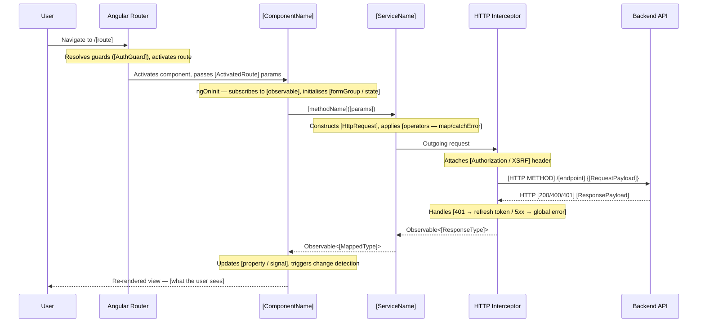

<!-- TEMPLATE -->
# Architecture — Flows

> Load this file when tracing a user journey, debugging a data flow,
> or understanding component interaction patterns.

## User Journey Flows

### [Journey Name — e.g. "User submits search form"]

> What this flow does: [one-sentence description of the user action and outcome]

---

## Component Interaction Patterns

## HTTP Interceptors

| Interceptor | Purpose | Order |
|------------|---------|-------|

## Service Dependency Graph

| Service | Injects |
|---------|---------|
