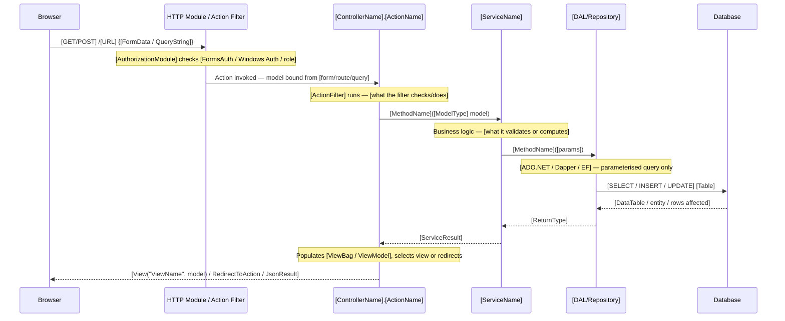

<!-- TEMPLATE -->
# Architecture — Flows

> Load this file when tracing a request through the pipeline,
> debugging a form submission, or understanding an AJAX interaction.

## Request Flows

### [Controller/Action or Page — e.g. "POST HomeController.Submit"]

> What this flow does: [one-sentence description of business purpose]

---

## Authentication Flows

## JavaScript / AJAX Patterns

| JS File | Endpoint Called | Updates |
|---------|----------------|---------|
