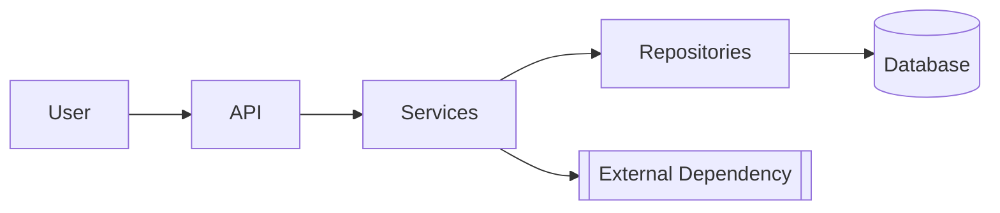
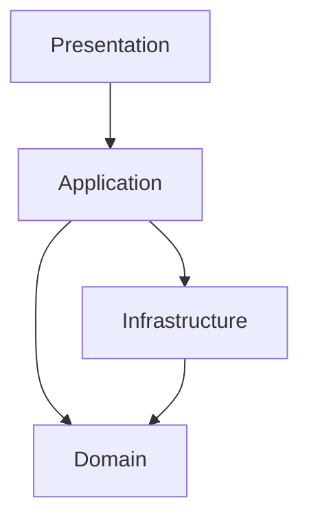

<!-- TEMPLATE -->
# Architecture

> Load this file when understanding the overall structure, adding new controllers
> or views, or planning changes to the request pipeline.

## Technology Stack

| Category | Technology |
|----------|------------|
| Framework | |
| Authentication | |
| Data Access | |
| Client-Side | |
| CSS Framework | |
| Testing | |

## End-to-End Architecture

<!-- Whole-system view. Renders in VS Code (with the Mermaid preview extension),
     Azure DevOps, and GitHub. Only include nodes confirmed from source — never invent. -->



## Layered View

<!-- Real tiers with dependency direction, derived from actual module/package references
     (not assumed layering). Replaces any former ASCII layer diagram. -->



> ⚠ If the layer graph cannot be determined, keep this marker instead of an empty
> diagram — needs manual input.

## Solution Structure

```
[solution name]/
```

## Request Pipeline

| Component | Type | Purpose |
|-----------|------|---------|

## Authentication & Authorization

## Web.config / appsettings Transforms

| Environment | Overrides |
|------------|----------|

## Database Access Pattern

## Controller / Action Map

| Controller | Action | HTTP | Route | Auth | View |
|-----------|--------|------|-------|------|------|
