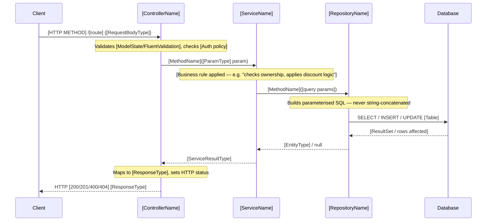

<!-- TEMPLATE -->
# Architecture — Call Chains

> Load this file when tracing a bug or feature through the request pipeline,
> or when doing impact analysis on specific endpoints.

## Call Chains

### [Endpoint Name] — [HTTP METHOD] [route]

> What this endpoint does: [one-sentence description of business purpose]

---

## Class-Level Dependency Graph

### Controllers

| Class | Constructor Injections |
|-------|----------------------|

### Services

| Class | Interface | Constructor Injections |
|-------|-----------|----------------------|

### Repositories

| Class | Interface | Constructor Injections |
|-------|-----------|----------------------|

### External APIs

| Class | Interface | Constructor Injections |
|-------|-----------|----------------------|

## Highest Fan-In (most depended-upon)

| Type | Depended on by |
|------|---------------|

## Highest Fan-Out (most dependencies)

| Class | Direct Dependencies |
|-------|-------------------|
