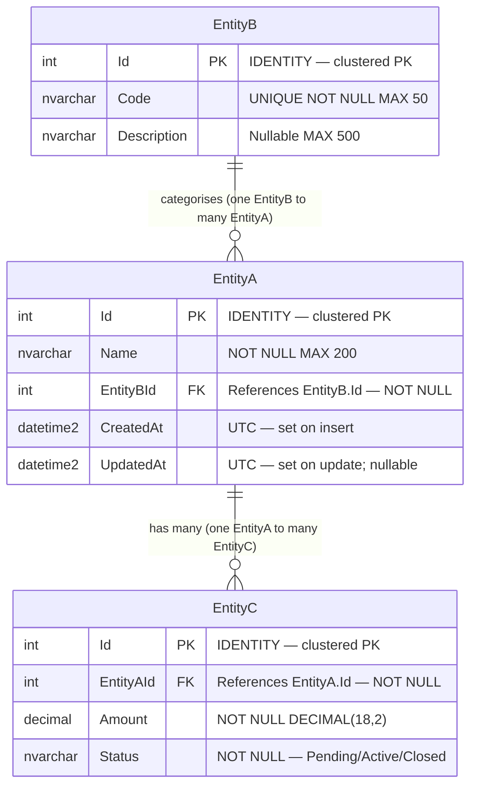

<!-- TEMPLATE -->
# Architecture — Data Model

> Load this file when adding or changing an entity, table, or query, when
> reasoning about data ownership, or when a feature touches persistence.

## Entity Relationship Diagram

> One diagram covering all tables. Include PK/FK annotations and column types.
> Update this diagram whenever the schema changes — it is the visual source of truth.

> ⚠ Replace the example entities above with the actual schema from this project.

---

## Entities / Tables

| Entity / Table | Owning Module | Key Columns | Purpose |
|----------------|---------------|-------------|---------|

## Relationships

| From | To | Cardinality | Foreign Key | On Delete |
|------|----|-------------|-------------|-----------|

## Data Ownership

> Which module/service is the system-of-record for each table. Others read via
> its API/repository, not by writing the table directly.

| Table / Aggregate | Owner | Written by | Read by |
|-------------------|-------|-----------|---------|

## Key Aggregates

> The main consistency boundaries — the root entity and what is loaded/saved with it.

## Access Patterns

> This project mandates **Dapper + parameterised SQL** (no ORM — see CLAUDE.md).
> Document the query surface: which repositories run which queries against which tables.

| Repository | Query / SP | Tables touched | Read/Write |
|------------|-----------|----------------|------------|

## Migrations / Schema Source

> Where the schema is defined (SQL scripts, DbUp, EF migrations for schema-only, DBA-managed).

> ⚠ Could not determine — needs manual input
