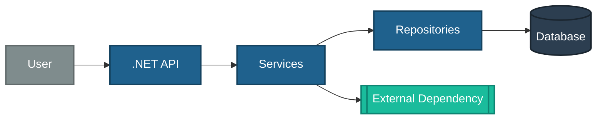
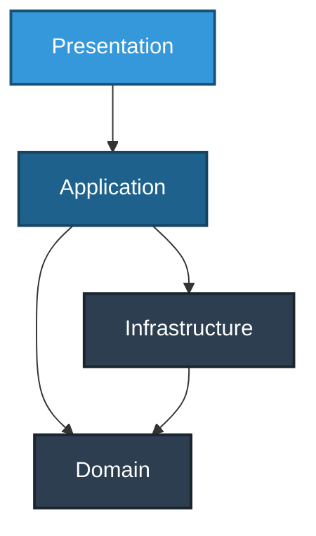

<!-- TEMPLATE -->
# Architecture

> Load this file when adding a new layer, project, middleware, or endpoint,
> or when needing to understand the overall structure.

## Technology Stack

| Category | Technology |
|----------|------------|
| Framework | |
| Authentication | |
| Data Access | |
| Database Driver | |
| Logging | |
| Configuration | |
| API Documentation | |
| Health Checks | |
| Testing | |
| CI/CD pipeline | see `architecture-deployment.md` |
| Deployment model | see `architecture-deployment.md` |

## Solution Structure

```
[solution name]/
```

## End-to-End Architecture

<!-- Whole-system view. Renders in VS Code (with the Mermaid preview extension),
     Azure DevOps, and GitHub. Only include nodes confirmed from source — never invent. -->

<div style="background-color: white; padding: 25px; border-radius: 8px;">



</div>

## Layered View

<!-- Real tiers with dependency direction, derived from <ProjectReference> edges
     (not assumed Clean Architecture). Replaces the former ASCII layer diagram. -->

<div style="background-color: white; padding: 25px; border-radius: 8px;">



</div>

> ⚠ If the layer graph cannot be determined from project references, keep this
> marker instead of an empty diagram — needs manual input.

## Project Responsibilities

| Project | Responsibility | DI Method | InternalsVisibleTo |
|---------|---------------|-----------|-------------------|

## Middleware Pipeline Order

```
[middleware in order]
```

## API Endpoints

| Controller | HTTP | Route | Auth | Return Type |
|-----------|------|-------|------|-------------|

## Configuration Sections

| Section | Model Class | Purpose |
|---------|-------------|---------|

## Background Jobs

> ⚠ Could not determine — needs manual input
