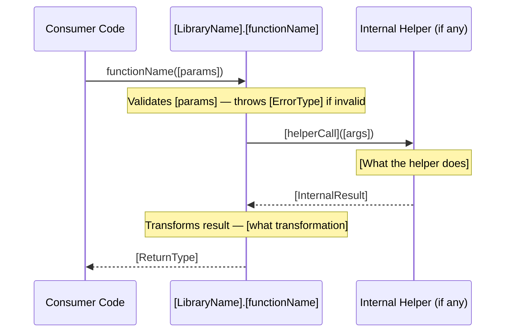
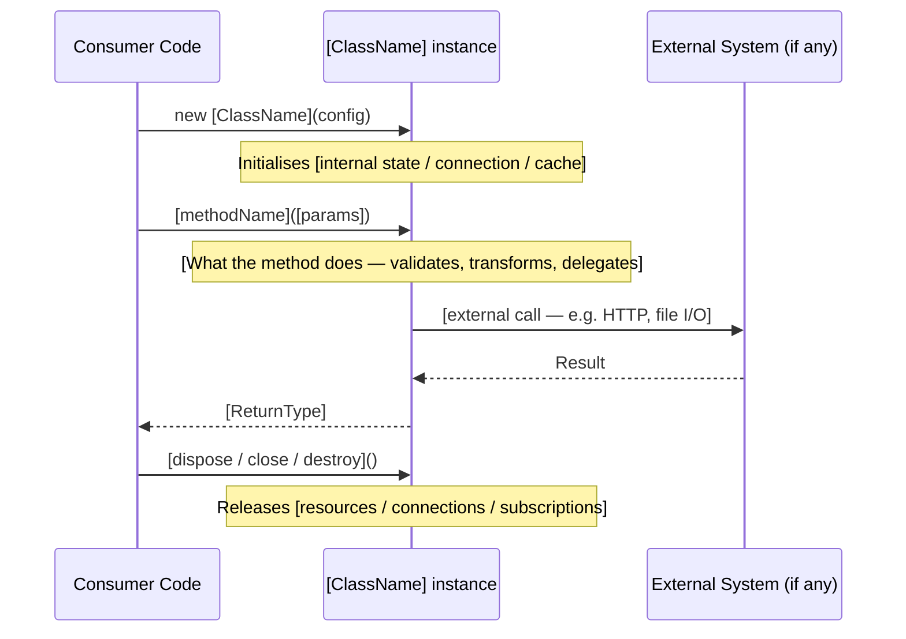

<!-- TEMPLATE -->
# Architecture — Public API

> Load this file when implementing against or extending this library.

## Functions

### `functionName(params): ReturnType`

**Parameters:**
| Name | Type | Required | Default | Description |
|------|------|----------|---------|-------------|

**Returns:**

**Side Effects:**

**Throws:**

**Usage flow:**



---

## Classes

### `ClassName`

**Constructor:**

**Public Methods:**

**Public Properties:**

**Lifecycle flow:**



---

## Types & Interfaces

---

## Usage Patterns

### Basic Setup

```typescript
// example
```

### Common Usage Examples

---

## Known Gotchas
