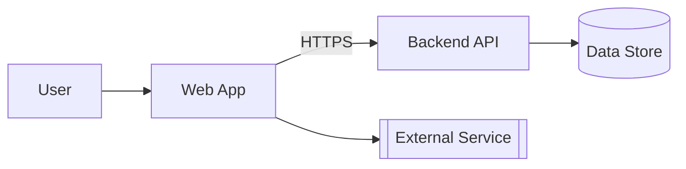
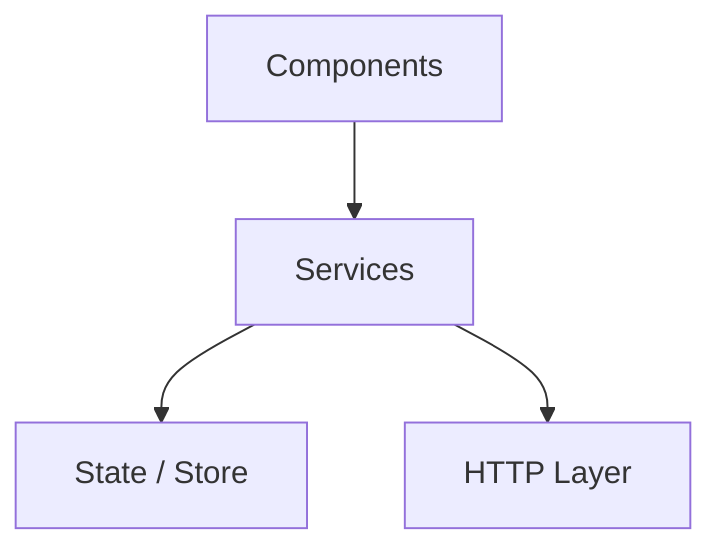

<!-- TEMPLATE -->
# Architecture

> Load this file when using, extending, or publishing this library.

## Technology Stack

| Category | Technology |
|----------|------------|
| Language | |
| Build Tool | |
| Bundle Targets | |
| Test Framework | |
| Documentation | |

## End-to-End Architecture

<!-- Whole-system view. Renders in VS Code (with the Mermaid preview extension),
     Azure DevOps, and GitHub. Only include nodes confirmed from source — never invent. -->

## Layered View

<!-- Real tiers with dependency direction, derived from actual imports/module boundaries
     (not assumed layering). Replaces any former ASCII layer diagram. -->

> ⚠ If the layer graph cannot be determined, keep this marker instead of an empty
> diagram — needs manual input.

## Package Metadata

| Field | Value |
|-------|-------|
| Name | |
| Version | |
| Description | |
| Main | |
| Module | |
| Exports | |
| Peer Dependencies | |

## Folder Structure

| Folder | Purpose |
|--------|---------|

## Public API Surface

| Export | Type | Description |
|--------|------|-------------|

## Bundle Targets

| Format | Output File | Consumers |
|--------|------------|----------|
