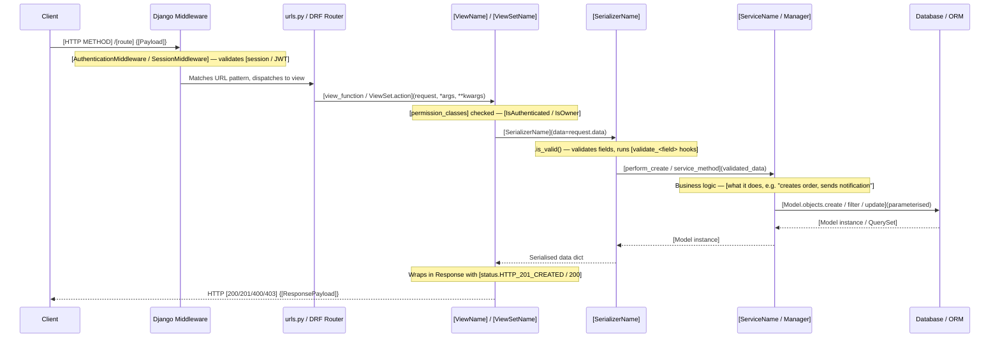

<!-- TEMPLATE -->
# Architecture — Request Flows

> Load this file when tracing how a request moves through the Django app,
> or when changing behaviour that spans multiple layers.

## Call Chains

### [View/Endpoint Name — e.g. "POST /api/orders/"]

> What this endpoint does: [one-sentence description of business purpose]

---

## Dependency Graph

| Unit | Type | Dependencies |
|------|------|-------------|

## Highest Fan-In

| Type | Injected/Imported by |
|------|----------------------|

## Highest Fan-Out

| Unit | Dependency Count |
|------|------------------|
