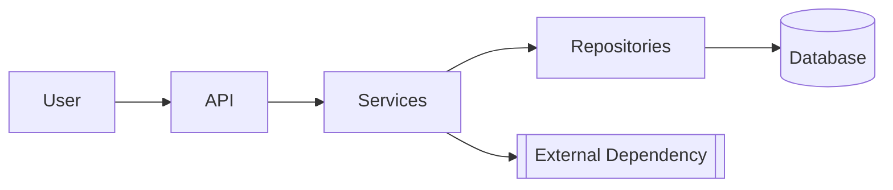
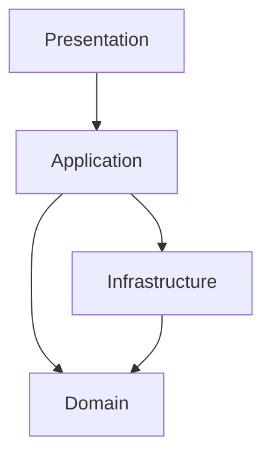

<!-- TEMPLATE -->
# Architecture

> Load this file when adding a new layer, module, middleware, or endpoint,
> or when needing to understand the overall structure.

## Technology Stack

| Category | Technology |
|----------|------------|
| Language / runtime | |
| Framework | |
| Authentication | |
| Data Access / ORM | |
| Database | |
| Migrations | |
| Validation | |
| Logging | |
| API Documentation | |
| Testing | |
| Build tool | |
| CI/CD pipeline | see `architecture-deployment.md` |
| Deployment model | see `architecture-deployment.md` |

## End-to-End Architecture

<!-- Whole-system view. Renders in VS Code (with the Mermaid preview extension),
     Azure DevOps, and GitHub. Only include nodes confirmed from source — never invent. -->



## Layered View

<!-- Real tiers with dependency direction, derived from actual module/package references
     (not assumed layering). Replaces any former ASCII layer diagram. -->



> ⚠ If the layer graph cannot be determined, keep this marker instead of an empty
> diagram — needs manual input.

## App Structure

```
[project root]/
```

## Apps & Responsibilities

## Middleware Chain

```
[in order]
```

## API Endpoints / Views

| Handler | HTTP | Route | Auth | Request | Response |
|---------|------|-------|------|---------|----------|

## Settings of Note

| Section | Binding | Purpose |
|---------|---------|---------|

## Background Jobs

> ⚠ Could not determine — needs manual input
