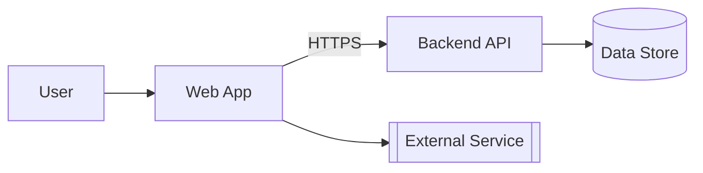
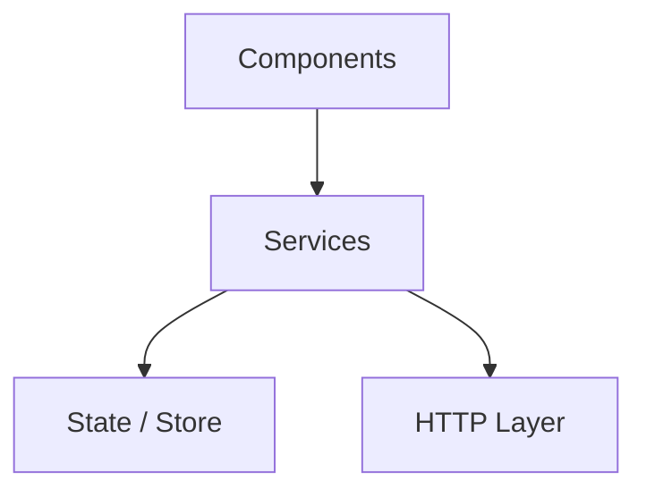

<!-- TEMPLATE -->
# Architecture

> Load this file when adding new features, understanding project structure,
> or onboarding to the codebase.

## Technology Stack

| Category | Technology |
|----------|------------|
| Framework | |
| Meta-Framework | |
| Routing | |
| State Management | |
| UI Component Library | |
| HTTP Client | |
| Testing | |
| Build tool / CI/CD | see `architecture-deployment.md` |

## End-to-End Architecture

<!-- Whole-system view. Renders in VS Code (with the Mermaid preview extension),
     Azure DevOps, and GitHub. Only include nodes confirmed from source — never invent. -->

## Layered View

<!-- Real tiers with dependency direction, derived from actual imports/module boundaries
     (not assumed layering). Replaces any former ASCII layer diagram. -->

> ⚠ If the layer graph cannot be determined, keep this marker instead of an empty
> diagram — needs manual input.

## Folder Structure

| Folder | Purpose |
|--------|---------|

## Component Library Inventory

| Component | Purpose |
|-----------|---------|

## API Consumption Map

| Hook / Service | API Endpoint | HTTP Method |
|---------------|-------------|-------------|

## Routing Structure

| Route | Component | Layout | Auth Required |
|-------|-----------|--------|--------------|

## State Management

| Scope | Pattern | Store / Atom |
|-------|---------|-------------|
