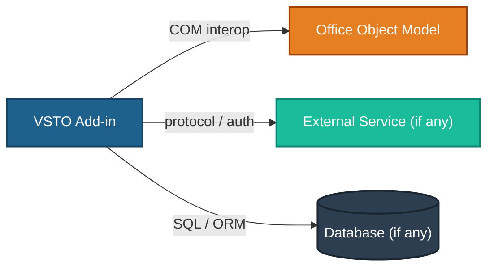

<!-- TEMPLATE -->
# Architecture — Integrations & External Dependencies

> Load this file when adding or changing a call to an external system, when
> reasoning about Office COM interop, or when evaluating failure behavior and resilience.
>
> VSTO add-ins integrate primarily via the Office Object Model (COM) and optionally
> via HTTP/REST, SharePoint, SQL Server, or other enterprise services.

## Office Object Model (Primary Integration)

> The Office host is the core integration boundary — treat it as an external dependency.

| Office API surface | Version / behaviour | Called from | Notes |
|--------------------|---------------------|-------------|-------|
| Excel / Word Application object | | | |
| Workbook / Document events | | | |
| Range / Selection operations | | | |
| Ribbon (IRibbonExtensibility) | | | |
| TaskPane (CustomTaskPane) | | | |
| Custom XML parts | | | |
| DocumentProperties / BuiltInDocumentProperties | | | |

> ⚠ Could not determine — populate from actual Office object model usage

## External Dependencies

> Non-Office integrations — REST APIs, databases, queues, file shares, etc.

| Dependency | Kind | Contract (protocol / endpoint) | Called from | Auth |
|------------|------|-------------------------------|-------------|------|

<!-- Kind: REST API · SOAP / WCF · SQL Server · SharePoint · SMTP · file share · Active Directory · SDK -->

> ⚠ Could not determine — populate from actual API calls, SDK usage, and connection strings

## COM Interop Resilience

> Office COM calls can fail if the host app is in a state it cannot accept automation
> (e.g. modal dialog open, protected view, no document loaded). Document handling below.

| Failure scenario | Detection | Handling |
|-----------------|-----------|----------|
| No workbook / document open | | |
| Protected view / read-only | | |
| Modal dialog blocking automation | | |
| COM exception (COMException) | | |
| HRESULT / RPC server unavailable | | |

## External Dependency Resilience

| Dependency | Timeout | Retry / backoff | On failure |
|------------|---------|-----------------|------------|

> ⚠ Could not determine — populate from HTTP client config, retry policies, SDK settings

## Ownership & SLA

| Dependency | Owning team / vendor | SLA / availability target | Support contact |
|------------|----------------------|---------------------------|-----------------|
| Office host | Microsoft | n/a (local install) | |

> ⚠ Could not determine — needs manual input for external dependencies

## Data Exchanged

> What data crosses each boundary (and any B1–B7 sensitivity).
> Flag PII / privileged matter data leaving the add-in or the document.

> ⚠ Could not determine — needs manual input
