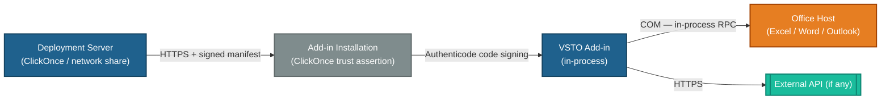

<!-- TEMPLATE -->
# Architecture — Security

> Load this file when reviewing trust boundaries, changing deployment signing,
> or running a security review. Consumed by the security skill.
>
> Auth *mechanics* (ClickOnce manifest, code signing certificate) live in
> `architecture-deployment.md`. This file is the *trust model* and permission map.

## Trust Boundaries / Zones

> Where trust changes: deployment server → client, code signing assertion, COM host boundary,
> add-in → external API. Note what is authenticated/validated at each crossing.

<!-- Trust-zone map. Renders in VS Code (Mermaid preview extension), Azure DevOps, and GitHub.
     Only include boundaries confirmed from the codebase — never invent. -->

> ⚠ Could not determine — populate from actual deployment and signing config

## Authorization Model

| Action / Resource | Permission required | Enforced at |
|---|---|---|
| Install add-in (per-user) | User profile write access | ClickOnce / Windows Installer |
| Install add-in (machine-wide) | Local Administrator | Windows Installer (HKLM) |
| Access Office object model | None — runs as current user | Office trust boundary |
| Call external API | Network access | OS / firewall |

<!-- From code: any permission demands (CAS), registry key access, filesystem paths written. -->

## Business Rules Gating Actions

> Rules beyond installation trust (e.g. "only licensed users may export", "add-in disabled
> if Office version is below minimum"). Usually human knowledge.

> ⚠ Could not determine — needs manual input

## Secrets Handling (summary)

> Cross-links `architecture-deployment.md` → Secrets Management. Note here only what the
> *application code* does — Windows Credential Manager, isolated storage, no secrets in
> `app.config`.

## Sensitive Data Handling

> Which Office objects or external API responses carry sensitive data, and how it is
> protected in memory / at rest / in logs (no PII in isolated storage unencrypted, no
> credentials in `CustomDocumentProperties`).

> ⚠ Could not determine — needs manual input
