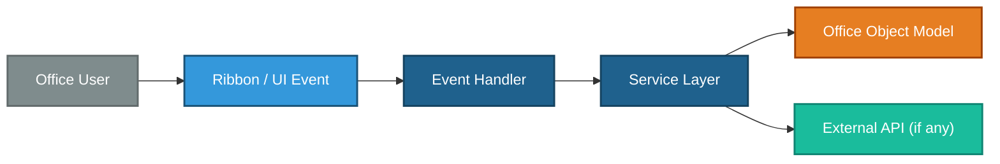
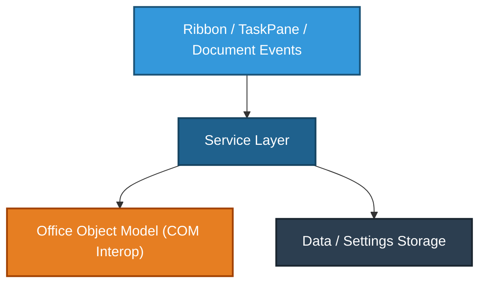

<!-- TEMPLATE -->
# Architecture

> Load this file for system-wide orientation: stack, layer responsibilities,
> module map, and the two Mermaid diagrams.

## Technology Stack

| Layer | Technology | Notes |
|---|---|---|
| Office host | | |
| .NET Framework version | | |
| Add-in type | Add-in / Document customization | |
| VSTO version | | |
| Ribbon | Yes / No | |
| TaskPane | Yes / No | |
| Auth / identity | | |
| External API calls | Yes / No | |
| Data persistence | | |

## Solution Structure

| Project | Path | Purpose |
|---|---|---|

## Add-in / Customization Lifecycle

### Startup (`ThisAddIn_Startup` / `ThisWorkbook_Startup`)

| Action | Detail |
|---|---|
| Events subscribed | |
| Services initialized | |
| Ribbon registered | |
| TaskPane created | |

### Shutdown (`ThisAddIn_Shutdown` / `ThisWorkbook_Shutdown`)

| Action | Detail |
|---|---|
| Events unsubscribed | |
| TaskPanes disposed | |
| COM objects released | |

## Host Application Integration

| Globals accessor | Type | Purpose |
|---|---|---|
| `Globals.ThisAddIn` | | |
| `Globals.Ribbons.*` | | |

## End-to-End Architecture

> ⚠ Could not determine — populate from actual codebase

## Layered View

> ⚠ Could not determine — populate from actual codebase
