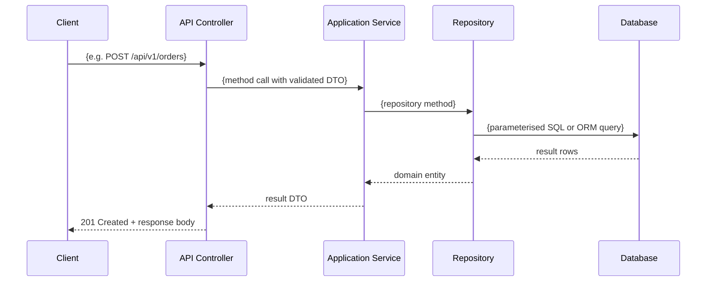
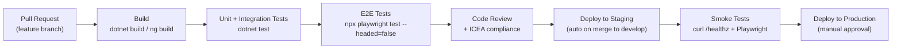

# Spec: Phase 1 Architecture Documents

_Loaded by migration SKILL.md at Stage 1 start. Defines the required format and content for all
five permanent target application architecture documents. After Stage 1 documents are written,
this spec leaves context — Stage 4 cluster agents do not use it._

---

## Execution Instructions for Stage 1

Generate ALL five documents in a single pass. Write each to:
`docs/Release{R}/Sprint{S}/UserStory{ADO_ID}/{DOCUMENT_NAME}`

**Non-negotiable rules:**
- ALL diagrams MUST be Mermaid. No described diagrams, no ASCII art.
- Every significant architectural component MUST have an ADR section.
- All decisions are proposed by the AI based on source analysis. Ask the developer ONLY when genuinely ambiguous — not to validate obvious choices.
- If a diagram cannot be completed without missing information, insert: `[DIAGRAM PENDING — {specific question to developer}]` and ask.
- Populate every section. If information is unavailable, write `[Not determined — {reason}]` rather than leaving it blank.

---

## ADR Format (apply to every significant component in every document)

```markdown
### Decision: {What is being decided}

**Recommendation:** {chosen approach in one sentence}

| Option | Verdict | Reason |
|---|---|---|
| {Option A} | Rejected | {reason grounded in source app characteristics or target requirements} |
| {Option B} | Rejected | {reason} |
| **{Chosen option}** | **Accepted** | {reason — must reference source analysis or a concrete benefit} |

**Benefits for this migration:**
- {specific benefit tied to what was found in the source application}
- {second benefit}
```

---

## Document 1: COMPONENT-ARCHITECTURE.md

**Filename:** `COMPONENT-ARCHITECTURE.md`
**Purpose:** High-level map of the target system. The "table of contents" for all other architecture docs.

### Required Sections

**### 1. System Overview**

One paragraph describing:
- What the application does
- Who uses it (primary actor types: end users, administrators, external API consumers, other services)
- What business problem it solves

Derive from: source application analysis + developer description in Step 0.

**### 2. Technology Stack**

Table with confirmed final stack:

| Layer | Technology | Version | Notes |
|---|---|---|---|
| Runtime | {e.g. .NET 10 / Java 21} | {version} | |
| Web Framework | {e.g. ASP.NET Core Web API} | | |
| Frontend | {e.g. Angular 17+ / None} | | |
| Database | {from Q2 / inferred from source} | | |
| ORM / Data access | {Dapper / EF Core / JPA} | | |
| Authentication | {Entra ID / Custom JWT / etc.} | | |
| Caching | {Redis / In-memory / None} | | |
| Message queue | {Service Bus / RabbitMQ / None} | | |
| Logging | {Serilog + Application Insights / ELK / etc.} | | |

Derive from: Stage 0 target platform (Q1) + Stage 0 cloud (Q2) + source auth pattern detection + industry best practice for target stack.
If a row cannot be determined: ask the developer before writing this document.

**### 3. System Context (C4 Level 1)**

```mermaid
C4Context
  title System Context — {Application Name}
  Person(user, "{Primary User Role}", "{what they do}")
  Person_Ext(admin, "Administrator", "Manages configuration and access")
  System(app, "{Application Name}", "{one-line description}")
  System_Ext(auth, "{Auth Provider}", "Authentication and authorisation")
  System_Ext(db, "{Database}", "Persistent data storage")
  {Additional external systems detected in source analysis}
  Rel(user, app, "Uses", "HTTPS")
  Rel(admin, app, "Administers", "HTTPS")
  Rel(app, auth, "Authenticates via", "OAuth 2.0 / OIDC")
  Rel(app, db, "Reads/Writes", "TLS")
```

Derive from: source external dependencies detection + Q2 cloud + auth pattern.

**### 4. Component Map (C4 Level 2)**

```mermaid
graph TB
  {frontend component if two-track} -->|"JWT Bearer\nHTTPS"| API["API Layer\n{Name}.Api"]
  API --> SK["Shared Kernel\n{Name}.Domain.Common"]
  {For each bounded context cluster from graph:}
  API --> {ClusterName}["{ClusterName} Context\n{Name}.Application.{ClusterName}"]
  {ClusterName} --> SK
  {ClusterName} --> DB[("Database\n{engine}")]
  {If cache:} API --> Cache[("Redis Cache")]
  {If queue:} API --> Queue[("Message Queue")]
  API --> AuthProvider["{Auth Provider}"]
```

Derive from: graph cluster plan + SharedKernel identification + external dependencies.
Show sync connections (solid arrows) and async connections (dashed arrows) differently.

**### 5. Layer Architecture**

State the chosen pattern (simplified / four-layer clean architecture) and show dependency direction:

```mermaid
graph LR
  {If four-layer:}
  API["API / Host\n(entry point)"] --> Application
  Application["Application\n(use cases, interfaces)"] --> Domain
  Infrastructure["Infrastructure\n(data, external)"] --> Application
  Infrastructure --> Domain
  Domain["Domain\n(entities, rules)\nNO external deps"]

  {If simplified:}
  API["API Layer"] --> Services["Services\n(business logic)"]
  Services --> Domain["Domain\n(entities)"]
  Services --> Infrastructure["Infrastructure\n(data access)"]
```

Follow with one-paragraph rationale referencing the proportionality decision (file count + complexity).

**### 6. External Dependencies**

| Service | Purpose | Connection type | Owns / External |
|---|---|---|---|
| {e.g. Azure SQL} | Primary data store | TLS SQL over port 1433 | External (managed) |
| {e.g. Entra ID} | Authentication | HTTPS / OIDC | External (managed) |
| {e.g. Redis} | Session cache + distributed cache | TLS port 6380 | External (managed) |

Derive from: source external dependency detection + Q2 cloud + auth pattern.

**### 7. Component ADRs**

One ADR per bounded context cluster explaining its boundary (using ADR format above).
One ADR for the overall layer architecture pattern choice.

---

## Document 2: DATA-ARCHITECTURE.md

**Filename:** `DATA-ARCHITECTURE.md`
**Purpose:** How data is structured, accessed, and protected in the target application.

### Required Sections

**### 1. Data Strategy**

One-paragraph description of the data access approach.
Then an ADR for the data access pattern choice (Dapper / EF Core / JPA / etc.).

Note: if CLAUDE.md contains "Dapper only" rule, the ADR must reflect that as a hard constraint, not a choice.

**### 2. Entity Inventory**

| Entity | Source origin | Owning context | Key relationships |
|---|---|---|---|
| {EntityName} | {SourceClass.java / .cs} | {ClusterName} | One-to-many with {OtherEntity} |

Derive from: source class/entity file analysis + graph module membership.

**### 3. Entity Relationship Diagram**

```mermaid
erDiagram
  {For each entity and its associations:}
  {ENTITY_A} ||--o{ {ENTITY_B} : "{relationship label}"
  {ENTITY_A} {
    string id PK
    string {field1}
    {type} {field2}
  }
```

Derive from: source domain class analysis (entity annotations, navigation properties, foreign keys).
Show only domain entities — not DTOs or view models.

**### 4. Data Flow (typical request)**



**### 5. PII Inventory**

If PII detected in source (names, emails, SSNs, health data, financial data):

| Field | Entity | Classification | Protection |
|---|---|---|---|
| email | Customer | PII — contact | Store hashed for lookup; display masked |
| fullName | Customer | PII — identity | Encrypted at rest |

If no PII detected: write "No PII fields identified in source analysis. Review and confirm before production deployment."

**### 6. Schema Migration Approach**

Describe how the existing database schema is handled:
- EF6 source → EF Core target: scaffold baseline migration from existing DB, then empty Up()/Down()
- JPA/Hibernate source → Dapper target: write DbUp/Flyway SQL scripts from entity analysis
- Same ORM: generate initial migration from existing schema, mark as baseline

**### 7. ADR: Data Access Pattern**

(ADR format — see above.)
Include in reasoning: the source ORM, the CLAUDE.md data access convention if present, and performance characteristics for the expected load.

---

## Document 3: SECURITY-ARCHITECTURE.md

**Filename:** `SECURITY-ARCHITECTURE.md`
**Purpose:** How the target application authenticates users, authorises access, and protects data.

### Required Sections

**### 1. Authentication Strategy**

Infer the auth strategy from:
- Source auth pattern detection (Spring Security JWT / Forms Auth / Passport.js / etc.)
- Target stack + cloud (Q2) — Azure → Entra ID is the natural default for enterprise apps
- If source uses JWT and target is .NET + Azure: propose Entra ID (more secure, managed)
- If source uses session auth: propose JWT bearer (stateless, scales horizontally)
- If source has API key auth: propose ApiKey authentication handler

If the inferred strategy is ambiguous (e.g. source has BOTH session AND JWT): ask the developer:
"I see the source uses both session auth for the web UI and JWT for the API. Should the target consolidate to JWT only, or maintain both?"

**### 2. Authentication Flow**

```mermaid
sequenceDiagram
  participant C as Client / Browser
  participant SPA as Frontend (if applicable)
  participant IdP as {Auth Provider}
  participant API as .NET API

  {For Entra ID OIDC:}
  C->>SPA: Open application
  SPA->>IdP: OIDC authorization request
  IdP-->>C: Login page
  C->>IdP: Credentials
  IdP-->>SPA: Authorization code
  SPA->>IdP: Token exchange
  IdP-->>SPA: Access token (JWT, RS256)
  SPA->>API: Request + Bearer token
  API->>IdP: Validate via JWKS endpoint
  IdP-->>API: Token valid + claims
  API-->>SPA: Response

  {For Custom JWT:}
  C->>API: POST /auth/login (credentials)
  API->>API: Validate credentials + sign JWT (HS256/RS256)
  API-->>C: Access token + refresh token
  C->>API: Request + Bearer token
  API->>API: Validate signature + claims
  API-->>C: Response
```

**### 3. Authorization Model**

Table of roles/policies detected from source (controller-level access control, role checks):

| Role / Policy | What it grants | Source pattern |
|---|---|---|
| {e.g. "Admin"} | Full CRUD on all resources | {e.g. @PreAuthorize("hasRole('ADMIN')")} |
| {e.g. "User"} | Read own resources only | |

How implemented in target stack:
- .NET: `[Authorize(Roles = "Admin")]` or `[Authorize(Policy = "RequireAdmin")]`
- Java: `@PreAuthorize("hasRole('ADMIN')")` on `@Service` methods

**### 4. Secrets Management**

Based on Q2 cloud:
| Secret type | Storage | Access pattern |
|---|---|---|
| DB connection string | {Key Vault / AWS Secrets Manager / env var} | Read on startup via IConfiguration |
| Auth client secret | {Key Vault / env var} | Read on startup |
| API keys | {Key Vault / env var} | Read on startup |

Hardcoded secrets are NEVER acceptable — document the required environment variables and Key Vault secret names.

**### 5. Data Protection**

- TLS: all external communications use TLS 1.2+ (UseHttpsRedirection in .NET)
- Encryption at rest: if PII fields identified in DATA-ARCHITECTURE.md, state how they are protected
- Data Protection key ring: .NET `AddDataProtection()` — state where keys are stored (Key Vault / blob storage)
- CORS: state the explicit allowed origins (never `AllowAnyOrigin` in production)

**### 6. Threat Model (brief)**

List the top 3 threats for this application type and their mitigations:

| Threat | Likelihood | Mitigation |
|---|---|---|
| Broken authentication | Medium | Entra ID / JWT validation; short token expiry; JWKS rotation |
| Injection (SQL/NoSQL) | Medium | Parameterised queries only (Dapper convention / ORM) |
| Sensitive data exposure | High (if PII) | Encryption at rest; masked in logs; TLS in transit |

**### 7. ADR: Authentication Strategy**

(ADR format — see above.)
Include in reasoning: source auth complexity, target stack, cloud provider defaults, team familiarity.

---

## Document 4: INFRASTRUCTURE-ARCHITECTURE.md

**Filename:** `INFRASTRUCTURE-ARCHITECTURE.md`
**Purpose:** Where the target application runs, how it is deployed, and how it is monitored.

### Required Sections

**### 1. Environment Map**

| Environment | Purpose | Key differences |
|---|---|---|
| Development | Local developer machines | Local DB / in-memory cache / no auth enforcement |
| Staging | Pre-production testing | Cloud-hosted / real auth / anonymised data |
| Production | Live system | Full hardening / real data / alerting active |

**### 2. Hosting Topology**

```mermaid
graph TB
  subgraph Internet
    Client["Browser / Mobile / API Consumer"]
  end

  subgraph {Cloud Provider from Q2}
    subgraph "{Networking layer e.g. VNet / VPC}"
      LB["{Load Balancer / API Gateway / Application Gateway}"]

      subgraph "{Compute e.g. App Service Plan / ECS Cluster}"
        API["{Name} API\n{runtime}"]
        {Frontend["Angular SPA\n(Static Web App)"] if two-track}
      end

      subgraph "{Data Tier}"
        DB[("{Database engine}\n{tier/sku}")]
        {Cache["Redis Cache"] if cache in stack}
        {KV["Key Vault / Secrets Manager"] if cloud}
      end
    end
  end

  Client -->|HTTPS| LB
  LB --> API
  {LB --> Frontend if two-track}
  API --> DB
  {API --> Cache}
  {API --> KV}
```

Derive from: Q2 cloud + hosting model + external dependencies.

**### 3. CI/CD Pipeline**



Adapt pipeline to the target cloud (Azure Pipelines / GitHub Actions / AWS CodePipeline).

**### 4. External Service Connections**

| Service | Connection | Secret location | Health check |
|---|---|---|---|
| {Database} | Connection string | {Key Vault secret name} | SELECT 1 |
| {Redis} | Connection string | {Key Vault secret name} | PING |
| {Auth provider} | JWKS URL (public) | N/A (public key) | GET /.well-known/jwks.json |

**### 5. Health Monitoring**

- Health endpoint: `/healthz` — checks database connectivity, cache ping, external service reachability
- Logging: structured logs (Serilog / SLF4J) → {sink from tech stack}
- Alerting: {cloud-native alerts on error rate, response time, health check failures}
- Correlation ID: `X-Correlation-Id` header propagated through all requests and logged on every line

**### 6. ADR: Hosting Model**

(ADR format — see above.)
Compare the chosen model (App Service / AKS / ECS / IIS) against alternatives for this application's expected load and operational complexity.

---

## Document 5: ARCHITECTURE-DECISIONS.md

**Filename:** `ARCHITECTURE-DECISIONS.md`
**Purpose:** Authoritative log of architectural decisions. Updated whenever a significant decision is made.

### Required Sections

**### Overview**

Brief description of what ADRs are and when to add new ones.
Each ADR is numbered sequentially (ADR-001, ADR-002, ...).
Superseded ADRs are marked with "Superseded by ADR-{N}" — never deleted.

**### Initial ADRs (generated in Stage 1)**

Populate these from the ADR sections in COMPONENT, DATA, SECURITY, and INFRASTRUCTURE docs:

| ADR # | Title | Document source |
|---|---|---|
| ADR-001 | Architecture pattern (simplified vs four-layer) | COMPONENT-ARCHITECTURE.md |
| ADR-002 | Authentication strategy | SECURITY-ARCHITECTURE.md |
| ADR-003 | Data access pattern (Dapper / EF Core / JPA) | DATA-ARCHITECTURE.md |
| ADR-004 | Hosting model | INFRASTRUCTURE-ARCHITECTURE.md |
| ADR-005 to ADR-00{N} | One per bounded context boundary decision | COMPONENT-ARCHITECTURE.md |

**### ADR Format**

```markdown
## ADR-{NNN}: {Decision title}
Date: {YYYY-MM-DD}
Status: Accepted

### Context
{What drove this decision. Reference source app characteristics, constraints, and requirements.
One to three sentences.}

### Decision
{What was decided — one sentence.}

### Options Considered
| Option | Verdict | Reason |
|---|---|---|
| {Option A} | Rejected | {concrete reason} |
| {Option B} | Rejected | {concrete reason} |
| **{Chosen option}** | **Accepted** | {concrete reason} |

### Consequences
{What this means for the migration effort and the long-term app. Include both positive
consequences and any trade-offs accepted.}
```

**Rule:** Every ADR in ARCHITECTURE-DECISIONS.md must be cross-referenced in the document where
the decision is discussed (COMPONENT, DATA, SECURITY, INFRASTRUCTURE). Add a line:
`> See ARCHITECTURE-DECISIONS.md → ADR-{NNN}` at the bottom of the relevant ADR section.

---

## Relationships Between Documents

```
COMPONENT-ARCHITECTURE.md          ← master map; all other docs reference it
  ↳ system context + components
  ↳ tech stack (referenced by DATA, SECURITY, INFRASTRUCTURE)
  ↳ layer pattern (referenced by TARGET-ARCHITECTURE.md cluster specs)

DATA-ARCHITECTURE.md
  ↳ entity model (referenced by cluster specs in TARGET-ARCHITECTURE.md)
  ↳ PII fields (referenced by SECURITY-ARCHITECTURE.md data protection section)

SECURITY-ARCHITECTURE.md
  ↳ auth strategy (referenced by COMPONENT diagram, API layer spec, integration contract)
  ↳ secrets locations (referenced by INFRASTRUCTURE-ARCHITECTURE.md)

INFRASTRUCTURE-ARCHITECTURE.md
  ↳ hosting + CI/CD (referenced by migration report and post-migration recommendations)

ARCHITECTURE-DECISIONS.md
  ↳ aggregates ADRs from all four docs above
  ↳ living document — updated as new decisions are made during migration
```
