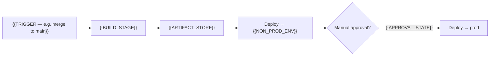
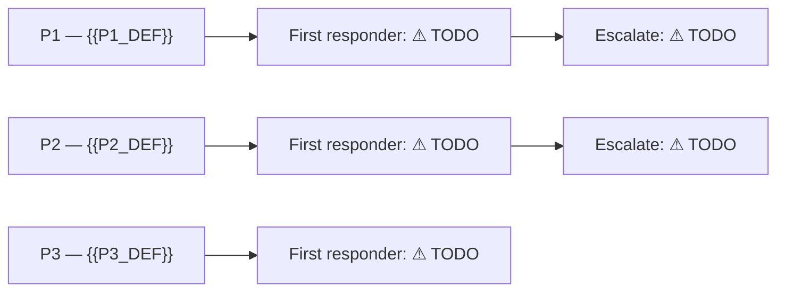

<!--
  MASTER OPERATIONAL RUNBOOK TEMPLATE  (operations skill)
  ─────────────────────────────────────────────────────────
  Filling rules (SKILL.md Step 5 enforces these):
    • {{PLACEHOLDER}}  → replace with a value DERIVED FROM EVIDENCE (architecture docs,
                         config, IaC/pipeline, consent-gated source). If evidence is absent,
                         DO NOT guess — convert it to a ⚠ TODO instead.
    • ⚠ TODO           → a value that must come from a human or a live check. Leave it
                         literally in the output. Never fabricate over it.
    • {{#each …}} / {{#if …}} blocks → repeat/keep per real data; DELETE the block if no data.
    • Every shell command keeps its "⚠ verify against live/CLI" caveat.
    • Mermaid: build only from derived topology; unknown nodes/edges become a node
      labelled "⚠ TODO". Never invent an edge.
    • Strip every HTML comment (like this one) from the final output.
-->
# {{PROJECT_NAME}} — Operational Runbook

> **Purpose:** the single document a support engineer opens when something is wrong with
> {{PROJECT_NAME}}, or when performing a routine operational task.
>
> **How to use this doc:** every field marked **⚠ TODO** must be filled in by the owning team —
> do not treat a TODO as "not applicable." Values here are drawn from the architecture docs,
> configuration, and pipeline definitions; **verify each against the live environment before
> relying on it in an incident.**
>
> **Status:** {{DOC_STATUS}} · Last updated: {{DATE}} · Owner: **⚠ TODO (support lead)**
>
> **Maintenance:** each section carries a _Last reviewed_ stamp (see §16). Update the relevant
> section — and its stamp — whenever infrastructure, contacts, or secrets change; append every
> resolved incident to §9.

---

## 0. At a glance

| Item | Value |
|---|---|
| Application | {{PROJECT_NAME}} — {{ONE_LINE_DESCRIPTION}} |
| What it does | {{WHAT_IT_DOES}} |
| Frontend | {{FRONTEND_STACK_AND_HOST}} |
| Backend | {{BACKEND_STACK_AND_HOST}} |
| Auth | {{AUTH_MODEL}} |
| Data store | {{DATA_STORE}} |
| Key dependencies | {{KEY_DEPENDENCIES}} |
| Region(s) | {{REGIONS}} |
| Support hours / SLA | ⚠ TODO — see §14 |
| Primary on-call | ⚠ TODO — see §12 |
| Escalation | ⚠ TODO — see §12 |

**First move in any incident:** identify the layer — {{LAYER_LIST — e.g. frontend / auth /
backend / a specific dependency}}. The symptom→layer map in §8 routes you to the right playbook.

_Last reviewed: ⚠ TODO_

---

## 1. Architecture recap (60-second version)

{{ARCHITECTURE_SUMMARY — 2-4 sentence plain-English recap derived from architecture docs}}

- {{AUTHZ_NOTE — where authorization actually happens; e.g. "all authorization is enforced on
  the backend; frontend gating is cosmetic"}}
- **Graceful degradation:** {{DEGRADATION_NOTE — which dependency failures degrade vs hard-fail,
  derived from error-handling evidence; unknown → ⚠ TODO}}

Full detail: [../../.claude/architecture/architecture.md](../../.claude/architecture/architecture.md)
and the other `architecture-*.md` files.

_Last reviewed: ⚠ TODO_

---

## 2. Architecture & dependency map

<!-- Build the graph from the derived component + dependency list. One node per component and
     per external dependency. Label each dependency edge with its auth mechanism when known;
     unknown auth → "⚠ TODO" on the edge. Add a "⚠ TODO" node for any suspected-but-unconfirmed
     dependency rather than omitting or inventing it. -->
```mermaid
flowchart TD
    User([User / Browser])
    FE["{{FRONTEND_COMPONENT}}"]
    BE["{{BACKEND_COMPONENT}}"]
    User -->|"{{FE_AUTH_FLOW}}"| FE
    FE -->|"{{FE_BE_PROTOCOL}}"| BE
{{#each DEPENDENCIES}}
    BE -->|"{{this.auth_mechanism}}"| {{this.node_id}}["{{this.name}}"]
{{/each}}
```

_Last reviewed: ⚠ TODO_

---

## 3. Environments & resource inventory

| Env | Frontend URL | Backend URL | Subscription / account | Deploy config |
|---|---|---|---|---|
{{#each ENVIRONMENTS}}
| {{this.name}} | {{this.frontend_url}} | {{this.backend_url}} | {{this.subscription}} | {{this.deploy_config}} |
{{/each}}

{{#if PROD_NOT_CONFIRMED}}
**⚠ CRITICAL to confirm before relying on any prod procedure:** {{PROD_STATUS_NOTE}}. Verify the
prod resources below all exist and a prod deploy has succeeded end-to-end.
{{/if}}

Resource names per environment (from {{RESOURCE_SOURCE — e.g. pipelines/ENVIRONMENTS.md / IaC}}):

| Resource | {{ENV_COLUMNS}} |
|---|---|
{{#each RESOURCES}}
| {{this.label}} | {{this.values}} |
{{/each}}

_Last reviewed: ⚠ TODO_

---

## 4. Access a support engineer needs (get this BEFORE an incident)

You cannot fix what you can't reach. Request these during onboarding, not during a P1.

| Access | Why | How granted | Have it? |
|---|---|---|---|
{{#each ACCESS_ITEMS}}
| {{this.access}} | {{this.why}} | {{this.how}} | ⚠ TODO |
{{/each}}

{{#if NETWORK_GOTCHA}}
> **Network gotcha:** {{NETWORK_GOTCHA}} — plan for it; it is not doable from an unmanaged
> device off-network.
{{/if}}

_Last reviewed: ⚠ TODO_

---

## 5. Routine operations

### 5.1 Deploy (normal release)

{{DEPLOY_PROCEDURE — derived from pipeline definitions: what triggers a build, what gates it,
where the artifact goes, which envs auto-deploy vs are manual}}

<!-- Deploy & rollback flow. Nodes = pipeline stages derived from the pipeline YAML. Mark any
     stage you cannot confirm as "⚠ TODO". -->


### 5.2 Rollback

{{ROLLBACK_PROCEDURE — derived; if no automated rollback exists, say so explicitly}}

> {{ROLLBACK_DB_CAVEAT — e.g. rolling back the image does NOT revert a DB migration}} — see §5.4.
> Record the last-known-good release/artifact after each prod release: **⚠ TODO (maintain a log)**.

**✅ Confirm resolved:** after rollback, {{ROLLBACK_SMOKE_TEST — e.g. hit the health endpoint,
run one core user action}} to confirm the service is actually restored — do not close the incident
on "redeploy started".

### 5.3 Restart

{{RESTART_PROCEDURE — derived}}

```bash
{{RESTART_COMMANDS}}
```
⚠ Verify each command against the live environment and your CLI version.

> **Caveat:** {{RESTART_CAVEAT — e.g. no graceful-shutdown handling → a restart can drop in-flight
> requests; prefer low-usage windows. Unknown → ⚠ TODO}}

**✅ Confirm resolved:** {{RESTART_SMOKE_TEST}}.

### 5.4 Database migrations

- {{MIGRATION_MECHANISM — how migrations are defined + applied; derived from db/ + pipeline}}
- Applying a migration: **⚠ TODO — document who applies, from where, and how it is verified.**
- **Rolling back a release that included a migration:** {{MIGRATION_ROLLBACK_NOTE}}.
  **⚠ TODO — capture the backward-compat / down-script policy.**

{{#if OTHER_ROUTINE_OPS}}
### 5.5 {{OTHER_ROUTINE_OP_TITLE}}

{{OTHER_ROUTINE_OP_BODY}}
{{/if}}

_Last reviewed: ⚠ TODO_

---

## 6. Health, logs & monitoring

| Signal | Where | Notes |
|---|---|---|
| Liveness | {{HEALTH_ENDPOINT}} | {{HEALTH_NOTE}} |
| Readiness | {{READINESS_ENDPOINT_OR_NONE}} | {{READINESS_NOTE}} |
| Backend logs | {{LOG_LOCATION}} | {{LOG_FORMAT_NOTE — structured vs unstructured, correlation IDs?}} |
| APM / traces | {{APM_OR_NONE}} | {{APM_NOTE}} |
| Alerts | ⚠ TODO — {{ALERT_STATUS}} | see the alert table below |
| Frontend errors | {{FE_ERROR_TRACKING_OR_NONE}} | {{FE_ERROR_NOTE}} |

{{#if SAMPLE_LOG_QUERY}}
**Sample log query:**
```
{{SAMPLE_LOG_QUERY}}
```
⚠ Confirm the actual table/source name for your logging setup.
{{/if}}

**Recommended alert set** (wire before/right after go-live):

| Alert | Signal / source | Threshold | Destination | Wired? |
|---|---|---|---|---|
{{#each RECOMMENDED_ALERTS}}
| {{this.name}} | {{this.signal}} | {{this.threshold}} | ⚠ TODO | ⚠ TODO |
{{/each}}

_Last reviewed: ⚠ TODO_

---

## 7. Secrets & rotation

> Prevent the classic "it worked for months then died" outage from an expired secret. Every
> credential the app depends on, where it lives, who rotates it, and when.

| # | Secret / credential | Used for | Location | Type | Auto-picked-up on rotation? | Owner | Expiry / next rotation | Blast radius if expired |
|---|---|---|---|---|---|---|---|---|
{{#each SECRETS}}
| {{@index}} | {{this.name}} | {{this.used_for}} | {{this.location}} | {{this.type}} | {{this.auto_pickup}} | ⚠ TODO | ⚠ TODO | {{this.blast_radius}} |
{{/each}}

{{#if MANAGED_IDENTITY_NOTE}}
> **Managed Identity wins:** {{MANAGED_IDENTITY_NOTE}} — nothing to rotate for those. Keep it that
> way; resist adding stored keys where a workload identity works.
{{/if}}

### 7.1 Rotation procedures

{{#each ROTATION_PROCEDURES}}
**{{this.secret}}:**
```bash
{{this.commands}}
```
{{/each}}
⚠ Verify each command against the live environment and your CLI version.

### 7.2 Rotation calendar (fill in real dates)

| Due | Item(s) | Owner | Done? |
|---|---|---|---|
| ⚠ TODO | ⚠ TODO | ⚠ TODO | ☐ |

> Set a calendar reminder **2 weeks before** each known expiry. The **highest-value action** is to
> find the real expiry date of {{PRIORITY_SECRET — the most likely silent-outage source}} now.

_Last reviewed: ⚠ TODO_

---

## 8. Symptom → layer → playbook map

| Symptom (what the user reports) | Likely layer | Go to |
|---|---|---|
{{#each SYMPTOMS}}
| {{this.symptom}} | {{this.layer}} | {{this.playbook_ref}} |
{{/each}}

<!-- Triage decision tree. Derive branches from the symptom table above. -->
```mermaid
flowchart TD
    start([User reports a problem]) --> q1{"{{TRIAGE_Q1 — e.g. Does the app load at all?}}"}
{{#each TRIAGE_BRANCHES}}
    {{this.from}} -->|"{{this.condition}}"| {{this.to}}
{{/each}}
```

_Last reviewed: ⚠ TODO_

---

## 9. Failure-mode playbooks

Each playbook: **Symptoms → Diagnose → Recover → ✅ Confirm resolved → Escalate.**

{{#each PLAYBOOKS}}
### 9.{{this.number}} {{this.title}}

- **Symptoms:** {{this.symptoms}}
- **Diagnose:** {{this.diagnose}}
- **Recover:** {{this.recover}}
- **✅ Confirm resolved:** {{this.smoke_test}}
- **Escalate:** {{this.escalate_target}} → ⚠ TODO (contact)

{{/each}}

_Last reviewed: ⚠ TODO_

---

## 10. Known issues & watch-items

<!-- Derive ONLY from what is observable in code/config/architecture (e.g. no retry/timeout on an
     HTTP client, unstructured logging, no readiness probe, in-memory state under scale-out).
     Do NOT invent. Each item: what it is + operational consequence. -->
{{#each KNOWN_ISSUES}}
- **{{this.title}}** — {{this.consequence}}.
{{/each}}

_Last reviewed: ⚠ TODO_

---

## 11. Backup & disaster recovery

- **{{PRIMARY_DATA_STORE}}:** backup policy, retention, RTO, RPO — **⚠ TODO — confirm and document;
  perform one recorded restore drill.** {{BACKUP_DEFAULT_NOTE}}
- **Config/secrets:** {{CONFIG_RECOVERY_NOTE}}. Document a secret-store-loss recovery path — **⚠ TODO.**
- **App code/artifacts:** {{CODE_RECOVERY_NOTE}}.
- **What is NOT recoverable if the data store is lost without backup:** {{IRRECOVERABLE_NOTE}}.

_Last reviewed: ⚠ TODO_

---

## 12. Escalation & ownership

### 12.1 Application ownership

| Role | Name | Contact (Teams/email/on-call) | Notes |
|---|---|---|---|
| Support lead | ⚠ TODO | ⚠ TODO | Owns this document |
| Primary on-call | ⚠ TODO | ⚠ TODO | |
| Secondary / backup on-call | ⚠ TODO | ⚠ TODO | |
| Product owner | ⚠ TODO | ⚠ TODO | Prioritises fixes |
| Engineering manager | ⚠ TODO | ⚠ TODO | Escalation point |

### 12.2 Resource & dependency ownership

| Area / dependency | What breaks if it's down | Platform owner / team | Support / escalation contact |
|---|---|---|---|
{{#each OWNERSHIP_AREAS}}
| {{this.area}} | {{this.impact}} | ⚠ TODO | ⚠ TODO |
{{/each}}

### 12.3 Escalation path

<!-- Severity → first responder → escalate-to. Definitions can be derived; responders/contacts
     are ⚠ TODO. -->


_Last reviewed: ⚠ TODO_

---

## 13. Incident communications & time-to-declare

- **Declare a P1 when:** {{P1_DECLARE_THRESHOLD — e.g. app down for all users for > N minutes}} — ⚠ TODO confirm threshold.
- **On declaring, notify:** ⚠ TODO (channel / distribution list / stakeholders).
- **Status-update cadence:** ⚠ TODO (e.g. every 30 min until resolved).
- **Where to record the incident:** ⚠ TODO (ticket queue / channel).
- **Post-incident:** append the failure mode + fix to §9 and update the relevant _Last reviewed_ stamp.

_Last reviewed: ⚠ TODO_

---

## 14. Support targets & open questions

Populate these — they gate a real SLA:

- Availability / uptime target: **⚠ TODO**
- Support hours (24×7 vs business hours): **⚠ TODO**
- Performance target (p95) / expected peak load: **⚠ TODO**
- Scaling rules ({{SCALING_KNOB — e.g. min/max replicas}}): **⚠ TODO**
- Data-retention policy for {{SENSITIVE_DATA_NOTE — any PII-adjacent store}}: **⚠ TODO**
{{#each OPEN_QUESTIONS}}
- {{this}}: **⚠ TODO**
{{/each}}

_Last reviewed: ⚠ TODO_

---

## 15. Appendix — quick command reference

```bash
{{COMMAND_APPENDIX — the handful of commands a support engineer runs most: status, logs,
restart, rollback, rotate-secret. Each derived from the environment; keep parameter names real.}}
```
⚠ Verify each command against the live environment and your CLI version.

---

## 16. Maintenance & review cadence

| Section | Owner | Cadence | Last reviewed |
|---|---|---|---|
| §3 Environments / resources | ⚠ TODO | on infra change | ⚠ TODO |
| §7 Secrets & rotation | ⚠ TODO | expiry-driven + quarterly | ⚠ TODO |
| §9 Failure-mode playbooks | ⚠ TODO | after every incident | ⚠ TODO |
| §12 Escalation & ownership | ⚠ TODO | quarterly (contacts go stale) | ⚠ TODO |
| Whole document | ⚠ TODO | quarterly | ⚠ TODO |

---

*This runbook is a living document. Update it after every incident (add the failure mode + fix to
§9) and whenever infrastructure changes. Companion transition gate: the go-live acceptance
checklist (generated by `/go-live`).*
