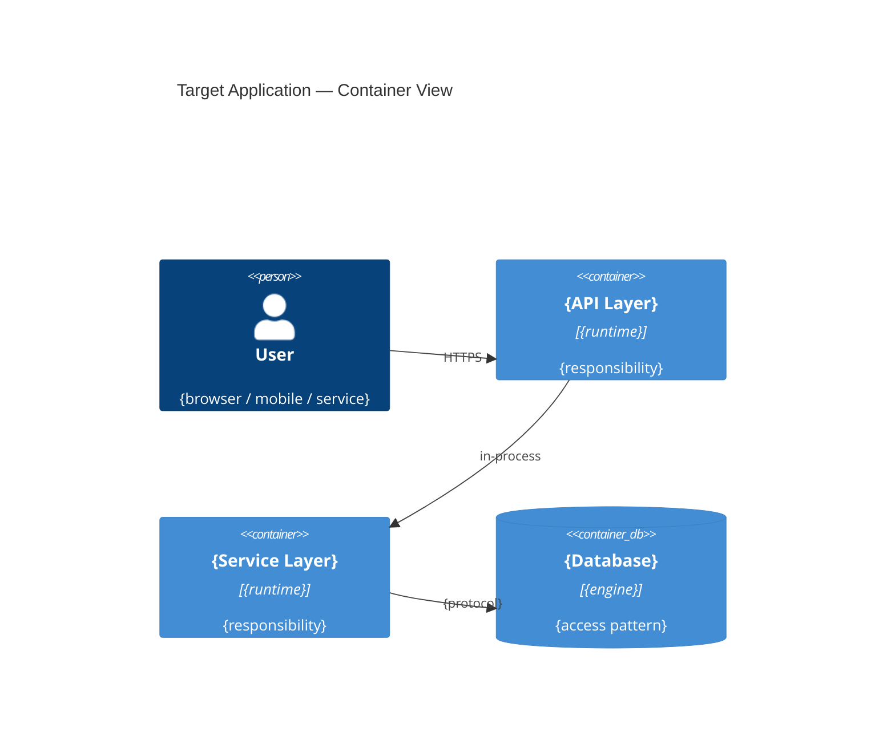
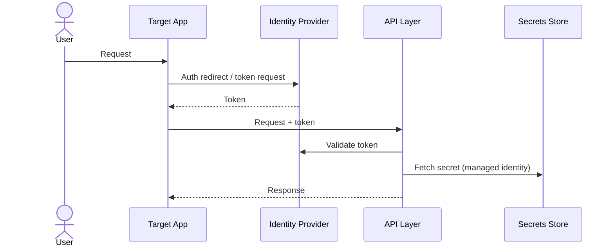
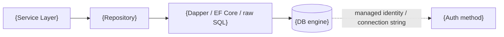
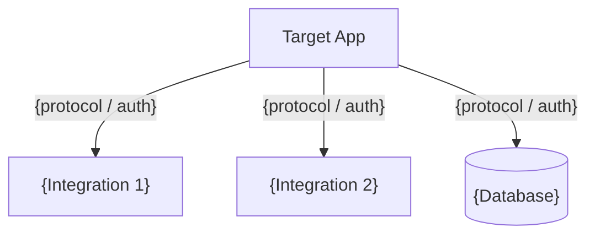
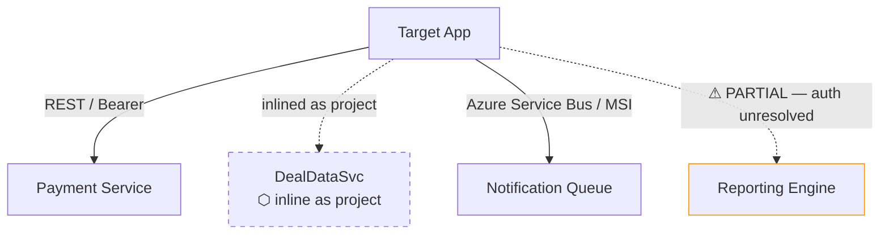
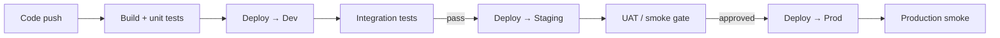
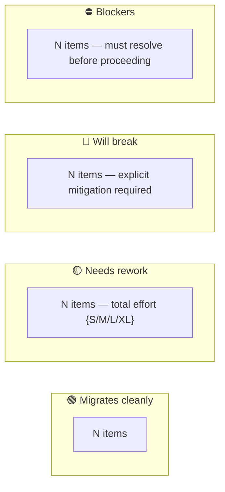

# Spec: Target Design Documents

_A **reusable design-authoring capability** invoked by any migration-family skill
(**Upgrade · Rewrite · Replatform**) after the target option is selected and before code/IaC
generation begins. Defines the document set, templates, diagram requirements, and the approval gate
that must be cleared before any code is written._

> **Developer-facing companion:** [`target-design-runbook.md`](../../../refs/specs/target-design-runbook.md) —
> plain-language "what to review and how to approve" guide for the developer. This spec is the
> skill-facing contract.

---

## Who invokes this — per-skill binding

| Skill | When invoked | Depth | Documents produced |
|---|---|---|---|
| **Rewrite** | after `APPROVE OPTIONS` (Step 2), before cluster code generation (Step 4) | **Full** — target doesn't exist; all documents authored from scratch | all 7 |
| **Replatform** | after 6R posture + option selection (R1), before IaC authoring (R3) | **Full** — infrastructure/deployment are the primary deliverables; all dimensions required | all 7 |
| **Upgrade** | after gap/risk analysis, before `APPROVE DESIGN` + baseline tag + tool execution | **Delta only** — same structure, delta covers what changes; infrastructure/deployment conditional on hosting change. Gap/risk report IS Document 7 (governed by `feasibility-spec.md`) — no separate `migration-feasibility.md`. | 4 always + 2 conditional |

**Full** = authored from scratch; the target does not exist yet. The LLM derives the document from the
source knowledge graph, the selected option, and the migration mapping refs.

**Delta only** = covers only what changes from source to target. Unchanged sections are marked
`No change — preserved from source`. The LLM derives the delta from the gap/risk analysis.

**Conditional (Upgrade)** = infrastructure and deployment documents are produced only when the
selected upgrade option includes a hosting change (e.g. moving from Windows App Service to Linux).
The skill decides at option-selection time; if no hosting change, both are omitted with a note.

---

## The phase — why it exists

Code and IaC generation produce the target application. Before that happens, the developer and
architect need to see and validate **what will be built** across every dimension — components,
security, data, integrations, infrastructure, deployment — and confirm it is **feasible and
cost-justified**. These documents are that review surface.

They serve two purposes:
1. **Developer decision gate** — review and approve before committing to code generation.
2. **Design-intent baseline** — the document set becomes the design side of the
   as-built reconciliation (`asbuilt-reconciliation-spec.md`) after generation completes.

---

## Output location and naming

```
docs/migrations/{MIGRATION_ID}/design/
  target-component-architecture.md
  target-security-architecture.md
  target-data-architecture.md
  target-integration-architecture.md
  target-infrastructure-architecture.md   (Rewrite + Replatform; Upgrade conditional)
  target-deployment-architecture.md       (Rewrite + Replatform; Upgrade conditional)
  migration-feasibility.md
```

`{MIGRATION_ID}` is set by the invoking skill from its work item reference.

---

## Diagram standard

All diagrams are **Mermaid** — text-based, authored inline by the LLM, renders in VS Code / GitHub /
Azure DevOps without external tools. Every diagram is version-controlled alongside the document.

Rules:
- Each diagram sits **directly below** the section it illustrates — never in an appendix.
- **No section that describes relationships between components is complete without a diagram.**
- Use `architecture-beta` for cloud topology where the renderer supports it; fall back to a `flowchart`
  with `subgraph` blocks if not.
- Diagram content must match the document's prose — a diagram that contradicts the text is a defect.
- For Upgrade delta documents, diagram only the changed components; show unchanged ones as greyed
  nodes with label `(unchanged)`.

---

## Revisions during design approval

After initial authoring, documents are revised through the feedback loop defined in
[`design-revision-spec.md`](design-revision-spec.md) — not by manually re-opening and editing.
Any change to one document triggers an automated cascade to affected documents. New information
arriving during design review (a newly discovered integration, a developer correction, a constraint
not known at source analysis time) enters through the feedback loop, which routes it through the
appropriate verification spec before propagating across dependent documents. The developer reviews
only the delta, not all 7 documents again.

The scope of this spec is **initial authoring**. Change management belongs to `design-revision-spec.md`.

## Gate

Each document carries a `Status` field (`DRAFT` → `APPROVED`). An open question (`- [ ]`) in any
document blocks approval of that document. **All documents must reach `APPROVED` before the invoking
skill proceeds to code/IaC generation.**

The developer approves via `APPROVE DESIGN {MIGRATION_ID}` (approves the full set) or
`APPROVE DESIGN {MIGRATION_ID} {document-name}` (approves one document). The skill records each
approval in its ledger (`payload.{skill}.gate_verdicts.design_approved = true`) and only proceeds
when all required documents for that skill are approved.

**APPROVE DESIGN applies to all three skills — including Upgrade.** Even delta documents require
explicit approval before the baseline tag is created and tool execution begins. Any change during
review — a correction, a newly discovered constraint, a revised effort estimate — goes through the
feedback loop (`design-revision-spec.md`) before approval is granted. The feedback loop stabilises
the document set; APPROVE DESIGN closes the gate.

---

## Document 1 — `target-component-architecture.md`

**Purpose:** Defines every component in the target application, how they relate, and what patterns
govern their structure. The developer should be able to read this document and understand the full
shape of the target app before a single line is written.

**LLM derives from:** source knowledge graph (modules, dependencies), selected option (stack, patterns),
migration mapping refs (framework equivalents), posture decision (port / re-architecture).

**Depth:** Full (Rewrite/Replatform) · Delta (Upgrade).

### Dependencies
```
depends_on: []
```
No other design documents needed — derives directly from the source and the selected option.

### Required sections

**## 1. Executive Summary**
One paragraph: what the target app is, what pattern it follows, how it differs from the source.

**## 2. Component Inventory**

| Component | Responsibility | Layer | Maps from source |
|---|---|---|---|
| {name} | {responsibility} | {API / Service / Data / Infra} | {source module or "new"} |

**## 3. Layer Structure**
Describe how layers are organised (e.g. API → Service → Repository → DB). State the dependency rule
(inner layers must not reference outer layers).

**Required diagram — C4 Container:**

Show every container (deployable unit), its technology, and how they communicate. Do not omit
infrastructure services the app depends on (Key Vault, Service Bus, etc.).

**## 4. Key Patterns**
Dependency injection approach, validation strategy, error handling, CQRS / mediator if applicable.
One sentence per pattern with rationale.

**## 5. What changes from source** *(Full depth only)*

| Source component | Target equivalent | Change type | Risk |
|---|---|---|---|
| {source} | {target} | {replaced / renamed / split / merged / new} | {LOW/MEDIUM/HIGH} |

**## 6. Open Questions**
- [ ] {any unresolved design decision — must be empty before APPROVE}

---

## Document 2 — `target-security-architecture.md`

**Purpose:** Defines how authentication, authorisation, secrets, and API security work in the target.
Every security decision made here must be traceable to the generated code during as-built reconciliation.

**LLM derives from:** source auth/integration analysis, selected option (identity provider, hosting),
security architecture decisions, regulatory constraints captured at intake.

**Depth:** Full (Rewrite/Replatform) · Delta (Upgrade).

### Dependencies
```
depends_on: [target-component-architecture, target-infrastructure-architecture]
```
Needs the component inventory (auth enforcement points per component) and the infrastructure choice
(managed identity placement, Key Vault placement).

### Required sections

**## 1. Auth Strategy**
Identity provider, protocol (OIDC / SAML / Windows / local), token format and lifetime.
State explicitly what changes from the source auth model.

**Required diagram — Authentication sequence:**

The sequence must cover the full handshake from user request to authorised API response.
Adapt for API-key or service-to-service flows where applicable.

**## 2. Authorisation Model**
Roles, policies, claims — mapped from source roles. State the enforcement point (middleware /
attribute / policy handler).

| Source role | Target equivalent | Change | Enforcement point |
|---|---|---|---|

**## 3. API Security**
CORS policy, rate limiting, required headers, HTTPS enforcement, input validation approach.

**## 4. Secrets Management**
How every credential and key is stored and injected. No hardcoded values — Key Vault refs / env vars
only. State which secrets exist and how they flow to the component that needs them.

**## 5. What changes from source** *(Full depth only)*

| Source approach | Target approach | Risk |
|---|---|---|

**## 6. Open Questions**
- [ ] {question}

---

## Document 3 — `target-data-architecture.md`

**Purpose:** Defines the target data store, access pattern, schema migration approach, and data
residency constraints. For Replatform this covers how the existing data moves to a managed cloud
service. For Rewrite this covers the full new data access design.

**LLM derives from:** source data model (from knowledge graph), selected option (DB choice, ORM
decision), integration/auth analysis (connection approach), compliance constraints from intake.

**Depth:** Full (Rewrite/Replatform) · Delta (Upgrade).

### Dependencies
```
depends_on: []
```
Derives directly from the source data model and the selected option — no other design document needed.

### Required sections

**## 1. Data Store**
DB type and version, managed vs. self-hosted, cloud service if applicable. Rationale for the choice
tied to the selected option.

**## 2. Access Pattern**
ORM / micro-ORM / raw SQL with rationale. For Replatform: connection approach (connection string vs.
managed identity), connection pooling configuration, retry/resilience policy for cloud.

**Required diagram — Data access flow:**


**## 3. Data Model**

**Required diagram — ER diagram** of the primary entities and their relationships:
```mermaid
erDiagram
  {ENTITY_A} {
    {type} {field} PK
    {type} {field}
  }
  {ENTITY_B} {
    {type} {field} PK
    {type} {field} FK
  }
  {ENTITY_A} ||--o{ {ENTITY_B} : "{relationship}"
```
Include all entities the target app owns. Reference external entities (from integrations) as stubs.

**## 4. Schema Migration**
How existing source data reaches the target — migration scripts, seed approach, rollback strategy.
State whether data migration is in-scope for this migration or handled separately.

**## 5. Data Residency and Compliance**
PII fields identified, encryption at rest, regulatory requirements (GDPR, HIPAA, SOX where
applicable), backup retention policy.

**## 6. What changes from source** *(Full depth only)*

| Source pattern | Target pattern | Effort | Risk |
|---|---|---|---|

**## 7. Open Questions**
- [ ] {question}

---

## Document 4 — `target-integration-architecture.md`

**Purpose:** Maps every external dependency the target app has — what it talks to, what protocol and
auth it uses, how it changes from the source, and which integrations are blockers. This is the
highest-risk dimension in most migrations.

**LLM derives from:** the **Integration Inventory** produced by
[`integration-verification-spec.md`](integration-verification-spec.md) during source analysis
(before options). That inventory is the single authoritative source — this document does NOT
re-derive integrations independently. It reads the verified rows, applies the chosen option's
integration approach, and records the target state. Any row still `PARTIAL` or `UNVERIFIED` in the
inventory at design time is a blocker — it must be resolved before this document can be `APPROVED`.

**Depth:** Full (Rewrite/Replatform) · Delta (Upgrade — covers only integrations that change).

### Dependencies
```
depends_on: [target-component-architecture]
```
Needs the component inventory to know which integrations are inlined (become components) vs kept
external. The Integration Inventory itself is pre-existing from integration-verification-spec.md.

### Required sections

**## 1. Integration Inventory**

Populated directly from `integration-inventory.md` (output of `integration-verification-spec.md`).
The "Target approach" column is the only column the skill authors here — all other columns are
transcribed from the verified inventory. Do NOT re-verify or re-classify independently.

| Integration | Kind | Transport / Auth | Source approach | Target approach | Risk | Verification |
|---|---|---|---|---|---|---|
| {name} | {WCF/REST/gRPC/queue/DB} | {NTLM/Bearer/MSI/API-key} | {source client} | {target client} | {LOW/MEDIUM/HIGH/BLOCKER} | {VERIFIED/UNVERIFIED} |

**Required diagram — Integration overview:**

Drawn from the Integration Inventory rows (`integration-verification-spec.md` output). Every source
integration MUST appear in the diagram — **transparency is the rule**: a reviewer must see the full
picture of every integration that existed and what happened to it. Label each edge with the **target**
protocol and auth scheme — not the source. Use distinct visual markers per outcome:

| Outcome | Visual marker | Mermaid style |
|---|---|---|
| External call (preserved) | Solid border, solid edge | default |
| Inlined as project | Dashed border, dashed edge, label `⬡ inline as project` | `stroke-dasharray: 5 5` |
| NuGet package | Dashed border, dashed edge, label `⬡ NuGet package` | `stroke-dasharray: 5 5` |
| PARTIAL / UNVERIFIED | Dashed border, label `⚠ PARTIAL` — blocks APPROVE | `stroke:#f90` |



**## 2. Breaking Changes**
For each integration that cannot be preserved as-is: state what breaks, the available options
(A/B/C), recommendation, and the behavioral risk rating.

**## 3. Unverified Integrations**
Any row carried forward from the Integration Inventory with `Verification: PARTIAL` or
`Verification: UNVERIFIED` must be resolved before APPROVE. Return to
[`integration-verification-spec.md`](integration-verification-spec.md) — Tier 1 or Tier 2 — to
resolve the gap. List each with the specific resolution action required:

- [ ] {integration name} — {what is ambiguous and what evidence is needed}

**## 4. Open Questions**
- [ ] {question}

---

## Document 5 — `target-infrastructure-architecture.md`

**Purpose:** Defines the cloud infrastructure the target application requires — compute, networking,
storage, identity, and the landing zone. For Rewrite this covers new cloud components the rewritten
app introduces. For Replatform this covers the cloud services replacing on-prem components. This
document is the primary output for Replatform; it is required for Rewrite because a code rewrite
almost always introduces new cloud dependencies.

**LLM derives from:** selected option (cloud provider, compute choice), source topology (from
`migration-source-detect.cjs`), NFR spec (Replatform), security architecture decisions, TCO analysis.

**Depth:** Full (Rewrite/Replatform) · Conditional (Upgrade — only when the option includes a hosting
change; omit with a note otherwise).

### Dependencies
```
depends_on: []
```
Derives directly from the selected option and source topology — no other design document needed.

### Required sections

**## 1. Cloud Target**
Provider, region(s), subscription/account structure.

**## 2. Compute**
Chosen service with rationale tied to the selected option (App Service / AKS / Container Apps /
Azure Functions / IaaS VM). State scale-out approach and any autoscale constraints.

**## 3. Networking**
VNet design, subnet allocation, NSG rules, private endpoints, DNS, ingress/egress.

**Required diagram — Infrastructure topology:**
```mermaid
flowchart TB
  subgraph Azure["{Cloud provider} — {region}"]
    subgraph VNet["VNet {CIDR}"]
      subgraph AppSubnet["App Subnet"]
        Compute["{Compute service}"]
      end
      subgraph DataSubnet["Data Subnet"]
        DB[("{DB service}\n(private endpoint)"]
        KV[("{Secrets store}\n(private endpoint)"]
      end
    end
    Monitor["{Observability service}"]
  end
  User["User / Client"] -->|"HTTPS"| Compute
  Compute --> DB
  Compute --> KV
  Compute --> Monitor
```
Show every managed service, its subnet placement, and all connections. Private endpoints must be
explicitly shown. Every arrow must be labelled with the protocol or connection type.

**## 4. Identity and Secrets**
Managed identity assignment, Key Vault access policies, how credentials flow to each component.
No component may use a connection string where managed identity is available.

**## 5. Storage and Database**
Managed DB service configuration, blob/file storage, CDN if applicable, backup and retention policy.

**## 6. Landing Zone**
Tier-0 resources provisioned first and inherited by all capabilities. List in provisioning order.

**## 7. New cloud components introduced** *(Rewrite)*
| Component | Cloud service | Why needed | Risk if absent |
|---|---|---|---|

**## 8. On-prem → cloud equivalents** *(Replatform)*
| On-prem component | Cloud equivalent | Protocol/auth change | Notes |
|---|---|---|---|

**## 9. Open Questions**
- [ ] {question}

---

## Document 6 — `target-deployment-architecture.md`

**Purpose:** Defines how the target application is built, tested, and deployed — the CI/CD pipeline,
IaC structure, environment progression, and rollback approach. Required for Rewrite and Replatform;
conditional for Upgrade when the hosting model changes.

**LLM derives from:** CI/CD platform confirmed at intake, IaC flavor confirmed at intake, environment
progression requirements, NFR spec (Replatform), security constraints (secrets in pipeline).

**Depth:** Full (Rewrite/Replatform) · Conditional (Upgrade).

### Dependencies
```
depends_on: [target-infrastructure-architecture]
```
Needs the infrastructure choice (compute service, networking) to define the matching CI/CD
pipeline stages, deployment targets, and rollback approach.

### Required sections

**## 1. CI/CD Platform**
Platform (Azure DevOps / GitHub Actions / GitLab) and pipeline structure — triggers, agents,
artifact publishing.

**## 2. IaC**
Flavor (Bicep / Terraform / ARM / Pulumi), module/stack structure, state management, drift detection.

**## 3. Environment Progression**

**Required diagram — Pipeline and environment flow:**

Show every stage, the gate between stages (automated test / manual approval), and what happens on
gate failure. Prod deployments must show a rollback path.

**## 4. Configuration Management**
How environment-specific configuration is stored (Key Vault refs / environment variables / config
transforms) and injected at deployment time. No secrets in pipeline YAML or committed config files.

**## 5. Rollback Approach**
How a failed deployment is reversed for each environment. State the maximum tolerable rollback time
for production (ties to the NFR spec where applicable).

**## 6. Open Questions**
- [ ] {question}

---

## Document 7 — `migration-feasibility.md`

**Purpose:** The feasibility assessment — a structured analysis of what migrates cleanly, what needs
rework, what will break (with options), and what is a hard blocker. Combined with the TCO analysis,
this is the primary decision document for whether to proceed. Governed by the format defined in
[`feasibility-spec.md`](feasibility-spec.md).

**LLM derives from:** source analysis, selected option, mapping reference files (GREEN/YELLOW/RED
tables for the stack pair), dependency ledger (package versions), integration verification status,
NFR spec (Replatform).

**Depth:** Full (Rewrite/Replatform — standalone `migration-feasibility.md`). For **Upgrade**, this
spec governs the **format of the gap/risk report itself** — the gap/risk report IS Document 7. No
separate `migration-feasibility.md` is produced. Any revision during APPROVE DESIGN (e.g. a developer
corrects a RED item's effort estimate or adds a newly discovered blocker) goes through the feedback
loop (`design-revision-spec.md`), which cascades changes across the gap/risk report and the delta
design documents as a single coherent package.

### Dependencies
```
depends_on: [target-component-architecture, target-data-architecture,
             target-infrastructure-architecture, target-deployment-architecture,
             target-security-architecture, target-integration-architecture]
```
Reads risk ratings and effort estimates from all other design documents — authored last.

### Required diagram — Risk distribution summary



Show the count per category and the aggregate effort for YELLOW items. Any BLOCKER in the diagram
must be accompanied by a resolution path or a recommendation to abort.

Full section structure and required content are defined in `feasibility-spec.md`.

---

## Hard rules

- NEVER begin code or IaC generation until all required documents for the invoking skill are
  `Status: APPROVED` and all `[ ]` open questions are resolved.
- NEVER author a diagram that contradicts the document's prose — the diagram and the text are the
  same design, expressed differently.
- NEVER mark a section `No change — preserved from source` in a delta document without verifying
  it against the actual source — assumption of "no change" is not the same as confirmed no change.
- NEVER omit the integration document because integrations "seem simple" — integrations are the
  highest-risk unverified surface in most migrations.
- NEVER omit infrastructure and deployment documents for a Rewrite — a code rewrite to a new stack
  almost always introduces new cloud dependencies that must be designed before code generation.
- EVERY `UNVERIFIED` integration row in the integration document blocks APPROVE — it must be resolved
  to `VERIFIED` or `DEFERRED (task)` with a written owner before the gate passes.
- The document set is the design-intent baseline for as-built reconciliation
  (`asbuilt-reconciliation-spec.md`) — treat it as a signed contract, not a rough draft.
